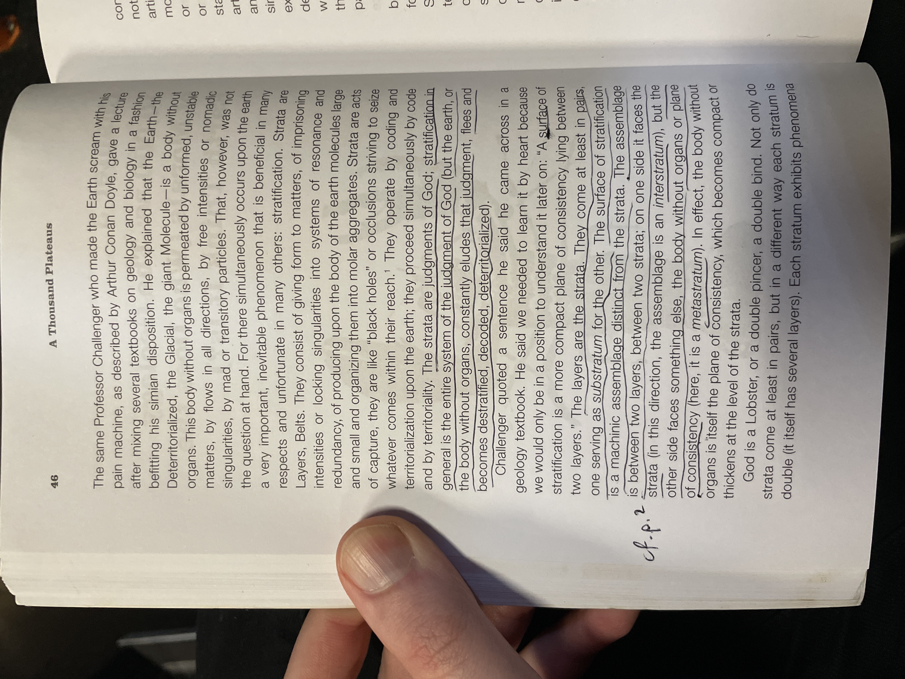

[[A-Thousand-Plateaus.pdf]]

## Contents

Translator's Foreword: Pleasures of Philosophy Brian Massumi ix 

Notes on the Translation and Acknowledgments xvi 

Author's Note xx 

1. Introduction: Rhizome 3 
    ==Root, radicle, and [[rhizome]]==
	Issues concerning books
	The One and the Multiple
	==Tree and [[rhizome]]==
	The geographical directions, Orient, Occident, America
	The misdeeds of the tree
	==What is a [[plateau]]?== 
2. 1914: One or Several Wolves? 26 
    Neurosis and psychosis
	==For a theory of multiplicities==
	Packs
	The unconscious and the molecular 
3. ==10,000 B.C.: The Geology of Morals (Who Does the Earth Think It Is?)== 39 
    ==[[Strata]]==
	==Double articulation (segmentarity)==
	==What constitutes the unity of a stratum==
	==Milieus==
	==The diversity within a stratum: forms and substances, epistrata and parastrata==
	==Content and expression==
	 ==The diversity among [[strata]]==
	==The molar and the molecular==
	==[[abstract machine|Abstract machine]] and [[assemblage]]: their comparative states==
	==Metastrata== 
4. November 20, 1923: Postulates of Linguistics 75 
    The order-word
	Indirect discourse
	Order-words, acts, and incorporeal transformations
	Dates
	Content and expression, and their respective variables
	==The aspects of the [[assemblage]]==
	Constants, variables, and continuous variation
	Music
	Style
	Major and minor 
	==[[Becoming]]==
	Death and escape, figure and metamorphosis  
5. 587 B.C.-A.D. 70: On Several Regimes of Signs 111 
    The signifying despotic regime
	The passional subjective regime
	 The two kinds of delusion and the problem of psychiatry
	The ancient history of the Jewish people
	==The [[line of flight]] and the prophet==
	The face, turning away, and betrayal
	The Book
	==The system of [[subjectivity]]: consciousness and passion, Doubles==
	Domestic squabble and office squabble
	==Redundancy==
	==The figures of [[deterritorialization]]==
	==Abstract machine and diagram==
	==The generative, the transformational, the diagrammatic, and the machinic== 
6. November 28, 1947: How Do You Make Yourself a Body Without Organs? 149 
    ==The [[body without organs]], waves and intensities==
	The egg
	Masochism, courtly love, and the Tao
	The strata and the plane of consistency
	Antonin Artaud
	The art of caution
	The three-body problem
	Desire, plane, selection, and composition 
7. Year Zero: Faciality 167 
    White wall, black hole
	The abstract machine of faciality
	Body, head, and face
	Face and landscape
	The courtly novel
	==Theorems of [[deterritorialization]]==
	The face and Christ
	The two figures of the face: frontal view and profile, the turning away
	Dismantling the face 
8. 1874: Three Novellas, or "What Happened?" 192 
    The novella and the tale: the secret
	The three lines
	Break, crack, and rupture
	The couple, the double, and the clandestine 
9. 1933: Micropolitics and Segmentarity 208 
    Segmentarity, primitive and civilized
	The molar and the molecular
	==[[Fascism]] and totalitarianism==
	The segmented line and the quantum flow
	Gabriel Tarde
	==Masses and classes==
	==The abstract machine: mutation and overcoding==
	==What is a power center?==
	The three lines and the dangers of each
	Fear, clarity, power, and death 
10. 1730: Becoming-Intense, Becoming-Animal, Becoming-Imperceptible... 232 
    ==[[Becoming]]==
	Three aspects of sorcery: multiplicity; the Anomalous, or the Outsider; transformations
	Individuation and Haecceity: five o'clock in the evening
	Longitude, latitude, and the plane of consistency
	The two planes, or the two conceptions of the plane
	==Becoming-woman, becoming-child, becoming-animal, becoming-molecular: zones of proximity==
	Becoming imperceptible
	The secret
	Majority, minority, minoritarian
	The minoritarian character and dissymmetry of becoming: double becoming
	Point and line, memory and becoming
	Becoming and block
	The opposition between punctual systems and multilinear systems
	Music, painting, and becomings
	The refrain
	==Theorems of [[deterritorialization]] continued==
	Becoming versus imitation 
11. 1837: Of the Refrain 310 
    In the dark, at home, toward the world
	Milieus and rhythm
	The placard and the territory
	Expression as style: rhythmic faces, melodic landscapes
	Bird song
	==Territoriality, assemblages, and interassemblages==
	==The territory and the earth, the Natal==
	The problem of consistency
	==Machinic assemblage and [[abstract machine]]==
	Classicism and milieus
	Romanticism, the territory, the earth, and the people
	Modern art and the cosmos
	Form and substance, forces and material
	Music and refrains; the great and the small refrain 
12. 1227: Treatise on Nomadology: The War Machine 351 
    ==The two poles of the [[State]]==
	==The irreducibility and exteriority of the war machine==
	The man of war
	Minor and major: the minor sciences
	The body and esprit de corps
	Thought, the State, and nomadology
	==First aspect: the war machine and nomad space==
	==Second aspect: the war machine and the composition of people, the nomad number==
	==Third aspect: the war machine and nomad affects== 
	Free action and work
	==The nature of [[assemblage]]s: tools and signs, arms and jewelry==
	Metallurgy, itinerancy, and nomadism
	==The machinic phylum and [[technology|technological]] lineages==
	==Smooth space, striated space, holey space==
	The war machine and war: the complexities of the relation 
13. 7000 B.C.: Apparatus of Capture 424 
    The paleolithic State
	==Primitive groups, towns, States, and world-wide organizations==
	Anticipate, ward off
	The meaning of the word "last" (marginalism)
	Exchange and stock
	==Capture: landownership (rent), fiscal organization (taxation), public works (profit)==
	The problem of violence
	The forms of the State and the three ages of Law
	==[[Capitalism]] and the [[State]]==
	Subjection and enslavement
	Issues in axiomatics 
14. 1440: The Smooth and the Striated 474 
    ==The [[technology|technological]] model (textile)==
	The musical model
	The maritime model
	The mathematical model (multiplicities)
	The physical model
	The aesthetic model (nomad art) 

Conclusion: Concrete Rules and Abstract Machines 501 
Notes 517 
Bibliography (compiled by Brian Massumi) 579 
Index 587 
List of Illustrations 611

## Complete Index (1987 edition)

Adam, Paul: 572 n. 9 
Aesthetics: and smooth and striated space, 492-99
- See also Art; Epistemology 
Affect: 
- and becoming-animal, 258-59; 
- and body, 260-61; 
- definition of, xvi; 
- and haeccity, 261-62; 
- and war machine, 400. 
- See also Spinoza, Baruch 
Afrikaans: as major language, 102 
Agriculture: West as, 18 
Aguirre, the Wrath of God: 126 
A la recherche du temps perdu: 271-72, 289, 319 
Alembert's equation: 335 
Alliez, Eric: 568 n. 36 
Alphandery, Paul: 520 n. 23, 557-58 n. 59 
Althusser, Louis: 130, 536 n. 6 
Amado, Jorge: 553 n. 13 
Amalrik, Andrei: 470 
America: 
- as flow, 20; 
- as rhizome, 19 
Amin, Samir: 566 n. 23, 570 n. 53; 
- and capitalist axiomatic, 465, 469; 
- and social formation, 435-36 
Analogy: 
- and representational thinking, xi-xii; 
- and resemblance, 236-37. 
- See also Representation 
"And": 
- and linguistic variation, 99; 
- vs. "to be," 25, 98 
Anti-Oedipus: xi, 3, 566 n. 22 
Aphorism: as plateau, 23 
Arborescent schema: 
- and becoming, 293-94; 
- critique of, xii-xiii; 
- of evolution, 10-11; 
- as hierarchy, 16-17; 
- of language, 92-95; 
- and line and point, 293-94; 
- and [[rhizome]], 6-7, 20, 34, 328-29, 506; 
- and segmentarity, 211-12; 
- and territorial assemblage, 327-28; 
- of thought, 15-17; 
- and tracing, 15, 20; 
- and writing, 5-7. 
- See also Rhizome; State apparatus; Stratification 
Archimedes: and nomad science, 361-63 
Architecture: 
- and consistency, 329; 
- and State science, 364-65. 
- See also Geometry; Science 
Ardant, Gabriel: 568 n. 35 
Ardant, Will: 568 n. 35 
Aristotle: and war machine, 417 
Arithmetic: see Mathematics 
Arland, Marcel: 195 
Aron, Raymond: 563 nn. 104, 107 
Arrow, Kenneth: 519 n. 14, 544 n. 80 
Art: and becoming, 316-17
-  nomad, 401-2
- salvation through, 185-87
- and smooth and striated space, 492-99
- and territory, 320-21 
Artaud: 542 n. 48
- and body without organs, 150, 158-59, 160, 162-63
- and drugs, 285
- and nomad thought, xiii
- and thought, 377-78 
Artisan: and flow of matter, 409
- and metallurgy, 411-12 
Artist: and population, 345-46
- See also Art 
Asimov, Isaac: 540 n. 23 
Assemblage: :and becoming, 306
- and becoming-animal, 242, 257-60
- and body without organs, 156, 157-58
- book as, 4
- collective, of enunciation, 80, 85, 88
- and consistency, 331-34
- and content and expression, 88-89, 504-5
- and deterritorialization, 333-34, 504-5
- of enunciation, 83, 87
- and exchange, 437-41
- and faciality, 180-81
- and form and matter, 340
- and haeccity, 262-63
- and incorporeal transformation, 82
- and language, 109-10
- libidinal, 37
- and linguistic variation, 99-100
- and machine, 343-44, 510-14
- molecular, 213
- and multiplicity, 8, 22-23, 34
- and order-word, 108-10
- and refrain, 312, 323-27
- and regime of signs, 119, 121-22, 140-41
- and State apparatus, 513
- and stratification, 503-5
- and subject, 264-65
- and subjedification, 130, 134
- territorial, 323-27, 332-34, 503-5
- and unconscious, 35
- and war machine, 398-403, 406-7, 513
- See also Machine
- Machinic assemblage
- Multiplicity; Plane of consistency 
Atomic bomb: and war machine, 404-5
- See also Weapon 
Attila: and war machine, 417 
Aurevilly, Barbey d': 193-94 
Austin, J. L.: 77 
Autran, Charles: 530 n. 22 
Axiomatic: capitalist, 454-73 passim
- and diagrammatic, 143-44
- and State apparatus, 460-73 passim
- and stratification, 57
- See also Capitalism; State apparatus 

Bach, Johann Sebastian: 511 
Bachelard,Gaston: 236,238,313,555n.32 
Badiou, Alain: 537 n. 20 
Baer, Karl Ernst von: 46-47, 53, 254 
Baillon, M. H.: 520 n. 20 
Bailly, Jean-Christophe: 521 n. 25 
Bakhtin, Mikhail: 82, 523 n. 5, 524 n. 10, 525 n. 21 
Balandier, Georges: 535 n. 4 
Balazs, Etienne: 565 n. 15 
Balibar, Etienne: 569 n. 48 
Balmes, Francois: 537 n. 20 
Balzac, Honore de: 266 
Bamberger, J.-R: 523 n. 5 
Bantu dialects: 102 
Barnes, Mary: 138 
Barraque, Jean: 532 n. 3, 545 n. 87, 550 n. 48, 551 n. 51 
Barthes, Roland: 533 n. 7, 545 n. 88 
Bartok, Bela: 342
- and refrain, 349-50 
Basaglia, Franco: x 
Bataille, Georges: 383 
Bateson, Gregory: 543 n. 62
- and intensity, 158
- and plateau, iv, 21-22 
Battle: and war machine, 416-23
- See also War 
Beaufret, Jean: 529 n. 18 
Beaujouan, Guy: 572 n. 10 
Beckett, Samuel: 97-98, 199
- and faciality, 173
- and territorial assemblage, 503 
Becoming: and abstract machine, 252
- and arborescence, 293-94
- and assemblage, 306
- and causality, 283-84
- and deterritorialization, 291-92, 306-7
- and drugs, 282-86
- and haeccity, 280
- and heterogeneity, 10
- of major and minor languages, 104-6
- and majority and minority, 291-93
- and man, 291-93
- and memory, 291-98
- molecular nature of, 292-93
- and music, 299-309
- and plane of consistency, 251-52, 507
- and pragmatics, 251
- and refrain, 350
- and rhizome, 238-39, 251, 294
- and schizoanalysis, 251
- and secret, 287-90
- and sexuality, 275-79
- and stratification, 502-3
- and structuralism, 237-38
- and transformation, 250-51
- and war machine, 277-78 
Becoming-animal: and assemblage, 242-43, 257-59
- of child, 14
- and faciality, 115-16, 176, 187
- and line, 245
- and masochism, 155-56
- and molecule, 272-75
- and multiplicity, 239-52 passim
- and music, 304-5, 308-9
- and plane of consistency, 258-59
- and psychoanalysis, 259-60
- and resemblance, 233-35
- and State apparatus, 242-43
- and stratification, 53
- and transformation, 252-53
- and war machine, 242-43, 247-48, 396
- and writing, 240 
Beethoven, Ludwig van: 95, 270, 511
- and refrain, 348 
Being: and State philosophy, xii-xiii 
Bellini, Vincenzo: 307 
Bene, Carmelo: and linguistic variation, 98 
Bennet, E. A.: 521 ch. 2 n. 3 
Benveniste, Emile: xviii, 78, 82, 130, 541 n.42, 554 n. 25 
Benveniste, R. E.: 10 
Berg, Alban: 339, 552 n. 61 
Bergson, Henri: x, 237-39, 374, 483-84, 486, 573 n. 17 
Berio, Luciano: 96,342,545 n. 87,546 n. 91 
Berlioz, Hector: 342 
Bernoulli: and State science, 363 
Bernstein, I. S.: 553 n. 14 
Berthe, Louis: 536 n. 9, 566 n. 18 
Bettelheim, Bruno: 542 n. 57, 543 n. 62 
Bible, the: and book, 127
- King James, 529 n. 16
- numbers in, 118
- and reality, 129
- and subjectification, 131
- See also Christ; Christianity; Religion 
Bifo, Franco 
Berardi: 572 n. 68 
Binary relations: and arborescent schema, 5
- and faciality, 176-80
- and multiplicity, 5
- and segmentarity, 210 
Biochemistry: and stratification: 45-46, 49-50 
Biology: and stratification, 46-48
- See also Science 
Bizet, Georges: 269
- and refrain, 350 
Black English: 93-94, 102-5 
Black hole: and assemblage, 333-34
- and consciousness, 133
- and faciality, 167-91 passim
- and line of flight, 224
- and refrain, 312
- and segmentarity, 211
- and stratification, 40, 56
- and subjectification, 167-68
- See also White wall 
Black Panthers: and becoming, 291 
Blanche, Robert: 570 nn. 54, 60 
Blanchot, Maurice: xiii, 265, 538 n. 29, 541 n. 43, 556 n. 44 
Bloch, Jules: 562 n. 99 
Block: and becoming, 294, 299
- and content and expression, 299
- See also Flow; Line of flight 
"Blumfeld": 169 
Body: and [[affect]], 256-57
- and cartography, 260-61
- and faciality, 115-16, 170-72, 176, 181
- and haeccity, 260-61
- and language, 80, 86
- and machinic assemblage, 89, 90
- and number, 391-92
- and order-word, 107-8
- and representation, 86
- and State apparatus, 366-67
- See also Faciality; Organ; Organism 
Body without organs: 149-66 passim
- and assemblage, 4, 157-58
- and becoming-animal, 156
- and becoming-woman, 276-77
- and deterritorialization, 156-57, 161
- and faciality, 171-72
- and God, 150, 158-59
- and intensity, 153, 157-58, 161, 164-65
- and line, 203
- and map, 12, 163-64
- and metallurgy, 411
- and multiplicity, 30, 154
- and organism, 4, 30, 158-59
- and plane of consistency, 72, 154-55, 158, 159, 165-66, 270, 506-8
- and plateau, 158
- and psychoanalysis, 151, 165
- and schizoanalysis, 165
- and signifiance, 159-61
- and smooth space, 479
- and stratification, 56, 159-63
- and subjectification, 134, 159-61
- and unconscious, 30
- and Wolf-Man, 31
- See also Organ; Organism 
Bolero: 271 
Bolsheviks: 38, 88, 100, 139 
Bonnard, Pierre: 175 
Book: American and European, 19
- and arborescent schema, 5-7
- and assemblage, 22-23
- classical, 5
- composition of, 3-4
- and deterritorialization, 3-4, 11, 126-27
- modern, 5-6
- and multiplicity, 9
- and plateau, 22
- and representation, 22-23
- and rhizome, 11, 22-23
- and signifiance, 126-27
- and tracing, 24
- and world, 5-6, 11
- See also Writing 
Borderline: and becoming, 245-46, 249-53
- See also Line 
Borges, Jorge Luis: 125, 241 
Boulez, Pierre: 262, 267, 269, 296, 518 n. 22, 519 n. 8, 527 n. 39, 541 n. 36, 548 n. 14, 553-54 n. 20
- and smooth and striated space, 477-78 
Bouligand, Georges: 554 n. 21, 556 n. 40, 570 n. 61 
Boulte, Nicolas: 537 n. 20 
Boulvert, Gerard: 569 n. 44 
Bourdieu, Pierre: 524-25 n. 13 
Bradbury, Ray: 541 n. 37, 570 n. 57 
Brain: as population, 64
- as rhizome, 15-16
- See also Consciousness; Thought 
Braudel, Fernand: 434, 468, 558 n. 60, 558-59 n. 64, 561 n. 79 
Brehier, Emile: 525 n. 18 
Brekle, Herbert: and linguistic competence, 92 
Brelet, Gisele: 547 n. 102, 551 n. 50
- and refrain, 349-50 
Breytenbach, Breyten: 527 n. 38 
Broglie, Louis de: 143 
Bronte, Charlotte: 261 
Brossolet, Guy: 520 n. 15, 563 n. 104, 564 n. Ill 
Brouwer, L. E. J.: 570 n. 61 
Brownian motion: and crowd, 30
- as fractal, 487
- and multiplicity, 33
- See also Mathematics; Physics; Science 
Brunhoff, Suzanne de: 538 n. 27 
Brunschvicg, Leon: 554 n. 23 
Brunswick, Ruth Mack: and Wolf-Man, 26, 31, 35
- See also Freud, Sigmund; Psychoanalysis 
Biichner, Georg: 25 
Buddha: and rhizome, 20
- See also Religion 
Bureaucracy: of East and West, 19-20
- and segmentarity, 210, 214
- and subjectification, 132
- and tracing, 15
- See also State apparatus 
Burroughs, William S.: 6, 152, 531 n. 14, 532 n. 8 
Butor, Michel: 546 n. 89 
Cage, John: 267, 269, 344, 545 n. 87 
Calame-Griaule, Genevieve: 539-40 n. 21 
Caldwell, Erskine: 520 n. 18 
Calling of Saint Peter and Saint Andrew, The: 185 
Canetti, Elias: 33-34, 107-8, 214, 525 n. 17 
Canguilhem, Georges: 522 n. 9, 539 n. 13 
Cannibalism: and presignifying regime, 118 
Capgras, Joseph: 119-20 
Capitalism: axiomatic of, 454-73 passim
- and deterritorialization, 453-56
- and rhizome, 20
- and social formation, 436-37
- and smooth and striated space, 490-92
- and State apparatus, 434-35, 447-48, 452-59
- and war, 421
- See also Axiomatic; State apparatus 
Capture: and State apparatus, 424-73 passim 
Cardascia, Guillaume: 568 n. 33 
Carnot, Nicolas: and State science, 363 
Carpenter, Edmund: 557 n. 56, 572 nn. 6-7, 574 n. 28 
Carriere, Mathieu: 542 n. 50, 553 n.l 1 
Carroll, Lewis: 76, 437 
Cartography: and body, 260-61
- and rhizome, 12-15
- See also Map 
Castaneda, Carlos: 138-39, 227-28, 248-49, 282, 519 n. 7, 556 n. 38
- and body without organs, 161-62 
Castle, The: 132 
Causality: and evolution, 431
- and plane of consistency, 283-84 
Cellular chemistry: and double articulation, 42
- and stratification, 58-60
- See also Science 
Center: and multiplicity, 17-18
- and segmentarity, 209-10
- and stratification, 50-52
- See also Circle 
Certeau, Michel de: 527 n. 36 
Cezanne, Paul: 343, 347, 493 
Chabrier, Emmanuel: and refrain, 350 
Charles, Daniel: 542 n. 51, 545 n. 87 
Charriere, Georges: 561 n. 82, 575 n. 37 
Chasles, Michel: 554 n. 28 
Chatelet, Francois: 461, 565-66 n. 16 
Chatelet, Gilles: 574 n. 27 
Chatrian, Alexandre: 246 
Chaunu, Pierre: 558 n. 60
- and smooth space, 479-80 
Chauvin, Remy: 10, 522 n. 15 
Chekhov, Anton: 206 
Cheng, Francois: 280, 542 n. 45 
Chevalier, Louis: 558 n. 61 
Childe, V. Gordon: 563 n. 101
- and metallurgy, 412, 415
- and State apparatus, 428-29,450-51 
Chomsky, Noam: 524 n. 7, 530 n. 38
- and Black English, 102
- and grammatical tree, 5, 7, 12, 15,91,92, 101, 148
- and Labov, 93-94
- and minor language, 103
- and regime of signs, 141 
Chopin, Frederic: 271 
Christ: 124, 301, 533 n. 7
- and faciality, 176-79, 182, 184-85, 187, 189
- and incorporeal transformation, 81
- See also Bible, the; Christianity; Religion 
Christen, Yves: 518-19 n. 5 
Christianity: semiotic of, 125
- translation of, 137
- See also Christ; Religion 
Chromaticism: and linguistics, 95-100
- See also Music, Painting 
Chronochromie: 320 
Church: and becoming-animal, 247-48
- and segmentarity, 218
- See also Christianity; Religion 
CIA: and war machine, 403 
Ciguri: 160 
Cinema I: 518 n. 21 
Cinema II: 518 n. 21 
Circle: and segmentarity, 208-11
- and sign, 117
- See also Center; Geometry 
City: and smooth and striated space, 481
- See also Town 
Cixous, Helene: xii 
Clairvaux, Bernard de: 364 
Classicism: and form and substance, 338 
Clastres, Helene: 553 n. 15 
Clastres, Pierre: 528 n. 7, 557 n. 58
- and evolutionism, 429
- and war machine, 357-59 
Clausewitz, Karl von: 218, 559 n. 68, 571 n, 64
- and State apparatus, 355
- and war, 419-21,467 
Cleisthenes: and State apparatus, 211-12 
Clement, Catherine: Deleuze's interview with, 517 n. 2 
Clement, Pierre: 562 n. 98 
Clerambault, Gatian: 119-20, 128 
Cline, W. B.: 562 n. 98 
Coding: and articulation, 41
- and faciality, 170
- and music, 11-12
- and rhythm, 313-14
- and segmentarity, 222-24
- and State apparatus, 427-28, 434, 448-51, 459-60
- and stratification, 40, 52-55
- and substance, 41
- and territory, 322
- and tools, 60-61
- and translation, 52-53
- See also Language; Signifiance 
Cogito: and subjectivity, 128, 130-32
- See also Self (Mot) 
Communication: and language, 75-79, 85
- See also Information; Information science 
Compars: and royal science, 369-70
- See also Dispars 
Composition: see 
Consistency 
==Computer science: and arborescent schema, 16==
- ==See also Information science; Science; Technology== 
Concept: and identity, xi
- line as, 22
- and State philosophy, xii-xiii
- See also Epistemology; Idea; Thought 
Consciousness: and subjectification, 131-32, 134
- See also Epistemology; Subjectivity; Thought 
Consistency: and assemblage, 327-28, 331-34
- and deterritorialization, 336-37
- and expression, 329-33
- and heterogeneity, 328-31
- and music, 343
- and plateau, xiv
- and State apparatus, 431-32, 434-35
- and stratification, 335-37
- See also Assemblage; Heterogeneity;-Multiplicity; Plane of consistency; Stratification 
Constant: linguistic, 92, 93-94
- and minor language, 101-10
- See also Linguistics; Variation 
Content: and abstract machine, 511-12
- and articulation, 44, 64
- and assemblage, 88-89, 504-5
- and block, 299
- and deterritorialization, 87-89, 108-10, 307
- and diagrammatic, 142-45
- and expression, 44-45, 111
- and form, 43-44
- and language, 85-91
- molecular nature of, 57-58
- and nomad science, 369
- and sign, 117
- and stratification, 43, 57, 60-73 passim, 502-3
- and variation, 94
- See also Expression, Form
- Linguistics; Matter; Substance 
Cooper, David: 525 n. 16 
Coriat, Benjamin: 571 n. 66 
Cosmos: and deterritorialization, 326-27, 337
- and modernity, 342-43 
Cotard, Jules: 531 n. 2 
Courtship: and territory, 324-25
- See also Love; Sexuality 
Cousteau, Jacques: 549 n. 26 
"Crack-up, The": 198-200 
Cricket on the Hearth, The: 175 
Cromwell, Oliver: 125 
Crowd: and multiplicity, 30
- and romanticism, 341 
Crusades, the: and assemblage, 89
- and flow, 220-21
- and history, 23-24
- and war machine, 383-84
- See also Christianity; Religion 
Crystallization: and stratification, 49-50
- 57-60 
Cuenot, Lucien: 548 n. 21 
Cummings, E. E.: and linguistic variation, 99 
Cuvier, Georges: 46-47, 53, 254 
Dalcq, Albert: 531-32 n. 7 
Dali, Salvador: 27 
Darien, Georges: 523 n. 2 
Darius: 122 
Darwin, Charles: 46-49, 234
- See also Evolution 
Daudin, Henri: 538 n. 1 
Debussy, Claude: 270-71, 299, 319, 341-43, 545 n. 87
- and becoming, 308
- and faciality, 169
- and refrain, 303, 347 
Decalcomania: and rhizome, 12-15
- See also Map; Tracing 
Decoding: see Coding 
Deconstruction: and feminism, xii 
Delage, Roger: 551-52 n. 59 
Deleuze, Gilles: ix-x
- and Guattari, xi-xv 
Deligny, Fernand: 14, 202-3, 547 n. 1 
Democritus: 361
- and smooth space, 363-64, 489
- and State science, 363
- See also Lucretius; Molecule 
De Niro, Robert: and becoming-animal, 274 
[[Jacques Derrida|Derrida, Jacques]]: xi, 555 n. 32
- and war machine, 417 
Desargues, Gerard: 363, 365 
Descartes, Rene: 128, 530 n. 32 
Desire: and assemblage, 399-400
- and body without organs, 154-55, 165
- and psychoanalysis, 13
- and segmentarity, 215
- See also Libido; Love; Sexuality 
Despot: as flow, 19-20
- and signifying regime, 116-17
- See also State apparatus 
Dessert, Daniel: 555 n. 30 
Detective novel: as literary genre, 192-93 
[[deterritorialization]]: and abstract machine, 142-45
- and assemblage, 333-34, 504-5
- and becoming, 291-92, 306-7
- and body without organs, 156-57, 161
- and book, 126
- and capitalism, 453-56
- and consistency, 336-37
- and content and expression, 87-89, 108-10, 307
- and faciality, 172, 174-91 passim
- and flow, 219-21, 226
- and language, 61-63
- and line, 203-5
- and line of flight, 510
- and map tracing, 15
- and multiplicity, 9, 32, 33
- and music, 301-3
- and nomads, 381-84
- and novella, 195-200
- and plane of consistency, 70-71, 270, 272
- and population, 123-25, 345-46
- and refrain, 300-302, 347-48
- and regime of signs, 141-43, 508
- and rhizome, 9-10, 21
- and science, 372
- and segmentarity, 222-24
- and semiotic, 135, 138-39
- and sign, 67-68, 112, 113, 115-17, 121-23
- and State apparatus, 432-34
- and stratification, 53-57
- and subjectification, 133
- and substance, 41
- and variation, 99-100
- and war machine, 353
- See also Line of flight; Nomads; Territory 
Detienne, Marcel: 399, 426, 556 n. 41, 560 n. 78 
Devaux, Emile: 522-23 n. 24, 533 n. 6 
Devil, the: and becoming-animal, 239, 252-53 
Dhorme, Edouard: 529 n. 12 
Diaboliques: 194 
Diagrammatic: 141 -48
- See also Axiomatic 
Dialect: and major language, 101-3 
Dialogues: 517 
Dickens, Charles: 175 
Dieterlen, Germaine: 563 n. 102 
Difference et repetition: x, 517 n. 4 
Dillard, J. L: 527 n. 39 
Dimension: and becoming, 251-52
- of multiplicity, 8-9
- See also Geometry; Space 
Discourse: direct, 84
- indirect, 76-77, 80, 84, 99-100
- See also Language; Linguistics 
Dislocation, La: I'i-l^ 
Dispars: and nomad science, 370-71
- See also Compars 
DNA: and evolution, 10 
Dobb, Maurice: 537 n. 19, 569 n. 49 
Domination: and language, 101, 105-6 
Dos Passos, John: 520 n. 18 
Dostoyevsky, Fyodor: 196, 257, 530 n. 29 
Double articulation: and diagrammatic, 142-43
- and stratification, 40-74 passim, 502-3
- See also Content; Expression 
Doyle, Arthur Conan: 40 
Dream: and multiplicity, 30
- and representation, 29-30
- See also Unconscious 
Dreiser, Theodore: 520 n. 18 
Dreissche, T. van den: 549 n. 29 
Drugs: and perception, 282-86 
Dualism: and becoming, 276-77
- and map tracing, 13-14
- and multiplicity, 20
- See also Double articulation 
Duby, Georges: 537 n. 19 
Duccio: 185 
Ducrot, Oswald: 77, 78, 80 
Duhem, Pierre: 540 n. 29 
Dumas, Alexandre: 250 
Dumezil, Georges: 556 nn. 41, 43, 559 n. 67, 564 n. 8,565 n. 10
- and becoming-animal, 242-43
- and State apparatus, 351-52, 371, 424-26
- and war machine, 354 
Duns Scotus, John: 540-41 n. 33 
Dupouy, Roger: 532 n. 11, 540 n. 32 
Dupreel, Eugene: and consistency, 328-29 
Durkheim, Emile: 218-19, 376 
Duvignaud, Jean: 237 

Earth: and deterritorialization, 40
- and romanticism, 338-42
- See also Deterritorialization; Territory 
Ecce Homo: 269 
Ecumenon: and stratification, 50, 52, 55, 56, 72-73
- See also Planomenon 
Ego: Freudian, xviii
- See also Psychoanalysis; Self (Moi); Subjectivity 
Eibl-
Eibesfeldt, Irenaus: 547 n. 7, 548-49 n. 25, 550n.38 
Eichendorff, Joseph: 550 n. 47 
Einstein, Albert: 484, 501, 511 
Eisenstein, Sergei: 413-14, 533 n. 10, 550 n. 48
- and faciality, 184 
Eliade, Mircea: 548 n. 18, 564 n. 2 
Eliot, T. S.: 520 n. 18 
Emmanuel, Arghiri: 568 n. 36, 569 n. 49 
Emperaire, Jose: 557 n. 54 
Engels, Friedrich: 427, 566 n. 25, 568-69 n. 41 
English: as major language, 102 
Enunciation: and assemblage, 7, 22, 37
- and incorporeal transformation, 82-83
- and nomadology, 23
- and order-word, 107
- social character of, 79-80
- subject of, 129
- See also Linguistics; Statement 
[[epistemology]]: and war machine, 361-74 passim
- See also Concept; Idea; Subjedification; Subjectivity; Thought 
Erckmann, Emile: 246 
Ernst, Max: and faciality, 182 
Esquirol, Jean: 119-20 
Ethics: 153,257 
Ethnology: and State apparatus, 429-30 
Ethology: and consistency, 336 
Euclid: and State science, 109, 364
- and striated space, 371, 489 
Euclidean space: and multiplicity, 485-86
- and stratification, 47
- See also Geometry; Space 
Evans-Pritchard, E. E.: 535 n. 3 
Evolution: and becoming, 238-39
- and heterogeneity, 10-11
- and representation, 10
- and State apparatus, 429-31
- and stratification, 47-49 
Exchange: and assemblage, 437-41
- and territory, 440
- See also Capitalism 
Experimentation: and body without organs, 149-51, 161-62, 164
- and interpretation, 162 
Expression: and abstract machine, 511-12
- and articulation, 44, 64
- and assemblage, 88-89, 504-5
- and block, 299
- and consistency, 329-33
- and content, 43-45
- and deterritorialization, 87-89, 108-10, 307
- and diagrammatic, 142-45
- and faciality, 179-80
- and language, 85-91
- molar nature of, 57-58
- and nomad science, 369
- and order-word, 108-9
- and regime of signs, 111,140-41
- and sign, 117
- and stratification, 43, 57, 60-73 passim, 502-3
- and territory, 317-18
- and variation, 94
- See also Content; Double articulation; Form 
Exteriority: and assemblage, 23
- and multiplicity, 9
- and nomad thought, xii-xii, 377
- and stratification, 49-52, 57-58
- and territory, 317-18
- and war machine, 24, 351-80 passim
- See also Interiority 
Fabric: and smooth and striated space, 475-77 
Faciality: and abstract machine, 168-70, 174-91 passim: and assemblage, 180-81
- and becoming, 292-93
- and becoming-animal, 176, 187
- and body without organs, 171-72
- and Christ, 176-79, 182, 184-85, 187, 189
- and coding, 170
- and deterritorialization, 61-62, 172, 174-91
- and expression, 179-80
- and language, 60-62
- and line of flight, 188
- and multiplicity, 182-83
- and refrain, 301
- and rhizome, 190-91
- and schizoanalysis, 188;andsemiotic, 180-82
- and sign, 117
- and signifiance, 115-16, 179-82
- and subjectification, 179-82
- See also Body 
Farachi, Armand: 23 
Fascism: and capitalist axiomatic, 462-63
- and segmentarity, 214-15
- and State apparatus, 230-31
- as suicidal State, 231
- See also State apparatus; Totalitarianism 
Faulkner, William: 261, 292, 520 n. 18, 572 n.2 
Faure, Elie: 413 
Faye, Jean-Pierre: 82, 139, 536 n.l 1, 570-71 n. 62 
Feminism: and deconstruction, xii
- and psychoanalysis, xi 
Ferenczi, Sandor: and becoming-animal, 259 
Fernandez, Dominique: 303-4, 307 
Fichte, Johann Gottlieb: and State philosophy, xii 
Fiedler, Leslie: 282-83, 520 n. 18 
Film: and becoming-animal, 233
- and faciality, 168, 172, 175, 184
- and movement, 281 
Fitzgerald, F. Scott: 194, 198-200, 206, 229, 520 n. 18
- and becoming, 248, 260, 279
- and smooth space, 482 
Flaubert, Gustave: 541 n. 39 
Fleutiaux, Pierrette: 200-202 
Flore, Joachim de: 530 n. 23 
Flow: and book, 3-4
- and capitalist axiomatic, 468-69
- and deterritorialization, 11
- and matter, 409-10
- and nomads, 363, 404-15 passim
- and segmentarity, 217-21, 225-26
- and State apparatus, 448-49, 452-53, 456, 459-60
- See also Line of flight; Rhizome 
Foch, Ferdinand: and war, 416 
Focus: 291-92 
Forbes, Robert James: 563 n. 103 
Form: and abstract machine, 511
- and articulation, 41
- and becoming-animal, 252-53
- and classicism, 338
- and content and expression, 89
- and intensity, 253
- and language, 85-86
- and matter, 407-9
- of State, 448-60 passim
- and stratification, 43, 51-52, 54, 59-60, 60-73 passim
- and variation, 95
- See also Content; Matter 
Fort-Da: and refrain, 299
- See also Freud, Sigmund
- Psychoanalysis 
Fortes, Meyer: 535 n. 3, 536 n. 9 
[[Michel Foucault|Foucault, Michel]]: xi, xviii, 517 n. 8, 518 n. 20, 528 n. 5, 530-31 n. 39, 536-37 n. 16, 538 n. 1, 556 n. 44
- and language, 66-67
- and nomad thought, xiii
- and order-word, 87
- and power, xvii, 224
- and regime of signs, 140 
Fourquet, Francois: 566 n. 16 
Fractal: and multiplicity, 486-88
- See also Mathematics; Number 
Fradin, Jacques: 566 n. 25 
Francis, Saint: 178 
Francis Bacon: 518 n. 21 
Francois I: 221-22 
"Franglais": 102 
Freud, Sigmund: 5, 14, 18, 29-30, 125,127, 241, 284, 519 n. 9, 541 n. 41, 544 n. 78
- and becoming-animal, 259
- and body without organs, 164
- and multiplicity, 31
- and Wolf-Man, 26-38 passim
- See also Psychoanalysis 
Fried, Michael: 546 n. 89, 575 n. 38 
Friendship theorem: 17 
Fuller, J. F. C: 560 
Gaelic: as minor language, 102 
Galbraith, John Kenneth: 461, 524 n. 12 
Galileo: 511 
Galois, Evariste: 142 
Game theory: and State apparatus, 352-53 
Gardiner, Alan Henderson: 541 n. 40 
Gaulle, Charles de: and May 1968, 216
- and State apparatus, 424-25 
Gautier, Emile Felix: 537 n. 23, 557 n. 57 
Gavi, Philippe: 274 
Gay rights movement: and psychoanalysis, xi 
Genesis, Book of: 87
- See also Bible, the 
Genetics: and stratification, 53
- and language, 62-63 
Genghis Khan: 226
- and war machine, 354, 392-93,417-19 
Genseric: 226 
Geoffrey Saint-Hilaire, Etienne: 45-48, 55, 254-55, 542 n. 52 
Geology: and stratification, 40 
Geometry: and nomad science, 367
- and State apparatus, 212, 362-65
- See also Mathematics; Number; Space 
Geroudet, Paul: 548 n. 22 
Giotto: 178 
Girard, Claude: 544 n. 78 
Giscard d'Estaing, Valery: 216, 468 
Glass, Philip: 542 n. 46 
Glossalalie (Speaking in tongues): 96 
Gluckman, Max: 558 n. 61 
God: and body without organs, 150, 158-59
- and book, 127
- as cause, 3
- in East and West, 18
- and prophetism, 123-24
- and stratification, 40, 43-44, 58
- and subjectification, 128, 130
- See also Religion 
Godard, Jean-Luc: 25, 97-98, 267
- and faciality, 172 
Godelier, Maurice: 530 n. 33 
Goethe, Johann von: 269, 540 n. 22, 542 n. 52
- and Kleist, 268-69, 356
- and smooth and striated space, 482
- and State apparatus, 378
- and war machine, 24 
Golea, Antoine: 548 n. 11 
Gordon, Pierre: 539 n. 21 
Gorz, Andre: 215-16 
Gould, Glenn: 8 
Grammar: and language instruction, 75-76
- See also Language; Linguistics 
Grammaticality: and homogeneity, 93-94
- and power, 101
- and variation, 99 
Gravity: and striated space, 370 
Greimas, A. J.: 528 n. 6 
Griaule, Marcel: 415, 521 ch. 3 n. 2 
Griaznov, Mikhail: 430, 560 n. 73 
Griffith, D. W.: and faciality, 175, 183, 184 
Grohman, Will: 546 n. 92 
Grousset, Rene: 394, 563 n. 105, 574 n. 30, 575 n. 37 
Guattari, Felix: x-xi
- and Deleuze, xi-xv 
Guerin, Daniel: 214, 537 n. 24 
Gueroult, Martial: 560 n. 77 
Guerrero, Margarita: 539 n. 10 
Guillaume, Gustave: 349, 541 n. 39 
Guillerm, Alain: 571 n. 66 
Guillerm, Daniele: 571 n. 66 
Gulik, Robert van: 532 n. 14 
Habermas, Jiirgen: 518 n. 18 
Haeccity: and assemblage, 262-63
- and becoming, 276-77, 280
- and individual, 253
- and linguistics, 263-65
- and plane of consistency, 266-72, 507
- and psychoanalysis, 264
- and science, 369
- and subjectivity, 261-65
- See also Individual; Molecule 
Haptic space: and nomad art, 492-99 
Hardy, Thomas: 186-87, 332 
Harmand, Jacques: 564 n. 8 
Haudricourt, Andre: 18, 533 n. 12 
Hegel, G. W E: 269, 556 n. 42
- and Deleuze's philosophy, x
- and Kleist, 268, 356
- and State, 385, 460 
Heidegger, Martin: 125, 561 n. 85 
Helioglobale: 158 
Helmholtz, Hermann von: 573 n. 14 
Herbert, Frank: 559-60 n. 70 
Herzog, Werner: 110, 126 
Hess, W. R.: 549 n. 29 
Heterogeneity: and becoming, 250
- and consistency, 328-31
- of language, 100-101
- and nomad thought, xiii, 24, 361
- and rhizome, 7-8
- of social formation, 435-37
- See also Assemblage; Consistency; Multiplicity; Plane of consistency 
Heusch, Luc de: 353, 528 n. 4, 543-44 n. 75 
Heyting, A.: 570 n. 71 
Hierarchy: and rhizome, 21 
Hilbert, David: and diagrammatic, 143 
Hincker, Francois: 569 n. 45 
History: and memory, 295-96
- natural, and evolutionism, 233-34
- and nomads, 23-24, 393-94
- and segmentarity, 221-22
- and State apparatus, 23 
Hitchcock, Alfred: 305 
Hitler, Adolf: 214, 231 
Hjelmslev, Louis: 523 n. 28, 526 n. 22, 531 n. 40
- and content and expression, 108
- and double articulation, 45, 402
- and stratification, 43
- and variation, 99 
Hobbes, Thomas: and State apparatus, 357 
Hocquenghem, Guy: 273 
Hofmannsthal, Hugo von: and abstract machine, 512
- and becoming-animal, 240, 258, 275
- and order-word, 110 
Holderlin, Friedrich: 125, 268, 332, 507, 550 n. 47 
Hoist, E. von: 549 n. 29 
Holstein, Jonathan: 572 n. 3 
Homogeneity: of language, 92, 100-101
- and smooth and striated space, 488-89
- See also Consistency; 
Heterogeneity 
Horticulture: East as, 18-19 
Hubac, Pierre: 382 
Hugues-le-loup: 246 
Human beings: and art, 320-21, 498-99
- and becoming-animal, 238, 252-53
- enslavement of, 456-57
- and faciality, 170-71, 190-91
- and music, 309
- See also Man 
Humboldt, Wilhelm von: and State philosophy, xii 
Hume, David: as minor philosopher, x 
Hunt: and war, 395-96 
Husserl, Edmund: 192-93, 545 n. 85
- and geometry, 367
- and formed matter, 407-8, 410
- and multiplicity, 483 
Hylomorphic model: see Matter, and form 
Hyperion: 268 
"I": and subjectification, 130
- See also Consciousness; Self (Moi); Subjectivity IBM: and war machine, 403 
Ibn Khaldun, 'Abd al-Rahman: 366, 481, 557 n. 51 
Icon: and sign, 112
- and stratification, 65
- See also Index
- Linguistics
- Symbol 
Idea: and resemblance, 235
- and State philosophy, xii
- and war, 420
- See also Concept; Thought 
Identity: and State philosophy, xii-xiii
- and subject and object, xi
- and word, 28 
Ideology: and assemblage, 4
- and content and expression, 68, 89-90 
Iliad: 426 
Illusion: and abstract machine, 63, 65 
Immanence: and faith, 282
- and line, 205
- and plane of consistency, 154, 266-67
- and pleasure, 156-57;and rhizome, 18,20 
Immelmann, K.: 548 n. 24 
Incorporeal transformation: and language, 85
- and order-word, 108-9
- See also Transformation 
Index: and sign, 112
- and stratification, 65
- See also Icon; Linguistics; Symbol 
Individual: and form, 253, 254
- and haeccity, 261-62
- and multiplicity, 254
- See also Haeccity 
Information: genetic, 10-11
- and language, 75-76, 78-79, 85
- and signifiance, 79
- See also Communication 
==Information science: 5, 16, 79, 179-80==
- See also Computer science 
Intensity: and assemblage, 4
- and body without organs, 31, 153, 157-58, 161, 164-65
- and form, 253
- and language, 109-10
- and map, 15
- and multiplicity, 33
- and plane of consistency, 70
- and plateau, xiv, 22
- and pleasure, 157
- See also Consistency; Plane of consistency 
Interiority: and pleasure, 156-57
- and State philosophy, xii-xiii
- and stratification, 49-52
- and territory, 317-18
- of thought, 377
- See also Exteriority 
Interpretation: and book, 127
- and experimentation, 162
- and faciality, 115
- and signifiance, 114
- and subjectification, 138 
"In the Cage": 195-98 
Irigaray, Luce: xii 
Irish English: 102 
Isakower, Otto: 169 
Isomorphy: and capitalist axiomatic, 464-66
- and stratification, 46
- See also Form 
"Jackals and Arabs": 37 
Jackson, George: 204 
Jacob, Francois: 10-11, 42, 62, 522 n. 15 
Jacobs, Jane: 440, 565 n. 11 
Jakobson, Roman: 531 n. 41 
James, Henry: 195-98, 290, 329, 520 n. 18 
Janequin, Clement: 300 
Jargy, Simon: 547 n. 3 
Jaspers, Karl: 556 n. 46 
Jaulin, Robert: 533 n. 12 
Jevons, W. Stanley: 437 
Jewish people: and becoming, 291-92
- as subject, 128, 130
- See also Bible, the
- Moses 
Joan of Arc: 176
- and becoming-woman, 277 
Jones, LeRoi: 527 n. 39, 530 n. 34
- See also Black English 
Joset, Paul Ernst: 539 n. 11, 544 n. 77 
Jouhandeau, Marcel: 530 n. 28 
Jouissance: and body without organs, 154 
Journet, Jean-Louis: 555 n. 30 
Joyce, James: 6, 53, 105, 127, 200, 209 
Judgment: and representational thinking, xi-xii
- See also Aesthetics 
Julia, Dominique: 527 n. 36 
Julien, Florence: 202 
Jung, Carl: 30, 235-36, 238, 241, 259, 411
- See also Freud, Sigmund; Psychoanalysis 
Junger, Ernst: 403, 518 n. 3, 564 n. 6 
Kafka, Franz: xvii, 15, 36, 37, 76, 97-98, 122, 225, 346, 520 n. 22, 529 n. 15,541 n. 44, 545 n. 84, 552 n. 5
- and abstract machine, 512
- and assemblage, 88-89, 505
- and becoming-animal, 243-44
- and bureaucracy, 4, 34, 214
- and deterritorialization, 306
- and faciality, 169
- and subjectification, 132
- and variation, 94
- and war machine, 24 
Kandinsky, Vasili: 295, 298, 575 n. 38 
Kant, Immanuel: x, 367, 376, 417 
Kaufmann, Arnold: 551 n. 54 
Kerouac, Jack: 19,280 
Kesey, Ken: 520 n. 18 
Keynesian economics: and capitalist axiomatic, 462 
Kierkegaard, Suren: 197, 279, 281, 282, 376, 537 n. 17 
Kings of the Road: 482 
Kipling, Rudyard: 31 
Klaatsch, Hermann: 533 n. 6 
Klee, Paul: 295, 298, 303, 304, 310, 312, 337, 342, 344, 346, 347, 551 nn. 55, 58 
Klein, Melanie: 13-14, 541 n. 41
- See also Freud, Sigmund; Psychoanalysis 
Kleist, Heinrich von: and haeccity, 268
- and multiplicity, 9
- and nomads, 378, 381
- and plane of consistency, 507
- and rhizome, 25
- and smooth and striated space, 482
- and war machine, 4, 24, 355-56, 400 
Klossowski, Pierre: 131-32, 530 n. 28 
Kojeve, Alexandre: 556 n. 42 
Koran, the: and book, 127
- See also Mohammed; Religion 
Kraepelin, Emil: 119 
Krishna: and body without organs, 151
- See also Religion 
Kristeva, Julia: 523 n. 27, 528 n. 8, 559-60 n. 70 
La Boetie, Etienne de: 359 
==Labor: and smooth and striated space, 490-92==
- ==surplus, as apparatus of capture, 441-42==
- ==See also Capitalism; Capture; Marx, Karl==
Laborit, Henri: 535 n. 13 
Labov, William: 93-94, 103, 524 nn. 7, 10, 526 n. 28 
Lacan, Jacques: x, 26, 171, 529 n. 9, 543 n. 71
- See also Psychoanalysis 
Lacarriere, Jacques: 539 n. 20, 566 n. 21 
La Casiniere, Joelle de: 520 n. 21 
Lagache, Daniel: 529 n. 9 
Laing, R. D.: x 
Lalonde, Michel: 527 n. 37 
Lamarck, Chevalier de: 522 n. 8 
Land: and refrain, 347-48
- See also Territory 
Landscape: and faciality, 172-73
- and music, 319
- and refrain, 301 
Language: and abstract machine, 148
- and deterritorialization, 61-63
- and faciality, 60-62
- and genetics, 62-63
- and haeccity, 263-65
- as heterogeneous reality, 100-101
- and incorporeal transformation, 82
- and line, 202-3
- major and minor, 7-8, 101-10
- and map tracing, 77
- and music, 95-97
- philosophy of, 86
- and plane of consistency, 91
- and regime of signs, 140-41, 148
- and speech, 78, 92
- and State apparatus, 82-83, 429-30
- and stratification, 60-70
- and subjectivity, 78
- See also Coding; 
Linguistics; Semiotic; Sign; Signifiance 
Laplanche, Jean: 541 n. 41 
Laroche, Emmanuel: 557 n. 51, 572 n. 12 
Larouche, Jean Claude: 546 n. 98 
Lautman, Albert: 485, 556 n. 39 
Lautreamont, le Conte de: 236 
Laviosa-Zambotti, Pia: 522 n. 14 
Law: and science, 369-70
- See also State apparatus 
Lawrence, D. H.: 186-87, 188-89, 197, 205, 244, 251-52, 276, 546 n. 90 
Lawrence, T. E.: 563 n. 104 
Leach, Edward: 246-47 
League of Nations: and State apparatus, 435 
Leaves of Grass: 19 
Leclaire, Serge: and Wolf-Man, 26 
Leeuw, Gerardus van der: 574 n. 29 
Lelart, Michel: 536 n. 15 
Lenin, V. I.: 83, 100, 563 n. 108 
Lenz, Friedrich Walther: 25, 378 
Leroi-Gourhan, Andre: 60, 64, 302, 395, 407,475, 574 n. 33 
Letter to Hitler: 163-64 
Levi-Strauss, Claude: 112, 113, 209, 210, 236-37, 433, 539 n. 11, 541 n. 40 
Lewin.Kurt: 152-53, 169 
Libidinal economy: of West, xiv 
Libido: and body without organs, 37
- and flow, 31
- and machinic assemblage, 36
- and multiplicity, 31
- and unconscious, 35
- See also Desire; Psychoanalysis; Sexuality 
Lied von der Erde, Das (The song of the earth): 339 
Life of Saint Francis, The: 178 
Ligers, Z: 539-40 n. 21 
Limet, Henri: 561 n. 89 
Lindon, Jerome: 529 n. 17 
Lindqvist, N.: 527 n. 36 
Line: 
- and arborescent schema, 293-94
- and becoming, 279-80
- and becoming-animal, 245
- and body without organs, 203
- and deterritorialization, 203-5
- and diagrammatic, 144-45
- and language, 202-3
- and map, 202-3
- and nomad art, 496-98
- and novella, 195-202
- and rhizome, 8, 21, 203, 505-6
- and schizoanalysis, 202-3
- and segmentarity, 9, 202-7, 209, 211-12, 217, 222-26
- and smooth space, 478-79
- and State apparatus, 204
- and subjectification, 131-32
- See also Geometry; 
Line of flight; Plane; Space 
Lineage: and organization, 388, 391-92
- and phylum, 406-7
- State apparatus, 393 
Line of flight: and assemblage, 88-89
- and becoming, 277
- and book, 3-4
- and deterritorialization, 510
- and faciality, 188
- and map tracing, 14-15
- and multiplicity, 9, 32
- and plane of consistency, 270
- and point, 298
- and rhizome, 9, 11,21
- and signifying regime, 116, 121-22
- and stratification, 55
- and subjectification, 133-34
- and war machine, 422-23
- and writing, 24-25
- See also Deterritorialization; Line 
Linguistics: 75-110 passim
- and abstract machine, 511-12
- and arborescent schema, 5
- and content and expression, 90-91
- and incorporeal transformation, 82
- and power, 7-8, 18
- and pragmatics, 85, 90-91, 97-98
- and rhizome, 6-7
- as science, 100-110
- See also Coding; 
Language; Semiotic; Sign; Signifiance 
Liszt, Franz: 319 
Little Hans: 14, 256-59
- See also Freud, Sigmund 
Lizot, Jacques: 176, 209, 535-36 n. 5 
Logique du sens: x, 541 
Logos: and nomos, 369-73
- and State apparatus, xiii 
Lombard, Maurice: 558 n. 60, 562 n. 97 
Lorca, Federico: 261 
Lorenz, Konrad: 34, 239, 315-16, 547 n. 46, 548 nn. 9, 12,17,23 
Lory, G. M.: 527 n. 38 
Losey, Joseph: 291-92 
Louis XIV: 558 n. 59 
Love: and body without organs, 151
- and marginalism, 438-39
- and subjectification, 131-32, 134
- See also Desire
- Sexuality 
Lovecraft, H. P.: 240, 245, 248, 251, 523 n. 32 
Lowie, Robert: 113 
Lowry, Malcolm: 533 n. 8 
Loyola, Ignacio de: 533 n. 7 
Luca, Gherasim: 97-98, 530 n. 32 
Lucretius: x, 361, 489-90
- See also Democritus; Molecule 
Ludendorff, Erich: 563 n. 108 
Luke, Gospel according to: 124
- See also Bible, the 
Lulu: 184 
Luther, Martin: 126 
Luxemburg, Rosa: 537 n. 20 
Lyotard, Jean-Francois: 518 n. 17,532 n. 14 
Macciochi, Maria-Antonietta: 538 n. 32 
Machine: and assemblage, 4, 343-44, 346-47
- and capitalism, 456-59
- and consistency, 330-31
- and diagrammatic, 141-48
- and multiplicity, 34
- and music, 343
- and organ, 256
- and segmentarity, 212-13
- and social formation, 435-36
- and voice, 303-4, 307-8
- See also Assemblage; 
Multiplicity 
Machinic assemblage: and body, 88-90
- and diagrammatic, 145
- and enunciation, 7, 36-37
- and multiplicity, 34
- and nomadology, 23
- and plane of consistency, 71-73
- and power, 17
- and rhizome, 22
- and stratification, 41-42, 56-57, 68
- See also Assemblage, Multiplicity 
McLuhan, Marshall: 360 
Mahler, Gustav: 339 
Maldiney, Henri: 547 n. 32, 574 n. 31
- and nomad art, 493, 495 
Mallarme, Stephane: 127, 346 
Malmberg, Bertil: 101, 518 n. 2 
Man: as molar entity, 292-93
- white, and faciality, 176-79
- See also Human beings 
Mandelbrot, Benoit: 486-87 
Mann, Daniel: 233 
Mann, Klaus: 230-31 
Mann, Thomas: and music, 97 
Mannerism: and territory, 320
- See also Painting 
Manual de zoologiafantastica: 241 
Mao Tse-tung: 5, 20, 226 
Map: and body without organs, 163-64
- and line, 202-3
- and regime of signs, 119
- and representation, 12
- and rhizome, 12-15, 19-20
- and segmentarity, 222
- and tracing, 12-15. 
- See also CartographyTracing 
Marcel, Gabriel: 362 
Mark, Gospel according to: 124
- See also Bible, the 
Marshall, Alexander James: 550 n. 34 
Marshall Plan: and capitalist axiomatic, 462 
Martinet, Andre: 64, 528 n. 46, 530 n. 30 
Martino, Ernesto de: 546 n. 97 
==Marx, Karl: 558 n. 61, 567 nn. 27-28, 31-32, 568 n. 34, 568-69 n. 41, 570 n. 59==
- ==and book, 127==
- ==and capitalist axiomatic, 454, 463==
- ==and capture, 443==
- ==and State apparatus, 427-28, 447-48==
- ==and subjectivity, 453==
- ==and surplus value, 491-92.== 
- ==See also Capitalism; State apparatus== 
==Marxism: and major language, 105==
- ==and State apparatus, xi== 
Masochism: and becoming-animal, 155-56, 260
- and body without organs, 150, 152, 155-56 
Mathematics: nomadic nature of, 24
- and smooth and striated space, xiii, 482-88
- See also Geometry; Number; Science 
Matheson, Richard: 279, 540 n. 23 
Matter: and abstract machine, 511
- and body without organs, 43, 153
- of book, 3
- and flow, 409-10
- and form, 407-9
- and plane of consistency, 43, 45
- and stratification, 43. 
- See also Form; Substance 
Matthew, Gospel according to: 124
- See also Bible, the 
Maupassant, Guy de: 193 
Maurel, Christian: 543 n. 58 
May 1968: and philosophy, x
- and psychoanalysis, xi
- and segmentarity, 216 
Mayani, Zacharia: 529 n. 14 
Mazaheri, A.: 561 n. 88 
Mechanosphere: and stratification, 71, 74 
Meinong, A.: on multiplicity, 32-33, 483 
Mellaart, James: 565 n. 11 
Melville, Herman: 186-89, 199, 205, 539 n. 15 
Memory: and becoming, 291-98
- and deterritorialization, 293-94
- and line and point, 293-98
- and music, 295-98
- and rhizome, 15-16
- and tracing, 16
- See also Epistemology
- Thought 
Menaechmus: and State science, 363 
Meneur de loups: 250 
Mephisto: 230-31 
Mercier, Jacques: 533-34 n. 14 
Messiaen, Olivier: 94, 300, 301, 304, 309, 316-17,320,551 nn. 51,57-58 
Metallurgy: and flow, 410-11
- and nomads, 404-15 passim. 
- See also Flow; Science; Technology 
Meunier, Jacques: 358 
Meyer, Francois: 550 n. 40 
Michaux, Henri: 283, 285, 286 
Michelet, Jules: 221-22 
Micropolitics: 208-31 passim
- See also Axiomatic; 
Molecule; Segmentarity; State apparatus 
Milieu: definition of, xvii
- of rhizome, 21
- and rhythm, 313-16
- of stratification, 49-52, 54-55
- and territory, 317-18, 321-23 
Miller, Arthur: 291-92 
Miller, Henry: 18-19, 147, 166, 186-87, 248, 260, 276, 286, 482, 530 nn. 25, 31, 35, 533 n. 5, 546 n. 89, 551 n. 56 
Millet, Jean Francois: 343 
Millikan, Robert: 327 
Milovanoff, Annie: 557 n. 49, 572 n. 6 
Minority: and capitalist axiomatic, 469-73
- and language, 105-6 
Minor literature: 105 
Minor science: 108-9, 361-74 passim, 485-86 
Moby-Dick: 243-45, 248-50, 304, 305 
Mohammed: and nomads, 380, 383
- See also Koran, the; Religion 
Moiroux, Jacques: 537 n. 20 
Molecule: and articulation, 34
- and becoming, 248-50, 272-86 passim
- and deterritorialization, 345-46
- and music, 308-9
- and rhizome, 328-29
- and stratification, 45, 52, 57-60
- See also Becoming 
Mondrian, Piet: 295, 301, 305, 546 n. 89 
Monet, Claude: 298 
Money: and capture, 442-43
- and flow, 226-27
- See also Capitalism 
Monge, Gaspard: 363, 554 n. 28, 556 n. 36 
Monod, Jacques: 49, 521 ch. 3 n. 3, 522 n. 21, 549 n. 30, 550 n. 41 
Monsieur Zero: 279 
Montesquieu: 564 n. 9 
Montmollin, Robert: 570 n. 56 
Morand, Paul: 279 
More, Marcel: 304, 552 n. 60 
Morgenstern, Laura: 574 n. 34 
Moritz, Karl Philipp: 240, 512 
Morphogenesis: and double articulation, 42
- See also Form 
Moses: 122-24, 226
- and book, 127
- and nomads, 118, 383
- as subject, 128, 130
- and taxation, 394
- and war machine, 388, 390, 392-93, 417
- See also Bible, the; Religion 
Moulier, Yann: 469, 527 n. 40, 571 n. 66 
Movement: and becoming, 280-81
- and deterritorialization, 282, 326-27
- and nomads, 381
- and plane of consistency, 281-82
- and smooth and striated space, 498-99
- and State apparatus, 386
- See also Slowness
- Speed 
Mozart, Wolfgang: 297, 304, 309, 350, 546 n. 92
- and refrain, 300, 347 
Mr. Klein: 291-292 
Mrs. Dalloway: 263 
Multiplicity: and arborescent schema, 16-17, 33
- and assemblage, 8, 22-23, 34
- and becoming-animal, 239-52 passim
- and body without organs, 30, 154
- and book, 4-7
- and crowd, 30, 33-34
- and evolution, 48-49
- and faciality, 182-83
- and individual, 254
- and intensity, 33
- and language, 66-67
- and map, 15
- molecular, 27-28
- and music, 11-12
- and nomad thought, xiii
- and proper name, 37-38
- and psychoanalysis, 34-35
- and rhizome, 6-9, 22, 30, 33, 505-6
- and smooth space and striated space, 371, 482-88
- and stratification, 43, 52-53
- and unconscious, 35
- and unity, 8-9, 32-33
- See also Assemblage; Consistency; 
Machine; Plane of consistency 
Mumford, Lewis: 428, 457, 570 n. 58 
Murard, Lion: 566 n. 16 
Music: and becoming, 299-309
- and consistency, 329-33, 343
- and deterritorialization, 296-97, 301-3
- and faciality, 186
- and line of flight, 11-12
- and metallurgy, 411
- and molecule, 308-9
- and painting, 300-303
- and plane of consistency, 267, 270-72
- and refrain, 347-50
- and rhizome, 11-12
- and smooth and striated space, xiii, 477-78
- and subjectification, 137
- and territory, 318-19
- and variation, 95-97, 104
- See also Refrain 
Musset, Lucien: 558 n. 62, 561 n. 83 
Mussorgsky, Modest: 342, 550 n. 48
- and refrain, 300 
M'uzan, Michel de: 531 n. 5 
Myrdal, Gunnar: 571 n. 62 
Myth: and becoming, 237 
Napoleon: 47, 558 n. 59 
NASA: and capitalism, 455 
Nash, Paul: 546 n. 89 
Nature: and multiplicity, 5, 254
- and plane of consistency, 266
- and resemblance, 234-35
- See also Spinoza, Baruch; Substance 
Nef, John Ulric: 564 n. 109 
Negri, Antonio: and capitalist axiomatic, 469 
Nelli, Rene: 532 n. 13 
Nicolai, J.: 550 n. 37 
Nietzsche, Friedrich: 23, 125, 227, 257, 296, 342-43, 345, 541 n. 44, 552 n. 5, 555 n. 35
- and book, 6
- and deterritorialization, 510
- and haeccity, 268, 269
- as minor philosopher, x
- and nomad thought, xiii, 376-77
- and power, xvii
- and plane of consistency, 507
- and refrain, 350 
Nijinsky, Vaslav: 169,257 
Noailles, Pierre: 565 n. 10 
Nomadology: 315-423 passim
- and history, 23-34
- and stratification, 43 
Nomads: and art, 492-99
- and deterritorialization, 53-54, 381-84
- and evolutionism, 48-49
- and flow, 404-15 passim
- and religion, 382-84
- and semiotic, 118
- and smooth space, 380-81, 384-85, 410, 413-15, 474-500passim
- and State apparatus, 384-85, 430-31
- and war machine, 351-423passim. Seealso Deterritorialization; Smooth space; War machine 
Nomad science: and royal science, 367-69, 373-74
- and war machine, 361-74 passim
- See also Pragmatics; Science 
Nomos: and logos, 369-73
- and nomad, xiii, 370-71, 380-81
- and number, 388
- and polis, 353 
Noology: and war machine, 374-80
- See also Thought 
Novel: and faciality, 173-74
- as literary genre, 192-93 
Novella: as literary genre, 192-207 passim 
Number: and measurement, 8
- and multiplicity, 484-85
- semiotic of, 118
- and war machine, 387-94
- See also Geometry; Mathematics 
Numbers, Book of: 388
- See also Bible, the 
Object: and book, 3
- in Western metaphysics, xi
- See also Epistemology; Subjectivity 
Omnes, Roland: 521 ch. 3 n. 1 
"On Slogans": 83 
"On the Gradual Formation of Ideas in Speech" ("Uber die allmahliche Verfertigung der Gedanken beim Reden"): 378 
Optical space: and nomad art, 493-99 
Order-word: and content and expression, 108-9
- and death, 107-8, 110
- and incorporeal transformation, 80-81, 108-9
- and indirect discourse, 84
- and major and minor language, 106
- and sign, 87
- and speech acts, 79
- and statement, 107
- and variation, 94-95
- See also Linguistics 
Oresme, Nicholas: 540 n. 29 
==Organ==: and becoming-animal, 258-59
- and machine, 256
- See also Body; Body without organs 
Organism: and assemblage, 4
- and body, 41
- and [[body without organs]], 4, 30, 158-63
- and double articulation, 41-42
- and faciality, 171-72
- and nomad art, 498-99
- and [[State apparatus]], 366-67
- and stratification, 43-44, 50-54. 
- See also Body; Body without organs 
Organization: see Stratification 
Orgasm: as orientation of Western thought, xiv, 22
- See also Sexuality 
Orient, the: as rhizome, 18-19
- and State apparatus, 384-85
- 450-51 
Orlando: 294. 
Ortigues, Edmond: 564 n. 2 
Oury, Jean: x 
Overcoding: and language, 62
- and novella, 200-201
- and rhizome, 8-9
- and stratification, 63
- See also Coding; Language; Linguistics 
Pacotte, Julien: 519 n. 13, 544 n. 82 
Painting: and deterritorialization, 301
- and faciality, 172-73, 178-79, 184-85
- and line and point, 298
- and memory, 295
- and music, 300-303
- and refrain, 347-48
- See also Faciality 
Parain, Brice: 523 n. 4 
Parain, Charles: 569 n. 43 
Parant, Jean-Luc: 534 n. 16 
Pareto, Vilfredo: 439 
Paris, Jean: 184-85 
Parnet, Claire: 517 nn. 1,4 
Pasolini, Pier Paolo: 106,523 n. 5,527n. 39 
"Passionement" (Passionately): 98 
Peirce, C. S.: 531 n. 41 
Pelleas et Melisande: 299 
Pelliot, Paul: 561 n. 8 
Penthesilea: 355 
Perrier, Edmond: 46, 255, 522 n. 8 
Perronet, Jean: and State science, 363, 365 
Petitot, Jean: 16-18, 544 n. 82 
Phallogocentrism: as model of identity, xii 
Phantasy: and body without organs, 151
- and psychoanalysis, 154-55 
Philebus: 306 
Philosophy: modern, 128, 342-43
- and nomad thought, x, xiii
- and State apparatus, ix-x, 375-76
- See also Thought 
Phylum: machinic, 409-10
- and weapon, 406-7 
Physics: and smooth and striated space, 488-92
- See also Science 
Pingaud, Bernard: 544 n. 79 
Pinhas, Richard: 551 n. 53, 562 n. 94 
Pink 
Panther. 11,25 
Pirenne, Henri: 222 
Pirou, Gaetan: 566 n. 24 
Plane: definition of, xvii
- and haeccity, 265-72 passim
- of organization, 265-66
- See also Geometry; Line; 
Point; Space 
Plane of consistency: and [[abstract machine]], 70-73, 513-14
- and becoming, 251-52
- and becoming-animal, 258-59
- and body without organs, 154-55, 158, 159, 165-66, 270, 506-8
- and book, 4
- of brain, 15
- and [[deterritorialization]], 70-71, 270, 272
- and diagrammatic, 144-45
- and haeccity, 266-72
- and intensity, 70
- and language, 65, 91, 109
- and line of flight, 270
- and map, 12
- and machinic [[assemblage]], 71-73
- and multiplicity, 9
- and music, 270-71
- and regime of signs, 141-42
- and rhizome, 21
- and stratification, 40, 49-50, 56-57, 69-73, 269-70
- and [[subjectification]], 134
- and war machine, 422-23
- and writing, 268-69
- See also Assemblage; Consistency; Heterogeneity; Line; Rhizome 
Planomenon: and stratification, 50, 56, 73
- See also Ecumenon 
[[Plateau]]: and [[body without organs]], 158
- and book, ix
- and chapter, 22
- and [[rhizome]], 21-22
- and smooth space, xiv-xv
- See also Intensity; Nomads; Rhizome 
Plato: xi, xii, 559 n. 66
- and royal science, 361,369,475 
Point: and arborescent schema, 293-94
- and line of flight, 298
- and nomads, 380
- and rhizome, 8
- of subjectification, 129
- See also Geometry; Line; 
Plane; Space 
Politics: and axiomatics, 461
- and language, 82-83, 100-110
- and line, 204
- and war, 419-21, 467
- See also Axiomatic; Capitalism; State apparatus 
Pollock, Jackson: 546 n. 89, 575 n. 38 
Polyvocality: and faciality, 179-81 
Pompidou, Georges: and May 1968, 216
- and State apparatus, 424-25 
Poncelet, Jean: 363, 554 n. 23 
Pontalis, J.-B.: 541 n. 41, 544 n. 79 
Popelin, Claude: 522 n. 18 
Population: and deterritorialization, 345-46
- and stratification, 52-53
- See also Crowd; Multiplicity 
Portes du paradis, Les: 23-24 
Poststructuralism: and State philosophy, xi-xii 
Potemkin: 184 
Pottier, Rene: 560 n. 72 
Pound, Ezra: 105, 176, 200, 520 n. 18 
[[power]] (pouvoir): arborescent structure, of, 17
- definition of, xvii
- and faciality, 175
- and language, 7, 75-76, 95, 101, 105-6
- and minor philosophy, x
- and psychoanalysis, x-xi
- and segmentarity, 224-27
- and [[State apparatus]], 227, 431-32
- See also State apparatus 
Power (puissance): and capitalist axiomatic, 466-67
- definition of, xvii
- and faciality, 175
- and language, 95, 106
- and war machine, 392
- See also Consistency; War machine 
Pragmatics: and becoming, 251
- generative and transformational, 139-40
- and incorporeal transformation, 82-83
- and language, 77-78, 92
- and linguistics, 85, 90-91, 97-98
- and map, 15, 146-47
- and nomad thought, xiii
- as schizoanalysis, 146
- and State philosophy, xv
- and stratification, 43
- See also Nomad science; Schizoanalysis 
Preaux, Claire: 563 n. 106 
Primitive society: and segmentarity, 209-13
- and State apparatus, 357-61, 429-31, 433
- See also Evolution 
Princesse de Cleves, La: 173-74 
Prison: and language, 66-67 
Proclus: 554 
Profit: as apparatus of capture, 441-42
- See also Capitalism 
Proper name: and abstract machine, 142
- and body without organs, 35
- and haeccity, 263-64
- and intensity, 27-28
- and multiplicity, 27-28, 37-38
- and order-word, 84
- and variation, 100
- of Wolf-Man, 26-27
- See also Subjectivity 
Property: and deterritorialization, 388
- and State apparatus, 428, 449
- See also Capitalism 
Propp, Vladimir: 194 
Proust, Marcel: 196, 266, 358, 526 n. 27, 541 n. 39, 542 n. 47, 545 n. 84, 548 nn. 15, 19, 550 n. 46
- and becoming-woman, 277
- and [[deterritorialization]], 306
- and faciality, 185-86
- and haeccity, 271-72
- and marginalism, 438-39
- and music, 319
- and proper name, 37
- and refrain, 347
- and secret, 290
- and variation, 98 
Proust and Signs: 518 n. 25, 526 n. 27 
Psychanalyse et transversalit'e: 517 n. 10 
Psychiatry: and delusion, 119-21, 128 
Psychoanalysis: and arborescent schema, 17-18
- and becoming-animal, 259-60
- and body without organs, 151, 165
- and causality, 283-84
- and haeccity, 264
- and multiplicity, 34-35, 38
- and phantasy, 154-55
- and politics, x-xi
- as priesthood, 154-55
- and schizoanalysis, 17-18
- and secret, 288-89
- semioticof, 125
- and subjectification, 130-31
- as tracing, 12-15
- See also Freud, Sigmund; Schizoanalysis; Unconscious 
Public sphere: and private property, 451-52 
Quebecois: as minor language, 101-2, 104 
Querrien, Anne: 364-66,556 n. 36,573 n. 24 
Quinet, Edgar: 452 
Race: and faciality, 178
- and nomad thought, 379-80
- See also Man 
Ravel, Maurice: 270-71 
Ray, Jean: 29, 569 n. 50 
Reality: and representation, 23
- and subjectification, 129-30
- See also Epistemology 
Reason: as law, xii-xiii
- and State apparatus, 375-76 
Recherches: 517 n. 11 
Refrain: 310-50 passim
- and assemblage, 312, 323-27
- and becoming, 350
- and deterritorialization, 300-302
- and music, 299-302
- and plateau, xiv-xv
- and territory, 317, 321
- See also Music 
Regime of signs: and abstract machine, 141-42
- and [[assemblage]], 119, 121-22, 140-41
- authoritarian and despotic, 121-22
- and [[deterritorialization]], 141-43, 508
- and enunciation, 7
- and incorporeal transformation, 88
- and map, 119
- and order-word, 83-84
- and plane of consistency, 141-42
- and [[rhizome]], 21
- and semiotic, 11, 136
- and stratification, 63, 68
- and subjectification, 130
- See also Language; Linguistics; Semiotic; Sign 
Regis, Emmanuel: 529 n. 11 
Regnault, Francois: 526 n. 32 
Reich, Steve: 542 n. 46 
Reich, Wilhelm: 534 n. 22 
Reinberg, A.: 549 n. 29 
==Religion: and State apparatus, 382-84==
- ==and territory, 321-22== 
==Rent: as apparatus of capture, 440-41== 
Representation: and arborescent schema, 12
- and assemblage, 23
- and body, 86
- and book, 5-7
- and heterogeneity, 10 
Reterritorialization: see deterritorialization 
Reuleaux, Franz: 457 
Revel, Jacques: 527 n. 36 
Revolution moleculaire, La: 517-18 n. 12 
Rhizome: as antigenealogy, 10-11, 21
- and arboresent schema, xii, 6-7, 20, 34, 328-29, 506
- and becoming, 25, 238-39, 294
- and book, 6-7, 11, 22-23
- and evolution, 10-11
- and faciality, 190-91
- and language, 109-10
- and line, 203, 505-6
- and linguistics, 7-8, 91, 92
- and map, 20
- and multiplicity, 6-9, 30, 505-6
- and nomads, 415
- and novella, 199
- and segmentarity, 211
- and smooth and striated space, 371, 506
- and stratification, 53, 74
- and subjectification, 134
- as unconscious, 18
- and variation, 95-96
- and writing, 24-25
- See also Arborescent schema; Flow; Nomads; Plane of consistency 
Rhythm: and consistency, 328-29
- and milieu, 313-16
- and refrain, 313-14
- and territory, 318-20
- See also Music 
Ricardo, David: 567 nn. 27-28, 30-31 
"Rideau cramoisi, Le": (The crimson curtain): 193 
Riegl, Alois: 574 n. 32
- and nomad art, 492-93, 495 
Riemann, Georg: 142, 573 n. 16
- and multiplicity, 32, 482-83 
Riemannian space: 476, 485-86
- See also Geometry; Space 
Rimbaud, Arthur: 379 
Riviere, Jacques: Artaud's correspondence with, 377-78 
Robert, Jean: 565 n. 11, 568 n. 40 
Romanticism: and territory, 338-42 
Ronai, Maurice: 533 n. 13 
Rorschach test: and faciality, 180 
Rose, Steven: 519 n. 12 
Rosenstiehl, Pierre: 16-18, 544 n. 82 
Rossini, Gioacchino: 307 
Roth, Karl Heinz: 571 n. 66 
Rouget, Gilbert: 526 n. 29 
Rousseau, Jean-Jacques: 81-96 
Roussel, Raymond: 288-89 
Rovini, Robert: on Holderlin, 268 
Royal science: and nomad science, 367-68, 373-74
- See also Science, State apparatus
"Ruse, Une" (An artifice): 193 
Rush, J. H.: 522 n. 12 
Russell, Bertrand: and logic, 148
- and multiplicity, 33, 483 
Ruwet, Nicolas: 99 
Ruyer, Raymond: 332, 521 ch. 3 n. 3, 550 n. 36 
Ryan, Michael: 571 n. 66 
Sadock, J. M.: 525 n. 22 
Sahlins, Marshall: 573 n. 25 
Saint-Geours, Jean: 569-70 n. 52 
Salle, J. B. de la: 533 n. 7 
Samson, Joseph: 547 n. 3 
Samuel, Claude: 548 n. 13 
Sarraute, Nathalie: 196-97,267 
Sartre, Jean-Paul: and faciality, 171 
Saumjan, S. K.: 525-26 n. 22 
Saussure, Ferdinand de: 524 n. 7 
Scherer, Rene: 273 
Schizoanalysis: and abstract machine, 513
- and becoming, 251
- and body without organs, 165
- and faciality, 188
- and line, 202-3
- and map, 13
- and nomad thought, xiii
- and pragmatics, 146
- and psychoanalysis, 17-18
- and stratification, 43. 
- See also Pragmatics; Psychoanalysis 
Schleiermacher, August: xii 
Schmitt, Bernard: 445-46, 536 n. 14, 567 n. 32 
Schnebel, Dieter: 96 
Schoenberg, Arnold: and refrain, 350 
Schopenhauer as Educator: 376 
Schreber, Daniel Paul: 5, 120, 288-89, 531 n. 3 
Schumann, Robert: 270, 297-98, 304, 307-8, 550 n. 47
- and refrain, 300, 303, 347, 350 
Schwob, Marcel: 23-24 
Science: and assemblage, 22-23
- and axiomatic, 461
- and deterritorialization, 372
- and diagrammatic, 143-44
- major and minor, 108-9, 361-74
- and nomads, 24. 
- See also Mathematics; Nomad science; Technology 
Searle, John: 524 n. 9 
Secret: and content and form, 286-89
- and line, 205
- and novella, 193-94, 196-97
- and paranoia, 288-89
- and perception, 286-87
- and sexuality, 289-90
- and war machine, 287-88 
Sedentary: and nomad, 414-15 
Segmentarity: and coding, 222-24
- and deterritorialization, 222-24
- and line, 206-7, 209, 211 -12, 217, 222-26
- and line of flight, 216, 223-24
- molar and molecular, 213, 215-17, 224-25, 228
- and novella, 195-202
- and rhizome, 211
- rigid, 212
- and State apparatus, 218, 222-27
- supple, 213. 
- See also Consistency; State apparatus; Stratification; Striated space 
Self (Moi): definition of, xvii-xviii
- and order-word, 84
- and subjedification, 132, 133
- and war machine, 356. 
- See also Subjectivity 
Semantics: and speech acts, 77-78. 
- See also Linguistics 
Semiology: and regime of signs, 111-12 
- See also Language; Linguistics; Sign; Signifiance 
Semiotic: and deterritorialization, 135
- and faciality, 180-82
- and regime of signs, 136
- State apparatus, 135
- transformation of, 136-39. 
- See also Language; Linguistics; Regime of signs; Sign; Signifiance 
Sephiha, Vidal: 527 n. 35 
Serieux, Paul: 119-20 
Serres, Michel: 361, 371-72, 489-90, 519 n. 13, 554 n. 24, 555 n. 32 
Sexuality: and becoming, 246, 275-79
- and rhizome, 18. 
- See also Desire; Love 
Shakespeare, William: 125-26, 354 
Shestov, Leon: 206, 376 
Shrinking Man: 279 
Sign: and assemblage, 504
- and book, 4
- and content and expression, 117
- and deterritorialization, 67-68, 87, 112-13, 115-17, 121
- and faciality, 123
- and order-word, 87
- and signifiance, 112
- signifying regime of, 112
- and State apparatus, 118
- and stratification, 64-69
- and thing and word, 66-67
- and tool, 400-402. 
- See also Language; Linguistics; Regime of signs; Semiotic; Signifiance 
Signature: and territory, 316 
Signifiance: and abstract machine, 91
- and arborescent schema, 16
- and body without organs, 159-61
- definition of, xviii
- and faciality, 179-82
- and information, 79
- and interpretation, 114
- and regime of signs, 68
- and subjectifi-cation, 167-68
- and writing, 22. 
- See also Language; Linguistics; Semiotic; Sign 
Signified: see Sign 
Signifier: see Sign 
Simmel, Georg: 544 n. 76 
Simondon, Gilbert: 408-10, 522 nn. 11, 19, 523 n. 31, 555 n. 33 
Simpson, George Gaylord: 522 n. 10 
Sin: and segmentarity, 218 
Sinacoeur, Hourya: 551 n. 54 
Sirens: 308 
Slepian, Vladimir: and becoming-animal, 258-60, 274 
Slowness: and form, 254
- and science, 371-72
- and stratification, 56. 
- See also Movement; Speed 
Smith, Patti: 19 
Smooth space: and aesthetics, 492-99
- and body without organs, 479
- and capitalism, 490-92
- and minor science, 361-62
- and multiplicity, 482-88
- and nomads, 380-81,384-85, 410,413-15
- and number, 389
- and thought, xiii, 379-80
- and plateau, xiv-xv
- and rhizome, 506
- State apparatus, 489-92
- and striated space, 353, 369-73, 387, 474-500 passim
- and war machine, 363-64, 422-23, 489-92. 
- See also Consistency; Nomads; Plane of consistency; Rhizome; Space; Striated space 
Society: and segmentarity, 208-31 passim. 
- See also Politics; State apparatus 
Solomon: 122, 123, 534 n. 14. 
- See also Bible, the; Jewish people 
Solon: 557 n. 51 
Songs and Dances of Death: 300 
"Son of Sam": 80 
Sorcery: and becoming-animal, 239-52 passim 
Space: and haeccity, 261-63
- holey, 413-15
- and refrain, 311-12
- and State apparatus, 388-89. 
- See also Geometry; Smooth space; Striated space 
Spaier, Albert: 573 n. 15 
Speech: and action, 77-78
- and language, 78, 92. 
- See also Language; Linguistics 
Speed: and becoming-animal, 258-59
- and body, 260-61
- and book, 3-4
- and form, 254
- and haeccity, 261-62
- and nomads, 381, 499
- and plane of consistency, 270-71
- and science, 371-72
- and State apparatus, 386
- and stratification, 56. 
- See also Movement; Slowness 
Speed: 152 
Spengler, Oswald: 76 
Spinoza, Baruch: x, xiii, xvi, 123, 153-54, 158, 253-54, 256-57, 260-61, 507 
Spinozism: 253-60 
Spirit: Hegelian, and Cosmos, 342 
Spitz, Rene: 169-70 
Ssu-ma Ch'ien: 559 n. 69 
Stalin, Joseph: 525 n. 21 
Stalinism: and segmentarity, 214-15. 
- See also State apparatus; Totalitarianism 
Starobinski, Jean: 552 n. 10 
[[State apparatus]]: and abstract machine, 223
- and assemblage, 513
- and axiomatic, 460-73 passim
- and becoming-animal, 242-43, 247-48
- and book, 24
- and capitalism, 434-35, 452-59
- and capture, 444-45
- and coding, 434, 448-51, 459-60
- and consistency, 431-32, 434-35
- and deterritorialization, 432-34
- and flow, 448-49, 452-53, 459-60
- form of, 448-60 passim
- and history, 23
- and line, 204
- and nomads, 384-85
- and number, 388-94
- and philosophy, ix-xii, 375-76
- poles of, 424-26
- and power, 227
- and primitive society, 357-61
- and religion, 382-84
- and segmentarity, 208-31 passim
- and sign, 116-18, 135
- and smooth and striated space, 385-87,489-92
- and social formation, 435-37
- and stratification, 68-69, 433
- and subjectivity, 375-76, 460
- and thought, 24
- and violence, 447-48
- and war machine, 24, 229-31, 351-423 passim, 416-27, 430-31
- and writing, 401-2. 
- See also Axiomatic; Capitalism; Nomads; 
Stratification; 
Striated space; War machine 
Statement: and action, 77, 79, 86; definition of, xviii
- and order-word, 107
- and speech act, 79
- subject of, 129. 
- See also Enunciation; Linguistics 
Sternberg, Josef von: 532 n. 1 
Stockhausen, Karlheinz: 266,342,551 n. 53 
Stoics: and incorporeal transformation, 86 
"Story of the Abyss and the Spyglass, The": 200-202 
Stratification: 40-74 passim
- and assemblage, 503-5
- and body without organs, 159-63
- and book, 3-4
- and consistency, 335-37
- and content and expression, 502-3
- and diagrammatic, 142-45, 148
- and plane of consistency, 269-70
- State apparatus, 433
- and subjectification, 134. 
- See also Segmentarity; State apparatus; Striated space 
Stravinsky, Igor: 545 n. 87 
Striated space: and aesthetics, 492-99
- and capitalism, 490-92
- and minor science, 361-62
- and multiplicity, 482-88
- and rhizome, 506
- and smooth space, 353, 369-73, 413-15, 474-500 passim
- State apparatus, xiii, 385-87, 489-92
- and thought, 379-80
- and war machine, 489-92. 
- See also Nomads; Smooth space; Space; State apparatus; Stratification 
Strike: 413-14 
Strindberg, August: 115, 132, 278 
Structuralism: and binary logic, 5
- and resemblance, 235-36
- and rhizome, 12. 
- See also Linguistics 
Structure: and linguistics, 92-101 
Subjectification: and abstract machine, 134
- and arborescent schema, 16
- and body without organs, 134, 159-61
- and deterritorialization, 133, 134
- and faciality, 179-82
- and interpretation, 138
- and line of flight, 134
- and plane of consistency, 134
- and postsignifying regime, 119
- and regime of signs, 130, 132-33
- and signifiance, 167-68
- and stratification, 134
- and writing, 22. 
- See also Signifiance 
[[subjectivity|Subjectivity]]: and assemblage, 264-65
- and book, 3-4
- and capitalism, 456-59
- and haeccity, 261-65
- and language, 78
- and multiplicity, 8-9
- and property, 451-53
- and representation, 23
- State apparatus, 375-76, 460
- and State philosophy, xii-xiii
- and thought, 379-80
- in Western metaphysics, xi 
Substance: and abstract machine, 511
- and articulation, 41
- and body without organs, 153-54
- and form, 43
- and stratification, 43, 52. 
- See also Form; Matter; 
Spinoza, Baruch 
Sue, Eugene: 358 
Swann's Love (L'Amour de 
Swann): 185-86 
Symbol: and sign, 112, and stratification, 65
- See also Icon; Index; Linguistics 
Synge, J. M.: 526 n. 32 
Synthesizer: and language, 109
- and machine, 343
- and musical variation, 95-96
- See also Music 
Sznycer, Evelyne: 548 n. 16 
Szondi test: and faciality, 180 
Tale: as literary genre, 192-95 
Tales of Power: 162 
Tamerlane: and war machine, 419 
Tao: and pleasure, 157
- See also Religion 
Tarahumaras, Les: 158 
Tarde, Gabriel: 216, 218-19, 548 n. 10, 575 n. 34 
Taxation: as apparatus of capture, 442-43
- and number, 394
- See also Money; State apparatus 
Technology: and stratification, 60-61
- and weapon, 404-7
- See also Science 
Tel Quel: xi 
Territory: and art, 316-17, 320-21
- and assemblage, 323-27, 332-34, 503-5
- and coding, 322
- and expression, 317-18
- and milieu, 317-18, 321-23
- and multiplicity, 33
- and novella, 195
- and organization, 388-89
- and refrain, 312, 317, 321
- and rhythm, 314-16, 320
- and segmentarity, 212-13
- and stratification, 40, 53-57
- and substance, 41
- and war machine, 419
- See also Deterritorialization 
Tetry, Andre: 547 n. 101 
Theology: and becoming-animal, 252-53
- See also Religion 
Thesiger, Wilfred: 557 n. 55-56, 572 n. 7 
Third World: and capitalist axiomatic, 465, 468-69 
Thorn, Rene: 481, 539 n. 16 
Thorpe, W. H.: 333, 548 n. 8, 550 n. 33 
Thought: and arborescent schema, 15-17
- and smooth and striated space, 379-80
- and State apparatus, 374-80
- and subjectivity, 379-80
- and war machine, 376-78 
Timaeus: 361, 369 
Time: and haeccity, 261-63
- and literary genre, 193-94 
Time and Free Will: 483 
Tinbergen, Nikolaas: 327 
Titian: and faciality, 173 
Titorelli, Painter: 529 n. 15 
To Be Done with the Judgment of God: 163 
Todaro,G.J.: 10 
Tokei, Ferenc: 449, 565 n. 9 
Tool: and machinic assemblage, 90
- and sign, 400-402
- and State apparatus, 400-403
- and stratification, 60-61
- and weapon, 395-403
- See also Technology 
Totalitarianism: and capitalist axiomatic, 462
- and segmentarity, 214-15
- and State apparatus, 230-31
- See also Fascism; State apparatus 
Tournier, Michel: 261 
Town: and State apparatus, 432-34
- See also City 
Toynbee, Arnold J.: and nomads, 381, 482 
Tracing: 
- and arborescent schema, 20
- book as, 24; 
- and map, 12-15; 
- and rhizome, 12-15. 
- See also Map 
Transfiguration, The: 178 
Transformation: 
- analogical, 136-37; 
- and becoming, 250-53; 
- incorporeal, 80-83, 85-88; 
- and pragmatics, 139-40. 
- See also Incorporeal transformation 
Translation: 
- and multiplicity, 486; 
- of semiotic, 136-39; 486; 
- and stratification, 62-63. 
- See also Language 
Tree: see Arborescent schema 
Trial, The: xvii 
Tronti, Mario: 571 n. 66, 571-72 n. 67 
Troyes, Chretien de: 174, 533 n. 8 
Troyes, Garin de: 364 
Trudaine: 365 
Truffaut, Francois: 546 n. 96 
TV: and machinic enslavement, 458
- See also Technology 
Typee: 188-89 
Uexkull, Jacob von: 51, 257, 315 
Unconscious: 
- and arborescent schema, 18; 
- and body without organs, 30; 
- and causality, 284; 
- and multiplicity, 29-32, 35; 
- and pack, 35; 
- and resemblance, 235; 
- as rhizome, 12-15, 18. 
- See also Freud, Sigmund; Psychoanalysis 
"Unconscious, The": 27-28 
United Nations: and State apparatus, 435 
Universal History of Infamy, A: 241 
Vallier, Dora: 575 n. 38 
Varese, Edgar: 309, 343, 344, 551 n. 56 
Variation: 
- and abstract machine, 511-12; 
- and deterritorialization, 99; 
- in language, 93-95, 97-100; 
- and matter, 408-9; 
- and minor language, 101-10; 
- and royal science, 369-70. 
- See also Constant; Linguistics 
Varron: 565 n. 10 
Vauban, Marquis de: 363 
Vendryes, Pierre: 521 n. 3 
Verdi, Giuseppe: 307-8, 341-42 
Vergez, Raoul: 554 n. 3 
Vergopoulos, Kostas: 570 n. 53 
Vermeer, Jan: 347 
Vernant, Jean-Pierre: 236, 536 n. 7, 543 n. 61, 559 n. 66, 564 nn. 7-8, 573 n. 21, 574 n. 29 
Veyne, Paul: 569 n. 44 
Vialleton, Louis: 46-47 
Vidal-Naquet, Pierre: 565 n. 9 
Virilio, Paul: 231, 395-96, 520-21 n. 24, 536 nn. 8, 12, 554 n. 22, 564 n. 10
- and capitalist axiomatic, 462
- and deterritorialization, 345
- and smooth space, 480
- and State apparatus, 212, 386-87
- and war machine, 467 
Visage (Face): 96, 302 
Vivier,Odile:551n. 52 
Vladimirtsov, Boris: 394, 560 n. 71 
Vuillard, Jean Edouard: 175 
Vuillemin, Jules: 573 n. 14 
Wagenbuch, Klauss: 527 n. 39 
Wagner, Richard: 127, 142, 269, 270, 307-8,319,341-42 
Wahl, Jean: 526 n. 32 
War: and capitalism, 421, 466, 467
- and hunt, 395-96
- and politics, 467
- and war machine, 416-23
- See also State apparatus 
War machine: and assemblage, 406-7, 513
- and becoming, 277-78
- and becoming-animal, 242-43, 247-48, 396
- and body, 366-67
- and capitalist axiomatic, 466-67, 471-73
- and diagrammatic, 144
- and line of flight, 422-23
- and nomads, 351-423 passim
- and plane of consistency, 422-23
- and religion, 383-84
- and secret, 287-88
- and segmentarity, 218, 222-27
- semiotic of, 118
- and smooth and striated space, 363-64, 422-23, 489-92
- and State apparatus, 24, 229-30, 351-427 passim, 430-31
- and thought, 376-78
- See also Nomads
- Smooth space; State apparatus 
Watt, W. Montgomery: 557 n. 50 
Waves, The: 252, 513 
Weapon: and nomads, 403-15 passim
- and tool, 395-403
- See also Technology; War 
Weber, Max: 556 n. 42 
Webern, Anton von: 142, 511 
Weinreich, U.: 7 
Wenders, Wim: 482 
What Maisie Knew: 290 
White, Kenneth: 379 
White, Lynn Townsend, Jr.: 560 n. 79, 561 n. 86 
White wall: and faciality, 167-91
- and signifiance, 167-68
- See also Black hole 
Wilf, Herberts.: 519 n. 14 
Will, Edouard: 442, 568 n. 35 
Will to Power, The: 269 
Willard: 233, 243 
William the Conqueror: 19 
Wilson, Robert: 98 
Wittfogel, Karl: 19, 363, 565 n. 9 
Wolf-Man, the: 26-38 passim, 239, 249, 250
- See also Freud, Sigmund 
Wolfson, Louis: 273 
Woolf, Virginia: 29, 239, 252, 263, 276-77, 280, 294, 329 
Worringer, Wilhelm: 411, 575
- and nomad art, 415, 492-93, 495-99 
Wozzeck: 339 
Writing: and abstract machine, 65
- and becoming-animal, 240
- and deterritorialization, 11
- and dualism, 20
- and measurement, 4-5
- and memory, 16
- and nomad art, 497
- and plane of consistency, 268-69
- and rhizome, 23-25
- and State apparatus, 401-2
- and subjectification, 22
- See also Book
- Language 
Wunderlich, Dieter: 519 n. 11, 525 n. 22, 526 n. 24 
Yoga: and body without organs, 151 
Young, La Monte: 344 
Zavin, Fanny: 543 n. 64 
Zola, Emile: 523 n. 2