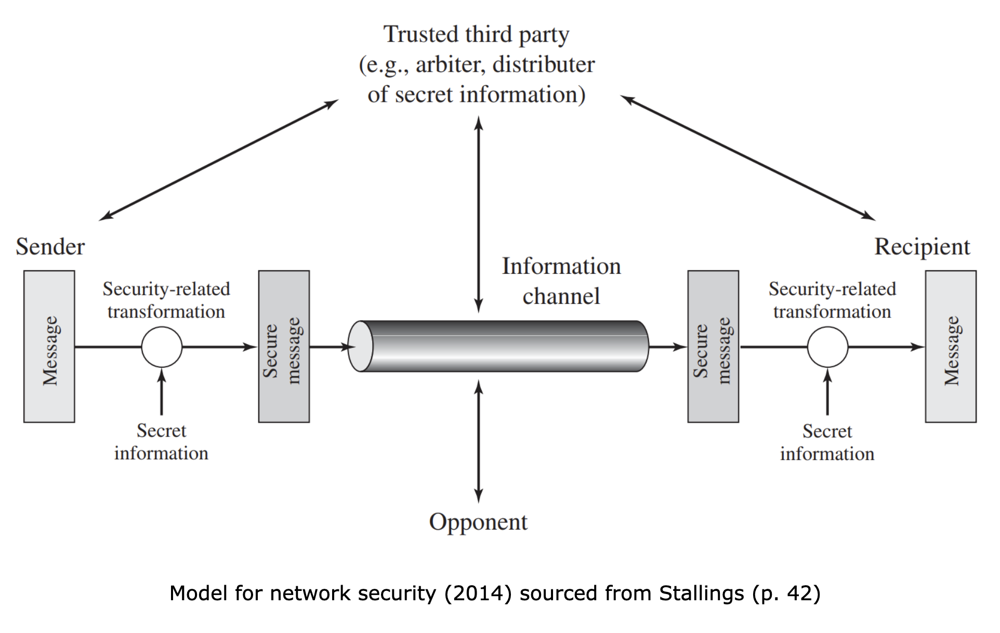

While information at rest is pertinent, the most common scenario we encounter is one wherein information is transmitted from one entity to another. There are various implementations across networks to facilitate this process and the responsibility is for the administration of the correct mechanisms at the right places to ensure a secure communication channel.

The following image briefly outlines a simplistic depiction of a model for securing a simplistic network, which we will discuss.

Information in transit can be intercepted and ascertained by an adversary, it is the nature of the transmission itself, which cannot be changed. Hence, as we cannot modify the medium, we try to modify the information. As we learned in our previous lesson, cryptography forms the basis of system and information security as it tends to be a central theme around which many other mechanisms are designed.

The use of encryption algorithms to confuse the information is only feasible if it is possible for both parties to have access to the key. However, once the information is encrypted, how do we pass the new information, or in short, the key? If both entities are able to physically do this in person, then why bother encrypting at all?

In the next lesson we will explore techniques that have been and are used to encrypt information in transit. However, to understand the process of encryption, we will first discuss some of the fundamental mathematical principles that need to be understood in order to successfully apply cryptographic principles towards security systems and information.