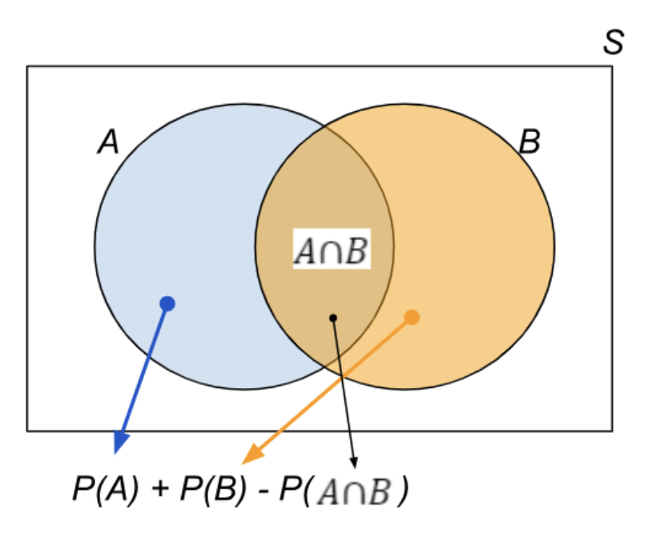

The probability of event A or event B is the sum of probability of event A and probability of event B minus the probability of both events A and B occurring.

$$𝑃(𝐴 \text{ or } 𝐵) =𝑃(𝐴∪𝐵)=𝑃(𝐴)+𝑃(𝐵)−𝑃(𝐴∩𝐵)$$

Consider the following diagram, which demonstrates the equation that denotes the addition rule.

