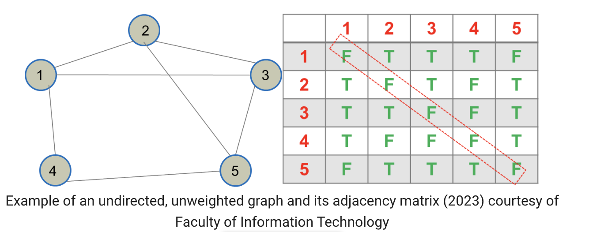
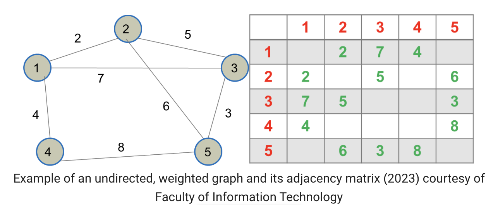
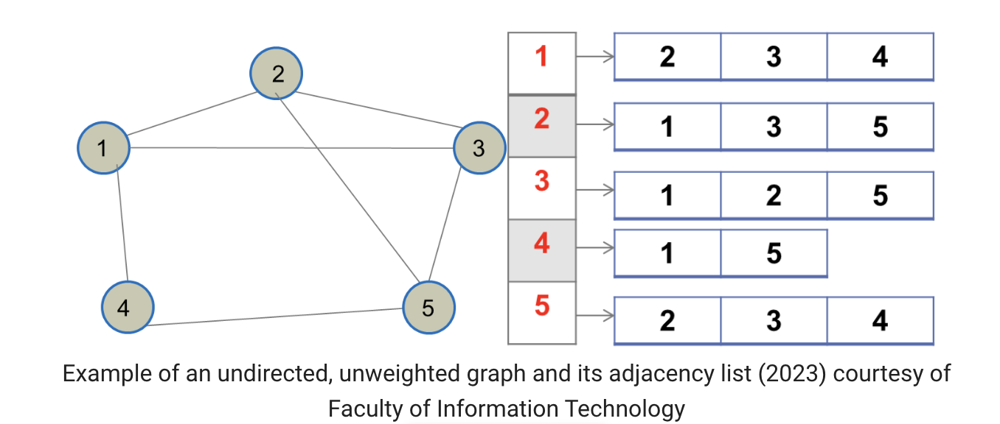
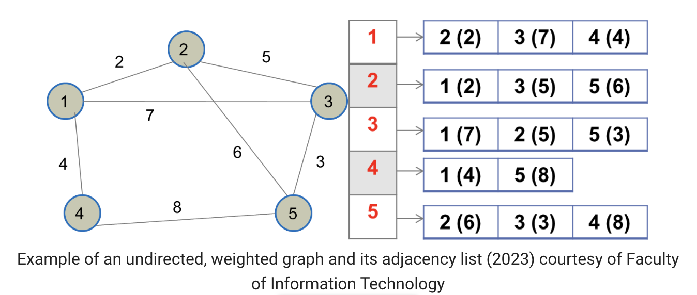

### 2. Graphs using adjacency matrices and lists

#### 2.1. Adjacency matrices

Adjacency matrices with only 0 or 1 (False/True) elements are called Boolean matrices.

To create an **adjacency matrix without weights**, we create a 𝑉×𝑉𝑉×𝑉 matrix 𝑀𝑀 and store 𝑇𝑇 (true) for 𝑀[𝑖][𝑗]𝑀[𝑖][𝑗] if there exists an edge between 𝑖𝑖-th and 𝑗𝑗-th vertex. Otherwise, store 𝐹𝐹 (false).

In the following example, there are 5 vertices, hence the matrix is of 5×55×5 rows and columns. Notice the False values highlighted in the matrix.

To create **an adjacency matrix with weights**, we create a 𝑉×𝑉𝑉×𝑉 matrix 𝑀𝑀 and store weight at 𝑀[𝑖][𝑗]𝑀[𝑖][𝑗] only if there exists an edge between 𝑖𝑖-th and 𝑗𝑗-th vertex. See the following figure for an example.

**Space and time complexity of adjacency matrix:** We create a 𝑉×𝑉𝑉×𝑉 matrix 𝑀𝑀 and store each weight at 𝑀[𝑖][𝑗]𝑀[𝑖][𝑗] only if there exists an edge from 𝑖𝑖-th to 𝑗𝑗-th vertex. Hence, the:  

- space complexity: 𝑂(𝑉2)𝑂(𝑉2) regardless of the number of edges
- time complexity of checking if a certain edge exists: 𝑂(1)𝑂(1)
- time complexity of retrieving all adjacent vertices: 𝑂(𝑉)𝑂(𝑉) regardless of the number of neighbours.

#### 2.2. Adjacency lists

To create **an adjacency list,** create an array of size 𝑉𝑉. At each 𝑉[𝑖]𝑉[𝑖], store the list of vertices adjacent to the 𝑖𝑖-th vertex.

See the following figure for an example.

To create **an adjacency list of a weighted graph,** we create an array of size 𝑉𝑉. At each 𝑉[𝑖]𝑉[𝑖], store the list of vertices adjacent to the 𝑖𝑖-th vertex along with the weights. (The numbers within the parenthesis correspond to weights.) See the following figure for an example.

**Space and time complexity of adjacency list:** We create an array of size 𝑉𝑉 and at each 𝑉[𝑖]𝑉[𝑖], store the list of vertices adjacent to the 𝑖𝑖-th vertex along with the weights. Hence, the:

- space complexity: 𝑂(𝑉+𝐸)𝑂(𝑉+𝐸)
- time complexity of checking if a particular edge exists: 𝑂(log𝐸)𝑂(log⁡𝐸) assuming sorted lists
- time complexity of retrieving all adjacent vertices: 𝑂(𝑋)𝑂(𝑋) where 𝑋𝑋 is the number of adjacent vertices.