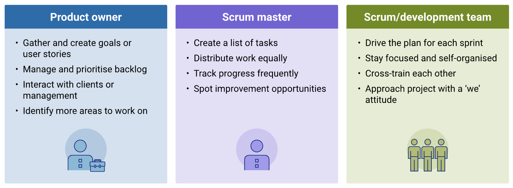

Agile project management is an iterative and flexible approach to project management that emphasises collaboration, customer feedback, and the ability to respond to change. It is widely used in software development but can be applied to various industries. The Agile framework is based on the Agile Manifesto, which outlines four key values and twelve principles.

In this topic book, you will cover the following:

- Agile Manifesto values
- Three main roles in the scrum framework
- Key steps in Agile scrum project management.

### 1. Agile Manifesto values

The Agile framework is based on the Agile Manifesto, which outlines four key values and twelve principles.

- **Individuals and interactions over processes and tools**: Emphasises the importance of communication and collaboration among team members. 
- **Working software over comprehensive documentation**: Prioritises delivering a working product and values practical results over extensive documentation. 
- **Customer collaboration over contract negotiation**: Encourages ongoing collaboration with customers to better understand and meet their needs. 
- **Responding to change over following a plan**: Acknowledges that requirements and priorities may change, and the team should be adaptable to those changes. 

As mentioned in this week's Spark, Scrum is an Agile framework for project management and product development that emphasises collaboration, flexibility, and customer satisfaction. In addition, Scrum also provides a structured yet flexible framework for teams to work together to deliver valuable products incrementally.

### 2. Three main roles in the scrum framework

View the following infographic to learn about the three main roles in the scrum framework.

### 3. Key steps in Agile scrum project management

Take a look at the key steps in Agile scrum project management and their key features:

| Step                                    | Details                                                                                                                                                                                                                                                                                                                                                                                                                                    |
| --------------------------------------- | ------------------------------------------------------------------------------------------------------------------------------------------------------------------------------------------------------------------------------------------------------------------------------------------------------------------------------------------------------------------------------------------------------------------------------------------ |
| 1. Define the project vision            | - Identify the project goals and objectives.  - Define the scope and vision of the project.                                                                                                                                                                                                                                                                                                                                             |
| 2. Backlog grooming (refinement)        | The purpose of the backlog grooming is to regularly review and refine the items in the backlog. This ensures that the backlog remains relevant, well-prioritised, and ready for the next sprint planning meeting.    - Create the product backlog. - List all features, enhancements, and tasks.  - Prioritise items based on customer value and project goals.                                                                |
| 3. Sprint planning                      | A sprint is a time-boxed iteration (usually 2–4 weeks) during which a potentially shippable product increment is created. Sprint planning occurs at the beginning of each sprint. The team selects a set of backlog items to work on during the sprint based on priority and capacity.     - Select items from the product backlog for the upcoming sprint.         - Define the sprint goal and tasks required to achieve it. |
| 4. Daily standup meetings (daily scrum) | Daily standup meetings are brief, daily meetings where team members synchronise activities and talk about what they've accomplished, what they plan to do next, and any obstacles they're facing. Daily standups promote communication, identify and address issues early, and keep the team aligned with project goals.                                                                                                                   |
| 5. Sprint review                        | At the end of each sprint, the team demonstrates the completed work to stakeholders. This approach allows for quick adaptation to changes, continuous integration, and the ability to release a potentially shippable product at the end of each sprint.     - Demonstrate the completed work to stakeholders.         - Collect feedback for improvement.                                                                     |
| 6. Sprint retrospective                 | After the review, the team holds a retrospective meeting to discuss what went well, what could be improved, and how to implement those improvements in the next sprint. Continuous improvement is a key principle of Agile. The retrospective helps the team reflect on their process and adapt to work more efficiently.                                                                                                                  |
| 7. Repeat                               | Repeat the process with a new sprint, incorporating feedback and adapting to changes.                                                                                                                                                                                                                                                                                                                                                      |