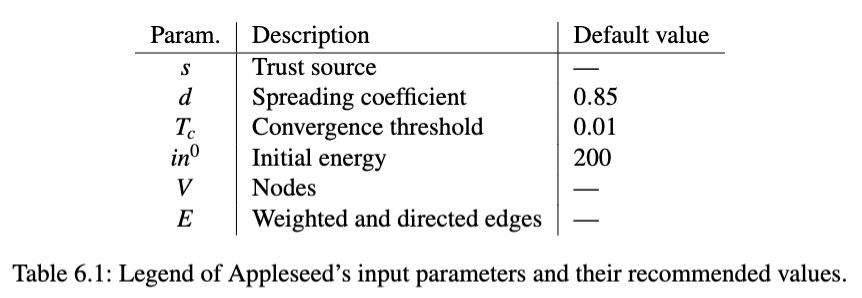
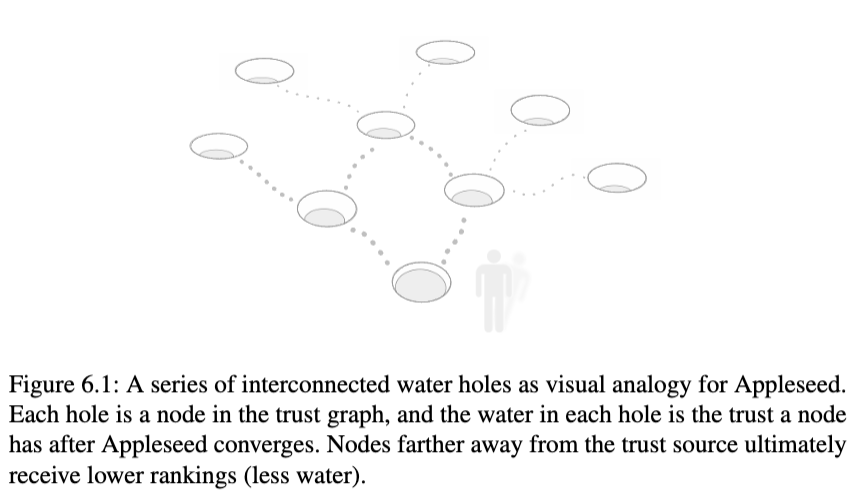
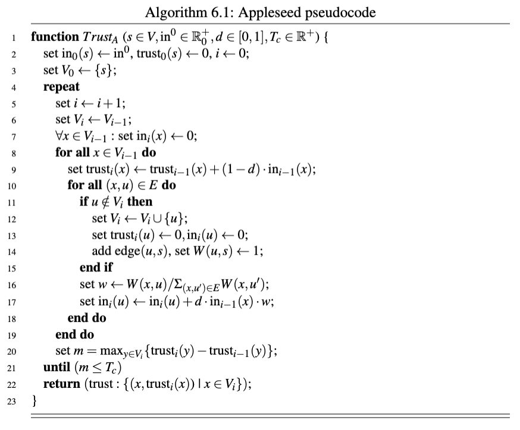
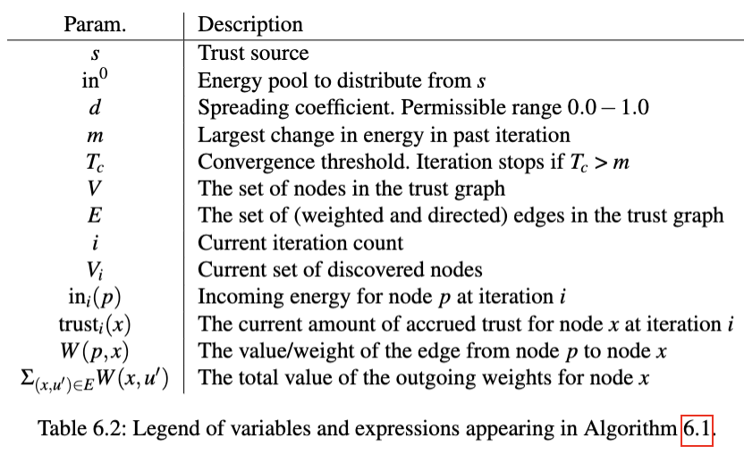

[[TrustNet - Trust-based Moderation]]:
>Appleseed \[[[Propagation Models for Trust and Distrust in Social Networks|Ziegler and Lausen, 2005]]] is a trust propagation algorithm and trust metric for local group trust computation. Basically, Appleseed makes it possible to take a group of nodes—which have various trust relations to each other—look at the group from the perspective of a single node, and rank each of the other nodes according to how trusted they are from the perspective of the single node. 
>The Appleseed algorithm was proposed by Cai-Nicolas Ziegler and Georg Lausen of Institut für Informatik, Universität Freiburg, initially in 2004 \[Ziegler and Lausen, 2004a]

## Trust Metric Classification
>In conjunction with presenting Appleseed, Ziegler and Lausen also propose a classification scheme for trust metrics, which will illuminate labeling Appleseed as a local group trust metric, as it was presented in the chapter introduction. The reason the author duo’s classification scheme is being brought up in this work is that it provides context and insight into what Appleseed is, as well as how it relates to other trust metrics. The proposed classification is composed of three non-orthogonal axes: the network perspective axis, the computation locus axis, and the link evaluation axis. 
>
>**Network perspective** 
>This axis determines the scope of the described trust metric, classifying metrics as either *global* or *local*. Examples of global trust metrics include EigenTrust and PageRank, which were briefly described in Section 5.2’s Related Work. 
>Local trust metrics work instead with subsets of the total trust graph, also known as partial trust graphs—with trust paths from one particular entity to another. The global-local split may also be viewed along the lines of *objective-subjective*. 
>
>**Computation locus** 
>The computation locus axis describes, as may be guessed from the name, where the trust is evaluated. This metric has a somewhat unfortunate naming for the two values the axis can take on. A *centralized*, also known as local, computation locus describes metrics where all of the computation is done individually by every node. 
>A *distributed* computation locus describes metrics where the trust computation is portioned out over the entire network—EigenTrust is a good example of a trust metric that would be classified as distributed along this axis. Since the computational load is distributed across the entire network, distributed metrics are also by definition global—full trust graph information is required. 
>
>**Link evaluation** 
>Link evaluation can take on two values: scalar and group. In a scalar trust metric, each trust assignment is evaluated independently of any other. That is, the value of one assignment does not depend on the value of another. For group trust metrics, however, trust assignments have inherent dependencies. Each trust assignment has a score dependent on the trust of the issuer, which in turn depends on the issuer’s incoming trust assignments. Groups of nodes, or neighbourhoods, are evaluated simultaneously. Group trust metrics calculate trust ranks for each node in the neighbourhood. Having described the proposed classification scheme we can now take another look at the Appleseed algorithm itself. It is a local, centralized (or local), group trust metric. This means that Appleseed works on *partial* trust graphs, it is a subjective metric, it operates on *neighbourhoods* of nodes, and all of the trust computation is done without relying on any external nodes i.e. participating nodes compute their own trust graphs, and it outputs a *ranking* of the nodes from the partial trust graph.

## Appleseed at a glance
>It might be difficult, initially, to understand all of Appleseed’s details. Thus, it seems useful to give a quick overview of important properties, parameters and ways of understanding Appleseed before delving into the algorithm itself. 
>
>**Spreading activation** 
>Appleseed is inspired by a concept called *spreading activation*. Spreading activation appears prominently in language research, specifically in research which deals with word recall \[Anderson et al., 1983]. It has been used as a theory to explain the priming effect, where initial exposure to a starting, or *priming*, phrase causes related words to be more quickly recalled, as a result of the prior exposure. Spreading activation was initially a theory that tried to computerize concepts of human language such as semantics, the meaning of words, and how words are related to each other through their semantics. The original theory treated the underlying meaning of a word, the *concept*, as a node in a directed graph, and the directed edges between concepts represent the relevance one concept has in respect to another \[Collins and Loftus, 1975]. 
>Spreading activation has later been repurposed for searching large, unsorted data collections by way of transforming the data into graphs of interconnected terms \[Ceglowski et al., 2003]. 
>Spreading activation is based on the idea of iteratively redistributing a finite *amount of energy* along a *weighted graph* structure, starting from a source and propagating along its *outward edges*. The energy propagates such that edges with larger weights end up funneling more energy than edges with smaller weights. The energy keeps propagating from node to node along the weighted and directed edges as long as the energy to propagate along the edge exceeds the activation threshold. If the activation threshold is not exceeded, the propagation for that edge stops. 
>The image, presumably scientifically inaccurate, the author of this work has had in mind when learning about spreading activation has been of neurons being activated—bursts of potential causing surging electrical stimulation through axons connecting different neurons, with surges of potential being further propagated if the activation threshold is exceeded in a neuron’s dendrites. 
>
>**Appleseed Properties** 
>Ziegler and Lausen outline a few properties of Appleseed in their article which feel relevant to briefly highlight. Appleseed *fully* distributes all of its initial energy, $in_0$, among its nodes—excluding the trust source, which does not accrue any trust, and nodes which do not have a path to the trust source. The algorithm is also proven by the authors to converge after a finite (but variable) amount of iterations. Experimentally, the amount of iterations before convergence, using the suggested values for parameters, seems to be around 60 to 100. The produced trust ranking is ordered such that the most trusted node, i.e. highest trust rank, is at the top of the list and the least trusted nodes are at the bottom. 
>Appleseed takes the following parameters as input: the trust source s, the spreading coefficient d, the convergence threshold Tc, and the amount of initial energy $in_0$. The algorithm implicitly also takes a set of trust assignments, or a trust graph composed of nodes, V , and weighted, directed edges, E. The range of permissible values for the edge weights is 0.0 − 1.0. The input parameters have been summarized in Table 6.1. Where possible, Ziegler and Lausen’s suggested parameter values have also been included.
>

## Pooling Water Analogy 
>In order to make the idea of Appleseed more graspable, a metaphor of water streaming amongst a group of water holes can be fruitfully employed, see Fig. 6.1. 
>Imagine you have a tub of water containing 200L. In front of you is a group of interconnected holes in the ground. Holes are connected to other holes by tunnels of varying sizes. All the holes are initially without water. You proceed to pour the tub of water into the hole closest to you. The water poured into the initial hole goes along the tunnels connecting to its closest neighbours, and the water that comes into the neighbours is distibuted along their tunnels to their neighbours, and so on. 
>The water sloshes from neighbour to neighbour, with more water ending up at the holes whose incoming tunnels are wider. Eventually the rushing water calms down, and the water level in each hole stabilizes. 
>The tub of water in the metaphor is the amount of finite energy that Appleseed redistributes from the trust source along its outgoing direct trust assignments. The width of the tunnels is akin to the trust weights, where wider tunnels are likened to outgoing edges with larger weights. The variable amount of water left in each hole after the slushing has ceased can be likened to the computed trust rank for each node in Appleseed’s trust graph. The more water a hole has, the higher its rank is, and the higher its trust. 
>The metaphor has flaws in its physicality but serves as a tool to aid in understanding the Appleseed algorithm.


## Algorithm
We now have enough background and context to dive into the algorithm itself, explaining its parameters in greater detail, and how the algorithm itself works. 
Algorithm 6.1 contains the full pseudocode for the heuristicless Appleseed trust computation algorithm presented in [Ziegler and Lausen, 2005]. Table 6.2 is a comprehensive legend of the different variables, as well as more complex expressions, that appear in Algorithm 6.1. 
Finally, it is important to note that a lot of context and essential details from the paper is not visible when reading the pseudocode listing—one of the aims of the longform descriptions in the Parameters section below is to remedy that issue. 

Walkthrough 
We will now give a guided tour of the code in Algorithm 6.1. Readers are recommended to complement this explanation with the legend in Table 6.2. Line numbers will be referred to according to the convention L :x, where x denotes the line being referred to, as seen in Algorithm 6.1’s listing
```
 function TrustA (s ∈ V, in0 ∈ R+ 0 , d ∈ [0, 1], Tc ∈ R+) { 
	 set in0(s) ← in0, trust0(s) ← 0, i ← 0; 
	 set V0 ← {s}; 
	 repeat 
		 set i ← i + 1; 
		 set Vi ← Vi−1; 
		 ∀x ∈ Vi−1 : set ini(x) ← 0; 
		 for all x ∈ Vi−1 do 
			 set trusti(x) ← trusti−1(x) + (1 − d) · ini−1(x); 
			 for all (x, u) ∈ E do
				 if u /∈ Vi then
					 set Vi ← Vi ∪ {u}; 
					 set trusti(u) ← 0, ini(u) ← 0; 
					 add edge(u, s), set W (u, s) ← 1; 
				 end if 
				 set w ← W (x, u)/Σ(x,u′)∈EW (x, u′); 
				 set ini(u) ← ini(u) + d · ini−1(x) · w; 
			 end do 
		 end do 
		 set m = maxy∈Vi {trusti(y) − trusti−1(y)}; 
	 until (m ≤ Tc) 
	 return (trust : {(x, trusti(x)) | x ∈ Vi});
 }
```


L :1 The function declaration, TrustA, shows the input parameters being declared, and the conditions that are imposed upon them. The trust source s has to be a node from the trust graph V , the energy to distribute in0 has to be a positive integer, the spreading factor d in the range 0..1, and the convergence threshold Tc also has to be a positive real number. See the section Parameters below for more detail. 
L :2 − 3 The initial state is setup. We begin at iteration 0, represented by the variable i, and which explains the subsequent subscripts. The only node we know of at the moment is the trust source s, thus the discovered nodes, V0, is initialised to the trust source. The trust source’s incoming energy, in0(s), is set to be the energy to distribute over the trust graph, in0. The incoming energy is what determines the trust rank of a node, which we will explain when we arrive at L :9. The current trust ranking for the trust source, trust0(s) is set to 0. It will also stay at 0, as the trust source does not accrue any trust (the trust source is regarded as absolutely trusted, already). 
L :4 − 7 We are now looping inside the main body of the algorithm. At the be- ginning of each loop, the bookkeeping is updated. The current iteration count, i is incremented, the set of discovered nodes from the previous iteration, Vi−1, is carried over to the current iteration, Vi. Finally, the new iteration’s incoming energy, ini(x), for all nodes that have been discovered, ∀x ∈ Vi−1, is initialised to 0. It is important to note that the incoming energy of the previous iteration, ini−1, remains intact; the values that were set during the previous iteration are unchanged. 
L :8 We start to loop over all of the previous iteration’s discovered nodes, Vi−1; x denotes the node currently under consideration. 
L :9 This is where the nodes’s outgoing trust from the previous iteration is added to the trust rankings of this iteration, for each node that was issued trust. For all of the discovered nodes, x ∈ Vi−1, set their current trust ranking to be the sum of their previously accrued trust, trusti−1(x), and the percentage they may keep, (1 − d), of the incoming trust, ini−1(x). The spreading factor d, passed in at L :1 during the function invocation, determines how much of a node’s incoming energy will be spread to its trusted nodes. Conversely, it also determines how much energy a node will be allowed to keep. If d is set to 1, nodes pass on all energy, keeping none (the percentage, 1 − d, evaluates to 0). 
L :10 We start to loop over each edge in the known trust graph. The node x is an already discovered node and present in Vi, while u may be a newly discovered node (it may also, however, be an already discovered node—L :11 handles the undiscovered case). 
L :11 − 15 The outgoing node was previously undiscovered! It is added to the set of discovered nodes, Vi. The new node’s trust ranking, trusti(u), is initialised to 0, and so is its incoming energy, ini(u). L :14 is special, because it adds the backpropagating edge. The backpropagating edge is basically an edge from a node to the trust source s, with its edge weight set to the maximum value. See the section Backpropagating edges below for more details. L :16 The proportion of outgoing energy to redistribute to the outgoing node, u, from the currently considered node, x, is determined. x’s assigned trust for u is cap- tured by W (x, u), i.e. the edge weight from x to u. The denominator in the fraction, Σ(x,u′)∈EW (x, u′), basically sums up the total outgoing weight from x, where u′ exists to keep track of the node under consideration in the summation. 
L :17 The outgoing node u’s incoming energy is set. The incoming energy for u, ini(u), denotes the sum of its current incoming energy and u’s allocated proportion of x’s outgoing energy, d · ini−1(x) · w, where w is what was determined on L :16. 
L :18 We exit the loop processing all of x’s outgoing nodes, initiated on L :10. 
L :19 We exit the loop processing all of the previous iteration’s discovered nodes, initiated on L :8.
L :20 The largest change in the trust rankings is calculated. For each node in the discovered set, y∈Vi , determine the largest change in trust rankings between this iteration and the previous iteration, trusti(y) − trusti−1(y), and save that in m for evaluation on L :21. 
L :21 The termination condition for the main loop, initiated on L :4. The loop terminates if the largest change in the last iteration, m, falls below the convergence threshold, Tc. If the condition, m ≤ Tc, evaluates to false the algorithm is regarded as to have converged on the trust rankings for all of the discovered nodes Vi. 
L :22 We return the calculated trust rankings for each discovered node x in Vi. 
L :23 The function ends.

Parameters 
Spreading coefficient 
The spreading activation coefficient d determines how much of the incoming energy a node will redistribute. In other words, it controls what portion of the incoming energy the node will keep. d is on the interval [0, 1], where 1 redistributes all of the incoming energy for a particular node, and 0 redis- tributes none of it—in which case the node keeps all of its incoming energy. The scenario of d = 0 is somewhat nonsensical, but a temporary assignment of d = 1 is an integral part of the design of Appleseed. The temporary d = 1 value is used for the trust source, which redistributes all of its incoming energy to its direct neighbours—the rationale being that the trust source is regarded as completely trusted, so we don’t need to compute any ranking for it.
The expression describing the amount of kept energy can be seen in the psue- docode on line 9 in Algorithm 6.1, (1 − d) · ini−1(x) Likewise, the redistributed energy can be read out on line 17, d · ini−1(x) · w where w denotes the weight of the outgoing edge being processed. As seen in Table 6.1, Ziegler and Lausen’s suggested value for spreading activa- tion is d = 0.85, meaning that 85% of the incoming energy is propagated and 15% is kept by the node redistributing energy. A final note from the paper on spreading activation: Spreading factor d may also be seen as the ratio between direct trust in x and trust in the ability of x to recommend others [...] Observe that low values for d favor trust proximity to the source of trust injection, while high values allow trust to also reach nodes which are more distant. [Ziegler and Lausen, 2005] Convergence threshold Appleseed is an iterative algorithm, meaning it will need several passes to home in on the final result. Iterative algorithms continue looping until a certain criteria has been fulfilled, whereupon the final result is regarded as having been computed. In Appleseed’s case, the parameter that determines when to stop iterating is the convergence threshold Tc. What the convergence threshold says is basically that once the amount of energy that is being redistributed falls below a certain threshold, then the computation has finished—we have our final ranking. More accurately: once the largest amount of energy that has been redistributed in the current iteration, i.e. the assignment of m on line 20, falls below the convergence threshold, line 21, then we have converged on the final trust ranking for the trust source s, given the nodes V and edges E. Initial energy The initial energy in0 defines the energy reservoar which Apple- seed distributes from the trust source s via its weighted edges. A nice property of Appleseed is that, after convergence, all of the initial energy in0 is fully distributed among the nodes in the produced ranking. Another way to view this property is that the total amount of energy in the network, at any point in time, sums up to in0. That there is no global energy loss simplifies implementation of Appleseed, as it allows implementors to trivially check if the sum of the produced rankings add up to the initial energy in0—and if that is not the case, then there is an obvious bug that needs to be remedied. The proposed value of in0 is 200 and seems to have been derived experimen- tally with regards to the convergence rate, or, the amount of iterations for the final result—higher values of in0 cause slightly more iterations