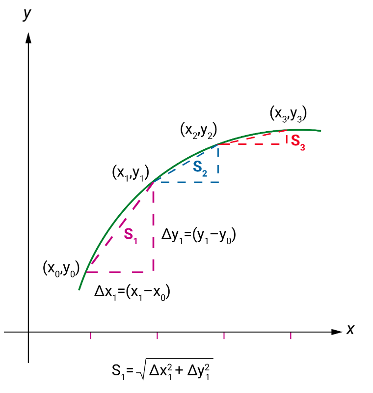

Assume that we are asked to find the length of a curve between two points, where the curve is smooth, and the derivative is continuous.

When integration is used to calculate arc length, the length of the curve needs to be divided into infinitesimally small sections, calculate the lengths of those small sections and then add them up.

Pythagoras' theorem adds the lengths of all those small curve segments between the start and finish points. As shown above, the lengths of the legs of each infinitesimal triangle are $Δ𝑥_𝑖$ and $Δ𝑦_𝑖$, and the hypotenuse is calculated as:

$$\sqrt{\Delta𝑥^2_𝑖+\Delta𝑦^2_𝑖}$$

Here, 𝑖𝑖 refers to the index of each triangle starting from the very first one. We use the integral to calculate the total length, from 𝑎𝑎 to 𝑏𝑏 along the curve.

$$\int_a^b\sqrt{\Delta𝑥^2_𝑖+\Delta𝑦^2_𝑖}$$

These  Δ𝑥𝑖Δ𝑥𝑖 and Δ𝑦𝑖Δ𝑦𝑖 can also be represented by dx and dy. Hence, the arc length along a curve, 𝑦=𝑓(𝑥)𝑦=𝑓(𝑥), from 𝑎𝑎 to 𝑏𝑏 , can also be represented by the following integral:

$$\int_a^b\sqrt{d𝑥^2_𝑖+d𝑦^2_𝑖}$$

After further simplification (since the dx values are units), it will be equivalent to:

$$\int_a^b\sqrt{1+(\frac{dy}{dx})^2dx}$$

And the arc length formula will be (since f’(x)= dy/dx):

$$\int_a^b\sqrt{1+(f'(x))^2dx}$$