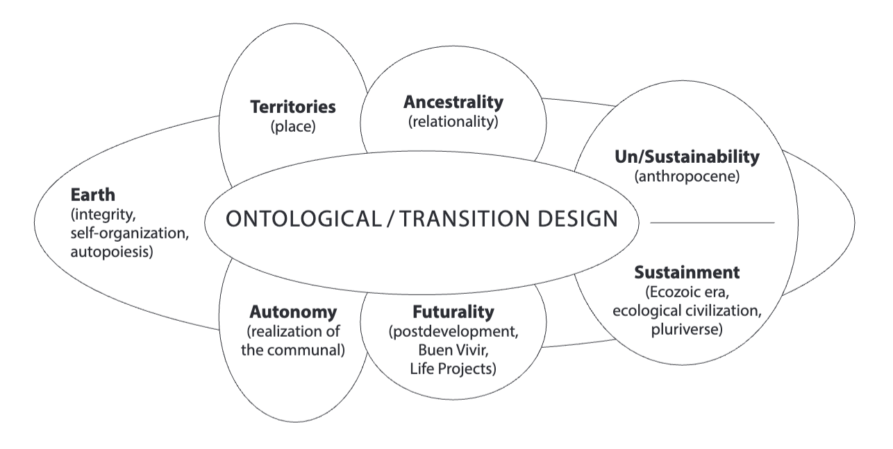

Presuppositions to a design process:
1. Every community practices the design of itself
2. people are practitioners of their own knowledge
3. What the community designs, in the first instance, is an inquiring or learning system about itself
4. Every design process involves a statement of problems and possibilities
5. This exercise may take the form of building a model of the system that generates the problem of communal concern
(slightly modified from [[Proceso de Comunidades Negras]] and Escobar 1998)
[[Autonomous Design and the Politics of Relationality and the Communal]] 184-5
"Autonomy-oriented design 
- Has as its main goal the realization of the communal, understood as the creation of the conditions for the community’s ongoing self-creation and successful structural coupling with their globalized environments. 
 - Embraces ancestrality, as it emanates from the history of the relational worlds in question, and futurality, as a statement about futures for communal realizations. 
 - Privileges interventions and actions that foster nonliberal, non-State-centered, and noncapitalist forms of organization. 
 - Creates auspicious spaces for the life projects of communities and the creation of convivial societies. 
 - Considers the community’s engagement with heteronomous social actors and technologies (including markets, digital technologies, extractive operations, and so forth) from the perspective of the preservation and enhancement of the community’s autopoiesis. 
 - Takes seriously the transition design imperatives of place building, re-localization, renewed attention to materiality and nonhumans, and the creation of interepistemic collaborative organizations. 
 - Gives particular attention to the role of commoning in the realization of the communal; conversely, it devises effective means to encourage diverse economies (social and solidarity economies, alternative capitalist and noncapitalist economies). 
 - Articulates with the trends toward Buen Vivir and the rights of nature and with related trends elsewhere (e.g., degrowth, commons). 
 - Fosters pluriversal openings; it is, to this extent, a form of design for the pluriverse, for the flourishing of life on the planet. 
 - Thinks deeply about, and creates spaces for, strengthening the connection between the realization of the communal and the Earth (its relational weave at every place and everywhere), in ways that enable humans to relearn to dwell on the planet with nonhumans in mutually enhancing manners.
 - Gives hope to the ongoing rebellion of humans and nonhumans in defense of relational life principles."
 