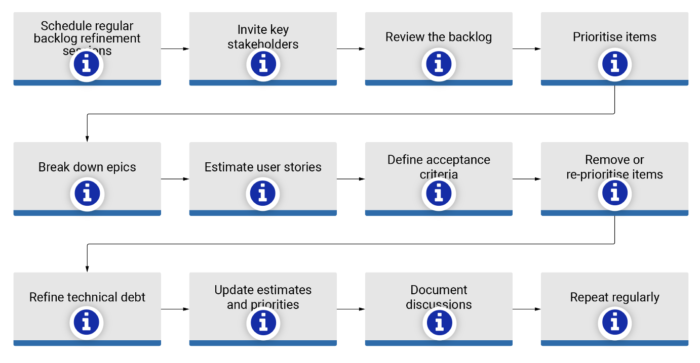

### 1. Backlog refinement

Backlog refinement, previously known as backlog grooming, is an essential part of the Agile project management process. It involves reviewing, prioritising, and refining items in the product backlog to ensure that the team is working on the most valuable and well-defined tasks.

By regularly refining the backlog, the team ensures that they are working on the most valuable tasks, that user stories are well-defined, and that the backlog remains a reliable guide for future development efforts.

Schedule regular backlog refinement sessions

Set up regular time slots for backlog refinement sessions. The frequency depends on your team's needs but is often done once per iteration or sprint.

Invite key stakeholders

Ensure that relevant stakeholders, including product owners, developers, and other team members, are present during the refinement sessions.

Review the backlog

Begin by reviewing the existing items in the backlog. Ensure that they are up to date and accurately reflect the current priorities and requirements.

Prioritise items

Work with the product owner to prioritise backlog items based on business value, customer needs, and strategic goals. Consider using techniques like MoSCoW prioritisation (Must-haves, Should-haves, Could-haves, and Won't-haves) or other prioritisation frameworks.

Break down epics

If there are large, high-level features or epics in the backlog, break them down into smaller, more manageable user stories. Each user story should represent a valuable piece of functionality that can be developed in a single sprint.

Estimate user stories

Collaboratively estimate the effort required to complete each user story. This can be done using story points, hours, or other estimation units. This helps the team understand the relative complexity of each task.

Define acceptance criteria

Clearly define acceptance criteria for each user story. These criteria specify the conditions that must be met for the user story to be considered complete. This ensures a shared understanding of what needs to be delivered.

Remove or reprioritize items

Identify and remove outdated or less valuable items from the backlog. Alternatively, if new information or priorities emerge, be prepared to reprioritise and adjust the backlog accordingly.

Refine technical debt

Address any technical debt that has been identified during the development process. Decide whether to tackle it immediately or schedule it for future sprints.

Update estimates and priorities

After discussing and refining items, update the estimates and priorities in the backlog. This ensures that the backlog remains a dynamic and accurate representation of the team's work.

Document discussions

Document any decisions, insights, or discussions that occur during the refinement session. This information can be valuable for future reference and for team members who may not have been present.

Repeat regularly

Backlog refinement is an ongoing process. Repeat these steps regularly to keep the backlog in good shape and to facilitate smooth sprint planning.