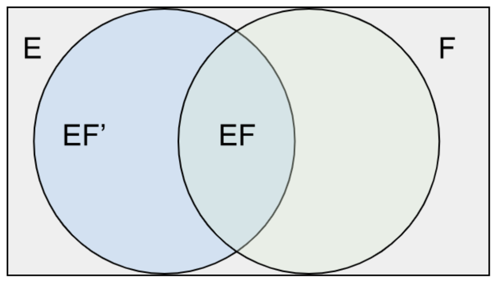

The following Venn diagram shows the intersection of the probability of two events. Let 𝐸 and 𝐹 be events.

Then, we may express 𝐸 as

$$𝐸=𝐸𝐹∪𝐸𝐹′$$

for, in order for a point to be in 𝐸, it must either be in both 𝐸 and 𝐹 or be in 𝐸 but not in 𝐹. As 𝐸𝐹 and 𝐸𝐹′  are clearly mutually exclusive, we have 𝑃(𝐸) as

$$𝑃(𝐸)=𝑃(𝐸𝐹)+𝑃(𝐸𝐹′)$$$$=𝑃(𝐸|𝐹)𝑃(𝐹)+𝑃(𝐸|𝐹′)𝑃(𝐹′)$$$$=𝑃(𝐸|𝐹)𝑃(𝐹)+𝑃(𝐸|𝐹′)[1−𝑃(𝐹)]$$

The probability of the event 𝐸 is a weighted average of the conditional probability of 𝐸 given that 𝐹 has occurred and the conditional probability of 𝐸 given that 𝐹 has not occurred.

Each conditional probability is given as much weight as the event it is conditioned on to occur. It is an extremely useful formula, for its use often enables us to determine the probability of an event by first 'conditioning' on whether or not some second event has occurred. There are many instances where it is difficult to compute the probability of an event directly. Still, it is straightforward to compute it once we know whether or not some second event has occurred.

The formula for the Bayes theorem can be written in a variety of ways. The following is the most common version:

$$𝑃(𝐴∣𝐵)=\frac{𝑃(𝐴)𝑃(𝐵∣𝐴)}{𝑃(𝐵)}$$

$𝑃(𝐴∣𝐵)$ is the conditional probability of event 𝐴 occurring, given that 𝐵 is true.

$𝑃(𝐵∣𝐴)$ is the conditional probability of event 𝐵 occurring, given that 𝐴 is true.

𝑃(𝐴) and 𝑃(𝐵) are the probabilities of 𝐴 and 𝐵 occurring independently of one another.

This can also be expanded and written for n mutually exclusive events $𝐴1,𝐴2,…,𝐴𝑛$ whose union is the sample space S. Let B be any given event. Then Bayes’ theorem states

$$𝑃(𝐴|𝐵)=\frac{𝑃(𝐴_𝑖)𝑃(𝐵|𝐴_𝑖)}{\sum^𝑛_{𝑖=1}𝑃(𝐴𝑖)𝑃(𝐵|𝐴_𝑖)};𝑖=1,2,...,𝑛$$

where $𝑃(𝐴1),𝑃(𝐴2),…,𝑃(𝐴𝑛)$ are called the **prior probabilities** of $𝐴1,𝐴2,…,𝐴𝑛$  and $𝑃(𝐴1|𝐵),𝑃(𝐴2|𝐵),…,𝑃(𝐴𝑛|𝐵)$ are called the **posterior probabilities**  of $𝐴1,𝐴2,…,𝐴𝑛$. Also, note that the sum of all the posterior probabilities must equal 1.