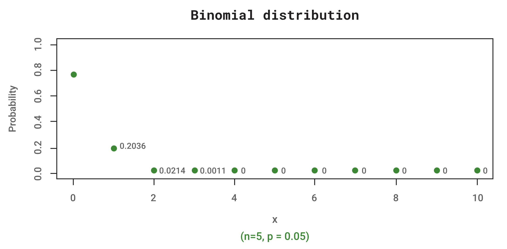

Consider $n$ independent performances of a random experiment with mutually exclusive outcomes that can be classified as success or failure. The words 'success' and 'failure' are to be regarded as labels for two mutually exclusive categories of outcomes of the random experiment. They do not necessarily have the ordinary connotation of success or failure. Assume that $𝑝$, the probability of success on any performance of the random experiment, is constant. Let $𝑄$ be the probability of failure so that $𝑄=1–𝑝$

The probability distribution of $𝑋$, the number of successes in $𝑛$ performances of the random experiment, is the binomial distribution, with a probability distribution function (pdf) specified by

$$𝑓(𝑥)=\frac{𝑛!}{𝑥!(𝑛−𝑥)!}𝑝^𝑥𝑄^{𝑛−𝑥};\ \ 𝑥=0,1,…,𝑛$$

where $𝑓(𝑥)$ is the probability of $𝑥$ successes in $n$ performances. One can show that the expected value of the random variable $𝑋$ is $𝑛𝑝$, and its variance is $𝑛𝑝𝑄$. 

As a simple example of the binomial distribution, consider the probability distribution of the number of defectives in a sample of 5 items drawn with replacement from a lot of 1000 items, 50 of which are defective. Associate “success” with drawing a defective item from the lot. Then the result of each drawing can be classified as success (defective item) or failure (non-defective item). The sample of five items is drawn with replacement (i.e., probability of success remains constant at 50/1000 = 0.05). Substituting in the equation above the values $𝑛=5$, $𝑝=0.05$, and $𝑄=0.95$ yields

$$𝑓(𝑥)=\frac{5!}{𝑥!(5−𝑥)!}(0.05)^𝑥(0.95)^{5−𝑥};\ \ 𝑥=0,1,2,3,4,5$$

as the probability density function for 𝑋, the number of defectives in the sample. The probability that the sample contains exactly three defectives is given by:

$$𝑃(𝑋=3)=\frac{5!}{3!2!}(0.05)^3(0.95)^2=0.0011$$

Hence we can write the general Binomial probability distribution formula as below:

$$𝑃(\text{𝑥 out of 𝑛})=\frac{𝑛!}{𝑥!(𝑛−𝑥)!}𝑝^𝑥(1−𝑝)^{(𝑛−𝑥)}$$
Where:

- $𝑛$ = total number
- $𝑥$ = number we want

The Binomial distribution for the example above is shown in the following figure. The plot is for $𝑛=5$ and $𝑝=0.05$. Each point represents the probabilities at each $𝑥$ value. Hence, by looking at the plot, we can see that $𝑃(𝑥=3)=0.0011$ is exactly the same as when computed using the binomial formula.

  