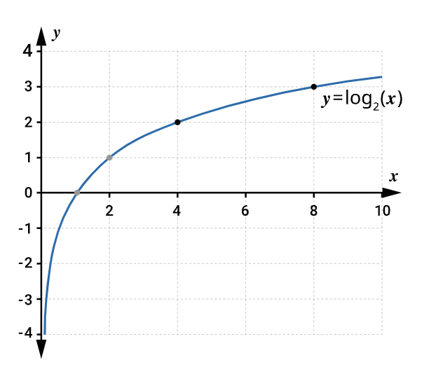
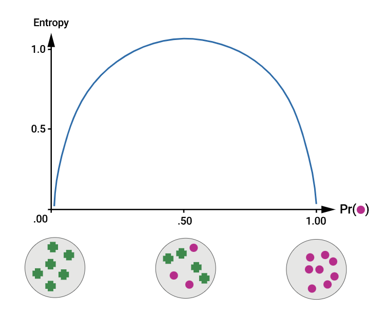
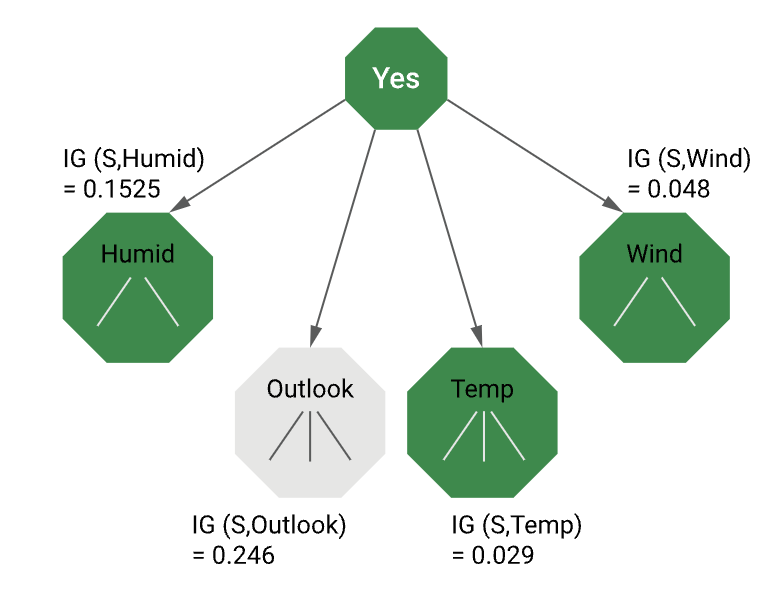
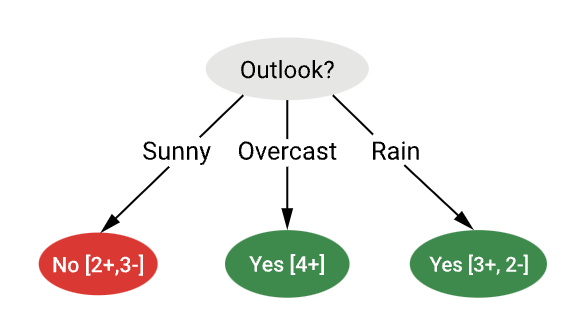
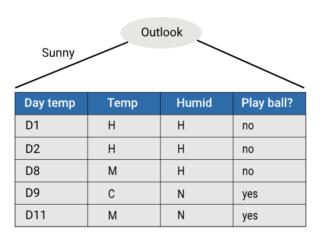
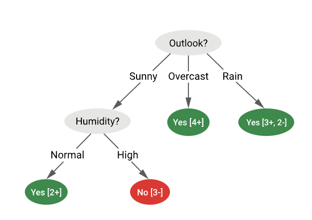
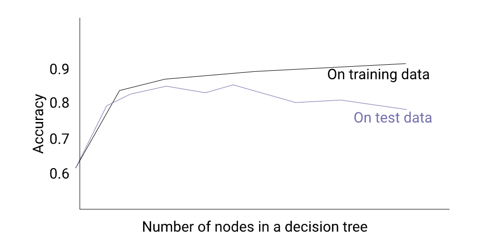
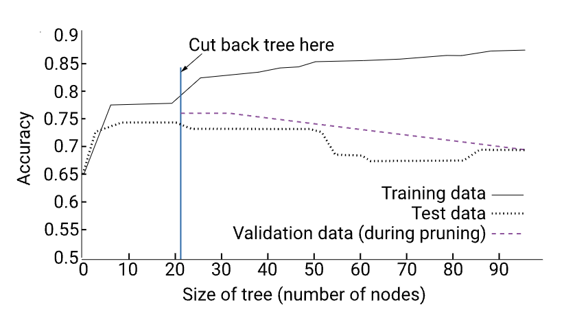
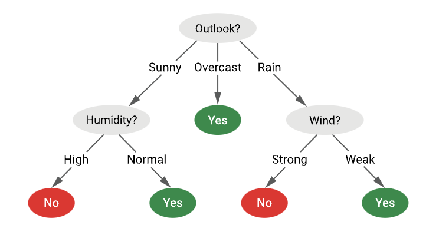

### Quantifying uncertainty

#### Entropy

Entropy is a way to measure uncertainty in a probability distribution and has the following formula for a discrete random variable 𝑋.  It’s a sum over the values 𝑋 that can take the probability of getting value 𝑥 multiplied by the log of the probability of getting x.

Given a discrete random variable on a finite set $𝑋=𝑥1,...,𝑥𝑛,$ with probability distribution function $𝑃𝑟(𝑥)=𝑃𝑟(𝑋=𝑥)$, the entropy $𝐻(𝑋)≥0$ of 𝑋 is defined as:
$$H(X) = -\sum_{i=1}^n Pr(x_i) log_2(x_i)$$

#### Example

In this example, we can see a portion of the graph of $𝑦=𝑙𝑜𝑔_2(𝑥)$.  Since probability values are always between 0 and 1, we are interested in the graph where 𝑥 is between [0, 1] when considering entropy.

Note also that the log is negative for 𝑥 between 0 and 1, hence why the negative sign is present in the entropy formula.

### Entropy and homogeneity

#### Entropy

In the following diagram, if 𝑆 is a distribution for purple and green shapes, then we can see the maximal entropy occurs when the probability of either blue or green is 0.5. The minimum entropy occurs when the probability of either is 0.

If you know the probability of a purple shape is 1, If you were given a new shape and asked how certain you were of the colour, you would be **perfectly certain** that it was purple. 

On the other hand, If you know the probability of a purple shape is 0.5, and you were given a new shape and asked how certain you are of the colour, you would be **maximally uncertain**.

#### Entropy is Bad, Homogeneity is Good

In this example, we have a random variable 𝑆 with examples labelled 𝑃 for positive and 𝑁 for negative. We also evaluate 0 logs 0 as 0.

$$Entropy(S) = -Pr(P)log_2(Pr(P)) - Pr(N)log_2(Pr(N))$$

If 𝑆 has 9 positive and 5 negative examples, then we can calculate the entropy of 𝑆 as 0.94.

$$Entropy([9+, 5-]) = -\frac{9}{14}log_2 \frac{9}{14} - \frac{5}{14}log_2 \frac{5}{14} = 0.94$$

#### Information Gain

**Information gain** is the tool we will use to construct our decision trees. Information gain is the expected reduction in entropy of a distribution of one variable 𝑆 if we split it on an attribute 𝐴 when both variables come from a joint distribution with 𝑆 and 𝐴.

$$IG(S,A) = H(S) - \sum_{v\in Values(A)} \frac{|S_v|}{S}H(S_v)$$

We split the examples into one pile for each value 𝑣 that the variable 𝐴 can take. |𝑆𝑣| is the size of the group of examples for which 𝐴 has value 𝑣.

#### Information gain of splitting on 'wind.'

In this example, using the play-ball data, we would like to find the information gained from play-ball by splitting on the 'wind' attribute. 

We consider 𝑆 to be 'play-ball' and 𝐴 to be 'wind'. 'Wind' can either be 'strong' or 'weak'. 

The table shows that unsplit, play ball has nine 'Yes' and 5 'No'. We can see the number of 'Yes' and 'No' values for play-ball when split based on 'Weak' and 'strong' wind. 

If we place the values into our information gain formula and calculate the entropy of 𝑆𝑤 and 𝑆𝑣, we find the information gain to be 0.048.

- Weak wind 𝑆𝑤=[6+,2−]
    
- Strong wind 𝑆𝑠=[3+,3−]

$$IG(S,A) = H(S) - \sum_{v\in Values(A)} \frac{|S_v|}{S}H(S_v)$$
$$= H(S) - \frac{8}{14}H(S_w) - \frac{6}{14}H(S_s)$$

$$= 0.94 - \frac{8}{14} \times 0.811 - \frac{6}{14} \times 1.00$$
$$= 0.048$$
| Day | Wind   | Play ball |
| --- | ------ | --------- |
| D1  | Weak   | No        |
| D3  | Weak   | Yes       |
| D4  | Weak   | Yes       |
| D5  | Weak   | Yes       |
| D8  | Weak   | No        |
| D9  | Weak   | Yes       |
| D10 | Weak   | Yes       |
| D13 | Weak   | Yes       |
| D2  | Strong | No        |
| D6  | Strong | No        |
| D7  | Strong | Yes       |
| D11 | Strong | Yes       |
| D12 | Strong | Yes       |
| D14 | Strong | No        |
#### Using information gain to learn a decision tree

To use information gain to build a decision tree, we split on the attribute that leads to the **largest information gain** in the variable we are trying to predict. That is the largest reduction in entropy.

 In the following illustration, we would take the left split if we had a choice between the left and right split.
 
 
'Outlook' has the largest information gain, so we should choose it as the split for the root node.

#### Building a Decision Tree

Selecting 'Outlook' in our previous example would produce the decision stump shown in the following diagram, and we can see the results that majority voting would give.

We want to continue building our tree until it is impossible to gain more information by splitting.

We can split the remaining attributes 'Temp' and 'Humid'. Looking at the data, we see that splitting on 'Humid' will, in fact, separate play ball perfectly into yes and no classes. 

If we continue with the algorithm, we will do the same evaluation process with the 'Rain' path from 'Outlook'.

#### Decision tree learning algorithm

The decision tree learning algorithm can be described at a high level quite simply with the following:

- BuildTree(TrainingData)
	1. Split(TrainingData)
- Split(𝐷)
	1. If all points in 𝐷 are of the same class, Then Return
	2. For each attribute 𝐴: Evaluate splits on 𝐴 (using IG)
	3. Use best split to partition 𝐷 into 𝐷1,𝐷2,...
	- Split (D1)
	- Split (D2)
	- ...

The work is done by the recursive function 'Split' that performs the top-down recursive splitting of attributes based on information gain.

#### Overfitting and decision trees

A generated tree may overfit the training data and try to fit noise or outliers, reducing accuracy for unseen samples. The following diagram illustrates how this becomes more likely as the number of nodes in the tree increases.

#### Avoiding overfitting in decision trees

There are a few options to prevent overfitting in decision trees:

- **Pre-prune -** where we stop growing the tree early if a goodness measure falls below a threshold. 
- **Post-prune -** where we grow the full tree, then cut back to the point before performance deteriorated. This is where we would use a validation data set. 
- **Regularisation -** where we add a complexity penalty to the performance measure, for example, penalise having more nodes. E.g., Complexity = Number of nodes in the tree.
#### Effect of pruning after growing the decision tree

The following diagram shows an example of post-pruning. To post-prune, we measure the model's performance during training using a validation data set, and at the end of the training, we cut the tree back to the way it was when the performance on the validation data was highest.

#### Enhancements to decision tree induction

There are several enhancements we can make to decision trees. So far, we’ve only looked at categorical attributes, but we can also handle **continuous-valued attributes**. 

- Input: Use threshold to split.
- Output: Estimate a linear function at each leaf (e.g., mean).

We can adapt the algorithm to handle **missing categorical values** by using the mode or by choosing at random according to the distribution of the attribute with missing values. 

We can also handle **missing continuous** values by using the mean.

And we’ve seen how we can reduce overfitting by post-pruning, for example.

#### Extracting rules from decision trees

Decision trees are highly interpretable, and we can represent the inferred structure in the form of **IF-THEN** rules that are easily readable by humans. 

In the following diagram, one rule is created for each path from the root to a leaf where each attribute-value pair along a path forms a conjunction, and the leaf node holds the class prediction.

- **IF** outlook=“sunny” and humidity=“high” **THEN** play-ball=“NO”
- **IF** outlook=“sunny” and humidity=“normal” **THEN** play-ball=“YES”
- **IF** outlook=“overcast” **THEN** play-ball=“YES”
- **IF** outlook=“rain” and wind=“strong” **THEN** play-ball=“NO”
- **IF** outlook=“rain” and wind=“weak” **THEN** play-ball=“YES”

