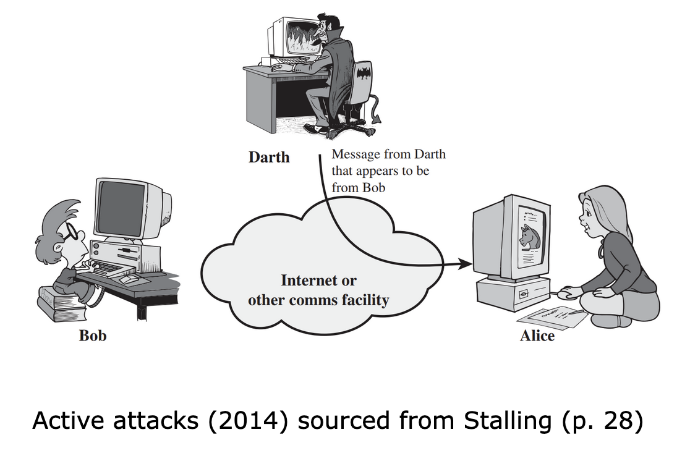
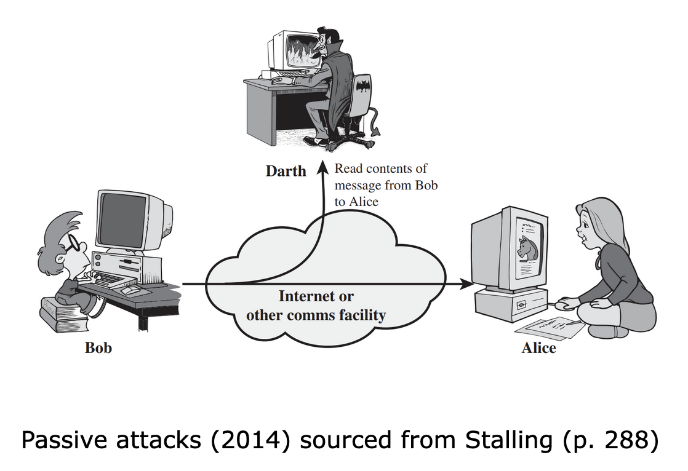

While it is simple to stipulate a set of properties that must be met in order to achieve security, the actual implementation and enforcement of those properties are far from simple. When considering computer security, the following aspects impact how secure a system is.

## The type of attack

Security attacks can be classified based on the type of attack or the source of the attack, as follows:

- **Active attacks:** Active attacks are generally the more dangerous ones, as these are the attacks that manage to make headlines on the news when they occur. The reason these attacks are dangerous is because an attacker actively aims to modify the communication stream between the sender and receiver. The goal of this type of attack is for the attacker to convince either party that they are in fact the other and in the process gain access to sensitive information or other details that the attacker can then exploit for financial gain or to cause other damages to the sender or receiver.

- **Passive attacks:** Passive attacks are generally not the ones that make big headlines. However, these attacks are perhaps even more important than active attacks. The reason for this is that passive attacks are carried out by an attacker covertly without either the sender or receiver being aware of the attacker's interception. These attacks could give a potential attacker a lot of information pertaining to either party, which can then be exploited later to carry out an active attack.
    

- **Inside attack:** An inside attack is an attack that is initiated by an insider within the organisation. The insider could be someone who already has access to resources but perhaps uses them in an unintended way within the organisation.
    
- **Outside attack:** An outside attack is an attack that is initiated by an outsider to the organisation. The outsider is generally not associated with the organisation and generally doesn't have prior knowledge or information of the internals of the organisation.  
    

## The mechanism used to perform the attack

The attack mechanism is the mode employed by the attacker in order to attack the system. An attacker can choose to compromise one of the many parts involved in the communication between the sender and the receiver. Through this mechanism, an attacker can also have a very different target that they hope to exploit as a result of the attack. Some examples could include the system itself, a specific software in use on the machine, a protocol used by the system or its peripherals, an installed software, or even the network via which the systems are communicating. The possible combinations that can be used by the attacker are extensive. As no two systems are exactly the same, the job of securing all systems can become challenging.

## The service or functionality targeted

Through the attack process, an attacker generally aims to gain an advantage over the target system(s). This advantage can be gained by exploiting some service or functionality offered by the system. The outcome of the advantage could be to get access to certain information or resources or to compromise the integrity of the data or information being transmitted.

# Challenges to computer security

When considering the above aspects collectively, we can see now why securing a computing system is not a very simple task. There are many possible alternatives that an attacker can use to attack a system and in order to secure it, we first need to understand the different ways an attacker could compromise the system. The following are some challenges that pose a challenge to computer security:

- Singular properties, such as confidentiality, integrity, etc., and their definitions are not easy to implement on a complex system.
    
- It is important to keep in mind the mechanism being used by the computer system. By understanding 'how' a functionality is facilitated, we can get a better idea of how to secure it.
    
- Security is a game between an attacker's knowledge of to exploit a system versus the defender's knowledge on how to secure it.
    
- Users often think about security only after an attack has occurred.
    
- Security requires a lot of monitoring, updating, and essentially, an active engagement, which is not always possible.
    
- Users often view strong security as a hindrance to usability and user-friendliness.
    

As we can observe, all the above affect the complexity associated with securing a computer system from an attacker.

See also from my notes: [[Challenges of cybersecurity]]

Next: [[Types of security attacks]]