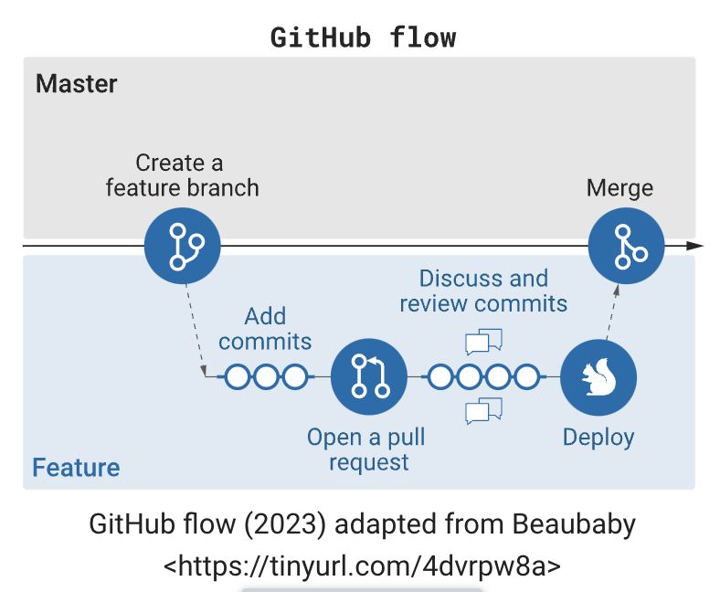

### 1. Collaborative coding platform (GitHub)

A GitHub pull request (PR) is a way to propose changes to a repository hosted on GitHub. It's a collaborative feature that enables developers to notify others about changes they have made in a particular branch of a repository. Pull requests are commonly used in the context of version control systems, particularly Git.

Here's a basic workflow for a GitHub pull request:

1. **Create a Feature Branch**: Developers begin by creating a new branch in the repository for each new feature, bug fix, or task. This helps isolate changes and prevents interference with the main or production branch.
2. **Add Commits**: Developers make changes and commit them to the branch. Commits are a way to save changes to the Git repository.
3. **Open a Pull Request (PR)**: Once the changes are ready, a pull request is opened. This is a request to merge the changes from the feature branch into the main branch.
4. **Discuss and Review**: Team members can review the code changes, discuss them, and suggest modifications. This collaborative process helps maintain code quality and catch potential issues.
5. **Automated Tests**: Automated tests can be run to ensure that the changes do not introduce new bugs and that the code meets the project's quality standards.
6. **Merge Pull Request**: If the changes are approved and the tests pass, the pull request is merged into the main branch. This brings the new code into the main codebase.
7. **(Optional) Deploy**: After merging, the changes can be deployed to a staging or production environment, depending on the project's deployment practices.
8. **(Optional) Release**: If applicable, a release may be created to package the changes and make them available to users.