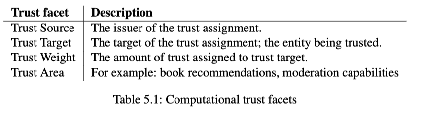
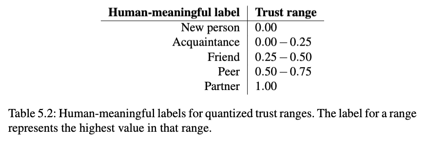

[[TrustNet - Trust-based Moderation]]:
>Computational trust has many potential applications, which is evident from the literature. Levien’s Advogato \[Levien, 2003] was used in a real-life internet community which used trust rankings to limit article posting to trusted users. 
>Ziegler and Lausen \[Ziegler and Lausen, 2004b] use trust to improve recommender systems, reasoning that trust and user similarity are tightly coupled. They validate their reasoning by empirically proving the coupling of trust and user similarity for a scraped dataset of book recommendations. Their aim of using trust is to avoid the problems, e.g. the cold start problem, associated with the collaborative filtering techniques used in the majority of recommender systems today. 
>Collaborative filtering is the idea that you can group users by similarity based on the users’ previous scores regarding the same products, i.e. similar users will rate similar products in a similar fashion. Given two users, user A and user B, and a set of products P that user A has not seen but which B has rated favourably. The products P can then be recommended to A if users A and B are similar. 
>Ziegler and Lausen propose that instead of using only collaborative filtering techniques, one can supplement those techniques by considering neighbourhoods of trust. A trust neighbourhood is fundamentally a set of nodes, say book reviewers, that have assigned trust to others nodes in the neighbourhood. A book reviewing community will thus have many neighbourhoods. Producing recommendations then boils down to querying the trust neighbourhood of a node to find e.g. books which the node has not yet read, but which its neighbours have rated favorably.

## Computational trust facets 
>The trust facets brought up in [[Trust|Section 5.1]] are the pillars that enable computational trust. We will expand on the subjectivity, scopedness and measurability of the trust facets for the sake of clarifying what a system of computational trust would require more concretely. 
>Implementing a subjective trust metric means forgoing any attempts to capture an absolute score describing the trustworthiness for any particular peer. What we instead want to determine is a trust score as seen from the perspective of one particular peer upon another. So for any trust judgement issued by a peer, let us call it the trust source, there will be a recipient of the issued trust, the trust target. 
>The judgement each source decrees regarding a trust target is called the trust weight. The concept of a trust weight will be present in fundamentally any implementation of computational trust. Either Alice trusts Bob, or she does not, or she trusts him to a certain degree—or she does not know of him at all. This trust weight may be inferred automatically from measured behaviour, or it may be explicitly issued by Alice. This work subscribes to the notion of issuing explicit trust assignments. The reason boils down to the fact that any causal inference is very difficult in the chat domain. The problems of automatic trust inference are explored with a couple of examples in the section Trust inference below. 
>If we are to introduce a notion of computational trust, there should be a component of it that regards the context in which the trust is placed. Many applications may, however, be well suited by a single generalizable domain. Outside of digital systems, we trust each other to varying degree depending on what area of life is being considered. Bob may trust Alice for tips on repairing machines, but not at all for help and advice regarding his garden. This facet is mentioned across the literature as trust scope \[Jøsang, 2007], trust purpose \[Jøsang et al., 2003], and trust categories \[Abdul-Rahman and Hailes, 1998]. As there is no definitive classification for this facet, this work has decided to add another one to the fray: trust area. The trust area acts as a grouping for related trust assignments. As will be discussed in Trust propagation below, trust is only transitive within a trust area. 
>The expanded trust facets for computational trust have been summarized in Table 5.1: 
>
>**Trust inference** 
>Let us consider Alice and Bob again. Let us say they are both participants of a chat system and have not interacted previously. Furthermore, let us assume that we want Alice to automatically assign Bob a trust score, resulting in that Bob is either minimally trusted or not trusted at all. 
>If Bob mentions Alice and Alice mentions Bob back, that could be taken as a signal that they know each other and are communicating amicably. It can however also be the case that Bob is exhibiting unwanted behaviour and Alice is asking Bob to stop. The situation is ambiguous and no inference can successfully be made. It could be argued that sentiment analysis could be utilized to infer minimal trust, but language use is ever-evolving and ambiguous—especially in informal chat settings, rife with community-specific terminology, jokes and irony (not to mention the abundance of human languages in modern use). 
>In another example, specific to distributed chat systems, we could look at automatically classifying flooding behaviour to mark flooders as untrusted. Flooding in chat systems is usually defined as a user repeatedly posting, often bogus, information at a high rate. If Alice detects that Bob is posting a lot of messages within a short amount of time, she could automatically mark him as untrusted. In distributed chat systems, however, it is a common-enough use case that peers continue to create good natured posts without synchronizing with any other peers (distributed chat systems are delay independent and continue to work perfectly without connectivity). The flood, then, might just be a peer who has been offline for a period of time and is synchronizing their history after having regained connectivity. This example, too, illustrates the difficulty of automatic trust inference in the chat domain. 
>Finally, there is nothing to stop domain-specific automated trust assignments from being implemented ontop of a system of explicit assignments—it is simply not the focus of this work.

## Trust weights
>**Trust quantization** 
>When considering notions of trust that are understandable for computers, eventually that notion must be translated to a number. In reality, the inverse is more the problem—when constructing computational models of trust the system designers will conceive of trust in various arrangements of numbers, for they are at that stage concerned with how to solve the problem for computers. The practical issue, then, becomes how to present that quantization to people, such that people’s decisions conform to a similarity in range as regards the quantization levels. For example, trusting someone to the degree of 0.85, for the range 0..1, does not meaningfully translate to any real life situation. We must instead conceive of *human-meaningful* labels for *ranges of quantized trust levels* such that they feel natural for people to use, enabling them to interface with the system in a way that causes for less individual distortions. For Alice’s semantics regarding a trust assignment of 0.85 might differ from Bob’s view of what a trust level of 0.85 means, but they both have notions of friend which is more likely to converge than pure floating point representations of trust. 
>See Table 5.2 for an example on trust quantization using labeled ranges. For each quantization range, the higher value is the value that the range will be quantized to. 
>Note: the labels that are to be used should ideally be specific to the *trust area*. It might make less sense to use the label *friend* in a trust area of music recommendations as compared to using the label *great taste*, for instance. ==What we lose in granularity and representation in using quantized ranges, we make up for in consistency across the nodes==. Ultimately, consistency across the trust graph is what is important when it comes to trust transitivity, the topic of the section *Trust propagation* below.
>
>
>**Similarity in judgement** 
>Trust weights may also have a specific interpretation regarding chosen values, which is that of *similarity in judgement*. What we mean by this, is that a trust source may issue a high trust weight for an entity whom they are similar to in a given trust area. That is, there is a strong overlap in how they think and act in the trust area. 
>Jøsang et al formalize this concept as *indirect trust*, which is one their two proposed trust variants (the other being *direct trust*) \[Jøsang et al., 2003]. The *indirect trust* variant is essentially a *recommendation edge*, by which we mean a source of trust that is outside an entity’s direct reach. The recommendation edge’s only purpose is to provide recommendations regarding whom to issue direct trust for in a given trust area, or *trust purpose*, as Jøsang calls it. What this work advocates for is that high trust weights, i.e. high similarities in judgement, naturally and implicitly correspond to highly weighted recommendation edges, or indirect trust. This understanding is greatly influenced by how trust weight is used in Appleseed, the topic of Chapter 6. Finally, our interpretation of trust weight as similarity in judgement echoes the user similarity of \[Ziegler and Lausen, 2004b], where trust and user similarity are similarly bound, as well as analyzed in earnest.

## Trust propagation
>Trust propagation is the term for how trust flows from one entity to another in a trust metric.
>	Trust propagation is the principle by which new trust relationships can be derived from pre-existing trust relationship\[s]. Trust transitivity is the most explicit form of trust propagation \[..] \[Jøsang et al., 2006
>
>**Trust transitivity** 
>Transitivity is the property that describes the following relation: if A is related to B, and B is related to C, then A is related to C. Trust transitivity, then, describes relations of trust across entities. An example of a transitive trust relation would be that if Alice trusts Bob, and Bob trusts Carole, then Alice trusts Carole. Trust is not inherently transitive but may be regarded as *conditionally transitive* \[Abdul-Rahman and Hailes, 2000], i.e. Alice may trust Carole if certain conditions are met (Alice may also trust Bob, her direct trust relation, more than she trusts Carole). One of the conditions for trust transitivity may be, for example, that trust is only transitive within the same trust area. Another condition may be that trust is only transitive if the trust target is a maximum of three hops away from the trust source—*Alice trusts* Bob would constitute one hop, with Alice as the trust source and Bob the trust target. 
>
>**Small worlds theory** 
>Small worlds theory, initially explored by Stanley Milgram \[Milgram, 1967], states that social networks can be boiled down to random graphs where one node may be reached by another node given a small amount of edges traversals. Small worlds theory is usually referred to as *six degrees of separation*. This has importance for trust systems as it states that, for a given trust system, and given a small average amount of issued trust statements per node, then a useful trust graph may still be derived, despite any sparseness as viewed from a single node. The term *useful* in this context is taken to mean that trust statements issued by nodes do not form isolated and unrelated islands, but chains of related neighbourhoods. Essentially, small worlds theory is what makes trust propagation and trust transitivity work in practice.

## Distrust
>Distrust is a contentious topic with differing interpretations—especially when it comes to trust metrics. In some ways, distrust is defined by what it is not. Distrust is not negated trust \[Guha et al., 2004]. It is also not a lack of trust, which would be represented by *New person* in table 5.2. This work instead views distrust as a complete discounting of anything to do with a distrusted entity. Statements issued from a distrusted entity are discarded, and trust placed in them by others is equally ignored. 
>This work adheres to the notion that any information coming from a distrusted entity is unreliable, i.e. the old adage *the enemy of my enemy is my friend* is not applicable. This understanding of distrust is mirrored by the Appleseed authors, Ziegler and Lausen: 
>	\[..] distrust does not allow to make direct inferences of any kind. \[Ziegler and Lausen, 2005] 
>Distrust is not, however, entirely negative, in fact Guha et al. propose that a small measure of distrust is beneficial for any trust system. We reiterate the finding that was initially presented in Section 5.2:
>	\[..] one of our findings is that even a small amount of distrust information can provide tangibly better judgements about trust information. \[Guha et al., 2004
>Explicitly including distrust in a trust metric helps maintain the semantics of trust actions; trust weights do not have to be overburdened by trying to reflect distrust (such as letting a trust weight of -1 or 0 reflect distrust). Modeling distrust also helps negate potential side-effects of using transitive trust. One example of a negative side-effect would be the following: if Alice trusts Bob, and Bob trusts Carole, then Alice would transitively trust Carole. Alice, however, has had prior bad experiences with Carole and knows not to trust her. If distrust is not explicitly modeled, Alice cannot avoid trusting Carole without impacting her trust for Bob. 
>It therefore seems wise to include distrust as a component of any trust system. As to how distrust may be included, there are a variety of ways, of which two will now be discussed: *transitive distrust* and *one-step distrust*. 
>
>**Transitive distrust** 
>Transitive distrust essentially builds on the idea of trust transitivity, propagating distrust statements made by one entity regarding another across the trust graph. If Alice distrusts Mallory, and Bob trusts Alice, then, in a system with *transitive distrust*, Bob would also distrust Mallory as a result of his trust in Alice. 
>
>**One-step distrust** 
>One-step distrusts limits the distrust to the issuer. In the example above, Alice would discount anything to do with Mallory but Bob would remain unaffected by Alice’s distrust for Mallory. Unlike transitive distrust, one-step distrust does not necessarily need to be known by any other node than the issuer—alleviating any potential social penalties in its use, which could otherwise conceivably impact the effective use of distrust as a system component. 
>TrustNet, the result of this thesis and presented in Chapter 7, implements one-step distrust. Its simplicity is appealing for many reasons. ==The primary reason is the fact that the context behind the distrust statement is inherently subjective, both to the trust area and the issuer of distrust. Therefore propagating any distrust is essentially problematic==—the criteria for distrust may differ greatly across both entities and trust areas, limiting the usefulness of the transitivity of such a statement.

[[Web of Trust]]
[[Proof of Trust]]
[[Public Key Infrastructure]]
