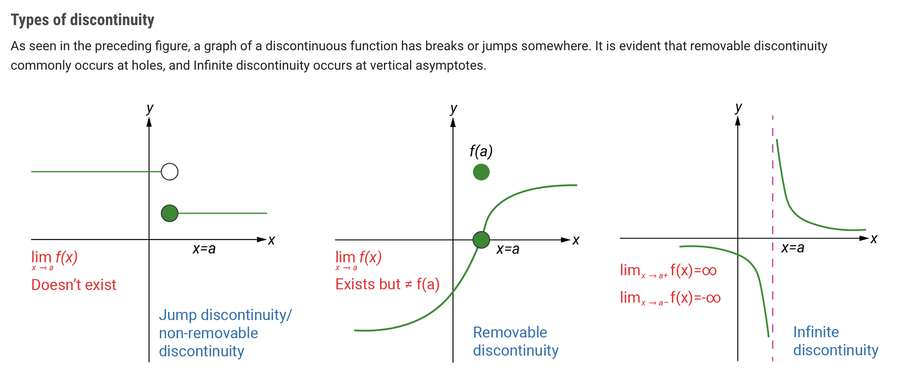

##### A formal definition of continuity

A function 𝑓(𝑥) is continuous at a point 𝑎, if the function’s value approaches 𝑓(𝑎) when 𝑥 approaches 𝑎. Hence if the following conditions are satisfied, it is said to be continuous:

- 𝑓(𝑎) should exist
- 𝑓(𝑥) has a limit as 𝑥 approaches 𝑎, i.e. $lim_{𝑥→𝑎}𝑓(𝑥)$ exists
- the limit of 𝑓(𝑥) as $𝑥→𝑎$ is equal to 𝑓(𝑎), i.e. $lim_{𝑥→𝑎}𝑓(𝑥)=𝑓(𝑎)$.

