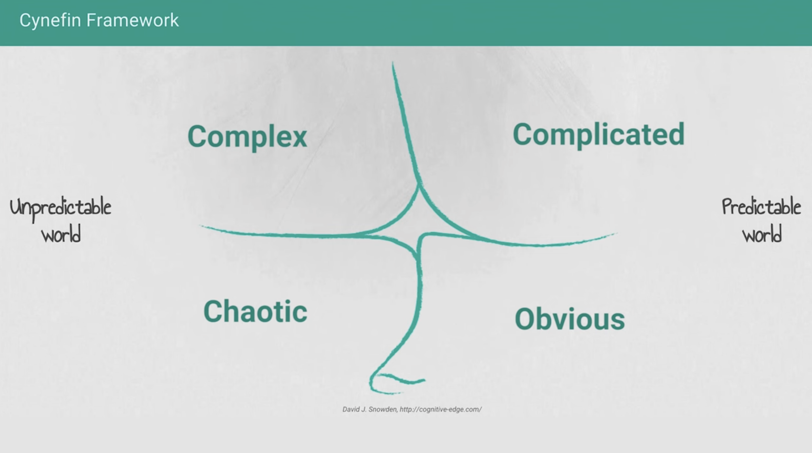

conceptual tool for dealing with complexity

idk if it makes sense as a quadrant as much as a spectrum or linear series of four domains

Obvious
...
Complicated
...
Complex
...
Chaotic

where higher on the list corresponds to the degree to which the relationship between cause and effect is understood

identifying what domain a given problem is in, and taking steps (safe-to-fail experiments) to hopefully move problems up the ladder, is useful for leadership