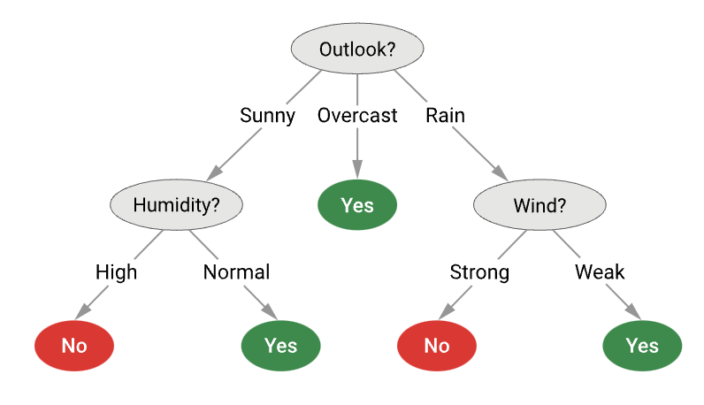
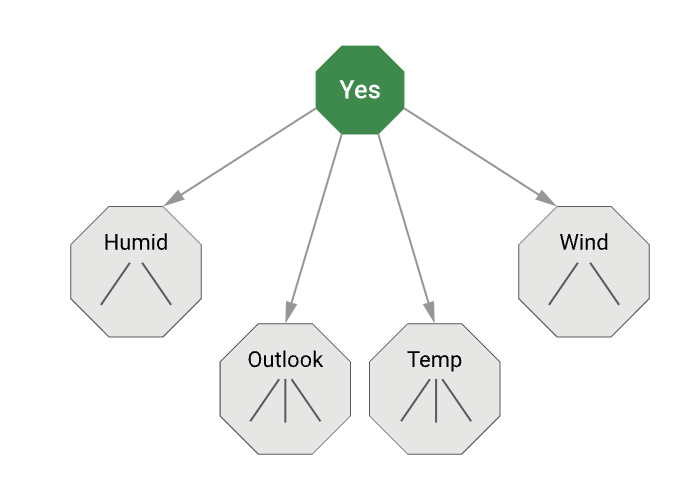
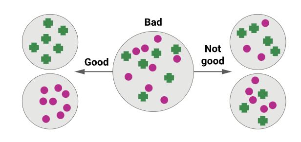

Decision trees are a supervised machine-learning method that uses a **tree structure** to predict the values of objects. Non-leaf nodes are **decision nodes** that split data into explanatory attributes, and leaf nodes represent **classes**. 

Each decision node (starting from the root) compares an **object's attribute** with a specific **attribute value** (or range) to classify an object. A path from the root to a leaf node gives the **class** of the object.

See also [[Building a decision tree]]

#### Decision tree example: Attributes

In this example, the task is to decide whether we should head outside to play ball based on the day's weather conditions. 

The sample data in the following table depicts a **vector of attributes** representing information about the weather conditions. It also shows a value for the **target variable**: 'Play ball', stating whether we played.

| Day | Outlook                                          | Temperature | Humidity | Wind | Play ball                                 |
| --- | ------------------------------------------------ | ----------- | -------- | ---- | ----------------------------------------- |
| D1  | Sunny                                            | Hot         | High     | Weak | No                                        |
|     | < Input x (vector of **explanatory attributes**) |             |          | />   | Output y (**target/dependent attribute**) |

#### Classification by decision tree induction

The entire training data can be broken into 

- **Input x,** vectors of explanatory attributes (represented by a vector of attribute values).
- **Output y,** the corresponding target values. 

The algorithm to construct a decision tree is a top-down recursive divide-and-conquer with a greedy attribute selection.

#### Training Dataset

In this example, we have an entire training data set with data for 14 days.

| Day | Outlook  | Temperature | Humidity | Wind   | Play ball |
| --- | -------- | ----------- | -------- | ------ | --------- |
| D1  | Sunny    | Hot         | High     | Weak   | No        |
| D2  | Sunny    | Hot         | High     | Strong | No        |
| D3  | Overcast | Hot         | High     | Weak   | Yes       |
| D4  | Rain     | Mild        | High     | Weak   | Yes       |
| D5  | Rain     | Cool        | Normal   | Weak   | Yes       |
| D6  | Rain     | Cool        | Normal   | Strong | No        |
| D7  | Overcast | Cool        | Normal   | Strong | Yes       |
| D8  | Sunny    | Mild        | High     | Weak   | No        |
| D9  | Sunny    | Cool        | Normal   | Weak   | Yes       |
| D10 | Rain     | Mild        | Normal   | Weak   | Yes       |
| D11 | Sunny    | Mild        | Normal   | Strong | Yes       |
| D12 | Overcast | Mild        | High     | Strong | Yes       |
| D13 | Overcast | Hot         | Normal   | Weak   | Yes       |
| D14 | Rain     | Mild        | High     | Strong | No        |
#### Learned Model

Here is a decision tree trained on this data. Each non-leaf node corresponds to an attribute, and there is one path out of the node for each value the attribute can take. The leaf nodes represent the decision to take.

Suppose we have a new day: D15, with the following conditions. Should we play ball? The decision tree says to check the outlook. The outlook is sunny. So we check humidity. Humidity is high, so the tree says no, we should not play ball.

| Day | Outlook | Temperature | Humidity | Wind | Play ball |
| --- | ------- | ----------- | -------- | ---- | --------- |
| D15 | Sunny   | Hot         | High     | Weak | ?         |
#### Simplest tree

What is the simplest decision tree we can have? Always predicting the majority class is not a tree. In the previous example, the majority class always predicted 'yes'.

The simplest tree is a **decision stump**, where values are split on a **single attribute** from **one decision node.**

#### On which attribute do we split?

How should we decide which attribute to split on when building a tree to have the best possible tree?

[[Building a decision tree]]