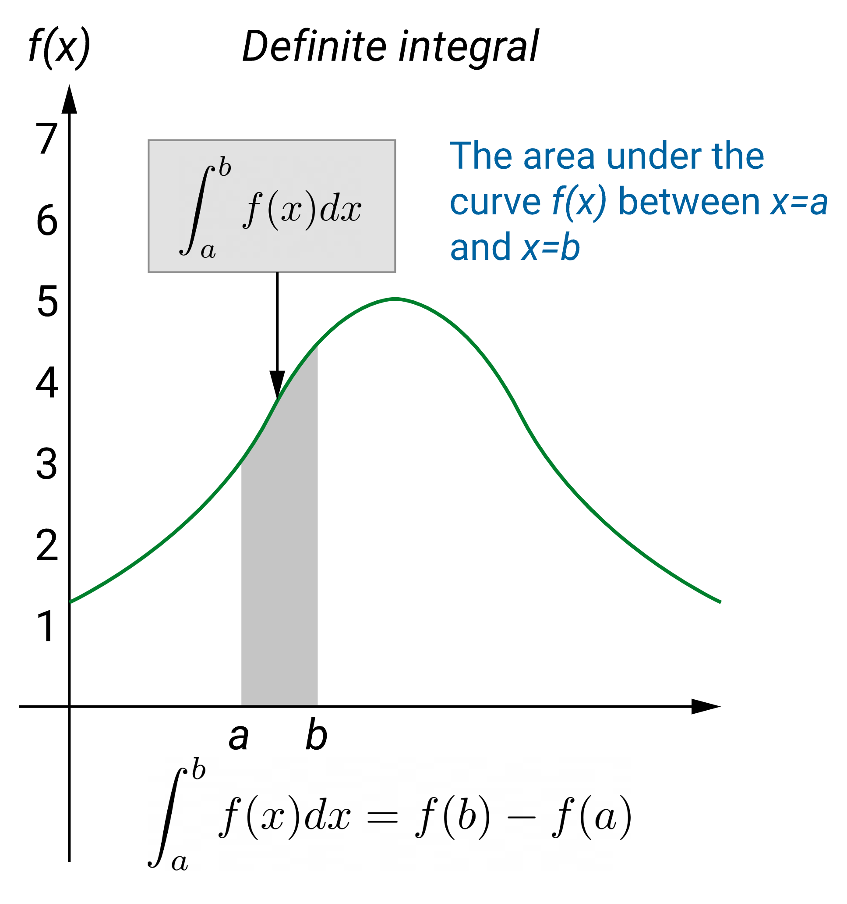

## Rule
$$\int_a^b𝑓'(𝑥)𝑑𝑥=[𝑓(𝑥)+𝑐]_a^b=(𝑓(𝑏)+𝑐)−(𝑓(𝑎)+𝑐)=𝑓(𝑏)−𝑓(𝑎)$$

## Explanation

There are many types of integrals, the main types are: **definite** and **indefinite** integrals.

Let’s understand these 2 types through an example.

Assume we have a function $𝑓=𝑥^2$, which results with 𝑓′=2𝑥. If $𝑓=𝑥^2+5$, still 𝑓′=2𝑥, and this could be valid for any constant value found in 𝑓.

Therefore, if we are given 𝑓′=2𝑥 to calculate the integral, producing $𝑓=𝑥^2$ might lead to an error since we have no clue about the constant values associated with the function. Hence, we say such integrals are **indefinite**. In order to overcome this problem, we simply add a constant 𝑐𝑐 at the end of the formula of the function, i.e. $𝑓=𝑥^2+𝐶$,𝐶can be any value including 0.

The other type is **definite** integrals, in which such constraint is not present. In some situations, we might be asked to find the integral between a certain range, for example, $\int_a^b 𝑓'(𝑥)dx$. In such situations, we have to find two integrals first, i.e. when $𝑥=𝑎$ (which is $𝑓(𝑎)$) and $𝑥=𝑏$ (which is $𝑓(𝑏)$), and afterwards find their difference $𝑓(𝑏)−𝑓(𝑎)$ (here $𝑏>𝑎$). When subtracting the two components, the constant value will be cancelled and therefore, we will be able to produce a definite solution. Hence, such types are called definite integrals. Consider the following graph which provides a visual representation of a definite integral.

