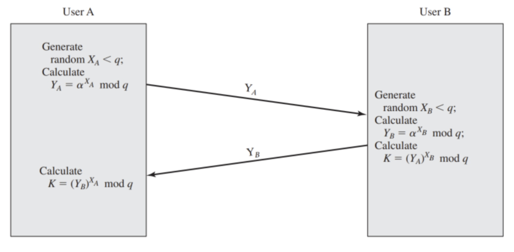
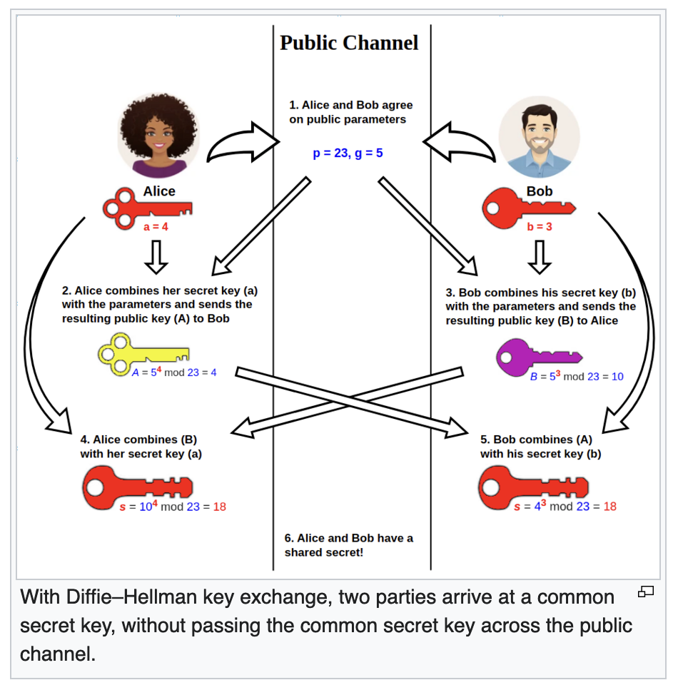
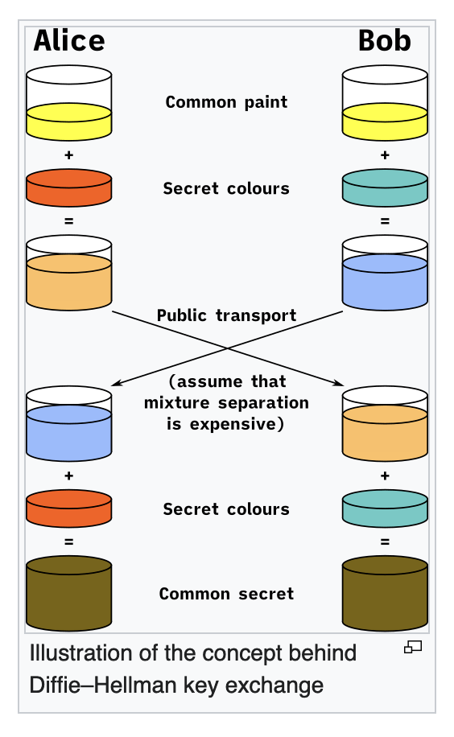

---
aliases:
  - Diffie-Hellman
  - DH
---
- published in 1976, first publicly known use of 'public key'/'private key' concept. Precedes [[RSA]]

## Monash

This algorithm is named after its founders and the main purpose of the algorithm, as the name suggests, is to perform the exchange of the secret key between two communicating users. Once the key exchange has been done, the users can then securely communicate using any algorithm with the shared secret key. 

The foundational premise of the key exchange algorithm is based on the difficulty to compute discrete logarithms. The discrete logarithm problem states that it is possible for us to and a unique exponent i, given any integer b, that has a primitive root a of a prime number p, such that the following holds true:

$$b \equiv a^i\mod p | 0 \leq i \leq (p-1)$$
The exponent i is called the [[Discrete logarithm problem|discrete logarithm]] of b for the base a, mod p
### Key exchange algorithm

To begin, the algorithm defines two known integer values $q$ a prime number and $\alpha$ a primitive root of q.

We assume that two users A and B  wish to communicate using this algorithm to exchange the key. In order to do so, each user must perform specific actions, as follows: 

User A must first compute the following based on the defined conditions:

$$Y_A = a^{X_A}\mod q | X_A < q\text{ and }X_A\text{,  is randomly selected}$$
Similarly, User B, independent of User A, must compute the following based on the defined conditions:

$$Y_B = a^{X_B}\mod q | X_B < q\text{ and }X_B\text{,  is randomly selected}$$
Both users must keep their randomly selected number X secret and does not share it. However, the computed Y value is shared with the other user publicly. 

Once the Y value has been received from User B, in order to determine the shared key K, User A must compute the following:
$$K = (Y_B)^{X_A} \mod q$$
Similarly, User B, on receiving the Y value from User A, must compute the following to obtain the shared key K:
$$K = (Y_A)^{X_B} \mod q$$
==By the rules of modular arithmetic, both the above calculations will produce the same result.==
$$K = (Y_B)^{X_A} \mod q$$
$$K = (\alpha^{X_B} \mod q)^{X_A} \mod q$$
$$K = (\alpha^{X_B})^{X_A} \mod q$$
$$K = \alpha^{X_B^{X_A}} \mod q$$
$$K = (\alpha^{X_A})^{X_B} \mod q$$
$$K = (\alpha^{X_A} \mod q)^{X_B} \mod q$$
$$K = (Y_A)^{X_B} \mod q$$
As you can see, using the above algorithm, both users have successfully managed to compute the value of the shared key K, which can then be used for future communication via a symmetric algorithm instead. Since the values of X are kept secret by both A and B, any adversary must compute the discrete logarithm as follows:
$$X_B = d\log_{\alpha, q}(Y_B)$$
The challenge for the adversary is that calculating the discrete logarithm for a large prime is infeasible.

### Key exchange protocols

An example scenario of using the Diffie-Hellman key exchange protocol has been shown in the image below:

For a network of users, residing on a LAN, ==the common values of α and q can be stored in a central repository accessible to each user==. In order for each user to communicate to another, each user can ==locally generate and store a long-lasting private value for X==. Each user wanting to communicate, then initiated the communication with another user and sends them the value of Y obtained using their private value of X. The second user will then use that value of Y along with their private value of X to obtain the shared key K. And in doing so, the second user will compute their own value of Y using their private value of X to send to the first user, who can then compute the share key K as well. 

It is important to note that this key exchange scheme is not without flaws. It is prone to attacks such as Man-in-the-middle and others that can compromise the overall security of the key exchange scheme. You will see these in more detail in later lessons.

## 4o:
### 1. **Public Key Exchange with Shared Secret**

- DH enables two parties to exchange public keys and calculate a shared secret without sending the secret itself over the network. This shared secret can then be used to encrypt further communication.

### 2. **Based on Hard Mathematical Problems**

- The security of DH relies on the computational hardness of the **Discrete Logarithm Problem**. For large enough numbers, it is computationally infeasible to reverse-engineer the secret key from the public information.

### 3. **Ephemeral or Long-Term Keys**

- DH can use either **ephemeral keys** (generated fresh for each session) or **long-term keys**. Ephemeral keys enhance security by enabling **Perfect Forward Secrecy** (PFS), meaning even if a private key is compromised later, past sessions remain secure.

### 4. **Vulnerability to Man-in-the-Middle (MitM) Attacks**

- DH itself ==doesn’t authenticate the parties==, so it is vulnerable to MitM attacks if used alone. Typically, DH is combined with other protocols (e.g., [[Authenticated Diffie-Hellman]], or through certificates in TLS) to prevent this vulnerability.

### 5. **Asymmetry of Public and Private Components**

- Each party has a private value and a public counterpart. The protocol involves modular exponentiation with a shared base and modulus, which are publicly known.

### 6. **No Message Confidentiality or Integrity by Itself**

- DH is purely for key exchange; it doesn’t inherently provide encryption or message integrity. It’s often used as a part of other protocols, like TLS, to establish a secure channel.

### 7. **Suitability for Symmetric Key Generation**

- The shared secret generated by DH is symmetric, which is well-suited for encrypting data using symmetric encryption algorithms.

### 8. **Compatibility with Multiple Curves (in Elliptic Curve Diffie-Hellman)**

- DH has a variant called **[[Elliptic curve cryptography|Elliptic Curve]] Diffie-Hellman (ECDH)**, which operates on elliptic curves instead of integers modulo a prime. ECDH offers equivalent security with smaller key sizes, making it efficient for environments with limited computational resources.

