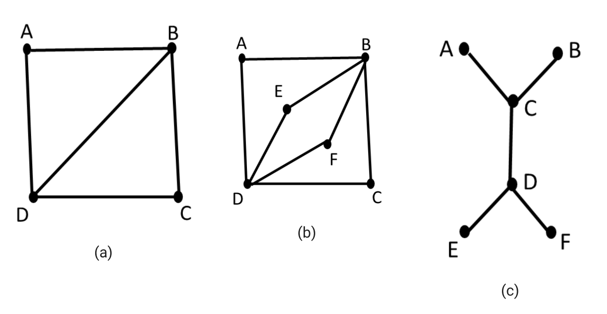

### 3. Planar graphs, Euler graphs, Hamiltonian graphs, and topological sort

#### 3.2. Euler graphs

A **Euler graph** is a type of a connected graph that has a Euler circuit. In a circuit, the start and end vertices of the path should be the same. Generally, if all the vertices of any connected graph have an even degree, then this type of a graph is called a Euler graph.

A **Euler path** is also called a **Euler walk** or a **Euler trail**. In a Euler graph, there is a closed trail that includes every edge of the graph. If it passes through each and every edge of the graph only once, then that type of a walk will be known as the Euler walk. In a Euler path, each edge of the graph must be visited exactly once, but the vertices on the path can be repeated.

The following examples in figures (a) and (b) are graphs with Euler paths. However, figure (c) is not.

  

The Euler path of (a) is BCDBAD, (b) is BCDFBEDAB and (c) doesn’t have an= Euler path (since it needs to repeat traversing through many edges).

Corresponding to the same figures, the graph in figure (a) does not have an= Euler circuit since there is no Euler path where the start and end vertices are the same.

However, the graph in figure (b) has a Euler circuit, ABCDFBEDA. Here, the start and end vertices are the same and it does not repeat traversing through the same edge.

Figure (c) doesn’t have a Euler circuit since it doesn’t have a Euler path.

This tells us that having a Euler path doesn’t assure that a graph can have a Euler circuit.