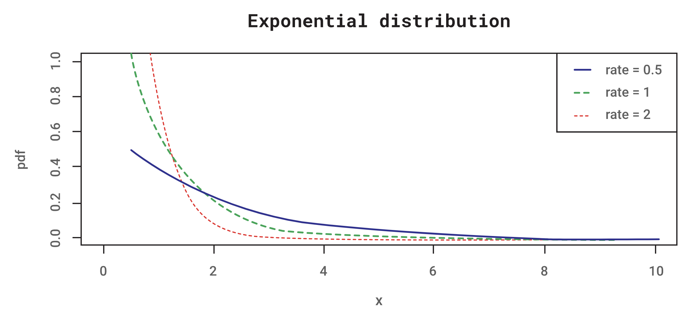

#### Exponential distribution

The exponential distribution is important because it represents the time required for a single event from a Poisson process to occur. In sampling from a [[Poisson distribution]] with parameter μ, the probability that no event occurs during $(0,𝑡)$ is $𝑒^{–\lambda𝑡}$. Consequently, the probability that an event will occur during $(0,𝑡)$ is:

$$𝐹(𝑡)=1−𝑒^{−\lambda𝑡}$$

This represents the **cumulative distribution function** (cdf) of 𝑡. One can therefore show that the probability distribution function (pdf) is:

$$𝑓(𝑡)=𝑒^{−\lambda𝑡}$$

Note that the parameter $1/\lambda$ (sometimes denoted as μ) is the expected value. Usually, the reciprocal of this value is specified and represents the expected value of 𝑓(𝑡). Because the exponential function appears in the expression for both the pdf and cdf, the distribution is justifiably called the exponential distribution. 

Alternatively, the cumulative exponential distribution can be obtained from the pdf (with 𝑥 replacing 𝑡):

$$𝐹(𝑥)=\int_{𝑥}^0\lambda𝑒^{−\lambda𝑥} 𝑑𝑥 = 1−𝑒^{−\lambda𝑥}$$

