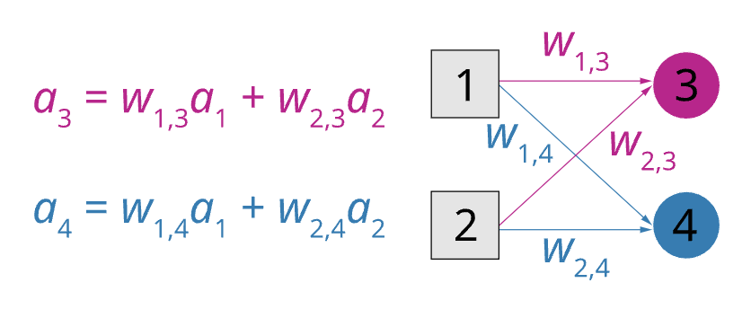

---
aliases:
  - feed-forward neural network
---
One of the two main types of [[Artificial Neural Network]]. 

See also [[Multi-layer feed-forward neural network]]
## Feed-forward network structure
[[Perceptron]]s are the simplest form of feed-forward neural network. In feed-forward neural networks, connections only go in one direction, from inputs towards the outputs. This can be contrasted with [[recurrent neural network]]s which have a bi-directional flow.

The output of each neuron is a function of its current input. A feed-forward network may have several outputs.
# Single layer feed-forward neural network
**One perceptron corresponds to one possible output**

- A network with all the inputs connected directly to the outputs.
- When there are 𝑚 outputs.
- Each output unit corresponds to a separate function.
- Each weight affects only one output. There are 𝑚 training processes.

The following diagram shows a case in which we would have one perceptron with the weights in red that output at node 3 and with blue weights that output at node 4.

Example
- Input: Email
- Output: SPAM/HAM
- Training data: A large collection of sample emails labeled SPAM or HAM
- Goal: learn to predict labels for future emails 
- Features: count of specific words in the email text

Four features
- BIAS (always 1)
- 'free' (count of word 'free' in text)
- 'money'
- 'the'

Example input: 'free money'

feature vector
$\mathbf{x}$ = (BIAS: 1, free: 1, money: 1, the: 0)

an example perceptron weight vector
$\mathbf{w}$ = (BIAS: -3, free: 4, money: 2, the: 0)

$g$ is the step activation function

Define $g(\mathbf{w} \cdot \mathbf{x}) = 1 \Rightarrow \mathbf{x}$ is SPAM and $g(\mathbf{w}\cdot \mathbf{x}) = 0 \Rightarrow \mathbf{x}$ is HAM

$$\mathbf{w}\cdot \mathbf{x} = \sum_i w_i \cdot x_i = 1 \times -3 + 1 \times 4 + 1 \times 2 + 0 \times 0 = 3$$
$$g(3) = 1$$
meaning that the email would be assigned the 'SPAM' label

For binary classification, one class label will always be 1 and the other will be 0

**The weight vector of a perceptron will always be a hyperplane in the space of features, and the hyperplane is the decision boundary of classification**

