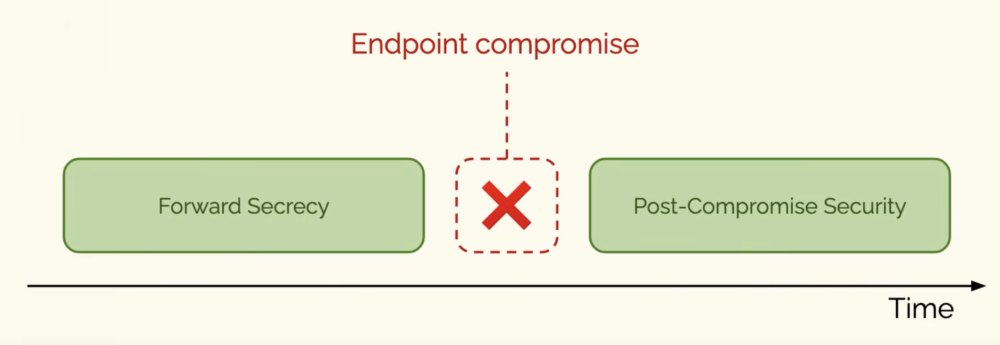

---
aliases:
  - FS
  - Forward security
---
A property of [[Secure messaging]] protocols that "ensures that messages sent and received before a state compromise remain secure".
[[Security Analysis and Improvements for the IETF MLS Standard for Group Messaging]]

The 'temporal opposite' of [[Post-compromise security]]
