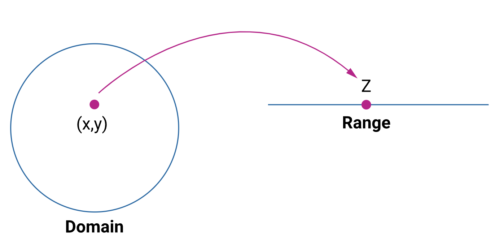
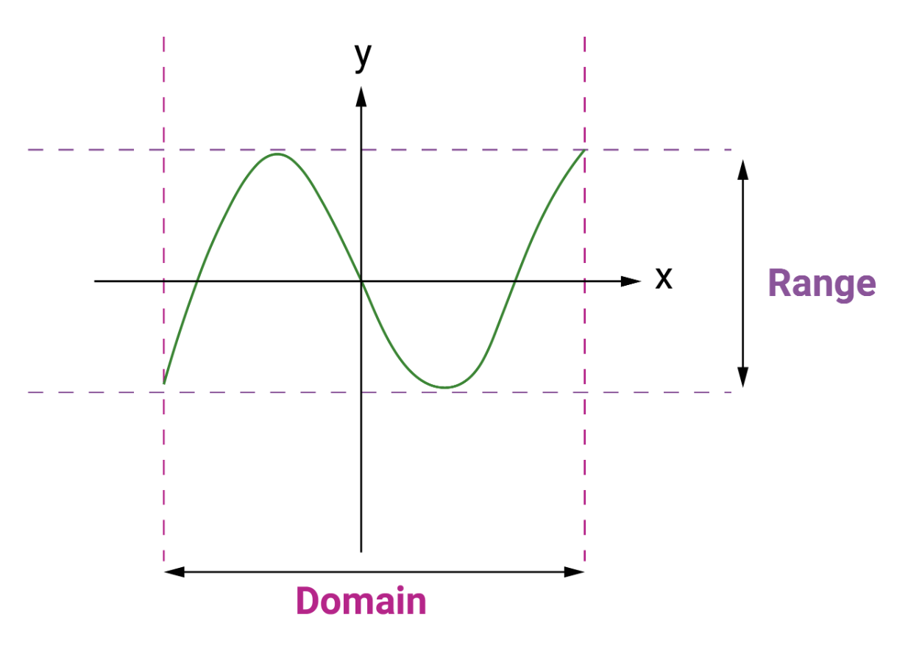

### 1. Introduction to functions and limits

#### 1.1. Functions

A function can be defined as an expression, a rule, or a law that defines a relationship between 2 variables. These two variables are called dependent variables and independent variables.

Generally, the relationship between these two variables is notated as $𝑦=𝑓(𝑥)$.

We read it as 'y equals f of x.' This builds the relationship between 𝑥 and 𝑦, which says that 𝑦 and 𝑥 are related such that for every 𝑥, there is a unique value of 𝑦. That is, 𝑓(𝑥) can not have more than one value for the same 𝑥.

There are various types of functions. There can be multiple dependent variables in certain functions.

Let’s look at a few examples.

1. Area of a circle, $𝐴=π𝑟2$: Here, the dependent variable 𝐴 (the area) is a function of the independent variable 𝑟 (the radius).
2. Area of a triangle, $𝐴=𝑏ℎ/2$: Here, 𝐴 is a function of 2 variables, 𝑏 (base) and ℎ (height).
3. Those of the format $𝑃(𝑥)=𝑎0+𝑎1𝑥+𝑎2𝑥2+⋯+𝑎𝑛𝑥𝑛$ are called polynomial functions.
4. 𝑦=𝑒𝑥, sometimes written as $𝑦=𝑒𝑥𝑝(𝑥)$ is called an exponential function

Other examples include trigonometric functions, complex functions, inverse functions, Power series functions, etc.

#### 1.2. Functions of several variables

For a function of 1 variable, we mapped the values of one variable to the values of another variable, 𝑦=𝑓(𝑥). For functions of 2 variables, we map pairs of variables to another variable.

For example, a function of two variables 𝑧=𝑓(𝑥,𝑦) maps each ordered pair (𝑥,𝑦) to a unique real number 𝑧.

In this kind of case, we have to determine the domain and the range of the variables associated with the functions. In simple terms, we must define the minimum and maximum values each variable can be assigned.

For example, if $𝑧=3𝑥+2𝑦$, then in order to determine the values of 𝑧, the domain of 𝑥 and 𝑦 should be defined. Similarly, the 𝑧 range should also be known beforehand.

Assume $𝑧=\sqrt{𝑥−4}$. Since square root can never be less than 0, (𝑥−4) should be ≥0, i.e. 𝑥≥4. When deciding on the domain of x, we say domain 𝐷:{𝑥|𝑥≥4}.