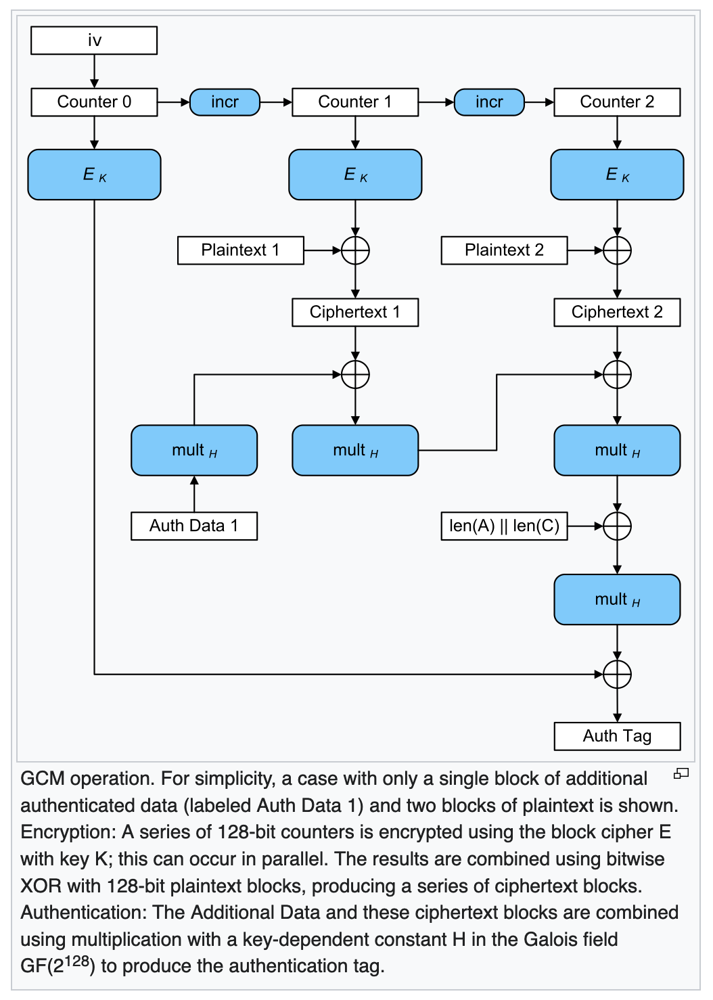

---
aliases:
  - Galois/Counter Mode
  - GCM
---
## Wikipedia: 

In cryptography, Galois/Counter Mode (GCM)[1] is a mode of operation for symmetric-key cryptographic block ciphers which is widely adopted for its performance. GCM throughput rates for state-of-the-art, high-speed communication channels can be achieved with inexpensive hardware resources.[2]

The GCM algorithm provides both data authenticity (integrity) and confidentiality and belongs to the class of [[Authenticated Encryption with Associated Data (AEAD)]] methods. This means that as input it takes a key K, some plaintext P, and some associated data AD; it then encrypts the plaintext using the key to produce ciphertext C, and computes an authentication tag T from the ciphertext and the associated data (which remains unencrypted). A recipient with knowledge of K, upon reception of AD, C and T, can decrypt the ciphertext to recover the plaintext P and can check the tag T to ensure that neither ciphertext nor associated data were tampered with.

GCM uses a block cipher with block size 128 bits (commonly AES-128) operated in counter mode for encryption, and uses arithmetic in the [[Galois field]] $GF(2^{128})$ to compute the authentication tag; hence the name. 

...

Like in normal counter mode, blocks are numbered sequentially, and then this block number is combined with an initialization vector (IV) and encrypted with a block cipher E, usually AES. The result of this encryption is then XORed with the plaintext to produce the ciphertext. Like all counter modes, this is essentially a stream cipher, and so it is essential that a different IV is used for each stream that is encrypted.

The ciphertext blocks are considered coefficients of a polynomial which is then evaluated at a key-dependent point H, using finite field arithmetic. The result is then encrypted, producing an authentication tag that can be used to verify the integrity of the data. The encrypted text then contains the IV, ciphertext, and authentication tag. 

