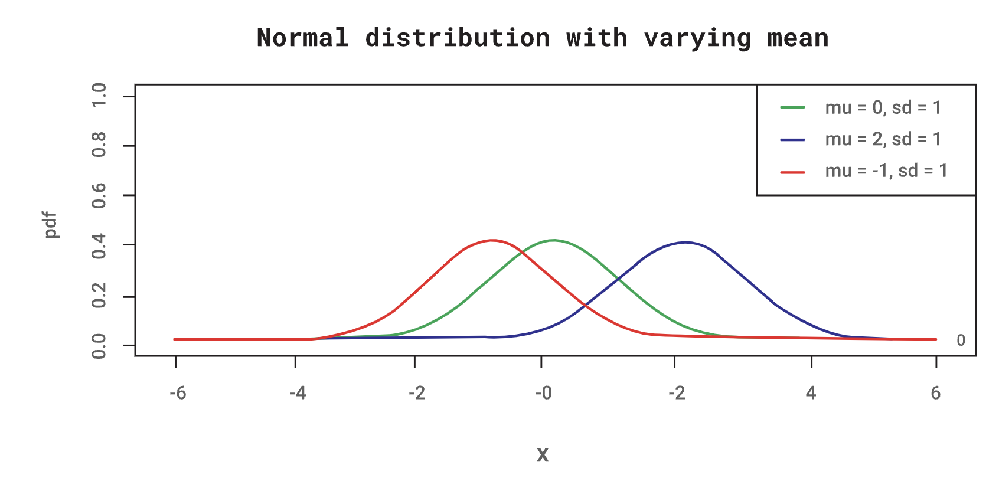

#### 3.1. Gaussian distribution: examples

The Gaussian or normal distribution is the most common distribution. The probability distribution function of a normal distribution is given by:

$$𝑓(𝑥)=\frac{1}{\sigma\sqrt{2𝜋}}e^{−\frac{(𝑥−𝜇)^2}{2𝜎^2}}$$

Where $μ$ is the mean value of $𝑥$ and $σ$ is its standard deviation.

If $𝑋$ is normally distributed with mean $μ$ and standard deviation $σ$, then the random variable $(𝑋–μ)/σ$ is normally distributed with mean 0 and standard deviation 1. The term $(𝑋–μ)/σ$ is called a standard normal curve that is represented by $𝑍$.

The figures below show the normal distribution for different mean values and standard deviations.

#### The standard normal distribution

Using the standard normal distribution table below, one can easily determine the probability of different $𝑧$ values. The following table shows the areas under a standard normal curve to the right of $𝑧_0$ for nonnegative values of $𝑧_0$. Probabilities about a standard normal variable $𝑍$ can be determined from this table.

Standard normal cumulative probability in the right-hand tail (area under the curve for specified values of $𝑧_0$) 

|z|0.00|0.01|0.02|0.03|0.04|0.05|0.06|0.07|0.08|0.09|
|---|---|---|---|---|---|---|---|---|---|---|
|0.0|0.500|0.496|0.492|0.488|0.484|0.480|0.476|0.472|0.468|0.464|
|0.1|0.460|0.456|0.452|0.448|0.444|0.440|0.436|0.433|0.429|0.425|
|0.2|0.421|0.417|0.413|0.409|0.405|0.401|0.397|0.394|0.390|0.386|
|0.3|0.382|0.378|0.374|0.371|0.367|00363|0.359|0.356|0.352|0.348|
|0.4|0.345|0.341|0.337|0.334|0.330|0.326|0.323|0.319|0.316|0.132|
|0.5|0.309|0.305|0.302|0.298|0.295|0.291|0.288|0.284|0.281|0.278|
|0.6|0.274|0.271|0.268|0.264|0.261|0.258|0.255|0.251|0.248|0.245|
|0.7|0.242|0.239|0.236|0.233|0.230|0.227|0.224|0.221|0.218|0.215|
|0.8|0.212|0.209|0.206|0.203|0.200|0.198|0.195|0.192|0.189|0.187|
|0.9|0.184|0.181|0.179|0.176|0.174|0.171|0.169|0.166|0.164|0.161|
|1.0|0.159|0.156|0.154|0.152|0.149|0.147|0.145|0.142|0.140|0.138|
|1.1|0.136|0.133|0.131|0.129|0.127|0.125|0.123|0.121|0.119|0.117|
|1.2|0.097|0.095|0.093|0.092|0.090|0.089|0.087|0.085|0.084|0.082|
|1.3|0.097|0.095|0.093|0.092|0.090|0.089|0.087|0.085|0.084|0.082|
|1.4|0.081|0.079|0.078|0.076|0.075|0.074|0.072|0.071|0.069|0.068|
|1.5|0.067|0.066|0.064|0.063|0.062|0.061|0.059|0.058|0.057|0.056|
|1.6|0.055|0.054|0.053|0.052|0.051|0.049|0.048|0.047|0.046|0.046|
|1.7|0.045|0.044|0.043|0.042|0.041|0.040|0.039|0.038|0.038|0.037|
|1.8|0.036|0.035|0.034|0.034|0.033|0.032|0.031|0.031|0.030|0.029|
|1.9|0.029|0.028|0.027|0.027|0.026|0.026|0.025|0.024|0.024|0.023|
|2.0|0.023|0.022|0.022|0.021|0.021|0.020|0.020|0.019|0.019|0.018|
|2.1|0.018|0.017|0.017|0.017|0.016|0.016|0.015|0.015|0.015|0.014|
|2.2|0.014|0.014|0.013|0.013|0.013|0.012|0.012|0.012|0.011|0.011|
|2.3|0.011|0.010|0.010|0.010|0.010|0.009|0.009|0.009|0.009|0.008|
|2.4|0.0.08|0.008|0.008|0.008|0.007|0.007|0.007|0.007|0.007|0.006|
|2.5|0.006|0.006|0.006|0.006|0.006|0.005|0.005|0.005|0.005|0.005|
|2.6|0.005|0.005|0.005|0.005|0.005|0.004|0.004|0.004|0.004|0.004|
|2.7|0.003|0.003|0.003|0.003|0.003|0.003|0.003|0.003|0.003|0.003|
|2.8|0.003|0.002|0.002|0.002|0.002|0.002|0.002|0.002|0.002|0.002|
|2.9|0.002|0.002|0.002|0.002|0.002|0.002|0.002|0.002|0.002|0.002|

##### Example

$$𝑃(𝑍>1.54)=0.062$$

is obtained directly from the table, as the area to the right is 1.54.

Consequently, one can deduce from the table,  

$$𝑃(0<𝑍<1.54)=0.5–0.062=0.438$$

Also, because of symmetry

$$𝑃(–1.54<𝑍<0)=0.438 \text{ 𝑎𝑛𝑑  } 𝑃(𝑍<–1.54)=0.062$$

The following probabilities can also be deduced by noting that the area to the right of 1.54 is 0.062. 

$$𝑃(–1.54<𝑍<1.54)=0.876$$
$$𝑃(𝑍<1.54)=0.938$$
$$𝑃(𝑍>–1.54)=0.938$$

#### The Empirical Rule

Suppose that $\bar𝑥$ and $s$ are the sample mean and sample standard deviation of an approximately normal data set. The empirical rule specifies the approximate proportions of the data observations within s, 2s, and 3s of the sample mean $\bar𝑥$.

1. Approximately 68 percent of the observations lie within $\bar{𝑥}\pm𝑠$
2. Approximately 95 percent of the observations lie within 𝑥¯  ±2𝑠
3. Approximately 99.7 percent of the observations lie within 𝑥¯  ±3𝑠

For any random variable 𝑋𝑋 that is normally distributed with mean μ  and standard deviation, one may now write as follows:

Eq(3.1)
$$𝑃(𝜇−𝜎<𝑋<𝜇+𝜎)=𝑃(−1<𝑋−𝜇𝜎<1)$$$$=𝑃(−1<𝑍<1)=0.68$$
Eq(3.2)

$$𝑃(𝜇−2𝜎<𝑋<𝜇+2𝜎)=𝑃(−2<𝑋−𝜇𝜎<2)$$$$=𝑃(−2<𝑍<2)=0.95   $$
Eq(3.3)

$$𝑃(𝜇−3𝜎<𝑋<𝜇+3𝜎)=𝑃(−3<𝑋−𝜇𝜎<3)$$$$=𝑃(−3<𝑍<3)=0.997$$

The probabilities given in Equation 3.1 to Equation 3.3 are the sources of the percentages cited earlier. These can be used to interpret the standard deviation 𝑠 of a sample of observations on a normal random variable as a measure of dispersion about the sample mean 𝑋. The normal distribution obtains probabilities concerning the mean of a sample of 𝑛 observations on a random variable 𝑋. If 𝑋 is normally distributed with mean μ and standard deviation σ, then the sample mean is normally distributed with mean μ and standard deviation $𝜎/\sqrt{𝑛}$. 

For example, suppose 𝑋  is normally distributed with a mean of 100 and a standard deviation of 2. Then, the mean of a sample of 16 observations on 𝑋 is normally distributed with a mean of 100 and a standard deviation of 0.5. To calculate the probability that is greater than 101, one would write:

$$𝑃(𝑋>101)=𝑃\left[\frac{\bar{𝑋}−100}{0.5}>\frac{101−100}{0.5}\right]$$
$$𝑃(𝑋>101)=𝑃\left[\frac{\bar{𝑋}−100}{0.5}>\frac{101−100}{0.5}\right];𝑍=\frac{\bar{𝑋}−100}{0.5}$$
$$=𝑃(𝑍>2)$$
$$=0.023$$