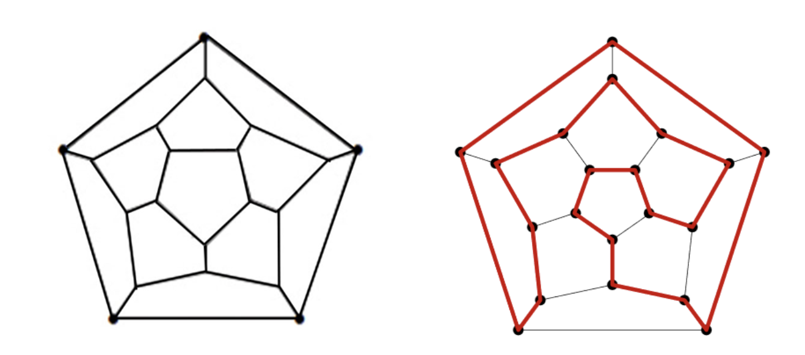
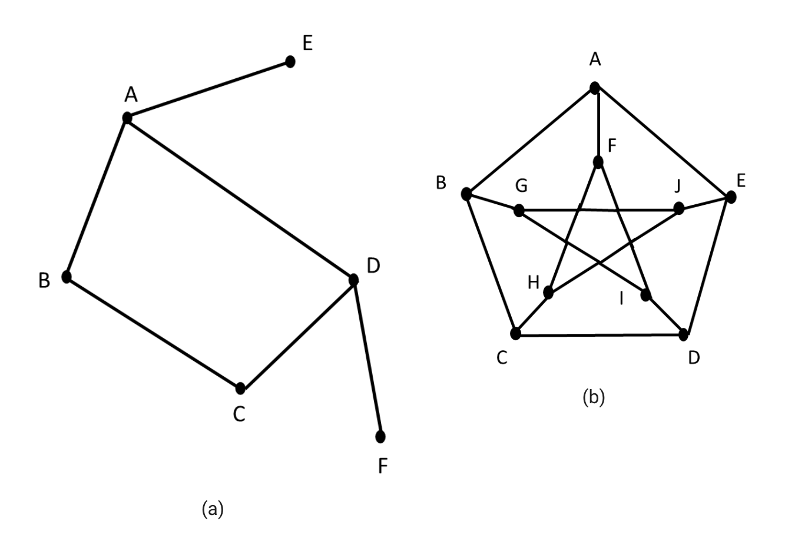

#### 3.3. Hamiltonian graphs

A **Hamiltonian graph** is one that contains a Hamiltonian circuit. A Hamiltonian cycle is a cycle in which each vertex is visited only once. A simple path in a graph that passes through every vertex exactly once is called a Hamiltonian path.

See the following figure that shows the original graph and its Hamiltonian cycle in red.

If there is a vertex of degree one in a graph, then it is impossible for it to have a Hamiltonian circuit. The following figure shows two graphs that do not possess Hamiltonian cycles.
  

Figure (a) cannot have a Hamiltonian cycle since there are two vertices 𝐸𝐸 & 𝐹𝐹 that disconnect the traversal of the graph and they both are vertices of degree one. Figure (b) has a few Hamiltonian paths (e.g. ABCDEJHFIG), but there are no Hamiltonian circuits.

In summary, a Hamiltonian cycle in a connected graph 𝐺𝐺 is defined as a closed path that traverses every vertex of 𝐺𝐺 exactly once except the starting vertex, at which the path also terminates. In an n-complete graph, there are (𝑛−1)!/2(𝑛−1)!/2 Hamiltonian cycles.