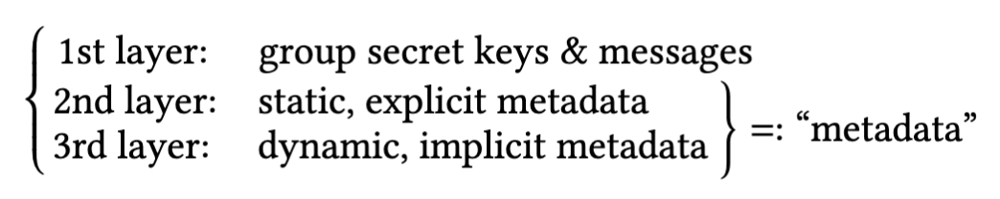
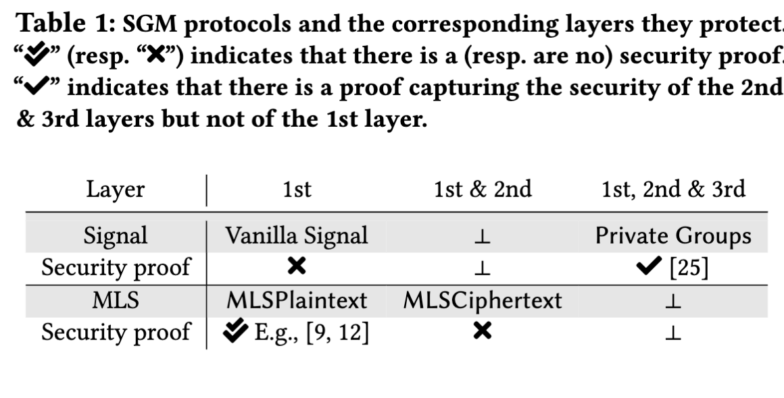
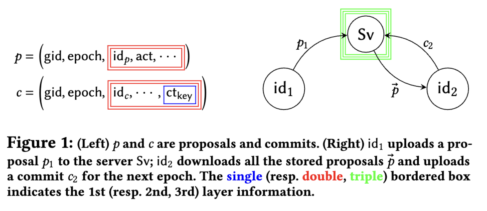

# Paper

## Abstract
Secure group messaging (SGM) protocols allow large groups of users to communicate in a secure and asynchronous manner. In recent years, continuous group key agreements (CGKAs) have provided a powerful abstraction to reason on the security properties we expect from SGM protocols. While robust techniques have been developed to protect the contents of conversations in this context, it is in general more challenging to protect metadata (e.g. the identity and social relationships of group members), since their knowledge is often needed by the server in order to ensure the proper function of the SGM protocol. 

In this work, we provide a simple and generic wrapper protocol that upgrades non-metadata-hiding CGKAs into metadata-hiding CGKAs. Our key insight is to leverage the existence of a unique continuously evolving group secret key shared among the group members. We use this key to perform a group membership authentication protocol that convinces the server in an anonymous manner that a user is a legitimate group member. Our technique only uses a standard signature scheme, and thus, the wrapper protocol can be instantiated from a wide range of assumptions, including post-quantum ones. It is also very efficient, as it increases the bandwidth cost of the underlying CGKA operations by at most a factor of two. 

To formally prove the security of our protocol, we use the universal composability (UC) framework and model a new ideal functionality $F^{mh}_{CGKA}$ capturing the correctness and security guarantee of metadata-hiding CGKA. To capture the above intuition of a “wrapper” protocol, we also define a restricted ideal functionality $F^{ctxt}_{CGKA}$, which roughly captures a non-metadata-hiding CGKA. We then show that our wrapper protocol UC-realizes $F^{mh}_{CGKA}$ in the $F^{ctxt}_{CGKA}$- hybrid model, which in particular formalizes the intuition that any non-metadata-hiding CGKA can be modularly bootstrapped into metadata-hiding CGKA

## 1 Introduction

A secure group messaging (SGM) protocol allows a group of users to asynchronously communicate in an end-to-end encrypted (E2EE) fashion. With the advent of Signal, SGM protocols have seen exponential growth in practical use, and currently, IETF is almost finished standardizing the Messaging Layer Security (MLS) SGM protocol [14] known to offer good scalability properties. 

The baseline security notion guaranteed by all SGM protocols is that no adversary, including the server, should be able to read the messages sent among the group members. However, this does not prevent the adversary from collecting metadata, such as the identities of the sender and of other group members, which can both be leaked from the exchanged encrypted contents. It has been shown in numerous real-world scenarios [23, 34 , 49 , 51 , 54] that knowledge of metadata alone can cause damaging repercussions, sometimes enough to defeat the purpose of using SGM protocols. These also have negative impacts on the activity and safety of some users, e.g., journalists and activists [47 , 48 ]. Recent media articles [ 18 , 42 ] report that, in the United States, metadata collection by law enforcement agencies on secure messaging applications is a widespread practice, supported by a legal [42] and technical framework [18] that gives it a wide reach.

#### Metadata in SGM

In SGM protocols, we can informally divide sensitive information into the following three layers:

Securing the 1st layer is the default goal of any SGM protocol; exchanging messages in an E2EE fashion is only possible if secure group secret keys* are shared among the group. Since the server is not considered an endpoint of the conversation, state-of-the-art SGM protocols aim at protecting the 1st layer from the server. 

\* There could either be a unique group secret key shared among the entire group as in MLS or multiple group secret keys, where different segments of the keys are shared among different members of the group as in Signal to perform pairwise communications

The 2nd and 3rd layers together constitute the metadata. Since they help the server to ensure the functionality of the SGM protocol, they are often only encrypted using a transport layer encryption protocol (like TLS or Noise [ 52 ]) between the server and the participants. In this case, the server has access to this information and may expose it if legally compelled, as discussed earlier. 

The 2nd layer captures any static metadata that is explicitly leaked from the content transmitted over the channel. For instance, the exchanged content may explicitly include the identity of the sender in the clear or the identity of a member being added, as in e.g. vanilla Signal [45] and MLSPlaintext [14]. Static metadata are also defined as a collection of sender information and handshake messages in the MLS standard draft [14, Sec. 10.1]. 

The 3rd layer captures any dynamic metadata that is implicitly leaked from the access pattern between group members and the server via the communication channel. For example, in MLSCiphertext that hides up to the 2nd layer, users connect to the server using a non-anonymous protocol such as TLS. Then, since the user implic- itly identifies itself to the server via the channel, the server learns the group member’s identities (and how many times each member accessed) by observing the users accessing the same group identity. In particular, this happens regardless of protecting the 2nd layer metadata. To hide the user identity on the channel, users can use anonymous protocols (e.g., Tor [1 , 31 ]) instead. However, even if an anonymous protocol is used when a user fetches information about a group they belong to, the exact subset of accessed information may be correlated to this user’s identity. This may for example be the case for SGM protocols that arrange group members in complex data structures such as trees. Specifically, hiding the metadata only at the 2nd layer while using anonymous channels is insufficient since similar information may be inferred from the 3rd layer, which incorporates all implicit leakages of dynamic metadata. 

In this work, only when all three layers are secured do we say that an SGM protocol is metadata-hiding.\*

\* Note that there are other types of metadata we can consider such as access timing [ 46 ] and geolocation of users.

#### Existing metadata-hiding SGM

Existing SGM protocols and the level of layers they protect are depicted in Tab. 1. Signal re- cently proposed a metadata-hiding SGM protocol that we call Private Groups [ 3 ]. This is an extension of Sealed Sender [ 2 ] — a metadata-hiding two-user secure messaging protocol. The main building block of Private Groups is an efficient MAC-based keyed- verification anonymous credential (KVAC) [24 ] that leverages the specific properties of tools from classical group-based cryptography, such as the ElGamal PKE and Schnorr PoK. While there is no formal security proof for Signal’s vanilla SGM, recently Chase, Perrin, and Zaverucha [25] proposed a new security model to capture exactly the metadata layers (2nd & 3rd layers) and provided a partial security proof of Private Groups.

MLS [ 14 ] comes in two variants: MLSPlaintext and MLSCiphertext, each corresponding to protocols protecting the 1st and 1st & 2nd layers, respectively. The security of MLSPlaintext has been scrutinized over the past few years [8, 9 , 12 , 17 , 19] and we now have a good understanding of it. However, no formal security proof for MLSCiphertext is known. Moreover, unlike Signal’s Private Groups, constructing any variant of MLS that further hides the dynamic metadata is unanswered. Considering that dynamic meta- data leaks part of, if not all, static metadata, MLSCiphertext may be leaking more metadata in practice than ideally expected.

### 1.1 Goal of This Work

In this work, we focus on continuous group key agreement (CGKA) — an abstraction that captures the core protocol underlying the MLS protocol, i.e., TreeKEM [ 16 ], and many other MLS-inspired SGM protocols [5, 8– 12, 30 , 36 , 41].\* In brief, CGKA allows an evolving group of users to agree on a continuous sequence of group secret keys. Other than the simple function of sharing a group secret key, CGKA further models the strong notions of forward secrecy (FS) and post-compromise security (PCS) [7, 28 , 29 ], which allow to greatly limit the scope of a compromise. 

\* To be accurate, MLS was inspired by asynchronous ratchet trees (ART) [30].

In a nutshell, a CGKA works as follows (see also Fig. 1):\* A group member may either (a) add a new member, (b) remove a member, and/or (c) update its keys by sending a proposal p. In an arbitrary interval, a group member may download the list of proposals $\vec{p} = \{ p_𝑖 \}_𝑖$ from the server and take them into effect by transmitting a commit c — this creates a new epoch where the group state is updated according to $\vec{p}$. Importantly, a commit also updates the group secret key to achieve PCS.

\* We base the explanation on the most recent iterations of TreeKEM (i.e., after version 8 on MLS) following a “propose-and-commit” flow.

A proposal p consists of five elements: (i) a string gid identifying the group; (ii) a counter epoch that specifies the current group state; (iii) the identity $id_p$ of the member creating p; (iv) a string act specifying whether p corresponds to (a), (b), or (c); and (v) other information typically required for authentication. A commit c has a similar structure, where $id_c$ denotes the committer and $ct_{key}$ is a ciphertext encrypting a key used to update the group secret. 

As depicted in Fig. 1, key is the 1st layer information, and any other static information included in p and c other than (gid, epoch) belong to the 2nd layer. Here, (gid, epoch) needs to be clear so that the receiver can download the appropriate p and c from the server. In the past few years, we have seen several increasingly stronger or different types (e.g., game-based, simulation-based) of security models for CGKA [5, 8– 12 , 19 , 37 , 41 , 57 ], however these models only capture security at the 1st layer. Although it is straightforward to construct a CGKA that intuitively secures the 2nd layer once a group secret key is established, it is not clear whether this intuition is correct. Indeed, MLSPlaintext has undergone 13 iterations, and formal security analyses of the 1st layer [8, 12] uncovered some subtle bugs. Thus, our first goal is the following: 

**(G1)** Propose a security model capturing the security of the 1st & 2nd layers and prove the security of existing CGKAs. 

As discussed above, securing the 2nd layer alone is insufficient. At first glance, it is tempting to replace the use of TLS for client-server communication with a client-anonymized authenticated channel (e.g., VPN or an anonymized proxy such as Tor [1 , 31 ]) in order to hide the 3rd layer. Unfortunately, this introduces another issue since, without any authentication on the client side, any adversary who knows (gid, epoch) can upload arbitrary garbage proposals and commits to the server, causing a denial of service (DoS) against the group. It could be possible to rely on the efficient MAC-based KVAC used by Signal’s Private Groups [ 3], however, their con- struction is highly limited to a classical, pre-quantum setting, and the security proof is in the generic group model [ 55 ]. Considering the modularity of the vanilla Signal and the MLS protocol, having a generic construction that can be efficiently instantiated from versatile assumptions, including but not limited to post-quantum assumptions, is highly desirable. Of independent interest, we note that in the face of a compromise or removal of a group member, Private Groups must restart a new group [25 ]. It remains an interesting problem to construct a protocol that offers any (non-trivial) PCS. This brings us to our second goal: 

**(G2)** Propose an efficient and generic metadata-hiding CGKA achieving the same level of FS and PCS offered by existing non-metadata-hiding CGKAs. 

Finally, Chase, Perrin, and Zaverucha [25 ] proposed a security model capturing the 2nd & 3rd layers of Signal. However, it does not capture the 1st layer of security, i.e., confidentiality and integrity of exchanged messages, nor the notion of PCS. Moreover, this model is tailored to the specific construction of Signal’s Private Groups [3 ] and seems unfit for CGKA. Thus, we arrive at our final goal: 

**(G3)** Propose a security model for metadata-hiding CGKA. 

### 1.2 Our Contributions 

#### UC model for the 2nd layer

We propose the first security model of CGKA capturing the security of the 2nd layer, i.e., static meta- data. Our security model extends the state-of-the-art [[Universal composability|universal composability]] (UC) security model used by Alwen et al. [ 12 ] and Hashimoto et al. [36 ] to analyze TreeKEM version 10 in MLS and Chained CmPKE, respectively — we denote the ideal functionality as This variation mirrors what MLSCiphertext does to MLSPlaintext, in the sense that it encrypts the static metadata by applying a layer of encryption.\* The main new ingredients we introduce are leakage functions that allow us to formally model the leaked static metadata (e.g., sender’s identity) from the proposals and commits. Similar to the state-of-the-art ideal functionalities, ours captures a strong model where active adversaries can tamper with or inject messages, and malicious insiders can invite malicious members to the group and arbitrarily fork the group state. With this formalization effort, we answer the first half of **(G1)**, see Sec. 3 for details. 

\* The subscript “ctxt” is inspired by the protocol name MLSCiphertext

#### Chained $CmPKE^{ctxt}$ UC-realizes $F^{ctxt}_{CGKA}$

We prove that a cipher- text variant of Chained CmPKE by Hashimoto et al. [36], coined as Chained $CmPKE^{ctxt}$, UC-realizes the ideal functionality $F^{ctxt}_{CGKA}$.\* Considering the similarity between Chained CmPKE and TreeKEM, we believe the ciphertext variant of TreeKEM can also be proven secure following a similar proof. The reason why we focused on the former is that it is in some sense a generalization of the latter — it allows members to selectively download updates from the server, also known as filtered CGKA [ 11 ]. This generalization allows obtain- ing a concretely efficient CGKA even in the post-quantum regime, which otherwise could be quite inefficient [36 ]. This security proof addresses the second half of (G1), see Sec. 3 for details.

\* This variation mirrors what MLSCiphertext does to MLSPlaintext, in the sense that it encrypts the static metadata by applying a layer of encryption.

#### UC model for the 3rd layer

We propose the first UC security model of CGKA capturing the security of the 3rd layer, i.e., group access pattern — we denote the ideal functionality as $F^{mh}_{CGKA}$. Any CGKA that UC-realizes $F^{mh}_{CGKA}$ is a metadata-hiding CGKA. The model captures the fact that a group member performing an upload or download remains anonymous and unlinkable from the server, while also restricting non-group members from accessing the group contents. To formalize the latter property, our ideal functionality $F^{mh}_{CGKA}$ captures an honest-but-curious server for the first time. All prior models only considered malicious servers so it was not possible to define a “correct” behavior of the server, i.e., shutting out non-group members. $F^{mh}_{CGKA}$ allows the adversary to corrupt the server, in which case it becomes identical to $F^{ctxt}_{CGKA}$ defined above. This answers (G3), see Sec. 5 for details. 

#### A generic and efficient protocol UC-realizing $F^{mh}_{CGKA}$

We provide a simple and generic wrapper protocol $𝑊^{mh}$ that UC-realizes $F^{mh}_{CGKA}$ in the $F^{ctxt}_{CGKA}$-hybrid model. Specifically, given an arbitrary CGKA $Π_{ctxt}$ that UC-realizes $F^{ctxt}_{CGKA}$, $𝑊^{mh}$ in composition with $Π_{ctxt}$ UC-realizes $F^{mh}_{CGKA}$. Unlike Signal’s Private Groups, we do not rely on complex tools such as a MAC-based KVAC, whose known efficient instantiations require classical group-based assumptions. Our key insight is to leverage the unique group secret key shared among the members (which is non-existing in Signal) to perform a proof of membership to the server. The concrete construction of our wrapper protocol only requires a standard signature scheme, which can be efficiently instantiated using either classical or post-quantum assumptions. Our metadata-hiding CGKA inherits all the FS and PCS properties satisfied by the underlying CGKA satisfying $F^{ctxt}_{CGKA}$. For instance, using MLSCiphertext as the underlying CGKA, the upload cost of a key update of our metadata-hiding CGKA can be 𝑂 (log 𝑁 ), as opposed to 𝑂 (𝑁 ) for Private Groups. This provides a theoretic answer to **(G2)**, see Sec. 4 for details. 

#### Instantiation and efficiency analysis

We provide concrete instantiations of our protocols under either classical or post-quantum assumptions. We then study the bandwidth impact of $𝑊^{mh}$ when applied to Chained $CmPKE^{ctxt}$. The impact of $𝑊^{mh}$ is moderate, as it never increases the bandwidth cost of the principal operations (“update”, “add” and “remove” proposals, as well as commit or application messages) by more than a factor of two. In practice, the concrete overhead may be even lower. This illustrates that our notion of metadata-hiding CGKA can be realized at a moderate cost. This covers the efficiency aspects of (G2), see Sec. 6.2 for details. 

#### Statistical leakage from metadata-hiding CGKA

Our security model allows us to prove that a CGKA UC-realizes an ideal functionality $F^{mh}_{CGKA}$ with respect to a specific leakage function, which defines any inherent metadata leakage that cannot be hidden. What the adversary can learn from this leakage function is another question. 

We initiate a discussion on the nature and extent of the information that can be inferred from this leakage. We study several CGKAs [5, 11 , 12 , 36 , 41] and find that all of them leak information through the size of protocol messages (welcome, proposal and/or commit), sometimes in surprising and indirect ways. At this point, we emphasize that the authors of these protocols never claimed them to be metadata-hiding, so this leakage does not reflect the shortcomings of the designs. We believe that a systematic study of this leakage, as well as proposing countermeasures to provably mitigate it, constitutes a valuable and exciting research direction. For now, this discussion explores the limitations of (G3), see Sec. 7 for details.

#### Limitations

We would like to clarify the limitations of this work. First, we only consider the CGKA aspect of SGMs. While it is believed that CGKA captures the essence of SGMs — which is supported by the vast amount of research focusing solely on CGKA [ 5, 8– 12 , 19 , 36 , 41 , 57] — to argue a provably secure metadata-hiding SGM, we would need to extend our security model to cover the message exchanging layer as well. It was only recently that a security model that captures the entire SGM at the 1st layer was proposed [9]. Second, our security model and protocol do not prevent an adversary from anonymously registering numerous fake groups on the server. We only prevent an outsider from accessing an existing group. Technically, this seems efficiently solvable using standard anonymous credentials [26 ] and we leave it as future work to incorporate these into our security model. Finally, metadata out- side the scope of our models, such as access timing [46 ] and device fingerprinting, may circumvent the privacy guarantees provided by a metadata-hiding CGKA.

## References

1. [n.d.]. Orbot: Proxy with Tor. https://guardianproject.info/apps/org.torproject.android/. 
2. 2018. Technology preview: Sealed sender for Signal. https://signal.org/blog/sealed-sender/. 
3. 2019. Technology Preview: Signal Private Group System. https://signal.org/blog/signal-private-group-system/. 
4. Ange Albertini, Thai Duong, Shay Gueron, Stefan Kölbl, Atul Luykx, and Sophie Schmieg. 2022. How to Abuse and Fix Authenticated Encryption Without Key Commitment. To Appear at USENIX 2022. 
5. Joël Alwen, Benedikt Auerbach, Miguel Cueto Noval, Karen Klein, Guillermo Pascual-Perez, Krzysztof Pietrzak, and Michael Walter. 2022. [[CoCoA - Concurrent Continuous Group Key Agreement|CoCoA: Concurrent Continuous Group Key Agreement]]. In EUROCRYPT 2022, Part II (LNCS). Springer, Heidelberg, 815–844. https://doi.org/10.1007/978-3-031-07085-3_28 
6. Joël Alwen, Margarita Capretto, Miguel Cueto, Chethan Kamath, Karen Klein, Ilia Markov, Guillermo Pascual-Perez, Krzysztof Pietrzak, Michael Walter, and Michelle Yeo. 2021. [[Keep the Dirt - Tainted TreeKEM, Adaptively and Actively Secure Continuous Group Key Agreement]]. In 2021 IEEE Symposium on Security and Privacy (S&P). IEEE Computer Society, Los Alamitos, CA, USA, 596–612. https://doi.org/10.1109/SP40001.2021.00035 
7. Joël Alwen, Sandro Coretti, and Yevgeniy Dodis. 2019. [[The Double Ratchet - Security Notions, Proofs, and Modularization for the Signal Protocol|The Double Ratchet: Security Notions, Proofs, and Modularization for the Signal Protocol]]. In EUROCRYPT 2019, Part I (LNCS, Vol. 11476), Yuval Ishai and Vincent Rijmen (Eds.). Springer, Heidelberg, 129–158. https://doi.org/10.1007/978-3-030-17653-2_5 
8. Joël Alwen, Sandro Coretti, Yevgeniy Dodis, and Yiannis Tselekounis. 2020. [[Security Analysis and Improvements for the IETF MLS Standard for Group Messaging]]. In CRYPTO 2020, Part I (LNCS, Vol. 12170), Daniele Micciancio and Thomas Ristenpart (Eds.). Springer, Heidelberg, 248–277. https://doi.org/10.1007/978-3-030- 56784-2_9 
9. Joël Alwen, Sandro Coretti, Yevgeniy Dodis, and Yiannis Tselekounis. 2021. [[Modular Design of Secure Group Messaging Protocols and the Security of MLS]]. In ACM CCS 2021, Giovanni Vigna and Elaine Shi (Eds.). ACM Press, 1463–1483. https://doi.org/10.1145/3460120.3484820 
10. Joël Alwen, Sandro Coretti, Daniel Jost, and Marta Mularczyk. 2020. [[Continuous Group Key Agreement with Active Security]]. In TCC 2020, Part II (LNCS, Vol. 12551), Rafael Pass and Krzysztof Pietrzak (Eds.). Springer, Heidelberg, 261–290. https: //doi.org/10.1007/978-3-030-64378-2_10 
11. Joël Alwen, Dominik Hartmann, Eike Kiltz, and Marta Mularczyk. 2021. [[Server-Aided Continuous Group Key Agreement]]. Cryptology ePrint Archive, Report 2021/1456. https://eprint.iacr.org/2021/1456. 21SAIK stands for Server-Aided Insider-Secure TreeKEM. 22CoCoA stands for COncurrent COntinuous group key Agreement. 
12. Joël Alwen, Daniel Jost, and Marta Mularczyk. 2022. [[On the Insider Security of MLS]]. In CRYPTO 2022, Part II (LNCS). Springer, Heidelberg, 34–68. https://doi.org/10.1007/978-3-031-15979-4_2 
13. Manuel Barbosa and Pooya Farshim. 2007. Randomness reuse: Extensions and improvements. In IMA International Conference on Cryptography and Coding. Springer, 257–276. 
14. Richard Barnes, Benjamin Beurdouche, Jon Millican, Emad Omara, Katriel Cohn- Gordon, and Raphael Robert. 2022. The Messaging Layer Security (MLS) Protocol. Internet-Draft draft-ietf-mls-protocol-13. Internet Engineering Task Force. https://datatracker.ietf.org/doc/html/draft-ietf-mls-protocol-13 Work in Progress. 
15. Mihir Bellare and Chanathip Namprempre. 2000. Authenticated Encryption: Relations among notions and analysis of the generic composition paradigm. In ASIACRYPT 2000 (LNCS, Vol. 1976), Tatsuaki Okamoto (Ed.). Springer, Heidelberg, 531–545. https://doi.org/10.1007/3-540-44448-3_41 
16. Karthikeyan Bhargavan, Richard Barnes, and Eric Rescorla. 2018. [[TreeKEM - Asynchronous Decentralized Key Management for Large Dynamic Groups|TreeKEM: Asynchronous Decentralized Key Management for Large Dynamic Groups A protocol proposal for Messaging Layer Security (MLS)]]. Research Report. Inria Paris. https: //hal.inria.fr/hal-02425247 
17. Karthikeyan Bhargavan, Benjamin Beurdouche, and Prasad Naldurg. 2019. Formal Models and Verified Protocols for Group Messaging: Attacks and Proofs for IETF MLS. Research Report. Inria Paris. https://hal.inria.fr/hal-02425229 
18. Thomas Brewster. 2022. Meet The Secretive Surveillance Wizards Help- ing The FBI And ICE Wiretap Facebook And Google Users. Forbes. https://www.forbes.com/sites/thomasbrewster/2022/02/23/meet-the-secretive-surveillance-wizards-helping-the-fbi-and-ice-wiretap-facebook-and-google- users/. 
19. Chris Brzuska, Eric Cornelissen, and Konrad Kohbrok. 2021. Cryptographic Security of the MLS RFC, Draft 11. Cryptology ePrint Archive, Report 2021/137. https://eprint.iacr.org/2021/137. 
20. Ran Canetti. 2001. Universally Composable Security: A New Paradigm for Cryptographic Protocols. In 42nd FOCS. IEEE Computer Society Press, 136–145. https://doi.org/10.1109/SFCS.2001.959888 
21. Ran Canetti, Yevgeniy Dodis, Rafael Pass, and Shabsi Walfish. 2007. Universally Composable Security with Global Setup. In TCC 2007 (LNCS, Vol. 4392), Salil P. Vadhan (Ed.). Springer, Heidelberg, 61–85. https://doi.org/10.1007/978-3-540-70936-7_4 
22. Ran Canetti, Uriel Feige, Oded Goldreich, and Moni Naor. 1996. Adaptively Secure Multi-Party Computation. In 28th ACM STOC. ACM Press, 639–648. https://doi.org/10.1145/237814.238015 
23. Bjorn Carey. 2015. Stanford computer scientists show telephone metadata can reveal surprisingly sensitive personal information. https://news.stanford.edu/2016/05/16/stanford-computer-scientists-show-telephone-metadata-can-reveal-surprisingly-sensitive-personal-information/. 
24. Melissa Chase, Sarah Meiklejohn, and Greg Zaverucha. 2014. Algebraic MACs and Keyed-Verification Anonymous Credentials. In ACM CCS 2014, Gail-Joon Ahn, Moti Yung, and Ninghui Li (Eds.). ACM Press, 1205–1216. https://doi.org/ 10.1145/2660267.2660328 
25. Melissa Chase, Trevor Perrin, and Greg Zaverucha. 2020. The Signal Private Group System and Anonymous Credentials Supporting Efficient Verifiable Encryption. In ACM CCS 2020, Jay Ligatti, Xinming Ou, Jonathan Katz, and Giovanni Vigna (Eds.). ACM Press, 1445–1459. https://doi.org/10.1145/3372297.3417887 
26. David Chaum. 1982. Blind Signatures for Untraceable Payments. In CRYPTO’82, David Chaum, Ronald L. Rivest, and Alan T. Sherman (Eds.). Plenum Press, New York, USA, 199–203. 
27. Benny Chor, Oded Goldreich, Eyal Kushilevitz, and Madhu Sudan. 1995. Private Information Retrieval. In 36th FOCS. IEEE Computer Society Press, 41–50. https://doi.org/10.1109/SFCS.1995.492461 
28. Katriel Cohn-Gordon, Cas Cremers, Benjamin Dowling, Luke Garratt, and Douglas Stebila. 2017. A Formal Security Analysis of the Signal Messaging Protocol. In 2017 IEEE European Symposium on Security and Privacy (EuroS&P). 451–466. https://doi.org/10.1109/EuroSP.2017.27 
29. Katriel Cohn-Gordon, Cas Cremers, and Luke Garratt. 2016. On Post-compromise Security. In 2016 IEEE 29th Computer Security Foundations Symposium (CSF). 164– 178. https://doi.org/10.1109/CSF.2016.19 
30. Katriel Cohn-Gordon, Cas Cremers, Luke Garratt, Jon Millican, and Kevin Milner. 2018. [[On Ends-to-Ends Encryption - Asynchronous Group Messaging with Strong Security Guarantees|On Ends-to-Ends Encryption: Asynchronous Group Messaging with Strong Security Guarantees]]. In ACM CCS 2018, David Lie, Mohammad Mannan, Michael Backes, and XiaoFeng Wang (Eds.). ACM Press, 1802–1819. https://doi.org/10. 1145/3243734.3243747 
31. Roger Dingledine, Nick Mathewson, and Paul F. Syverson. 2004. Tor: The Second-Generation Onion Router. In USENIX Security 2004, Matt Blaze (Ed.). USENIX Association, 303–320. 
32. Yevgeniy Dodis, Paul Grubbs, Thomas Ristenpart, and Joanne Woodage. 2018. Fast Message Franking: From Invisible Salamanders to Encryptment. In CRYPTO 2018, Part I (LNCS, Vol. 10991), Hovav Shacham and Alexandra Boldyreva (Eds.). Springer, Heidelberg, 155–186. https://doi.org/10.1007/978-3-319-96884-1_6 
33. Pooya Farshim, Claudio Orlandi, and Razvan Rosie. 2017. Security of symmetric primitives under incorrect usage of keys. IACR Transactions on Symmetric Cryptology (2017), 449–473. 
34. Ola Flisbäck. 2015. Stalking anyone on Telegram. https://oflisback.github.io/telegram-stalking/. 
35. Paul Grubbs, Jiahui Lu, and Thomas Ristenpart. 2017. Message Franking via Committing Authenticated Encryption. In CRYPTO 2017, Part III (LNCS, Vol. 10403), Jonathan Katz and Hovav Shacham (Eds.). Springer, Heidelberg, 66–97. https://doi.org/10.1007/978-3-319-63697-9_3 
36. Keitaro Hashimoto, Shuichi Katsumata, Eamonn Postlethwaite, Thomas Prest, and Bas Westerbaan. 2021. [[A Concrete Treatment of Efficient Continuous Group Key Agreement via Multi-Recipient PKEs]]. In ACM CCS 2021, Giovanni Vigna and Elaine Shi (Eds.). ACM Press, 1441–1462. https://doi.org/10.1145/3460120.3484817 
37. Keitaro Hashimoto, Shuichi Katsumata, Eamonn Postlethwaite, Thomas Prest, and Bas Westerbaan. 2021. [[A Concrete Treatment of Efficient Continuous Group Key Agreement via Multi-Recipient PKEs]]. Cryptology ePrint Archive, Report 2021/1407. https://eprint.iacr.org/2021/1407. 
38. Andreas Hulsing, Daniel J. Bernstein, Christoph Dobraunig, Maria Eichlseder, Scott Fluhrer, Stefan-Lukas Gazdag, Panos Kampanakis, Stefan Kolbl, Tanja Lange, Martin M Lauridsen, Florian Mendel, Ruben Niederhagen, Christian Rechberger, Joost Rijneveld, Peter Schwabe, Jean-Philippe Aumasson, Bas Westerbaan, and Ward Beullens. 2020. SPHINCS+. Technical Report. National Institute of Standards and Technology. available at https://csrc.nist.gov/projects/post-quantum-cryptography/round-3-submissions. 
39. Daniel Jost, Ueli Maurer, and Marta Mularczyk. 2019. A Unified and Composable Take on Ratcheting. In TCC 2019, Part II (LNCS, Vol. 11892), Dennis Hofheinz and Alon Rosen (Eds.). Springer, Heidelberg, 180–210. https://doi.org/10.1007/978-3-030-36033-7_7 
40. Shuichi Katsumata, Kris Kwiatkowski, Federico Pintore, and Thomas Prest. 2020. Scalable Ciphertext Compression Techniques for Post-quantum KEMs and Their Applications. In ASIACRYPT 2020, Part I (LNCS, Vol. 12491), Shiho Moriai and Huaxiong Wang (Eds.). Springer, Heidelberg, 289–320. https://doi.org/10.1007/978-3-030-64837-4_10 
41. Karen Klein, Guillermo Pascual-Perez, Michael Walter, Chethan Kamath, Margarita Capretto, Miguel Cueto, Ilia Markov, Michelle Yeo, Joël Alwen, and Krzysztof Pietrzak. 2021. Keep the Dirt: Tainted TreeKEM, Adaptively and Actively Secure Continuous Group Key Agreement. In 2021 IEEE Symposium on Security and Privacy. IEEE Computer Society Press, 268–284. https://doi.org/10.1109/SP40001.2021.00035 
42. Andy Kroll. 2021. FBI Document Says the Feds Can Get Your WhatsApp Data — in Real Time. Rolling Stone. https://www.rollingstone.com/politics/politics-features/whatsapp-imessage-facebook-apple-fbi-privacy-1261816/. 
43. Kaoru Kurosawa. 2002. Multi-recipient Public-Key Encryption with Shortened Ciphertext. In PKC 2002 (LNCS, Vol. 2274), David Naccache and Pascal Paillier (Eds.). Springer, Heidelberg, 48–63. https://doi.org/10.1007/3-540-45664-3_4 
44. Vadim Lyubashevsky, Léo Ducas, Eike Kiltz, Tancrède Lepoint, Peter Schwabe, Gregor Seiler, Damien Stehlé, and Shi Bai. 2020. CRYSTALS-DILITHIUM. Technical Report. National Institute of Standards and Technology. available at https://csrc.nist.gov/projects/post-quantum-cryptography/round-3-submissions. 
45. Moxie Marlinspike and Trevor Perrin. 2016. The double ratchet algorithm. https://signal.org/docs/specifications/doubleratchet/. 
46. Ian Martiny, Gabriel Kaptchuk, Adam Aviv, Dan Roche, and Eric Wustrow. 2021. Improving Signal’s sealed sender. (2021). To appear at NDSS 2021. 
47. Susan E. McGregor, Polina Charters, Tobin Holliday, and Franziska Roesner. 2015. Investigating the Computer Security Practices and Needs of Journalists. In USENIX Security 2015, Jaeyeon Jung and Thorsten Holz (Eds.). USENIX Associa- tion, 399–414. 
48. Susan E. McGregor, Franziska Roesner, and Kelly Caine. 2016. Individual versus Organizational Computer Security and Privacy Concerns in Journalism. PoPETs 2016, 4 (Oct. 2016), 418–435. https://doi.org/10.1515/popets-2016-0048 
49. Vaishnavi Krishna Mohan. 2021. WhatsApp’s New Privacy Policy: Collect- ing Metadata and Its Implications. https://www.globalviews360.com/articles/whatsapps-new-privacy-policy-collecting-metadata-and-its-implications. 
50. Ben Morris, Phillip Rogaway, and Till Stegers. 2018. Deterministic Encryption with the Thorp Shuffle. Journal of Cryptology 31, 2 (April 2018), 521–536. https://doi.org/10.1007/s00145-017-9262-z 
51. Kurt Opsahl. 2013. Why Metadata Matters. https://www.eff.org/deeplinks/2013/06/why-metadata-matters. 
52. Trevor Perrin. [n.d.]. The Noise Protocol Framework. The Noise Protocol Framework. http://www.noiseprotocol.org/noise.pdf. 
53. Thomas Prest, Pierre-Alain Fouque, Jeffrey Hoffstein, Paul Kirchner, Vadim Lyuba- shevsky, Thomas Pornin, Thomas Ricosset, Gregor Seiler, William Whyte, and Zhenfei Zhang. 2020. FALCON. Technical Report. National Institute of Standards and Technology. available at https://csrc.nist.gov/projects/post-quantum-cryptography/round-3-submissions. 
54. Charlie Savage. 2013. Court Rejects Appeal Bid by Writer in Leak Case. The New York Times. http://www.nytimes.com/2013/10/16/us/court-rejects-appealbid-by-writer-in-leak-case.html. 
55. Victor Shoup. 1997. Lower Bounds for Discrete Logarithms and Related Problems. In EUROCRYPT’97 (LNCS, Vol. 1233), Walter Fumy (Ed.). Springer, Heidelberg, 256–266. https://doi.org/10.1007/3-540-69053-0_18 
56. Nigel P. Smart. 2005. Efficient Key Encapsulation to Multiple Parties. In SCN 04 (LNCS, Vol. 3352), Carlo Blundo and Stelvio Cimato (Eds.). Springer, Heidelberg, 208–219. https://doi.org/10.1007/978-3-540-30598-9_15 
57. Matthew Weidner, Martin Kleppmann, Daniel Hugenroth, and Alastair R. Beres- ford. 2021. [[Key Agreement for Decentralized Secure Group Messaging with Strong Security Guarantees]]. In ACM CCS 2021, Giovanni Vigna and Elaine Shi (Eds.). ACM Press, 2024–2045. https://doi.org/10.1145/3460120.3484542
# PDF

Cites and builds on earlier work [[A Concrete Treatment of Efficient Continuous Group Key Agreement via Multi-Recipient PKEs]]

