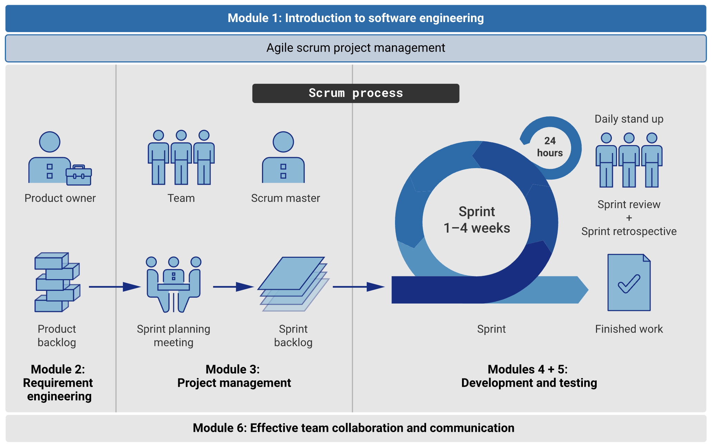

This module discusses the importance of software engineering, its role in ensuring high-quality software and its impact on project success, an overview of modern software development lifecycles (SDLC) and emphasising various methodologies such as Waterfall, Agile, Scrum, and Kanban. Finally, this module explores the roles and responsibilities involved in an Agile Scrum software development team.

#### In this module, you will:

- understand the concept of software engineering and its role and importance in modern technology.
- understand the stages of the Modern Software Development Lifecycle (SDLC), from requirements analysis to deployment and maintenance.
- dive into various software engineering methodologies, including Waterfall, Agile, Scrum, and Kanban.
- examine the different roles and responsibilities within an Agile Scrum software development team, such as product owners, scrum master, scrum team.

- The following unit overview diagram highlights your progress through the unit's Agile scrum software development process. Before we begin with the stages of this process, lets begin with an introduction to software development.

## Topic 1: What is [[Software engineering]]?

## Topic 2: [[Software Development Lifecycle]] (SDLC)

## Topic 3: [[software engineering methodologies]]

## Topic 4: [[Agile scrum project management]]

## Topic 5: [[Roles and responsibilities within an Agile scrum software development team]]