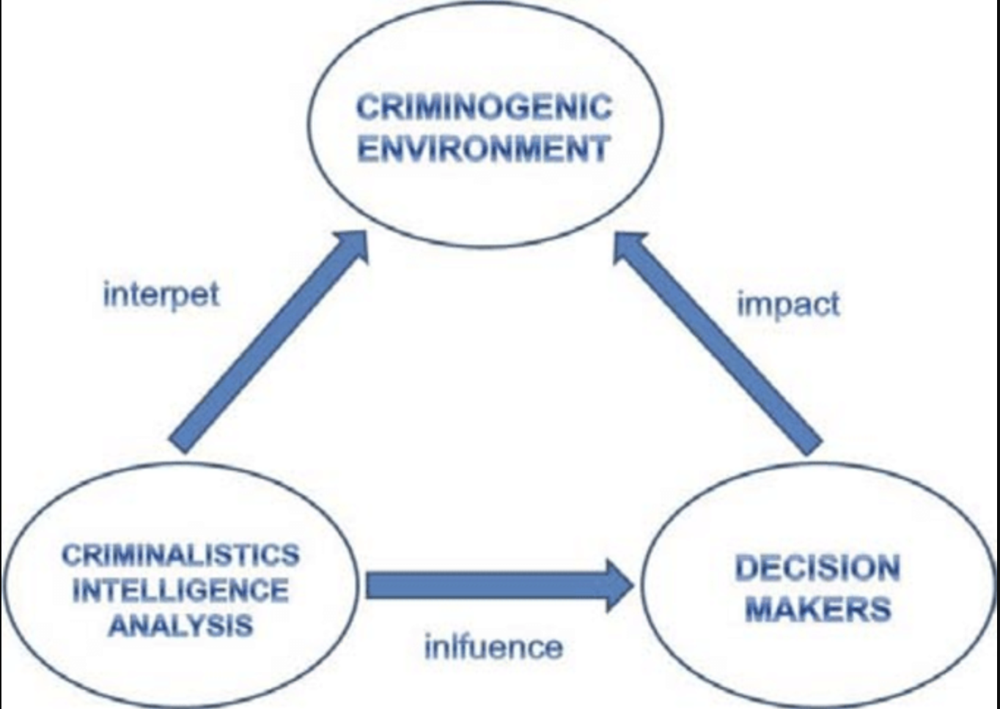

[[Intelligence-Led Policing in Practice - Reflections From Intelligence Analysts]] (pp.139-140):
>Intelligence-led policing (ILP) seeks to move ==from a “reactive” or “prosecution-directed mode” of policing to a more “proactive” style of crime prevention== (Innes, Fielding, & Cope, 2005, p. 41; Innes & Sheptycki, 2004, p. 1). This involves a shift away from responding to individual incidents and “threats” in isolation to one that is future orientated and strategic in nature (J. G. Carter, 2013; Ratcliffe, 2016). ILP seeks to achieve this by placing what is often referred to as “crime intelligence” at the forefront of decisions concerning the prevention and control of crime (Guidette & Martinelli, 2009, p. 132; Ratcliffe, 2016, p. 89). 1 Under this model, ==crime intelligence should guide operations “rather than operations dictating intelligence-gathering priorities”== (Ratcliffe, 2016, p. 6).

## Intelligence Models
[[Intelligence-Led Policing in Practice - Reflections From Intelligence Analysts]] (p.140):
>Crime intelligence or the intelligence process, more broadly, is often conceptualized in terms of ideal models. The most well-known of such models is the ==“intelligence cycle.”== There are numerous versions of the intelligence cycle; however, they broadly follow the same six stages: **planning, collection, collation and evaluation, analysis, dissemination, and feedback** (Gill & Phythian, 2013; Warner, 2013). The most common criticism of the intelligence cycle is that the practice of intelligence is much more fluid than as it is depicted in the model. A further criticism is how it views intelligence in isolation, paying no consideration to the broader law enforcement environment in which it sits, including a failure to articulate how intelligence analysis is linked to decision-making. In contrast, Ratcliffe’s (2016) ==3-I model== seeks to clearly illustrate the role of intelligence within policing. ==The 3-I model is not necessarily a representation of how intelligence functions within law enforcement currently, but a depiction of how law enforcement organizations should function== if they are to be truly intelligence-led. The 3-I model consists of **three components (crime intelligence analysis, decision makers, and criminal environment)** and **three processes connecting these components (interpret, influence, and impact)**, creating a triangle (Gul, 2009). There are two main differences between the intelligence cycle and the 3-I model, and they primarily relate to the latter two “Is.” The first is the significance placed on crime intelligence analysts having an *influence* over decision makers. The second, in turn, is for decision makers to actually implement various initiates who do have an *impact* on crime. This is perhaps the most contentious component of this model and is a key difference from other models that often see the creation of an intelligence product and its dissemination as the conclusion of this process (Coyne & Bell, 2011; Ratcliffe, 2016).

*it seems like the 'intelligence cycle' is more of a description of the process from the interior perspective of the analysts, whereas the 3-I model is a more high level model of its role within policing generally*

