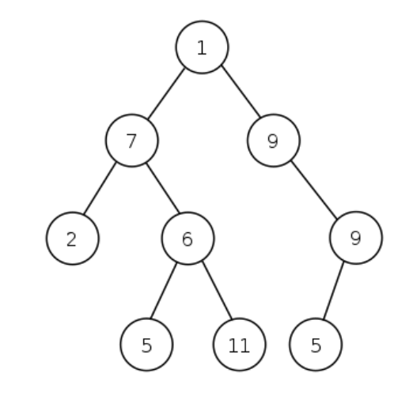
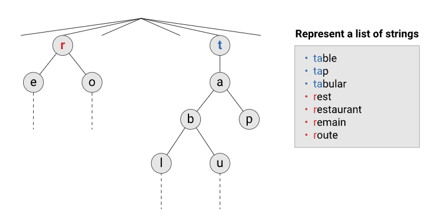
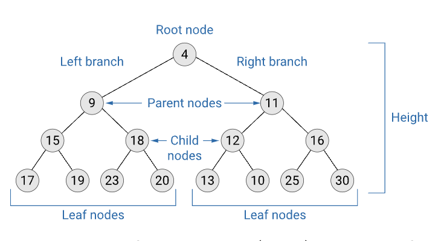

### 1. Introduction to trees

#### 1.1. Introduction and basic terminology

#### What are trees?

A tree is a connected graph but has no cycles. 

A cycle is a path in a graph with at least one edge, no repeated edges, and the first and last vertices coincide, but there are no other repeated vertices.

#### What are trees used for?

Trees are useful to model many things in a natural way:

- family trees
- organisation structure charts
- structure of chapters and sections in a book
- routing data for network traffic
- data compression.

#### Basic terminology

The following are some terminologies of trees:

- **Root**—the topmost node of a tree.
- **Parent**—any node (other than the root) in a tree that has at least one sub-node of its own.
- **Child**—a node immediately below a given node is a child of that node.
- **Leaf**—a node with no children, these nodes can be called external nodes, too.
- **Internal node**—any inner node with at least one child.
- **Height of a tree**—the longest path from the root node to the deepest leaf node.

