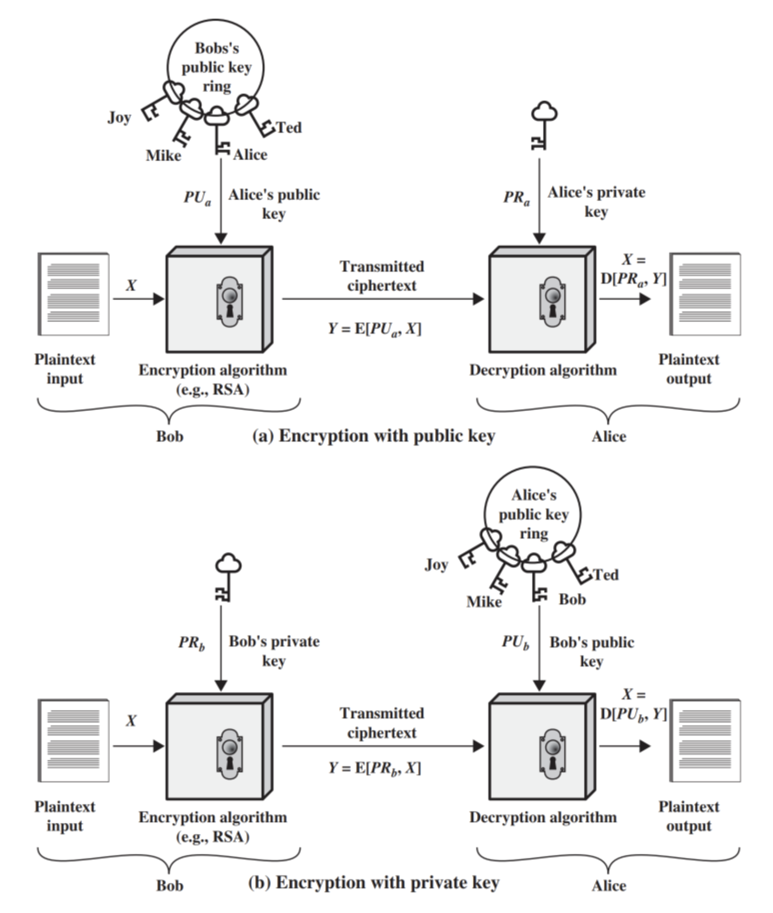

In the previous lessons, your focus has been on studying the aspects of symmetric encryption. While this technique is powerful and efficient, it relies on the utmost secrecy being maintained in respect to the key. Provided both communicating parties had access to the key, the encryption and decryption of messages was simple. However, despite all of these benefits, symmetric cryptosystems posed two main challenges:

- The first challenge was the hardest—the key exchange. If the communicating parties consisted of two individuals on different sides of the world, they would first need to securely exchange the keys before they can begin communicating. This was a big challenge.

- The second challenge was that of non-repudiation—wherein there was no guarantee that the sender of the message was in fact the sender of the message without any plausible deniability.

Symmetric cryptosystems generally relied on permutation and substitution mechanisms to encipher and decipher messages. These mechanisms were not able to address the two main issues. This was resolved with the introduction of asymmetric cryptography or public key cryptosystems.

Asymmetric cryptosystems use a pair of related keys rather than a single key. Both keys were generated using a mathematical function which could easily be computed one way but the reverse was infeasible or extremely computationally intensive. The foundational premise of asymmetric cryptosystems is that since the key pair were paired, either could be used to perform one operation and the other could then be used for the inverse operation. This allowed users to maintain a **private key**, which they kept secret and a **public key**, which could be shared with anyone. Messages encrypted with the public key could then only be deciphered with the private key and vice versa. This technique revolutionised modern cryptography alleviating many of the challenges associated with symmetric cryptosystems.

As asymmetric cryptosystems use different keys for encryption and decryption, they need different algorithms in place as well to perform each function. In order to define such an algorithm, it must meet the following requirements:

- A user **_b_**, wanting to use the algorithm, should be able to easily generate a key pair

public − PUb      private − PRb

- A user _**x**_, wanting to send an encrypted message _**C**_ to _**b**_, should be easily able to encrypt the plaintext message **_M_** knowing the encryption algorithm **_E_**, and the public key of **_b_**.
    

C = E(PUb, M)C = E(PUb​, M)

- User **_b_**, wanting to decrypt the received ciphertext _**C**_, should be easily able to decrypt the ciphertext to obtain the plaintext _**M**_, knowing the decryption algorithm _**D**_, and the private key of _**b**_.
    
    M = D(PRb, C) = D[PRb, E(PUb, M)]
    

- Given only the knowledge of the algorithm and the encryption key, it should be computationally infeasible to ascertain the decryption key.
    

- An adversary having knowledge of the public key of _**b**_, and an encrypted ciphertext _**C**_, should find it computationally infeasible to recover the original plaintext message _**M**_.
    

- And last, while not an absolute requirement, either key within the pair can be used for either operation with the other being used for the second operation in any order.
    

M = D[PUb, E(PRb, M)] = D[PRb, E(PUb, M)]

A high level illustration of the asymmetric cryptosystem can be defined as shown in the image below.

Any asymmetric cryptosystem generally consists of the following six aspects:

- **Plaintext:** This is the message which is meant to be transferred from the sender to the receiver
    
- **Encryption Algorithm:** This is the algorithm the sender needs in order to transform the plaintext prior to sending it
    
- **Private key:** Not to be confused with secret key (for symmetric encryption). This is the first half of the key pair which is used only by the receiver to decrypt the ciphertext via the decryption algorithm
    
- **Ciphertext:** This is the resulting output of the encryption algorithm produced by using the provided plaintext and defined private key.
    
- **Public key:** This is the second half of the sender's key pair which is made publicly available so the sender can encrypt any messages sent to the receiver.
    
- **Decryption algorithm:** This is the algorithm the receiver needs in order to transform the ciphertext back into plaintext
    

It is important to note that for any two parties communicating both sender and receiver must use the sender's keypair when transmitting a message.