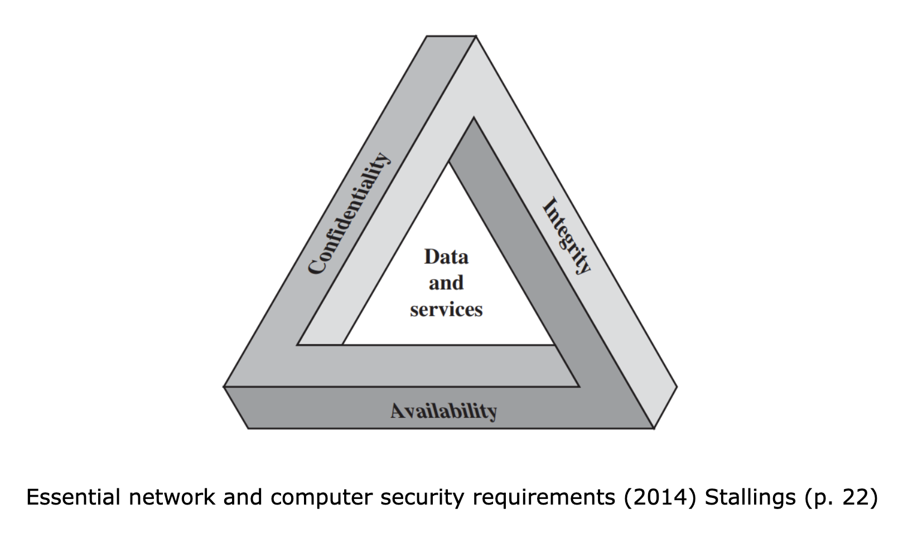

Gone are the days where secure meant a strong door and a heavy padlock. In today's world, security can be broken down in many ways. The advent of digital communications via the internet has opened up even more possibilities for breaches to occur and both sender and receiver need to ensure that all information stored and received is secure, while also ensuring security during transmission. However, the classic problem still persists; how can Alice send Bob an item that has been locked securely, so only Bob is able to open it but not anyone else who comes across the item during transit?

The National Institute of Standards and Technology (NIST) stipulates that in order to secure a system, its information, and its resources, there are three main requirements that must be adhered to in order to ensure security, which includes:

- **Confidentiality:** This property ensures that all information stored is only made available or disclosed to individuals who have the authorisation to access or view it.
    
- **Integrity:** This property ensures that the stored data is not modified or destroyed in any way by any unauthorised individual.
    
- **Availability:** This property ensures that the information stored is available when required to an authorised individual.

Confidentiality, integrity, and availability are often referred to as the CIA triad, formed by amalgamating the first letter of each property. However, with the growing use of digital communications over the internet, the CIA triad couldn't suffice all aspects to ensure the security of a computer system and the information stored. This led to practitioners extending the triad to also include two additional properties:

- **Authenticity:** This property ensures that the information transmitted and stored is authentic and that the sender is, in fact, the actual person whom the receiver believes to be sending the message.  
    
- **Accountability:** This property ensures that all actions that occur on a system can be traced back to the individual responsible for carrying them out.
    

It is important to keep in mind, that a truly secure system is not possible to achieve. However, by maximising the level of security at each level of the process, we can ensure that the overall security of the system is as high as possible.

Next: [[Challenges to computer security]]