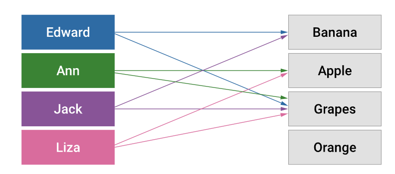

#### 1.1. Introduction to predicate logic

In this part, you will learn about the basic terminology in predicate logic and various components that can be used to construct a predicate logic sentence.

Look at the following example. It defines the relation 'Likes' for two collections of sets, say:

People (P)= {Edward, Ann, Jack, Liza}  
Fruits (F)= {Banana, Apple, Grapes, Orange}.

The arrows between the people to fruits indicate that the person on the left loves the fruit on the right.

Let’s look at a few statements about this scenario:

1. 'Edward likes Banana' is a true statement. Now how do we write this as a predicate?  
    **∃x ∈ P, Likes(x, Banana)  
    **i.e. there exists someone in P who likes Banana.
2. Similarly, “Jack likes Banana” is also a true statement, which can also be represented by the same predicate.  
    **∃x ∈ P, Likes(x, Banana).**
3. Is this a true statement?  
    **∃x ∈ P, Likes(x, Orange)  
    **No, it is not. That’s because nobody in the set of people P likes Orange.
4. **∀x ∈ P, Likes(x, Grapes)  
    **What does this mean? It says that every person in P likes Grapes, which is true.
5. Similarly, can we say **∀x ∈ P, Likes(x, Apple)?  
    **No, it is not possible. Why? Only Ann & Liza like apples, but not the others.