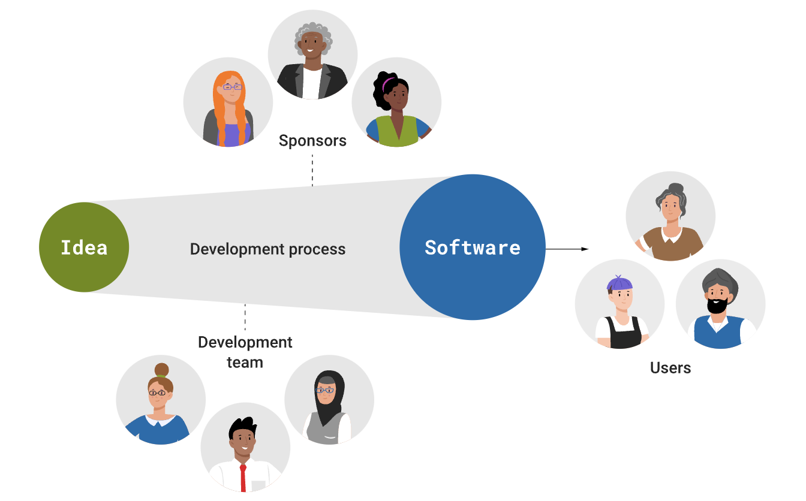
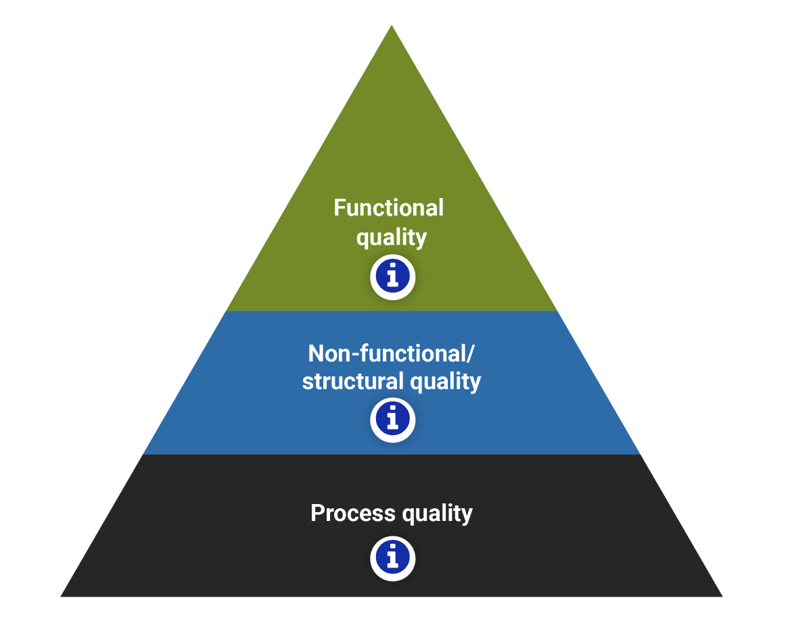
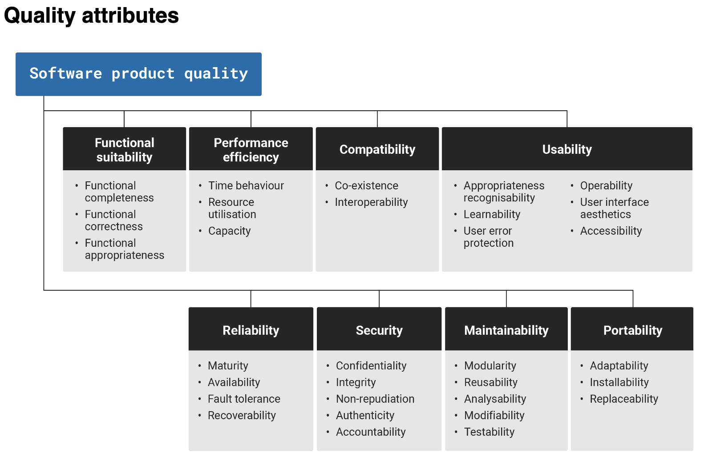

In this topic book, you will cover the following:

- What is software quality assurance (SQA)?
- What is software quality?
- What are the quality attributes of software systems?
- Functional quality
- Non-functional quality.

### 1. What is software quality assurance (SQA)?

**Software quality assurance (SQA)** is a set of activities and processes aimed at ensuring that software products meet specified quality standards (e.g. ISO 25010, SPICE or CMMI) and fulfill customer expectations.

Three goals of SQA are:

- ensuring **product** has desired quality properties
- ensuring **process** by which product was built is of sufficient quality
- ensuring QA of product and process is of sufficient quality.

#### Who cares about software quality?

A development process converts an idea into usable software. The three groups of people who care about the software’s quality are:

- **the software’s users**, who apply this software to some problem
- **the development team** that creates the software
- **the sponsors of the project**, who are the people paying for the software’s creation.

### 2. What is software quality?

**Software quality** can be defined as 'the degree of conformance to explicit or implicit requirements and expectations' (IEEE n.d.)

Functional quality (meeting the specified requirements)

The product’s compliance with functional (explicit) requirements and design specifications.

Non-functional/Structural quality

The product’s inner characteristics and architecture, i.e. structural (implicit) requirements, e.g. usability, maintainability, understandability, efficiency, security, and ethics.

Process quality

A repeatable development process that reliably delivers quality software while meeting delivery dates and budgets.

### 3. What are the quality attributes of software systems?

Software quality attributes are features that facilitate the measurement of a software product’s performance by software testing professionals. ISO/IEC 25010 is one of the common standards that provides a framework for evaluating software quality (both functional and non-functional).

### 4. Functional quality

Functional quality refers to the degree to which a product or service meets its intended purpose or functional requirements. Three main quality attributes that they look for are as follows.

The **functional completeness** is the measure of how well the system or a component meets all the stated requirements of the user. It measures the degree to which the system or a component includes all the features, functions, and capabilities required.

The **functional correctness** is the measure of how accurate and reliable the system or a component is in performing its intended task. It tests the ability of the system or a component to follow the rules and specifications correctly.

The **functional appropriateness** measures the degree to which the system or a component meets the user’s expectations. It evaluates the system’s or a component's ability to perform the tasks it is expected to do in a way that satisfies the user.

### 5. Non-functional quality

Non-functional quality, often referred to as non-functional requirements or characteristics, represents aspects of a system that describe how it performs its functions rather than what functions it performs. The following are examples of non-functional quality attributes.

| Quality Attribute | Description                                                                                                                                                                                                                                                     |
| ----------------- | --------------------------------------------------------------------------------------------------------------------------------------------------------------------------------------------------------------------------------------------------------------- |
| Usability         | It is described as how the user is utilizing a system effectively and the ease to which users can learn to operate or control the system. The well-known principle of usability is KISS (Keep It Simple Stupid). Software applications should be user-friendly. |
| Reliability       | It is the ability of a system to continue to keep operating over time.                                                                                                                                                                                          |
| Availability      | It is the ratio of the available system time to the total working time it is required or expected to function.                                                                                                                                                  |
| Portability       | It is the ability of a software application to run on numerous platforms such as data portability, hosting, viewing, etc.                                                                                                                                       |
| Testability       | It shows how well the system or component facilitates to perform tests to determine whether the predefined test criteria have been met.                                                                                                                         |
| Scalability       | It is the ability of a system to handle the demand for stress caused by increased usage without decreasing performance.                                                                                                                                         |
| Flexibility       | It is the ability of a system to adapt to future changes.                                                                                                                                                                                                       |
| Reusability       | It is the use of existing software or more than one software with small or no change. It is a cost-efficient and time-saving quality attribute.                                                                                                                 |
| Maintainability   | It is the ability of a software application to maintain easily and support changes cost-effectively.                                                                                                                                                            |
| Supportability    | It is the ability of a system that satisfies necessary requirements and needs to identifying and solving problems.                                                                                                                                              |
| Interoperability  | It is the ability of two or more systems to communicate or exchange data easily and to use the data that has been exchanged.                                                                                                                                    |
| Performance       | It is the ability of a system in the form of responsiveness to various actions within a certain period of time.                                                                                                                                                 |
| Security          | It is the ability of a system to resist or block malicious or unauthorized attempts that destroy the system and at the same time provide access to legitimate users.                                                                                            |
