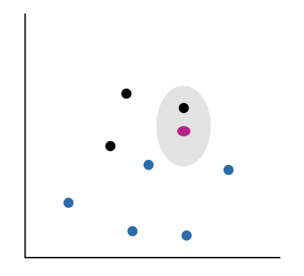
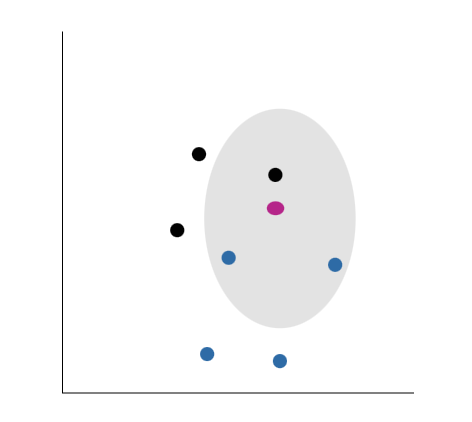
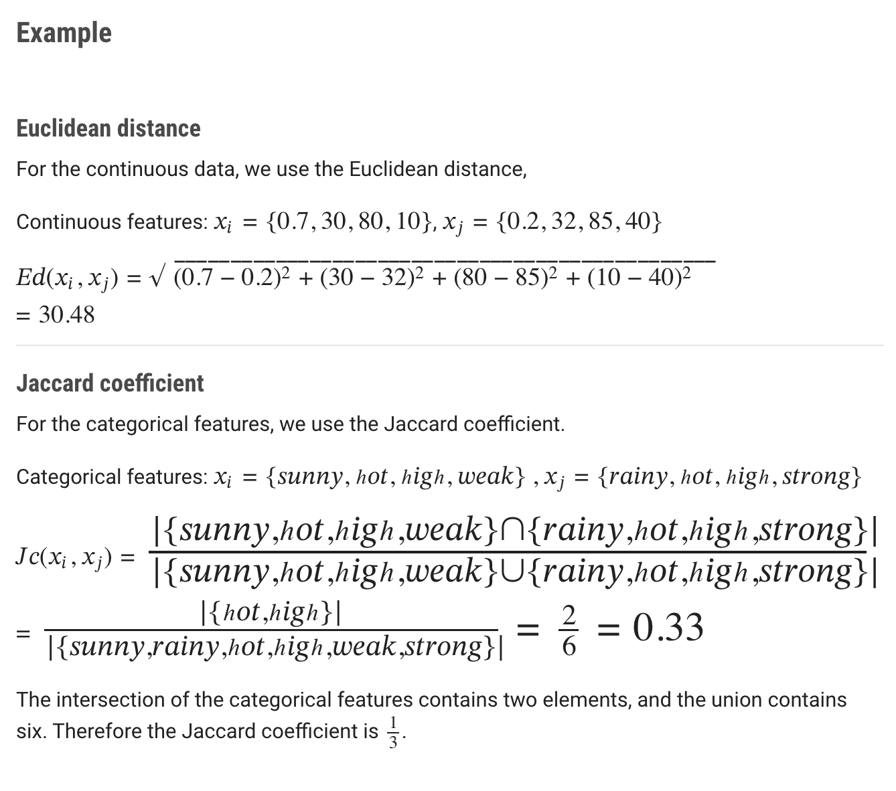

---
aliases:
  - k-NN
---
The categorisation of a point in n-dimensional space finds the point's k nearest neighbours in that space and selects the class label that is most common among them

#### 1-nearest neighbour

Suppose we had the data points shown in 2D space with either a label of black or blue, and we want to classify a new point shown currently in pink. 

If we do a 1 nearest neighbour, we find the single closest point to the pink point, a black point. We take a majority vote, with the result being black, and hence we classify the pink point as black.

#### 3-nearest neighbour

If, on the other hand, we are performing a 3 nearest neighbour, we look for the 3 closest points to our pink point and find two blue points and one black point. Therefore, our majority vote would classify the pink point as a blue one.

## Computing similarity

#### Finding the distance between different instances

If the features of our data are **continuous,** then we can use **[[Euclidean distance]]**, and if our features are **categorical,** then we can use the **[[Jaccard index|Jaccard coefficient]]**.

#### Parameter learning

There is no training in this algorithm. The training data and distance functions are all we need for the algorithm to run.

The model effectively **memorises** the whole 'training' data and refers to it whenever it needs to classify a new instance. This means that more data makes the model grow and requires more distance calculations for every classification. This makes the algorithm very simple overall but potentially quite slow.