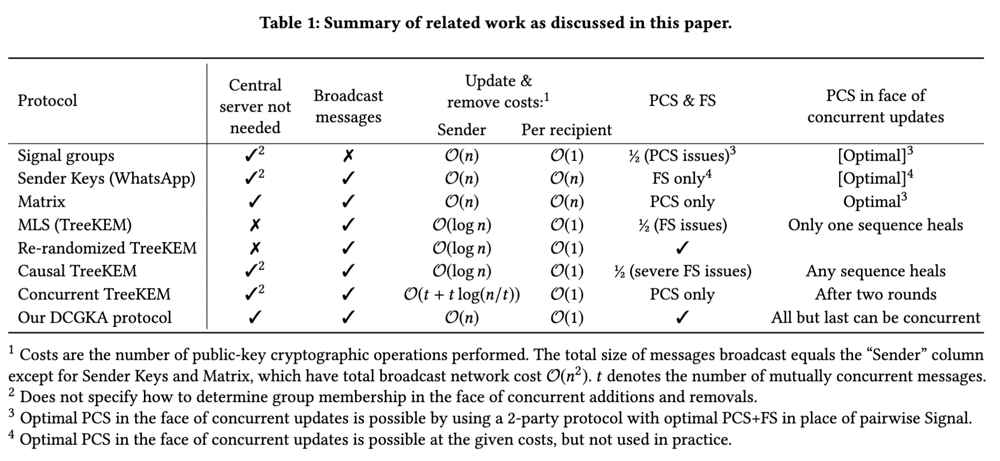
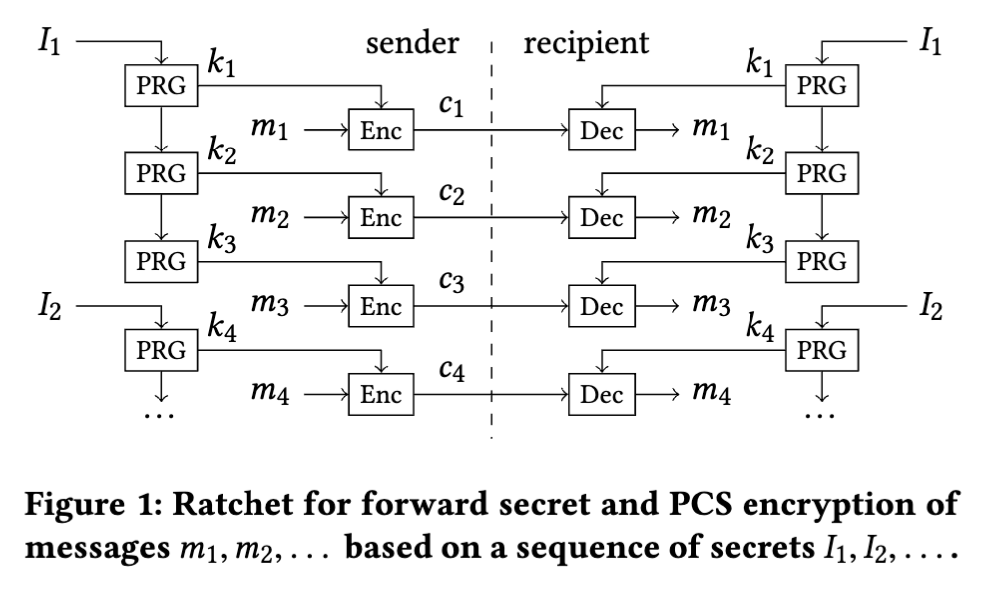
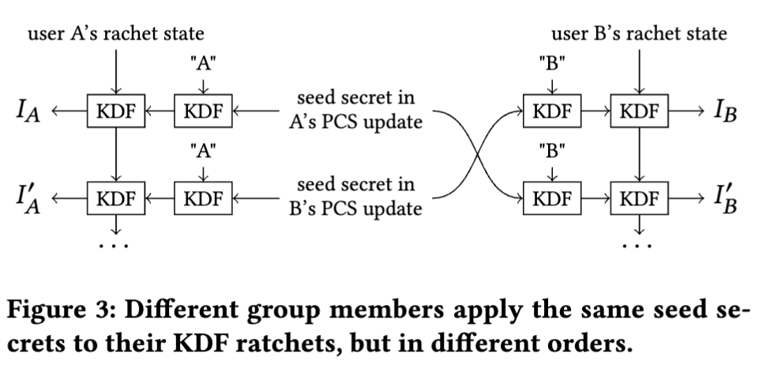
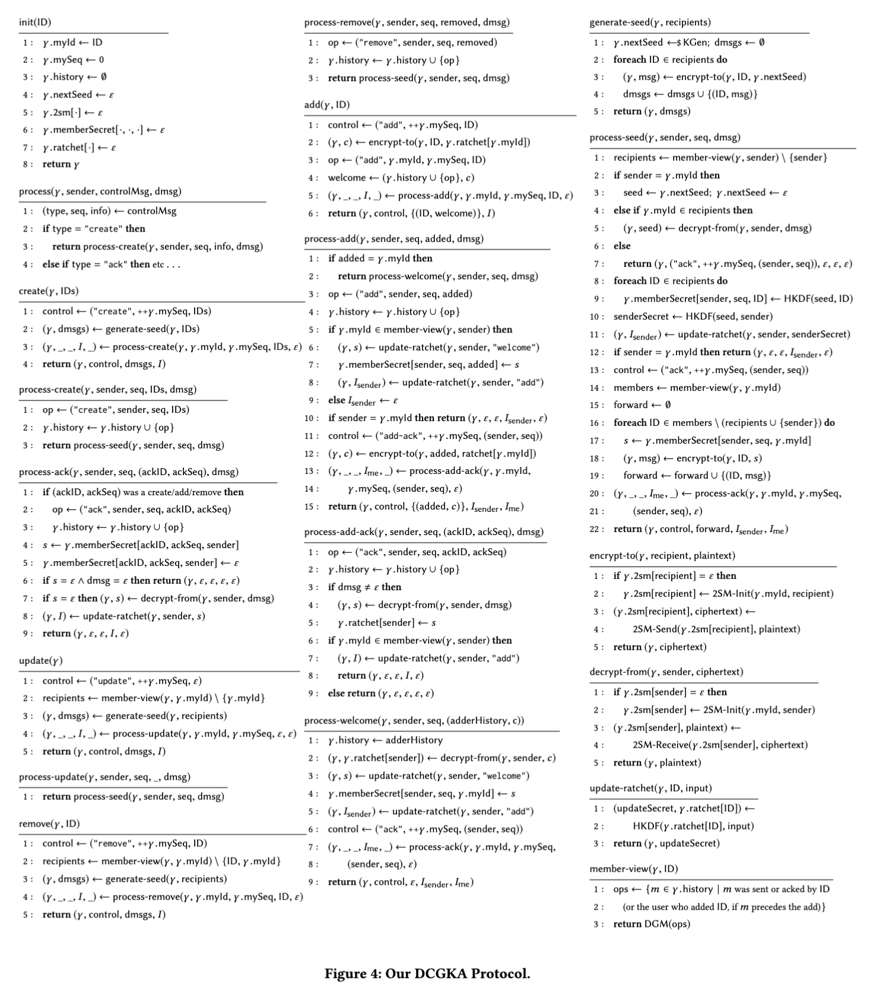
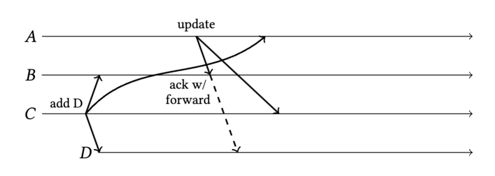
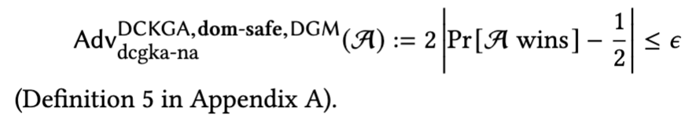
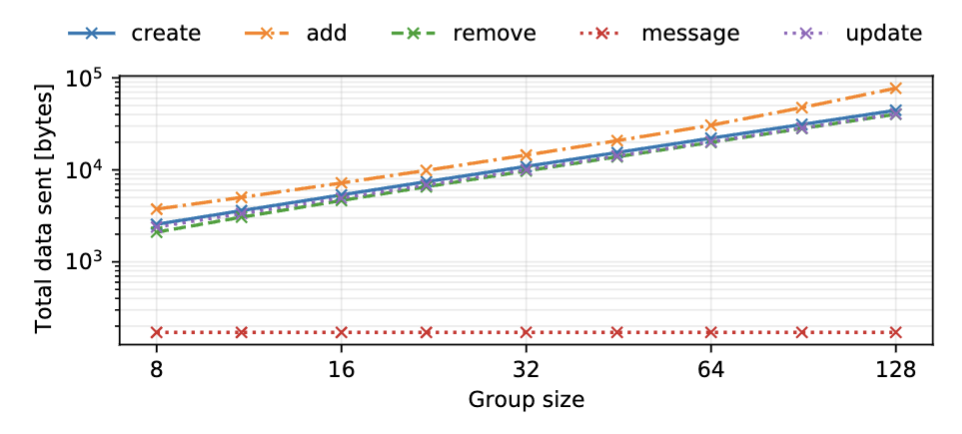
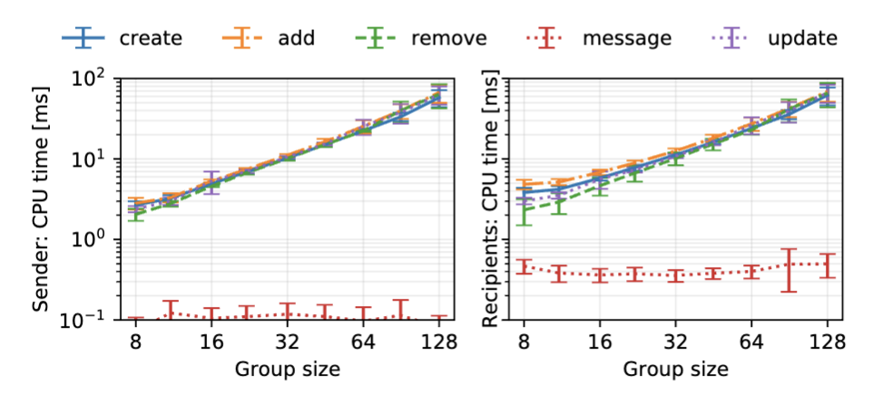

## Abstract

Secure group messaging protocols, providing end-to-end encryption for group communication, need to handle mobile devices frequently being offline, group members being added or removed, and the possibility of device compromises during long-lived chat sessions. Existing work targets a centralized network model in which all messages are routed through a single server, which is trusted to provide a consistent total order on updates to the group state. In this paper we adapt secure group messaging for *decentralized* networks that have no central authority. Servers may still optionally be used, but they are trusted less. We define *decentralized continuous group key agreement* (DCGKA), a new cryptographic primitive encompassing the core of a decentralized secure group messaging protocol; we give a practical construction of a DCGKA protocol and prove its security; and we describe how to construct a full messaging protocol from DCGKA. In the face of device compromise our protocol achieves forward secrecy and post-compromise security. We evaluate the performance of a prototype implementation, and demonstrate that our protocol has practical efficiency.

## 1 Introduction

WhatsApp, Signal, and similar messaging apps have brought end- to-end encryption to billions of users globally, demonstrating that the benefits of such privacy-enhancing technologies can be enjoyed by users who are not technical experts. Modern secure messaging protocols used by these apps have several important characteristics: 

- Asynchronous: A user can send messages to other users regard- less of whether the recipients are currently online. Offline recipients receive their messages when they are next online again (even if the sender is now offline). This property is important for mobile devices, which are frequently offline. 
- Resilient to device compromise: If a user’s device is compromised, i.e., all of that device’s secret key material is revealed to the adversary, the protocol nevertheless provides forward secrecy ([[Forward secrecy|FS]]): any messages received before the compromise cannot be decrypted by the adversary. Moreover, protocols can provide post-compromise security ([[Post-compromise security|PCS]]) [ 14 ]: users regularly update their keys so the adversary eventually loses the ability to decrypt further communication. As secure messaging sessions may last for years, these properties are important for limiting the impact of a compromise. 
- Dynamic: Group members can be added and removed at any time. 

In the case when only two users are communicating, the Signal protocol [ 32 ] is widely used. However, generalizations of this two-party protocol to groups of more than two users are not straight-forward. For example, WhatsApp’s group messaging protocol does not provide PCS [ 36, 43 ]. Signal implements group messaging by sending each message individually to each group member via a two-party secure channel, which is inefficient for large groups. 

Secure group messaging protocols have been the subject of much recent cryptographic work, which we summarize in Section 3. A notable example is the [[Messaging Layer Security]] (MLS) protocol, a standard under development by an IETF working group [ 5 , 31], which provides FS/PCS and is designed to scale to large groups. However, MLS assumes that all messages modifying the group state (i.e. adding/removing members or performing key updates for PCS) are delivered to all members in the same order. If two group members concurrently modify the group state, one of the requests must be rejected and retried. This total order is typically enforced by routing all messages through a centralized, semi-trusted delivery service; alternatively, a consensus protocol could be used. 

There are many systems in which such centralization is undesirable. Email is a prominent example of a decentralized communication method. Anonymity networks such as [[Tor]] [ 16 ] or [[Loopix]] [ 33 ] rely crucially on the assumption that no single node is able to observe all network traffic. Protesters use mesh networks, in which mobile devices exchange messages without any servers, to avoid censorship [ 1, 4 , 38 ]. In systems such as these, a protocol that assumes a central node or consensus cannot be used, because it would defeat the purpose of the underlying network’s decentralization. 

In this paper, we present a decentralized, asynchronous secure group messaging protocol supporting dynamic groups. Our protocol works with any underlying network without requirements on message ordering or latency: it can be deployed in peer-to-peer or anonymity networks; it tolerates network partitions, high latency links, and disconnected operation; and it does not require any servers or consensus protocol. If servers are optionally used, there is no need to trust them to order messages correctly, and users can switch from one server to another (or use multiple servers at the same time) without worrying about preserving message ordering. 

Our protocol provides end-to-end encryption with forward secrecy and PCS, even when multiple users concurrently modify the group state. It is practical, using only efficient and widely deployed cryptographic primitives. It provides key agreement: messages to the group need only be encrypted and sent once with small constant overhead, regardless of group size. Group membership changes and key updates (for PCS) require effort proportional to the group size. In this paper we make the following contributions:

 - We define Decentralized Continuous Group Key Agreement (DCGKA), a new security notion for establishing shared symmetric keys in dynamic groups. Our definition generalizes [[Continuous Group Key Agreement]] (CGKA) [3] to the decentralized setting. 
 - We construct a protocol that implements DCGKA (Section 6), prove its correctness and security (Section 7), and use it to implement secure group messaging (Section 4). 
 - We evaluate the performance of a prototype implementation of our protocol (Section 8), demonstrating that it is efficient enough for practical deployment.

## 2 Goals and Assumptions

In this section we summarize the goals of our protocol and the threat model for which it is designed. A secure group messaging protocol allows a group with a given set of users to be created, allows group members to add and remove other members, and allows group members to send messages to the current set of members. We distinguish between application messages (messages that a user wishes to send to the group) and control messages (sent by the protocol to update group state). The protocol must meet the following security goals: 
- ==Confidentiality==: An application message sent by a group member can only be decrypted by users who are also members of the group at the time the message is sent, according to the sender’s view of the group. 
- ==Integrity==: Messages cannot be undetectably modified by anyone but the member who sent them. 
- ==Authentication==: The sender of a message cannot be forged, and only members can send messages to the group.
- ==Forward secrecy== (FS): After a group member decrypts an application message, an adversary who compromises the private state of that member cannot decrypt that message. 
- ==Post-compromise security== (PCS): If an adversary compromises a group member, learning a snapshot of their current private state (including all secret keys), but the group member retains the ability to send messages, then the adversary can only decrypt messages until that group member sends a PCS update message that “heals” the compromise. More precisely, the adversary cannot decrypt messages sent by any group member who has processed the PCS update. In case an adversary gains persistent access to a device, PCS ensures that they lose decryption ability as soon as their persistent access is revoked (e.g., by a software update) and the group member sends a PCS update message. 
- ==Eventual consistency==: All group members receive the same set of application messages (possibly in different orders), and all group members converge to the same view of the group state as they receive the same set of control messages.

Our protocol ensures these security properties in the face of an adversary who can perform arbitrary active network attacks. If servers are used to relay messages, the adversary also fully controls those servers. We require the protocol to be decentralized, which means that whenever any subset of users is able to physically exchange messages, they can communicate via the protocol. For example, consider a group of protesters split across two physical locations, and assume that devices at each location are able to communicate (e.g. via a mesh network such as Briar [ 10] or Bridgefy [1 ]), but that long-range communication between the locations is interrupted (perhaps due to an adversary). This is known as a network partition [ 19]. In such a scenario, we require that the users at each location can continue to send and receive application messages, and to add and remove group members. Messages should be delivered immediately to local users, and be delivered to remote users as soon as long-range communication is restored. Such message delay may present usability challenges, but we think it is preferable to the alternatives (delaying communication between co-located users, or dropping messages entirely). 

Decentralization implies that we cannot assume messages are routed through a single server, since that would prevent communication between co-located users who cannot reach the server but can connect to each other. It also rules out majority voting or consensus, since a majority of users can reside at most in one location, leaving a minority in the other location unable to communicate.

### 2.1 Limitations

Decentralization involves trade-offs, which we summarize in this section. We also explain some simplifying assumptions we make. 
- *Efficiency*. The main practical downside of decentralization is reduced efficiency. Our protocol’s PCS update and group member- ship change messages have size 𝒪(n), where n is the number of group members, while in MLS those messages have size 𝒪(log(n)). However, in absolute terms, the linear cost is acceptable: in a group with 128 members, a key update operation in our protocol takes 70 ms of CPU time per client and transmits 40 kB of network traffic.
  MLS allows up to 50,000 members per group; our protocol is impractical for groups of that size. However, we argue that secure messaging for groups of thousands of people does not have a plausible threat model: large groups are more easily infiltrated by agents of the adversary, making the protocol’s confidentiality properties irrelevant. We believe that secure messaging is most valuable in small-to-medium sized groups, for which a 𝒪(n) cost is acceptable. 
  Our protocol also stores some state for each PCS update message until every group member acknowledges the message, so the state size may grow without bound if some group member never acknowledges messages. The size of the stored state can be reduced by using a different protocol (a variant of Sender Keys), but this increases the cost of membership changes to 𝒪(n2). In practice, the storage cost is negligible on today’s computing devices. 
- *Removed users*. When a user is removed in the decentralized setting, the removed user can continue sending messages to group members who have not yet received the instruction to remove that user. However, our protocol prevents removed users from violating confidentiality with such messages. 
- *Malicious group members*. In general, we assume that group members correctly follow the protocol. ==A group member can send mal-formed protocol messages that make other group members disagree on keys, causing denial of service (the same is true of MLS [12]).== However, group members cannot violate the protocol in a way that prevents them, or any members they add, from being removed from the group (Section 7). 
- *Scope of device compromise*. While we can guarantee all of the security goals against network attacks at all times, a device compromise inevitably temporarily impacts confidentiality, integrity, and authentication. ==For PCS we assume that following a device compromise, the adversary does not use the private state it has acquired to impersonate the compromised user until that user sends a PCS update message, as in many PCS protocols== [14]. After the compromised user sends a PCS update message, the security properties are restored. If the adversary does impersonate a user, the compromise is healed once that user, and any users the adversary added, are removed from the group (Section 7). 
- *Causal order processing*. ==Messages are processed after all causally prior protocol messages are received (Section 5.1), in contrast to instant message decryption in Signal==. MLS has a similar requirement, and it is easily satisfied by retransmitting missing messages. 
- *Unique additions*. To simplify the presentation of our algorithms, we assume that user additions are unique: if the same user is added more than once to the same group, then each user addition results in a separate protocol instance, and each is associated with a separate ID. This can be achieved e.g. by including a nonce in the user ID. 
- ==*Metadata privacy*. Some protocols (including MLS) encrypt metadata, such as the identity of a user being added to a group. However, these techniques do not work directly in a decentralized setting. We leave metadata privacy for future work.== 
- *Public Key Infrastructure (PKI)*. We assume the existence of a PKI that allows group members to obtain a correct public key for other users. One approach would be for individual users to authenticate each other (e.g. by scanning QR codes on each others’ phones if the users are co-located in person, or by reading out a low-entropy code over the phone and upgrading it to a shared secret using a PAKE protocol), and to build a web of trust from these pairwise checks. Other approaches are possible [ 39 ], but details of this decentralized PKI are outside the scope of this paper.

## 3 Related Work

There are many existing secure messaging protocols [ 39]. Schemes for two-party communication, providing forward secrecy and PCS to varying degrees, have been studied extensively over the past few years, starting with the Signal protocol [32] and its analysis [13], followed by several new protocols and their analyses [6 , 17, 22, 23 , 34] as well as a modular analysis and generalization of Signal [2]. 

Among group messaging protocols for more than two parties, relatively few are both asynchronous and support dynamic groups, which we consider critical requirements for practical group messaging on mobile devices. We focus on such protocols in our discussion below. See Table 1 for a high-level comparison. 

*Signal groups* use a simple protocol: the sender of each application message sends the message individually to each other group member using the two-party Signal protocol [ 36 ]. This approach quickly becomes inefficient in large groups, as every application message requires n − 1 two-party messages in a group of size n. ==Also, care is needed to achieve PCS: using the ordinary Signal protocol, a group member effectively performs a PCS update only after receiving a message from every other group member, which would never happen if one member is always offline.== 

*[[Sender Keys]]* is another simple protocol, used by WhatsApp [ 36 , 43 ]. In Sender Keys, each group member generates a symmetric key for messages they send, and then sends this key individually to each other group member using the two-party Signal protocol. For each message sent by this member to the group, a new key is derived pseudorandomly from the previous key, providing a ratchet for forward secrecy. Whenever a user is removed, each remaining group member generates a new key and sends it to the other remaining members over the same two-party channels. The protocol could provide PCS by updating keys periodically, but WhatsApp chooses not to do this. 

Like Signal groups, Sender Keys can be adapted to the decentralized setting; the disadvantage is that PCS updates are expensive. If one user is compromised, all of the sender keys become known to the adversary. Since each user updates only their own sender key, to recover from the compromise, each of the n group members needs to generate a new key and send it to each of the n − 1 other members, resulting in 𝒪(n2) messages over the two-party channels. 

Matrix’s end-to-end encryption protocol [29 , 40] is a variant of Sender Keys. It is decentralized, provides PCS, and explicitly handles concurrent updates and group membership changes. ==It is purposely not forward secret, although this could be changed.== PCS updates in Matrix require 𝒪(n2) messages, while our protocol has 𝒪(n) cost. No formal security analysis of the Matrix protocol has been published to date. 

The MLS protocol, mentioned in Section 1, uses the **[[TreeKEM]]** key agreement protocol [5, 8]. ==Adding or removing a group member, or performing a PCS key update, requires broadcasting a message of size 𝒪(log(n)).== This is achieved by arranging group members into a binary tree, with one leaf per group member, and each member knowing the secret keys on their leaf node’s path to the root. 

In large groups, MLS update messages are smaller than those in our protocol; the downside is that ==MLS is inherently centralized==. ==MLS allows several PCS updates and group membership changes to be proposed concurrently, but they only take effect after being committed, and all users must process commits strictly in the same order.== A proposal also blocks application messages until the next commit. ==In the case of a network partition like that described in Section 2, it is not safe for one subset of users to perform a commit, because a different subset of users may perform a different commit, resulting in a group state inconsistency that cannot be resolved. As a result, MLS typically depends on a semi-trusted server to determine the sequence of commits. There is a technique for combining concurrent commits [ 8 , §5], but this approach does not apply to commits that add or remove group members, and it provides weak PCS guarantees for concurrent updates.== 

Alwen et al. [3] introduce *[[Security Analysis and Improvements for the IETF MLS Standard for Group Messaging|Re-randomized TreeKEM]]* to strengthen TreeKEM’s forward secrecy. That protocol is ==even harder to decentralize==: group members update each other’s secret keys so that each secret key is only used once, allowing them to be deleted for forward secrecy, but this approach breaks if multiple concurrent messages are encrypted under the same public key. 

In the other direction, *Causal TreeKEM* modifies TreeKEM to require only causally ordered message delivery (see Section 5.1), at the cost of even ==weaker forward secrecy== [41 , §4]. Like our work, ==Causal TreeKEM describes how to handle dynamic groups in the decentralized setting, although the protocol description is largely informal. Also, its post-compromise security is weaker than for our DCGKA protocol: after multiple compromises, all compromised group members must send PCS updates in *sequence*, while our protocol allows all but the last update to be concurrent.== 

Bienstock, Dodis, and Rösler [ 9, §6] also propose a concurrency-aware variant of TreeKEM (“Concurrent TreeKEM” in Table 1). This protocol ==achieves PCS updates whose cost scales with the number of previous concurrent messages, matching MLS’s 𝒪(log(n)) when all messages are totally ordered==. However, it assumes that PCS updates occur in fixed rounds, with all messages from one round received before the start of the next round, and the ==authors do not consider forward secrecy or dynamic groups==. 

Our definition of DCGKA security is based on [[Continuous Group Key Agreement|CGKA]], introduced by Alwen et al. [3].

## 4 Protocol Overview

We now introduce our protocol for decentralized secure group messaging. We begin in this section by presenting a high-level overview of the system architecture, before diving into the details in the following sections. 

Like many other messaging protocols, we begin with a *ratchet*, which provides forward secrecy by encrypting each message with a different key. Figure 1 illustrates the ratchet for encrypting the sequence of messages $m_1, m_2, . . .$ sent by one particular user. The sender of the messages initializes the ratchet with an *update secret* $I_1$. When this user wishes to send message $m_i$, we use a pseudorandom generator (PRG) to deterministically generate a symmetric key $k_i$ and a new ratchet state from the current ratchet state. We encrypt $m_i$ using $k_i$ in an ==authenticated encryption scheme with associated data ([[Authenticated Encryption with Associated Data (AEAD)|AEAD]])==, where the associated data includes the message index i. The resulting ciphertext $c_i$ is broadcast to all group members. We then delete $I_1$, $k_i$ and the old ratchet state from memory, preventing an adversary from obtaining $k_i$ if the user is subsequently compromised. This construction has been formalized as *[[The Double Ratchet - Security Notions, Proofs, and Modularization for the Signal Protocol|forward secure AEAD]]* [2, §4.2]. 

==From time to time, the sender may replace the ratchet state with a fresh update secret $I_2, I_3, . . . .$ This enables PCS==: an adversary who has learned the ratchet state from a past device compromise, but who does not know the update secret, then loses the ability to decrypt subsequent messages. The schedule for update secrets can be chosen independently from the messages sent; for example, a user could apply a PCS update once per day, and rely on the PRG ratchet for messages sent over the course of a day. Thus, an adversary loses decryption ability shortly after a device compromise ends (e.g., due to a software update). 

==In a group messaging context, each group member has their own ratchet for the sequence of messages they send. To decrypt those messages, each group member maintains a copy of the ratchet for every other group member.== As long as each group member obtains the same sequence of update secrets for each sender, and changes their copy of the ratchet state at the appropriate times, they will be able to decrypt the sender’s ciphertexts $c_1, c_2, . . . .$ For forward secrecy, recipients also delete update secrets, keys, and ratchet state from memory as soon as they have been used. 

==With this construction, we have reduced the problem of secure group messaging to the problem of generating a sequence of update secrets $I_1, I_2, . . . .$ for each group member. That is the responsibility of a DCGKA protocol==, defined in Section 6.1. For example, in the Sender Keys protocol (Section 3), ==a group member picks a fresh random update secret, then sends it to every other group member using a two-party secure messaging channel (e.g. the Signal protocol)==. Sender Keys has the downside that to heal a compromise, each group member must send a new update secret to every other group member, resulting in ==𝒪(n2)== messages via the two-party channels. 

Our DCGKA protocol, described fully in Section 6, ==reduces the number of messages for a PCS update to 𝒪(n)== as follows. To initiate a PCS **update**, ==a user generates a fresh random value called a seed secret, and sends it to each other group member via a two-party secure channel==, like in Sender Keys. ==On receiving a seed secret, a group member deterministically derives from it an update secret for the sender’s ratchet, and also an update secret for its own ratchet.== Moreover, the ==recipient **broadcasts** an unencrypted acknowledgment to the group indicating that it has applied the update==. ==Every recipient of the acknowledgment then updates not only the ratchet for the sender of the original update, but also the ratchet for the sender of the acknowledgment==. Thus, after one seed secret has been disseminated via ==n − 1 two-party messages==, and confirmed via ==n − 1 broadcast acknowledgments==, each group member has derived an update secret from it and updated their ratchet. To further reduce cost, some of these messages can be delayed and batched without weakening the security properties (see Section 8).

**To remove a group member**, ==the user initiating the removal performs a PCS update in which the update secret is sent to all group members except the removed one==. **To add a group member**, ==each existing group member sends the new user a copy of state needed to derive their future update secrets== (see Section 6 for details). 

Different group members may receive messages in different orders; care is required to ensure that each sender’s ratchet is nevertheless updated with the same sequence of update secrets at each group member. We achieve this by constructing a sequence of group state changes for each group member, as illustrated in Figure 2. In this example, user A first creates a group containing A and B. User B acknowledges the group creation and then adds C. User C ac- knowledges being added by B, then performs a PCS update (which is acknowledged by B), and then removes A from the group (also acknowledged by B). Concurrently A performs a PCS update, but it is not acknowledged by B or C before A’s removal takes effect. 

In Figure 2, each box is a group state change that results in an update secret being applied to the ratchet for that particular user, and a message being broadcast to the group. The network protocol we describe in Section 5.1 ensures that messages from the same sender are processed in the order they were sent. Thus, if B first broadcasts B1 (the acknowledgment of A1), then broadcasts B2 (the addition of C), and so on, then all group members will first process B1, then B2, etc., and so all group members will update their copy of B’s ratchet with the same sequence of update secrets. 

Figure 3 shows in detail how we generate the sequence of update secrets for each group member. ==We use a second ratchet, based on a key derivation function KDF, in addition to the ratchet from Figure 1==. While the Figure 1 ratchet moves forward for every application message sent, ==the Figure 3 ratchet moves forward every time we produce an update secret for a given group member==. Formally, this ratchet can be modeled as a PRF-PRNG [2, §4.3]. 

In the example of Figure 3, users A and B concurrently initiate a PCS update. Each user generates a random seed secret and sends it to the group. To incorporate a seed secret into its ratchet, a user ==first uses a KDF to combine the seed with their user ID, producing a *member secret*==, and ==then combines the member secret with their ratchet state== in a second invocation of the KDF (the reason for using two KDF invocations is explained in Section 6.2). In Figure 3, user A first applies the seed secret from A’s own update, producing update secret $I_A$, and then applies B’s seed secret when acknowledging the receipt of B’s update, producing update secret $I^′_A$. User B first applies the seed from their own update, producing $I_B$ , then applies A’s seed secret when acknowledging its receipt, producing $I^′_B$.

## 5 Building Blocks

Our protocol makes use of several underlying modules and services, which we discuss in this section. We mostly use existing published algorithms, so we only briefly outline their required properties here. 

### 5.1 Authenticated Causal Broadcast (ACB) 

In a decentralized setting, the same messages may be delivered in a different order to different users. For example, during a network partition, users immediately receive messages from people on their side of the partition, but messages from the other side may be delivered much later. While we cannot guarantee that users will see all messages in the same order, we provide a weaker ordering guarantee called *[[Causal broadcast]]*. 

**Definition 1.** The causal order is a partial order ≺ on messages. m1 ≺ m2 (m1 causally precedes m2) if one of the following holds: 

- m1 and m2 were sent by the same group member, and that member sent m1 before sending m2; 
- m2 was sent by group member x, and m1 was received and processed by x before sending m2; 
- there exists m3 such that m1 ≺ m3 and m3 ≺ m2. 

We say ==m1 and m2 are **concurrent** if m1 ⊀ m2 and m2 ⊀ m1==. Causal broadcast requires that before processing m, a group member must process all preceding messages {m′ | m′ ≺ m}. Algorithms typically implement causal broadcast using vector clocks [18 , 30] or by including hashes of causal predecessors in each message [24], and by requesting retransmission of any dropped or corrupted messages. The vector clocks/hashes also help prevent replay attacks. 

Our causal broadcast module authenticates the sender of each message, as well as its causal ordering metadata, using a digital signature under the sender’s identity key. This prevents a passive adversary from impersonating users or affecting causally ordered delivery [24]. On every PCS update, a user generates a new identity keypair and broadcasts it (signed by the old key), so that an adversary who has compromised the user loses the ability to impersonate them [15 , §5]. Because our algorithm knows the current set of group members (Section 5.2) it can reject messages from non-members. 

Our DCGKA protocol uses two types of messages: broadcast messages are sent to all members of the group, while direct messages are sent to one specified recipient. We make this distinction only for reasons of efficiency; our security properties hold regardless of who receives which message. Even if the underlying network supports only unicast, a gossip protocol [ 27] or multicast tree [ 20] can disseminate a broadcast message to all group members at constant cost per node. If the network only supports broadcast, then all direct messages can be bundled into a single broadcast message and sent to the entire group. Each group member can then pick out the direct message intended for them from the broadcast message.

### Decentralized Group Membership (DGM)

In a decentralized setting, it is not always obvious who the current group members are. For example, say user A removes user B from the group, while concurrently B removes A. Some users may first process A’s removal of B and then ignore B’s operation (because B is no longer a group member at that point), while other users may first process B’s removal of A and then ignore A’s operation. If this sort of situation is not handled carefully, users could end up with inconsistent views of the group membership. 

Matrix implements one approach for resolving such conflicts: it first ==sorts membership changes so that revocations happen before other changes, then sorts by a timestamp included in each message, and applies changes in that order== [ 21 ]. Another approach is to use Conflict-free Replicated Data Types (CRDTs) [ 35 , 37 ]. For space reasons we elide a detailed discussion of these algorithms. 

Instead, we assume a Decentralized Group Membership (DGM) function that ==takes a set of membership change messages and their causal order relationships, and returns the current set of group members. The result must be deterministic and depend only on the causal order, not the exact order in which a given user received the messages. This function may also take permissions into account (e.g. allowing only admins to add or remove members)==. For simplicity we store the set of all membership changes that have occurred in a group’s history, although in practice it is possible to discard details of members who were added and then removed again.

### 5.3 Two-Party Secure Messaging

Definition 2. A bidirectional two-party secure messaging scheme consists of three algorithms 2SM-Init, 2SM-Send, and 2SM-Receive: 

Initialization: 2SM-Init(ID1, ID2) takes two IDs: ID1 is the local user and ID2 is the other party. It returns an initial protocol state σ . The 2SM protocol must use a Public Key Infrastructure (PKI) or key server to map these IDs to public keys. In practice, the PKI should include ephemeral prekeys, as introduced by Signal [ 28 ]. This allows users to send messages to a new group member, even if that member is currently offline. Send: 2SM-Send(σ, m) takes a state σ and a plaintext message m, and outputs a new state σ′ and a ciphertext c. Receive: 2SM-Receive(σ, c) takes a state σ and a ciphertext c, and outputs a new state σ ′ and a plaintext message m. The Signal protocol is a popular implementation of 2SM, but it does not suffice for our purposes because it heals from a compromise only after several rounds of communication, not with each message sent. Instead, we use a protocol with optimal forward secrecy and PCS [ 23 , §2.2], described formally in an extended version of this paper [42]. The security of 2SM is formalized in Appendix B.

## 6 Decentralised Continuous Group Key Agreement (DCGKA)

DCGKA generates a sequence of *update secrets* for each group member, which are used as input to a ratchet to encrypt/decrypt application messages sent by that member, as described in Section 4.

Only group members learn these update secrets, and fresh secrets are generated every time a user is added or removed, or a PCS update is requested. The DCGKA protocol ensures that all users observe the same sequence of update secrets for each group member, regardless of the order in which concurrent messages are received

### 6.1 The DCGKA Abstraction

**Definition 3.** A decentralized continuous group key agreement scheme consists of the algorithms ==**DCGKA = (init, create, add, remove, update, process)**==. Except for init, all of the algorithms take a state γ and further arguments as specified below. 

**Initialization:** init(ID) takes the ID of the current user, and returns an initial state γ . 
**Group creation:** create(γ , IDs) takes a state γ and a set of users IDs, and creates a new group with those members. 
**Member addition:** add(γ , ID) takes a state γ and a user ID, and adds that user to the group. 
**Member removal:** remove(γ , ID) takes a state γ and a user ID, and removes that user from the group. 
**PCS update:** update(γ) takes a state γ and performs a key update. 
**Message processing:** process(γ , sender, control, dmsg) is ==called when a control message is received==. It takes a state γ, the user ID of the message sender (authenticated as discussed in Section 5.1), a control message control, and a direct message dmsg (or ε if there is no associated direct message)

**create**, **add**, **remove** and **update** return a tuple of four variables (γ ′, control, dmsgs, I), where ==γ′ is a new state for the current user==, ==control is a control message that should be broadcast to the group== (or ε if no message needs to be sent), ==dmsgs is a set of (u, m) pairs where m is a direct message that should be sent to user u==, and ==I is a new update secret== for the current user. **process** returns a 5-tuple (γ′, control, dmsgs, $I_s$ , $I_r$), where ==$I_s$ is an update secret for the sender of the message being processed==, ==$I_r$ is an update secret for the recipient==, and the other variables are as before. The control message and direct messages must be ==distributed to the other group members through Authenticated Causal Broadcast== as discussed in Section 5.1, calling the process function on the recipient when they are delivered. If direct messages are sent along with a control message, we assume that the direct message for the appropriate recipient is delivered in the same call to process. Our algorithm ==never sends a direct message without an associated broadcast control message==

### 6.2 Our DCGKA Protocol

Figure 4 contains the full specification of our protocol. The variable γ denotes the state, which consists of the variables initialized in the function **init**. The notation 2sm[·] ← ε means that 2sm is a dictionary where every key is initially mapped to the default value ε, representing the empty string. 

==Every control message is a triple of the form (type, seq, content)==. The ==message type is one of `"create", "ack", "update", "remove", "add"`, or `"add-ack"`==. The seq field is a sequence number, which consecutively numbers successive control messages from the same sender. The content depends on the type. The **process** function unpacks the message tuple and then calls one of the six functions **process-create**, **process-ack**, **process-update**, **process-remove**, **process-add**, or **process-add-ack**, depending on the message type.

To simplify the presentation, we assume that each ID added to the group is unique. We also assume the DGM (Section 5.2) is such that create, add, and remove messages have the usual sequential semantics from their sender’s perspective, and that users can only be added by add messages targeting them, not as a side-effect of other messages (e.g., a remove “undoing” a concurrent remove).
#### 6.2.1 Helper Functions. 
We start by explaining several helper functions that appear in the right-hand column of Figure 4. 

==**encrypt-to** uses 2SM (Section 5.3) to encrypt a direct message for another group member==. The first time a message is encrypted to a particular recipient ID, the 2SM protocol state is initialized on line 2 and stored in γ.2sm[ID]. We then use 2SM-Send on line 4 to encrypt the message, and store the updated protocol state in γ . 

**decrypt-from** is the ==reverse of encrypt-to==. It similarly initializes the protocol state on first use, and then uses 2SM-Receive to decrypt the ciphertext, with the protocol state stored in γ .2sm[ID]. 

**update-ratchet** generates the next update secret for group member ID. It implements the outer KDF of the ratchet illustrated in Figure 3. The ratchet state is stored in γ .ratchet[ID]; we use a HMAC-based key derivation function HKDF [ 25 , 26 ] to combine the ratchet state with an input, producing an update secret and a new ratchet state. 

**member-view** computes the set of group members at the time of the most recent control message sent by user ID. It works by filtering the set of group membership operations to contain only those seen by ID, and then invoking the Decentralized Group Membership function DGM (Section 5.2) to compute the group membership. 

**generate-seed** generates a seed secret using KGen, a secure source of random bits, then calls encrypt-to to encrypt it for each other group member using the 2SM protocol. It returns the updated protocol state and the set of direct messages to send.
#### 6.2.2 Group Creation. 
A group is created in three steps: 
1. one user calls **create** and broadcasts a control message of type `"create"` (plus direct messages) to the initial members; 
2. each member processes that message and broadcasts an `"ack"` control message; 
3. each member processes the ack from each other member. 

The **create** function constructs the "create" control message and calls generate-seed to generate the set of direct messages to send. It then calls process-create to process the control message for this user (as if it had received the message) before returning. 

**process-create** returns a tuple including an updated state γ and an update secret I ; we use these and ignore the rest of the tuple. process-create is called both by the sender and each recipient of the "create" control message. It first records the information from the create message in γ .history, which we use to track group membership changes, and then calls process-seed. 

**process-seed** first uses member-view to determine the set of users who were group members at the time the control message was sent, and hence the set of recipients of the message. It then attempts to obtain the seed secret: 1. if the control message was sent by the local user, the last call to generate-seed placed the seed secret in γ .nextSeed, so we read that variable and then delete its contents (lines 2–3); 2. if the control message was sent by another user, and the local user is one of its recipients, we use decrypt-from to decrypt the direct message containing the seed secret (lines 4– 5); 3. otherwise we return an "ack" message without deriving an update secret (lines 6–7). Case 3 may occur when a group member is added concurrently to other messages, which we discuss later. 

Next, **process-seed** derives independent *member secrets* for each group member from the seed secret (lines 8–10) by combining the seed secret and each user ID using [[HMAC-based Extract-and-Expand Key Derivation Function (HKDF)|HKDF]] (like in Figure 3). The secret for the sender of the message is stored in senderSecret, and those for the other group members are stored in γ .memberSecret; the latter are used when we receive acknowledgments from those users. We only store the member secrets, and not the seed secret, so that if the user’s private state is compromised, the adversary obtains only those member secrets that have not yet been used. 

The sender’s member secret is used immediately to update their KDF ratchet and compute their update secret $I_{\text{sender}}$ (line 11), using update-ratchet. If the local user is the sender of the control message, we are now finished and return the update secret (line 12). If we received the seed secret from another user, we construct an "ack" control message to broadcast, including the sender ID and sequence number of the message we are acknowledging (line 13). 

Lines 14–19 of process-seed are relevant only in the case of concurrency, so we skip them for now and return to them later. The last step is to compute an update secret $I_{me}$ for the local user, which we do on lines 20–21 by calling process-ack. 

**process-ack** is also called by other group members when they receive the "ack" message. In this function, ackID and ackSeq are the sender and sequence number of the acknowledged message. First, if the acknowledged message was a group membership oper- ation, we record the acknowledgment in γ .history (lines 1–3). We do this because the member-view function needs to know which operations have been acknowledged by which user. 

Next, line 4 of process-ack reads from γ .memberSecret the ap- propriate member secret that was previously derived from the seed secret in the message being acknowledged. The member secret is then deleted for forward secrecy (line 5). Line 6–7 are relevant only in the case of concurrency, so we skip them for now. On lines 8–9 we update the ratchet for the sender of the "ack" and return the resulting update secret.
#### 6.2.3 PCS Update and Removing Group Members. 
Functions **update** and **remove** are similar to **create**: they also call generate-seed to encrypt a new seed secret to each group member. The difference is that the set of group members is determined using member-view on line 2 of update and remove, and in the case of remove, the user being removed is excluded from the set of recipients of the seed secret. Moreover, the control message they construct has type "update" or "remove" respectively. 

Similarly, process-update and process-remove are analogous to process-create. process-update omits updating γ .history, while process-remove adds a remove operation to the history. Both then call process-seed, which works like during group creation

#### 6.2.4 Adding Group Members. 
To add a new group member, an existing group member calls the add function, passing in the ID of the user to be added. This function constructs a control message of type "add" to broadcast to the group (line 1), and a welcome message that is sent to the new member as a direct message (lines 2–4). The welcome message contains the current KDF ratchet state of the sender, encrypted using 2SM, and the history of group membership operations to date (necessary so that the new member can evaluate the DGM function). It is possible to avoid sending an unbounded history of membership operations, but we omit this optimization for the sake of clarity. On line 5 we call process-add to compute the update secret for the user performing the addition. 

**process-add** is called by both the sender and each recipient of an "add" message, including the new group member. On lines 1–2, if the local user is the new group member being added, we call process-welcome (see below) and return. Otherwise we extend γ .history with the add operation (lines 3–4). Line 5 determines whether the local user was already a group member at the time the "add" message was sent; this is true in the common case, but may be false if multiple users were added concurrently. We discuss the common case first, and return to concurrency later. 

On lines 6–8 we twice update the ratchet for the sender of the "add" message. In both calls to update-ratchet, rather than us- ing a random seed secret, the ratchet input is a constant string ("welcome" and "add" respectively). It is sufficient to use constants here because all existing group members are allowed to know the next update secrets following the add operation. The value returned by the first ratchet update is stored in γ .memberSecret as the added user’s first member secret; the result of the second ratchet update becomes Isender, the update secret for the sender of the "add". On line 10, if the local user is the sender, we return that update secret. 

Otherwise, we need to acknowledge the "add" message, so on line 11 we construct a control message of type "add-ack" to broad- cast (note that add has its own acknowledgment type, whereas create, update and remove all use "ack"). We then use 2SM to encrypt our current ratchet state to send as a direct message to the added user, so that they can decrypt subsequent messages we send (line 12). Finally, we call process-add-ack to compute the local user’s update secret Ime, and return it with $I_{\text{sender}}$ (lines 13–15). 

process-welcome is the second function called by a newly added group member (the first is the call to init that sets up their state). Here, adderHistory is the adding user’s copy of γ .history sent in their welcome message, which is used to initialize the added user’s history (line 1). c is the ciphertext of the adding user’s ratchet state, which we decrypt on line 2 using decrypt-from. After γ .ratchet[sender] is initialized, we can call update-ratchet twice on lines 3–5 with the constant strings "welcome" and "add": exactly the same ratchet operations as every other group member performs in process-add. As before, the result of the first update-ratchet call becomes the first member secret for the added user, and the second returns Isender, the update secret for the sender of the add operation. 

Finally, the new group member constructs an "ack" control mes- sage (not "add-ack") to broadcast on line 6, and calls process-ack to compute their first update secret Ime. process-ack works as de- scribed previously, reading from γ .memberSecret the member se- cret we just generated, and passing it to update-ratchet. The previ- ous ratchet state for the new member is the empty string ε, as set up by init, so this step initializes the new member’s ratchet. Every other group member, on receiving the new member’s "ack", will initialize their copy of the new member’s ratchet in the same way.

By the end of process-welcome, the new group member has obtained update secrets for themselves and the user who added them. They then use those secrets to initialize the ratchets for application messages, illustrated in Figure 1, allowing them to send messages and decrypt messages from the user who added them. The ratchets for other group members are initialized by process-add-ack. 

**process-add-ack** is called by both the sender and each recipi- ent of an "add-ack" message, including the new group member. On lines 1–2 we add the acknowledgment to γ .history, like in process-ack. If the current user is the new group member, the "add-ack" message is accompanied by the direct message that we constructed in process-add; this direct message dmsg contains the encrypted ratchet state of the sender of the "add-ack", so we decrypt it on lines 3–5. 

On line 6 of process-add-ack, we check if the local user was already a group member at the time the "add-ack" was sent (which may not be the case when there are concurrent additions). If so, on line 7 we compute a new update secret I for the sender of the "add-ack" by calling update-ratchet with the constant string "add". In the case of the new member, the ratchet state was just previously initialized on line 5. This ratchet update allows all group members, including the new one, to derive each member’s update secret for the add operation, but it prevents the new group member from obtaining any update secret from before they were added

#### 6.2.5 Handling Concurrency. 
We have explained all of the functions in Figure 4, except for skipping a few lines that are related to handling concurrency. In particular, care is required when an add operation occurs concurrently with an update, remove, or another add operation. We now discuss those details. 

**Figure 5: A updates while concurrently C adds D, and B receives the add message before the update. When B receives the update, B considers D to be a group member, but D will be unable to derive B’s new update secret. To resolve this, B forwards its member secret to D in its ack message.**

We want all intended recipients to learn every update secret, since otherwise some users would not be able to decrypt some messages, despite being a group member. For example, consider a group with members {A, B, C} as illustrated in Figure 5, and say A performs an update while concurrently C adds D to the group. When A distributes a new seed secret through 2SM-encrypted direct messages, D will not be a recipient of one of those direct messages, since A did not know about D’s addition at the time of sending. D will therefore execute lines 6–7 of process-seed, and it cannot derive any of the member secrets for this update. When B updates its KDF ratchet using A’s seed secret, it will compute an update secret that D does not know, and D will not be able to decrypt B’s subsequent application messages. 

In this example, B may receive the add and the update in either order. If B processes A’s update first, the seed secret from A is already incorporated into B’s ratchet state at time time of adding D; since B sends this ratchet state to D along with its "add-ack" mes- sage, no further action is needed. On the other hand, if B processes the addition of D first (as in Figure 5), then when B subsequently processes A’s update, B must take the member secret it derives from A’s seed secret and forward it to D, so that D can compute B’s update secret for A’s update. 

This forwarding takes place on lines 14–19 of process-seed, which is called as part of processing an "update" or "remove" message. Recall that on line 1 we set recipients to be the set of group members at the time the update/remove was sent, except for the sender. On line 14 we then compute the current set of members according to the local node. The set difference on line 16 thus computes the set of users whose additions have been processed by the local user, but who were not yet known to sender of the update. 

If there are any such users, we construct a direct message to each of them. One of the member secrets we computed on line 9 is the member secret for the local user. On lines 17–19 we 2SM- encrypt that member secret for each of the users who need it. This set forward is sent as direct messages along with the "ack" (the dashed arrow in Figure 5). The recipient of such a message handles this case on line 7–8 of process-ack, where the forwarded member secret is decrypted and then used to update the ratchet for the "ack" sender. Note that this forwarding behavior does not violate forward secrecy: an application message can still only be decrypted by those users who were group members at the time of sending. 

Another scenario that needs to be handled is when two users are concurrently added to the group. For example, in a group consisting initially of {A, B}, say A adds C to the group, while concurrently B adds D. User C first processes its own addition and welcome message, and then processes B’s addition of D. However, since C was not a group member at the time B sent its "add" message, C does not yet have B’s ratchet state, so C cannot derive an update secret for B’s "add" message. The condition on line 5 of process-add is false and so C does not derive an update secret on lines 6–8. 

When B finds out about the fact that A has added C, B sends C its ratchet state as usual (line 12 of process-add), so C can initialize its copy of B’s ratchet as before (lines 4–5 of process-add-ack). Similarly, when D finds out about the fact that A has added C, D sends its ratchet state to C along with the "add-ack" message. The existing logic therefore handles the concurrent additions: after all acks have been delivered, C and D have both initialized their copies of all four ratchets, and so they are able to decrypt application messages that any group member sent after processing their addition.

## 7 DCGKA Security Analysis

We capture the security properties of DCGKA and the adversary’s capabilities formally in the security game in Appendix A. In summary, the adversary is given access to oracles to cause group members to call the protocol algorithms, deliver messages in causal order, and compromise group members, revealing their current state. The adversary is also given a transcript of all messages sent. However, due to the underlying Authenticated Causal Broadcast, the adversary is not allowed to modify messages, deliver them out of causal order, or forge the sender at the DCGKA level. The game is a key indistinguishability game, in which the adversary may challenge update secrets, revealing either the actual update secret or a random value, depending on a random bit b. We show that any adversary has only a negligible advantage in guessing b. 

We do not allow the adversary to send arbitrary messages signed by a compromised user: as discussed in Section 2.1, we assume that group members correctly follow the protocol, and we do not provide post-impersonation security. However, the adversary may perform arbitrary membership changes. To prevent trivial attacks in which the adversary compromises a group member and then decrypts a message intended for that member, the adversary wins the game only if a safety predicate dom-safe evaluates to true on the queries made by the adversary. This predicate is defined formally in Figure 13 in Appendix C. 

If the adversary compromises multiple users, and these users then perform concurrent PCS updates or removals, then the com- promise is not healed until after a subsequent dominating update or removal, which is a message that causally succeeds all of them. dom-safe captures this fact. For example, if multiple users are re- moved concurrently, and a group member sends an application message after receiving both remove messages but no subsequent updates or removals, then the removed users can collude to decrypt the application message. This slightly weaker-than-optimal post- compromise security is not a problem in practice because group members can always detect such a situation and choose to send a PCS update before their next application message, if no other group member has done so already. Also, note that if the adversary only compromises a single group member, that member is healed by their next PCS update, even if there are other concurrent updates (in contrast to some proposed techniques for MLS [8, §5], [41]). 

We define a non-adaptive (t, q, n)-adversary for the DCGKA game to be an adversary A that runs in time at most t, makes at most q queries, references at most n IDs, and must specify the sequence of queries it plans to make in advance, before seeing the result of any queries. Given a DGM scheme DGM, we say that our protocol is *non-adaptively* (t, q, n, dom-safe, DGM, ϵ)-secure if for all non- adaptive (t, q, n)-adversaries A, the *advantage*

**Theorem 4.** *Let DGM be a DGM function satisfying the assumptions stated in Section 6.2, and assume user additions are unique. Model HKDF as a random oracle, let λ be the bit length of random values output by KGen and HKDF, and let the 2SM protocol be (t ′, q, ϵ2sm)- secure in the sense of Appendix B. Then the protocol in Figure 4 is non-adaptively (t, q, n, dom-safe, DGM, ϵ)-secure, for t ≈ t ′ and*

The proof appears in Appendix C. The basic idea is that each dominating message’s seed secret is only sent to current group members over uncompromised 2SM channels, and hence those seed secrets are unknown to the adversary. The same then holds for the challenged update secrets, each of which directly incorporates some dominating message’s seed secret. Forward secrecy is guaranteed by the group members’ KDF ratchets and by deleting secrets after use. 

*Malicious group members and impersonating adversaries.* Our analysis assumes that all group members correctly follow the pro- tocol, and that the adversary does not use compromised state to impersonate a group member. Malicious members can trivially cause a denial of service by sending different seed secrets to differ- ent users in an update message, causing their ratchets to become inconsistent. Likewise, an impersonating adversary may cause the group to ignore future PCS updates from the impersonated user, or add other devices they own to the group. 

However, malicious members and impersonating adversaries cannot violate the protocol in a way that allows them to decrypt messages after they, and any devices they add, are removed from the group (unlike the “double-join” attacks on early versions of MLS [8, §5]). Informally, when a user A is removed, the other group members distribute a fresh seed secret over 2SM channels. Prior messages by A have no effect on these 2SM channels, even if A violates the protocol, so A is not able to obtain the seed secret.

## 8 Performance

In this section we examine the performance of our protocol as a function of n, the number of group members. 

### 8.1 Asymptotic Performance Analysis 
In general, causal broadcast requires additional metadata in every message to establish the causal ordering. The size of this metadata is proportional to the number of concurrently sent messages by different group members—𝒪(n) in the worst case [ 11 ]. However, we are able to reduce this overhead to zero because our DCGKA protocol does not require acks to be delivered in causal order with respect to each other. Instead, DCGKA only requires that each group member’s messages are delivered in order, and that acknowledg- ment messages are delivered after the message they acknowledge. The acknowledgment messages and the sequence numbers that are already contained in DCGKA messages in plaintext are sufficient to ensure this order. 

Additionally, Authenticated Causal Broadcast requires a signa- ture to authenticate the sender of each message, adding a constant- size overhead to each message. The AEAD for application messages and 2SM encryption for direct messages also add a constant over- head. Each direct message requires a constant number of public-key operations on both the sender and the recipient side. 

Each create, update, or remove DCGKA operation broadcasts one constant-size control message and sends 𝒪(n) constant-size direct messages. Each other group member replies by broadcasting a constant-size acknowledgment, resulting in 𝒪(n) network traf- fic overall. The operation requires 𝒪(n) public key operations at the sender, and 𝒪(1) public key operations for each other group member. 

Add operations send one constant-size control message and one direct message (the welcome message to the new user), and require 𝒪(1) public key operations at the sender. Each other group member broadcasts a constant-size acknowledgment and sends one constant- size direct message to the new member, resulting in 𝒪(n) network traffic overall. The acknowledgments require in total 𝒪(n) public key operations by the added user and 𝒪(1) public key operations by each other group member. In the above protocol description, the welcome message contains the history of group membership operations and acks, but in practice the acks can be replaced with a DAG representation of the causal order, as in Matrix’s DGM scheme [ 21 ], plus a description of the maximal messages acknowledged by each user. The welcome message thus has size ranging between 𝒪(n′) (no concurrency) and 𝒪((n′)2) (maximum concurrency), where n′ is the total number of users that have participated in the group since it was created. This approach is practical for the group sizes we target, as demonstrated by the protocol’s use in Matrix. 

As an optimization, a group member can choose to delay sending acknowledgments until the next time it performs a PCS update or membership operation, or wants to send an application message. By coalescing the delayed acknowledgments and the new operation or message into a single message with a single signature, the number of public key operations per ack is effectively reduced to zero. This optimization does not affect the security properties of the protocol. 

Our analysis assumes that the underlying network supports broadcast messaging, or at least that the network cost scales with broadcast message size instead of only with unicast message size. Indeed, broadcast messages are more efficient than sending distinct unicast messages in many networks, by reducing, e.g., the sender’s network usage, storage cost on intermediate nodes, or inter-server traffic in a federated system. If the network does not support broad- cast, each broadcast message must become 𝒪(n) unicast messages. However, these 𝒪(n) messages need not all be sent independently: many group members (and, optionally, some number of untrusted servers) can be involved in disseminating a broadcast message by using a suitable network topology, e.g. a mesh network, gossip protocol [27 ] or multicast tree [ 20 ]. These strategies are commonly used in practical distributed systems to achieve broadcast at con- stant cost per node, regardless of group size. 

The minimum storage requirement of our algorithm is 𝒪(n) for the current list of group members and the ratchet state for each member. Three elements of the state can exceed 𝒪(n): the DGM state (γ .history), member secrets that have not yet been used because not all group members have acknowledged their source messages, and the 2SM states. The state size for Matrix’s DGM scheme was discussed above. The member secrets’ state size is proportional to the number of acknowledgments that have not yet been received, which can in principle grow without bound, e.g., if some group members never come online. The 2SM protocols add state size bounded by the state size considered so far.

### 8.2 Implementation and Empirical Measurements 
We have implemented a prototype of our DCGKA algorithm in around 3500 lines of Java. The implementation is available as an open-source project on GitHub.1 We use a Java implementation of Curve25519 [7];2 all other cryptographic primitives use the built- in cryptography providers of the JVM. For the two-party secure messaging protocol, we use a protocol described informally by Jost et al. [ 23 , §2.2] as a simplification of their full protocol, which we describe formally and prove secure in the extended version of this paper [42 ]. We ran the evaluation using OpenJDK 8 on a single machine with 16 GiB memory and an 8-core Intel i7 processor. 

Our implementation demonstrates that the performance of our protocol is good enough for practical use in medium-sized groups of up to 128 members, even with an implementation that is not highly optimized. In our experiments we execute multiple test scenarios consisting of an initial group setup followed by a single group membership, PCS update, or message send operation. We measure the network traffic and CPU time resulting from that operation (including the processing of messages at all group members, and including any acknowledgments). We run all clients as separate threads in a single process and simulate a network by passing messages between threads as serialized byte arrays. Hash functions and symmetric encryption use a 128-bit security level. 

**Figure 6: The total data volume sent by all clients while ex- ecuting each type of operation, for groups ranging from 8 to 128 members. Broadcast messages are counted as a single outgoing message.**

Figure 6 shows that the total network traffic for creating a group, adding a group member, or removing a group member grows lin- early with the group size, as expected. Creating a new group of 128 members results in 43.4 kB being sent, and PCS updates (39.6 kB) and the group membership operations add (75.5 kB) and remove (39.3 kB) are in the same order of magnitude. Sending an application message incurs a constant overhead of 139 bytes regardless of group size. For our evaluation we send a 32 byte payload.

**Figure 7: The CPU time (on a single core) to execute an op- eration, per sender or recipient, for groups ranging from 8 to 128 members. The error bars show the standard deviation over 25 independent executions**

Figure 7 shows that the average computational effort per sender or recipient does not exceed 100 ms for group creation, PCS update, and membership operations on groups up to 128 members.3 For groups up to 64 members, the CPU times are less than 50 ms. Sending and receiving application messages is very fast, taking less than 1 ms regardless of group size. Comparing these results with an average mobile network latency of around 50 ms, these results support our conclusion that DCGKA is practicable for real-world applications with medium-sized groups.

## 9 Conclusion

In this paper we have shown how to enable secure group messaging with strong security guarantees (end-to-end encryption with for- ward secrecy and post-compromise security) in a decentralized and asynchronous setting. While the basic idea of sending secrets over two-party secure channels is simple, many details require careful design in order to meet our objectives: in particular, ensuring that all group members obtain the same keys when users are added concurrently with other group members performing PCS updates. 

Centralized protocols avoid such challenges by sequencing all updates through a semi-trusted server or consensus protocol. However, such centralization is undesirable in many settings, such as anonymous communication (mix networks), mesh networks, mo- bile ad-hoc networks, and peer-to-peer settings. By avoiding such centralization, our protocol allows secure group messaging to be deployed on any type of network, regardless of its topology. Even during a network partition, any subset of group members who are able to physically exchange messages can continue to communicate, update keys, and add or remove group members as usual. This gives our protocol much better robustness and censorship resistance than approaches based on a server that can become a single point of failure and a target for denial-of-service attacks. 

The downside of our protocol is that group membership operations and PCS key updates have 𝒪(n) cost in computation and network traffic for a group with n members, whereas the centralized MLS protocol requires only one broadcast message of size 𝒪(log n) for the same operations [ 5 ]. We have shown in Section 8 that our 𝒪(n) cost is acceptable even for groups of over 100 members. 

Beyond this paper, there are many open problems and interesting directions for future work, in particular addressing the limitations in Section 2.1.

## PDF

cf [[DeCAF - Decentralizable CGKA with Fast Healing]]

## References
 
1. Martin R. Albrecht, Jorge Blasco, Rikke Bjerg Jensen, and Lenka Mareková. 2021. [[Mesh Messaging in Large-Scale Protests - Breaking Bridgefy|Mesh Messaging in Large-Scale Protests: Breaking Bridgefy]]. In Cryptographers’ Track at the RSA Conference. Springer, 375–398. https://doi.org/10.1007/978-3- 030-75539-3_16 
2. Joël Alwen, Sandro Coretti, and Yevgeniy Dodis. 2019. [[The Double Ratchet - Security Notions, Proofs, and Modularization for the Signal Protocol|The Double Ratchet: Security Notions, Proofs, and Modularization for the Signal Protocol]]. In Advances in Cryptology – EUROCRYPT 2019. Springer, 129–158. Full version: https://eprint. iacr.org/2018/1037. 
3. Joël Alwen, Sandro Coretti, Yevgeniy Dodis, and Yiannis Tselekounis. 2020. [[Security Analysis and Improvements for the IETF MLS Standard for Group Messaging]]. In Advances in Cryptology – CRYPTO 2020, Daniele Micciancio and Thomas Ristenpart (Eds.). Springer International Publishing, Cham, 248–277. Full version: https://eprint.iacr.org/2019/1189. 
4. Jacob Aron and Aviva Rutkin. 2017. Hong Kong protesters use a mesh network to organise. New Scientist (Sept. 2017). https://www.newscientist.com/article/ dn26285-hong-kong-protesters-use-a-mesh-network-to-organise/ Archived at https://perma.cc/VKH7-KE9K. 
5. Richard Barnes, Benjamin Beurdouche, Jon Millican, Emad Omara, Katriel Cohn- Gordon, and Raphael Robert. 2020. The Messaging Layer Security (MLS) Protocol. Internet-Draft draft-ietf-mls-protocol-11. Internet Engineering Task Force. https://datatracker.ietf.org/doc/html/draft-ietf-mls-protocol-11 Work in Progress. 
6. Mihir Bellare, Asha Camper Singh, Joseph Jaeger, Maya Nyayapati, and Igors Stepanovs. 2017. Ratcheted Encryption and Key Exchange: The Security of Messaging. In Advances in Cryptology – CRYPTO 2017. Springer, 619–650. Full version: https://eprint.iacr.org/2016/1028. 
7. Daniel J Bernstein. 2006. Curve25519: New Diffie-Hellman Speed Records. In 9th International Conference on Theory and Practice in Public-Key Cryptography (PKC). Springer, 207–228. https://doi.org/10.1007/11745853_14 
8. Karthikeyan Bhargavan, Richard Barnes, and Eric Rescorla. 2018. [[TreeKEM - Asynchronous Decentralized Key Management for Large Dynamic Groups|TreeKEM: Asynchronous Decentralized Key Management for Large Dynamic Groups]]. Messaging Layer Security mailing list. https://mailarchive.ietf.org/arch/msg/mls/ v1CY0jFAOVOHokB4DtNqS__tX1o 
9. Alexander Bienstock, Yevgeniy Dodis, and Paul Rösler. 2020. On the Price of Concurrency in Group Ratcheting Protocols. In Theory of Cryptography, Rafael Pass and Krzysztof Pietrzak (Eds.). Springer International Publishing, Cham, 198–228. Full version: https://eprint.iacr.org/2020/1171. 
10. Simon Blöchinger and Richard von Seck. 2021. [[Survey of Mesh Networking Messengers]]. Technical Report. TU Munich Seminar IITM. https://doi.org/10. 2313/NET-2021-05-1_01 
11. Bernadette Charron-Bost. 1991. Concerning the size of logical clocks in distributed systems. Inf. Proc. Letters 39, 1 (July 1991), 11–16. https://doi.org/10. 1016/0020-0190(91)90055-M 
12. Katriel Cohn-Gordon. 2018. Trivial DoS by a malicious client. https://github.com/mlswg/mls-protocol/issues/21 
13. K. Cohn-Gordon, C. Cremers, B. Dowling, L. Garratt, and D. Stebila. 2017. [[A Formal Security Analysis of the Signal Messaging Protocol]]. In 2017 IEEE European Symposium on Security and Privacy (EuroS&P). 451–466. https://doi.org/10.1109/ EuroSP.2017.27 
14. Katriel Cohn-Gordon, Cas Cremers, and Luke Garratt. 2016. On Post-Compromise Security. In 29th IEEE Computer Security Foundations Symposium (CSF). IEEE, 164–178. https://doi.org/10.1109/CSF.2016.19 
15. Cas Cremers, Britta Hale, and Konrad Kohbrok. 2019. Efficient Post-Compromise Security Beyond One Group. Cryptology ePrint Archive, Report 2019/477. https://eprint.iacr.org/2019/477. 
16. Roger Dingledine, Nick Mathewson, and Paul Syverson. 2004. Tor: The Second-Generation Onion Router. Technical Report ADA465464. Naval Research Laboratory, Washington DC. 
17. F. Betül Durak and Serge Vaudenay. 2019. Bidirectional Asynchronous Ratcheted Key Agreement with Linear Complexity. In Advances in Information and Computer Security. Springer, 343–362. Full version: https://eprint.iacr.org/2018/889. 
18. C. J. Fidge. 1988. Timestamps in message-passing systems that preserve the partial ordering. Proceedings of the 11th Australian Computer Science Conference 10, 1 (1988), 56–66. 
19. Seth Gilbert and Nancy A Lynch. 2002. Brewer’s conjecture and the feasibility of consistent, available, partition-tolerant web services. ACM SIGACT News 33, 2 (June 2002), 51–59. https://doi.org/10.1145/564585.564601 
20. Mojtaba Hosseini, Dewan Tanvir Ahmed, Shervin Shirmohammadi, and Nicolas D. Georganas. 2007. A survey of application-layer multicast protocols. IEEE Communications Surveys & Tutorials 9, 3 (Sept. 2007), 58–74. https: //doi.org/10.1109/comst.2007.4317616 
21. Florian Jacob, Luca Becker, Jan Grashöfer, and Hannes Hartenstein. 2020. Matrix Decomposition: Analysis of an Access Control Approach on Transaction-Based DAGs without Finality. In Proceedings of the 25th ACM Symposium on Access Control Models and Technologies (Barcelona, Spain) (SACMAT ’20). Association for Computing Machinery, New York, NY, USA, 81–92. https://doi.org/10.1145/ 3381991.3395399 
22. Joseph Jaeger and Igors Stepanovs. 2018. Optimal Channel Security Against Fine-Grained State Compromise: The Safety of Messaging. In CRYPTO 2018. Springer, 33–62. Full version: https://eprint.iacr.org/2018/553. 
23. Daniel Jost, Ueli Maurer, and Marta Mularczyk. 2019. Efficient Ratcheting: Almost- Optimal Guarantees for Secure Messaging. In EUROCRYPT 2019. 159–188. Full version: https://eprint.iacr.org/2018/954.pdf. 
24. Martin Kleppmann and Heidi Howard. 2020. Byzantine Eventual Consistency and the Fundamental Limits of Peer-to-Peer Databases. CoRR abs/2012.00472 (2020). arXiv:2012.00472 https://arxiv.org/abs/2012.00472 
25. Hugo Krawczyk. 2010. Cryptographic Extraction and Key Derivation: The HKDF Scheme. In CRYPTO 2010. Springer, 631–648. https://doi.org/10.1007/978-3-642- 14623-7_34 
26. Hugo Krawczyk and Pasi Eronen. 2010. [[HMAC-based Extract-and-Expand Key Derivation Function (HKDF)]]. RFC 5869. https://doi.org/10.17487/RFC5869 
27. João Leitão, José Pereira, and Luís Rodrigues. 2009. ==Gossip-Based Broadcast. In Handbook of Peer-to-Peer Networking==. Springer, 831–860. https://doi.org/10.1007/ 978-0-387-09751-0_29 
28. Moxie Marlinspike and Trevor Perrin. 2016. [[The X3DH Key Agreement Protocol]]. Technical Report Revision 1. https://www.signal.org/docs/specifications/x3dh/ Archived at https://perma.cc/633M-J2WM. 
29. Matrix.org Foundation. 2019. End-to-End Encryption implementation guide. https://matrix.org/docs/guides/end-to-end-encryption-implementation- guide Archived at https://perma.cc/75RC-HS9B. 
30. Friedemann Mattern. 1989. Virtual Time and Global States of Distributed Systems. In Parallel & Distributed Algorithms. North-Holland, 215–226. 
31. Emad Omara, Benjamin Beurdouche, Eric Rescorla, Srinivas Inguva, Albert Kwon, and Alan Duric. 2020. The Messaging Layer Security (MLS) Architecture. Internet- Draft draft-ietf-mls-architecture-05. Internet Engineering Task Force. https: //datatracker.ietf.org/doc/html/draft-ietf-mls-architecture-05 Work in Progress. 
32. Trevor Perrin and Moxie Marlinspike. 2016.[[ The Double Ratchet Algorithm]]. Tech- nical Report Revision 1. https://signal.org/docs/specifications/doubleratchet/ Archived at https://perma.cc/AJL9-MBSB. 
33. Ania M Piotrowska, Jamie Hayes, Tariq Elahi, Sebastian Meiser, and George Danezis. 2017. The Loopix Anonymity System. In USENIX Security Symposium. 
34. Bertram Poettering and Paul Rösler. 2018. Towards Bidirectional Ratcheted Key Exchange. In CRYPTO 2018. Springer, 3–32. https://doi.org/10.1007/978-3-319- 96884-1_1 Full version: https://eprint.iacr.org/2018/296. 
35. Nuno M. Preguiça, Carlos Baquero, and Marc Shapiro. 2018. Conflict-free Replicated Data Types (CRDTs). CoRR abs/1805.06358 (2018). arXiv:1805.06358 http://arxiv.org/abs/1805.06358 
36. Paul Rösler, Christian Mainka, and Jörg Schwenk. 2018. [[More is Less - On the End-to-End Security of Group Chats in Signal, WhatsApp, and Threema|More is Less: On the End-to-End Security of Group Chats in Signal, WhatsApp, and Threema]]. In 2018 IEEE EuroS&P. 415–429. https://doi.org/10.1109/EuroSP.2018.00036 
37. Marc Shapiro, Nuno Preguiça, Carlos Baquero, and Marek Zawirski. 2011. [[Conflict-Free Replicated Data Types]]. In 13th International Symposium on Stabilization, Safety, and Security of Distributed Systems. 386–400. https://doi.org/10. 1007/978-3-642-24550-3_29 
38. Lokman Tsui. 2015. The coming colonization of Hong Kong cyberspace: gov- ernment responses to the use of new technologies by the umbrella movement. Chinese J. Comm 8, 4 (2015), 1–9. https://doi.org/10.1080/17544750.2015.1058834 
39. Nik Unger, Sergej Dechand, Joseph Bonneau, Sascha Fahl, Henning Perl, Ian Goldberg, and Matthew Smith. 2015. [[SoK - Secure Messaging|SoK: Secure Messaging]]. In 2015 IEEE Symposium on Security and Privacy (S&P). IEEE, 232–249. https://doi.org/10.1109/SP.2015.22 
40. Richard van der Hoff. 2019. Megolm group ratchet. https://gitlab.matrix. org/matrix-org/olm/-/blob/efd17631b16d1271a029e0af8f7d8e5ae795cc5d/docs/ megolm.md 
41. Matthew Weidner. 2019. Group Messaging for Secure Asynchronous Collaboration. Master’s thesis. University of Cambridge, Cambridge, UK. http://mattweidner.com/acs-dissertation.pdf Archived at https://perma.cc/XA8S-BHFN. 
42. Matthew Weidner, Martin Kleppmann, Daniel Hugenroth, and Alastair R. Beresford. 2020. Key Agreement for Decentralized Secure Group Messaging with Strong Security Guarantees. Cryptology ePrint Archive, Report 2020/1281. https://eprint.iacr.org/2020/1281. 
43. WhatsApp. 2017. [[WhatsApp Encryption Overview]]. https://www.whatsapp.com/security/WhatsApp-Security-Whitepaper.pdf Archived at https://perma.cc/QD7M-GPG5.