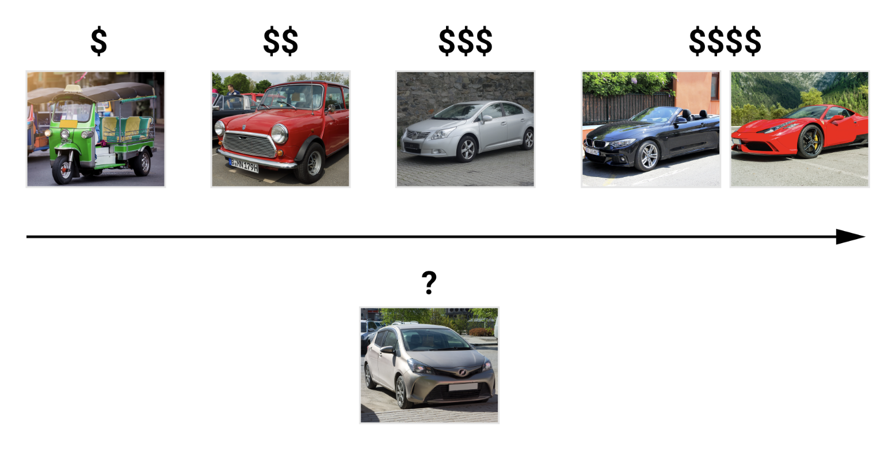
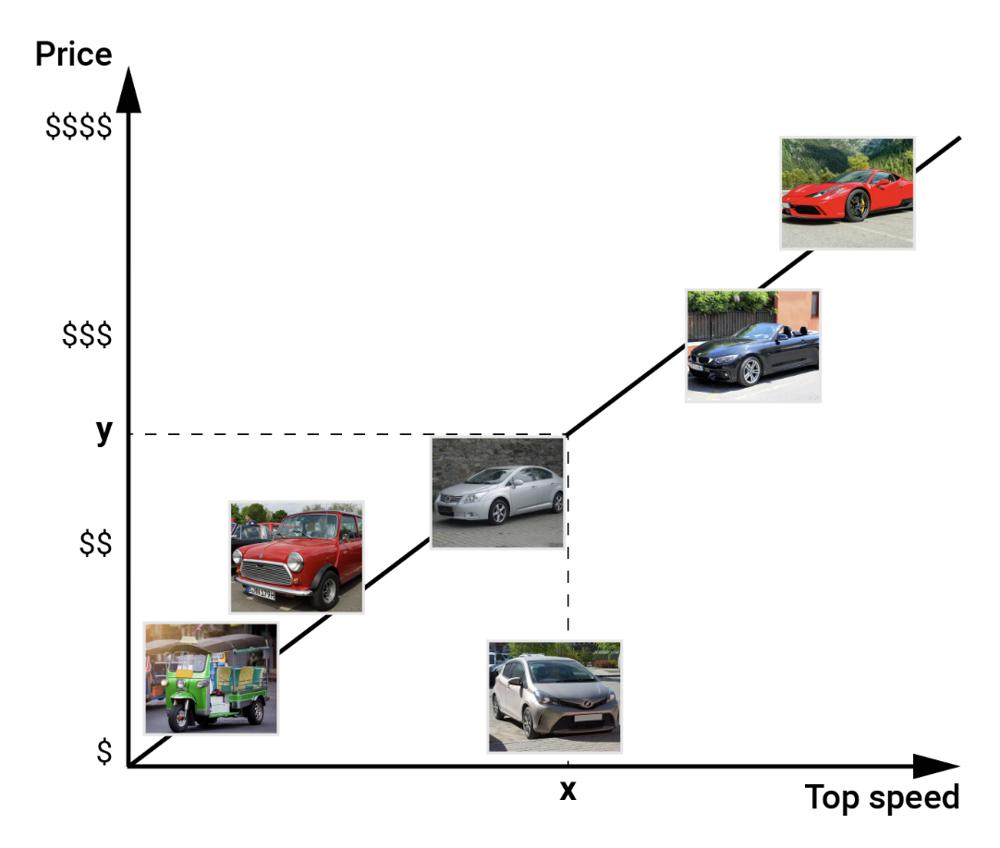
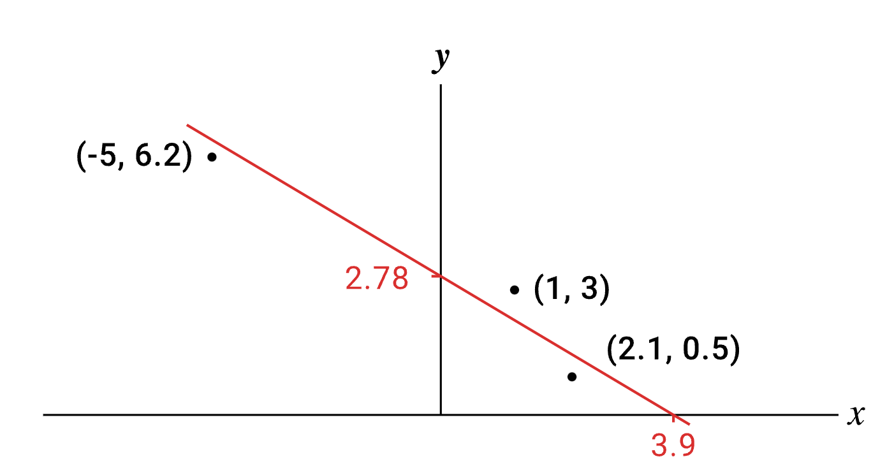

[[Module 5_ Topic 3 – Regression _ MonashELMS1.pdf]]
#### Regression

In regression, our task is to predict a continuous value. For example, the price of a car.

To do this, we might use a feature like top speed.

Or we might want to 'try' to predict stock prices from other continuous attributes like company profit, debt, and cash flow.

- Example 𝑦𝑗 is stock price, 𝑥𝑗 contains company profit, debt, cash flow, . . .
- Given a training set (𝑥1,𝑦1),...,(𝑥𝑁,𝑦𝑁)
- We assume 𝑥𝑗∈ℝ𝑚,𝑦𝑗∈ℝ

From here on, we'll assume our data is continuous.

### 1.2. Univariate linear regression

#### Univariate linear regression

Given a training set of N continuous valued pairs: (𝑥1,𝑦1),...,(𝑥𝑁,𝑦𝑁), we would like to learn a linear function with two coefficients to predict y from x. 

We want to learn the parameters w0 and w1 such that:  

ℎ𝑥(𝑥)=𝑤1𝑥+𝑤0

  

The loss function for our model is the sum over all N data points of the square of the difference between our predicted value for y and the true value of y.

**Loss:** Square of the difference between the true 𝑦𝑗 and predicted target value (𝑤1𝑥𝑗+𝑤0) for 𝑥𝑗:

𝐿𝑜𝑠𝑠(ℎ𝑤)=∑𝑗=1𝑁(𝑦𝑗−ℎ𝑤(𝑥𝑗))2=∑𝑗=1𝑁(𝑦𝑗−(𝑤1𝑥𝑗+𝑤0))2

So, for linear regression for a model ℎ𝑤ℎ𝑤 trained on a data set:

𝐷={(𝐱1,𝑦1),…,(𝐱𝑁,𝑦𝑁)},𝐱𝑗∈ℝ𝑚,𝑦𝑗∈ℝ

the loss function is:

𝐿𝑜𝑠𝑠(ℎ𝑤)=∑𝑗=1𝑁(𝑦𝑗−ℎ𝑤(𝑥𝑗))2

This loss function is called the **sum of squares error (SSE)** or **residual sum of squares (RSS)**, and can also be applied as a loss function to other regression algorithms. 

##### Assessment tip: Other loss functions for regression

We may also use other loss functions for regression. Two loss functions that you will encounter in Assessment 3 are the **mean absolute error (MAE)**:

𝑀𝐴𝐸(ℎ𝑤)=1𝑁∑𝑗=1𝑁∣∣𝑦𝑗−ℎ𝑤(𝐱𝑗)∣∣𝑀𝐴𝐸(ℎ𝑤)=1𝑁∑𝑗=1𝑁|𝑦𝑗−ℎ𝑤(𝑥𝑗)|  

and **root mean squared error (RMSE)**:

𝑅𝑀𝑆𝐸(ℎ𝑤)=1𝑁∑𝑗=1𝑁(𝑦𝑗−ℎ𝑤(𝐱𝑗))2‾‾‾‾‾‾‾‾‾‾‾‾‾‾‾‾‾‾‾‾√

#### Learning the parameters

To learn the parameters, we would like to find the coefficients 𝑤∗=(𝑤∗0,𝑤∗1)𝑤∗=(𝑤0∗,𝑤1∗) that minimise the loss function 𝐿𝑜𝑠𝑠(ℎ𝑤)𝐿𝑜𝑠𝑠(ℎ𝑤) on the training data.

We can do this by finding the derivative of the loss function and setting it to 0.   

- 𝐿𝑜𝑠𝑠(ℎ𝑤)𝐿𝑜𝑠𝑠(ℎ𝑤) is a convex function, so 𝑤∗𝑤∗ is unique
- Find 𝑤∗𝑤∗ by setting the derivative to 0.

∂∂𝑤𝑖𝐿𝑜𝑠𝑠(ℎ𝑤)=0∂∂𝑤𝑖𝐿𝑜𝑠𝑠(ℎ𝑤)=0

Then we solve the values for 𝑤𝑤 with an **iterative algorithm** like gradient descent, though our simple linear function ℎ𝑤=𝑤1𝑥+𝑤0ℎ𝑤=𝑤1𝑥+𝑤0 has an analytic solution with the given formulas we can use directly to find the values for 𝑤0𝑤0 and 𝑤1𝑤1.  

𝑤0=∑𝑦𝑗−𝑤1∑𝑥𝑗𝑁𝑤0=∑𝑦𝑗−𝑤1∑𝑥𝑗𝑁

  

𝑤1=𝑁∑𝑥𝑗𝑦𝑗−∑𝑥𝑗∑𝑦𝑗𝑁∑𝑥2𝑗−(∑𝑥𝑗)2

#### Example

Computing the analytic solution in practice requires the computation of a slow matrix inverse unless the data size is small. When data size is large, **gradient descent** is preferred.

This example uses analytic formulas. With the 3 data points given, we compute the values shown for 𝑤1𝑤1 and 𝑤0𝑤0.

- Training data: (1,3),(2.1,0.5),(−5,6.2)(1,3),(2.1,0.5),(−5,6.2)
- Linear regression model: ℎ𝑤=𝑤1𝑥+𝑤0ℎ𝑤=𝑤1𝑥+𝑤0

##### For 𝑤1𝑤1

𝑤1=3(1×3+2.1×0.5+(−5)×6.2)−(1+2.1−5)(3+0.5+6.2)3(12+2.12+(−5)2)−(1+2.1−5)2=−0.712𝑤1=3(1×3+2.1×0.5+(−5)×6.2)−(1+2.1−5)(3+0.5+6.2)3(12+2.12+(−5)2)−(1+2.1−5)2=−0.712

##### For 𝑤0𝑤0

𝑤0=(3+0.5+6.2)−𝑤1(1+2.1−5)3=2.78𝑤0=(3+0.5+6.2)−𝑤1(1+2.1−5)3=2.78  

---

We can also plot the 3 data points and the solution we found and see how it fits the data.

- Training data: (1,3),(2.1,0.5),(−5,6.2)(1,3),(2.1,0.5),(−5,6.2)
- Linear regression model: ℎ𝑤=−0.712𝑥+2.78

### 1.3. Gradient descent

#### Gradient descent

The fundamental idea of the **gradient descent algorithm** is that we iteratively move towards a function minimum by using the gradient to tell us the direction of the steepest descent and take small steps in that direction. 

The algorithm picks an initial value of the coefficients 𝑤0𝑤0 and iteratively moves each coefficient towards the minimum by following the negative direction of the gradient until the values **converge**. 

- 𝐰0𝑤0 ← any point in the parameter space; 𝑡=1𝑡=1
- Until convergence (||𝐰𝑡−𝑚𝑎𝑡ℎ𝑏𝑓𝑤𝑡−1||<ϵ)(||𝑤𝑡−𝑚𝑎𝑡ℎ𝑏𝑓𝑤𝑡−1||<ϵ)

- For each 𝑤𝑖𝑤𝑖 in 𝐰:𝑤𝑡𝑖←𝑤𝑡−1𝑖−𝛼∂∂𝑤𝑖𝐿𝑜𝑠𝑠(ℎ𝑤)=0𝑤:𝑤𝑖𝑡←𝑤𝑖𝑡−1−𝛼∂∂𝑤𝑖𝐿𝑜𝑠𝑠(ℎ𝑤)=0

In the algorithm given, 𝛼𝛼 represents a learning rate constant that adjusts how much the algorithm updates the coefficients at each step.

#### Gradient descent: Univariate linear regression

In **univariate linear regression,** we have the following identities for the gradients concerning 𝑤0𝑤0 and 𝑤1𝑤1.

∂∂𝑤0𝐿𝑜𝑠𝑠(ℎ𝑤)=−2(𝑦−ℎ𝑤(𝑥))∂∂𝑤1𝐿𝑜𝑠𝑠(ℎ𝑤)=−2(𝑦−ℎ𝑤(𝑥))𝑥∂∂𝑤0𝐿𝑜𝑠𝑠(ℎ𝑤)=−2(𝑦−ℎ𝑤(𝑥))∂∂𝑤1𝐿𝑜𝑠𝑠(ℎ𝑤)=−2(𝑦−ℎ𝑤(𝑥))𝑥

We have the corresponding update rules for one training example (𝑥𝑖,𝑥𝑗)(𝑥𝑖,𝑥𝑗)

𝑤𝑡0⟵𝑤𝑡−10+𝛼(𝑦𝑗−ℎ𝑤(𝑥𝑗))𝑤𝑡1⟵𝑤𝑡−11+𝛼(𝑦𝑗−ℎ𝑤(𝑥𝑗))𝑥𝑗𝑤0𝑡⟵𝑤0𝑡−1+𝛼(𝑦𝑗−ℎ𝑤(𝑥𝑗))𝑤1𝑡⟵𝑤1𝑡−1+𝛼(𝑦𝑗−ℎ𝑤(𝑥𝑗))𝑥𝑗

We also have a data set with N examples.

𝑤𝑡0⟵𝑤𝑡−10+α∑𝑗=1𝑁(𝑦𝑗−ℎ𝑤(𝑥𝑗))𝑤𝑡1⟵𝑤𝑡−11+α∑𝑗=1𝑁(𝑦𝑗−ℎ𝑤(𝑥𝑗))𝑥𝑗𝑤0𝑡⟵𝑤0𝑡−1+α∑𝑗=1𝑁(𝑦𝑗−ℎ𝑤(𝑥𝑗))𝑤1𝑡⟵𝑤1𝑡−1+α∑𝑗=1𝑁(𝑦𝑗−ℎ𝑤(𝑥𝑗))𝑥𝑗

Note that the 2 from the derivative is combined with the learning rate alpha as a single constant.

#### Gradient descent: Multivariable linear regression

Univariate linear regression is unlikely to be the case in a real-world example. It is far more likely that we’ll have many features we want to predict from and need to perform **multivariate linear regression**.

We need a new coefficient for each new 𝑥𝑥 feature we add.

ℎ𝑤(𝑥𝑗)=𝑤0+𝑤1𝑥𝑗,1+...+𝑤𝑚𝑥𝑗,𝑚=𝑤0+∑𝑖=1𝑚𝑤𝑖𝑥𝑗,𝑖ℎ𝑤(𝑥𝑗)=𝑤0+𝑤1𝑥𝑗,1+...+𝑤𝑚𝑥𝑗,𝑚=𝑤0+∑𝑖=1𝑚𝑤𝑖𝑥𝑗,𝑖

If we define a value for 𝑥0=1𝑥0=1 for all data points, however, then we can write the linear function succinctly as a dot prediction between our feature vector 𝑥𝑥 and the coefficient vector 𝑤𝑤.

- Set 𝑥𝑗,0=1𝑥𝑗,0=1 for all samples
- ℎ𝑤(𝑥𝑗)=𝑤⋅𝑥=∑𝑖=0𝑚𝑤𝑖𝑥𝑗,𝑖ℎ𝑤(𝑥𝑗)=𝑤⋅𝑥=∑𝑖=0𝑚𝑤𝑖𝑥𝑗,𝑖

The gradient descent update rules are also unchanged by adding more features.

- Updates for one training example (𝑥𝑖,𝑥𝑗)(𝑥𝑖,𝑥𝑗)

𝑤𝑡𝑖⟵𝑤𝑡−1𝑖+α(𝑦𝑗−ℎ𝑤(𝑥𝑗))𝑥𝑗,𝑖𝑤𝑖𝑡⟵𝑤𝑖𝑡−1+α(𝑦𝑗−ℎ𝑤(𝑥𝑗))𝑥𝑗,𝑖

- Updates for N training examples

𝑤𝑡𝑖⟵𝑤𝑡−1𝑖+α∑𝑗=1𝑁(𝑦𝑗−ℎ𝑤(𝑥𝑗))𝑥𝑗,𝑖