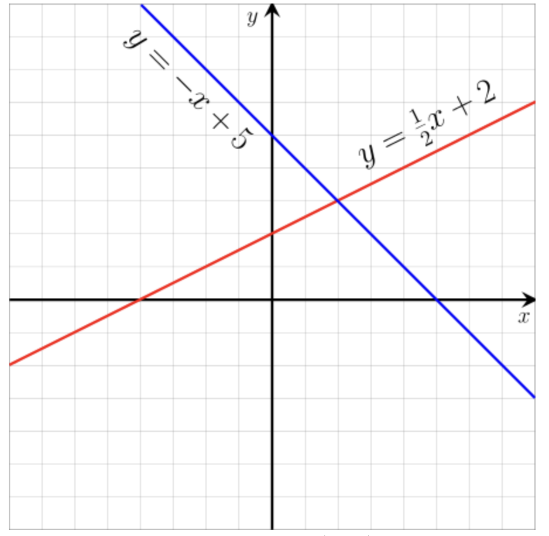

## 1.1. Introduction to linear systems

If you need to solve problems mathematically, you have to convert them to mathematical equations. This process is called mathematical modelling.

In equations, you will find various types of elements, they can be constants, scalars, symbols, variables, etc. For example, we may write an equation like 𝑎𝑥+𝑏𝑦=𝑐, where 𝑎, 𝑏 and 𝑐 are some amounts (say quantities of some items) and 𝑥 and 𝑦 are variables (say item type).

That is an example of a **linear equation** with two unknowns 𝑥 and 𝑦.

Another example, suppose we have three unknown variables 𝑥, 𝑦, 𝑧 with the following relationship: $𝑎𝑥^2+𝑏𝑦𝑧=𝑐$. We cannot call this a linear equation because it contains the term which is 𝑥 raised to power two, and it also contains the product of terms 𝑦 and 𝑧.

### What is a linear equation?

An equation is called **linear** if each of the variables involved is of power one or power zero, not any higher or lower power, and does not have any terms made up of products of two variables. Further, the variables should not be raised to become the power of some base such as $𝑒^𝑥$, which represents the exponential function.

A linear equation must contain at least one variable and have linear power, i.e., power one or zero. At least one of the variables must be of power one.

Linear equations with two variables on X-Y plane (2010) <https://tinyurl.com/n7t237yj>

There are linear equations with many unknowns. As an example, analyse the following equation:

$$𝑎1𝑥1+𝑎2𝑥2+....+𝑎𝑛𝑥𝑛=𝑏$$

Here we find the sum of 𝑎1𝑥1 and 𝑎2𝑥2 up to 𝑎𝑛𝑥𝑛, which is called a **linear combination** of the variables. The constant value 𝑏 on the right-hand side of the equation is the **constraint** on that equation. If 𝑏 is zero, we call that equation **homogeneous**.

Therefore, in mathematical modelling:

1. we need first to identify the necessary symbols, variables, constants, constraints, etc.
2. afterwards, identify the relationships between them
3. then construct equations for these relationships
4. finally, solve them.

# Solving Linear systems
Linear systems can be solved using several methods. Here are some of the most common ones:

1. **Graphical Method**:
   - Plot each equation on a graph.
   - The point(s) where the lines intersect are the solution(s).

2. **Substitution Method**:
   - Solve one equation for one variable in terms of the other variable.
   - Substitute this expression into the other equation.
   - Solve the resulting equation for the remaining variable.
   - Substitute back to find the other variable.

3. **Elimination Method** (or Addition Method):
   - Manipulate the equations to eliminate one variable by adding or subtracting the equations.
   - Solve for the remaining variable.
   - Substitute back to find the other variable.

4. **Matrix Method** ([[Gaussian elimination]]):
   - Write the system of equations as an augmented matrix.
   - Use row operations to transform the matrix into row-echelon form.
   - Back-substitute to find the solution.

5. **Matrix Inversion**:
   - If the system can be written as \( AX = B \), where \( A \) is a matrix of coefficients, \( X \) is the column matrix of variables, and \( B \) is the column matrix of constants.
   - Find the inverse of \( A \), denoted as \( A^{-1} \).
   - Multiply both sides by \( A^{-1} \) to get \( X = A^{-1}B \).

6. **Cramer's Rule**:
   - Applicable if the system has the same number of equations as unknowns and the determinant of the coefficient matrix is non-zero.
   - The solution is found using determinants of matrices.
