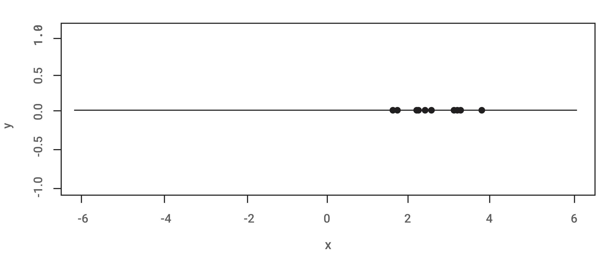
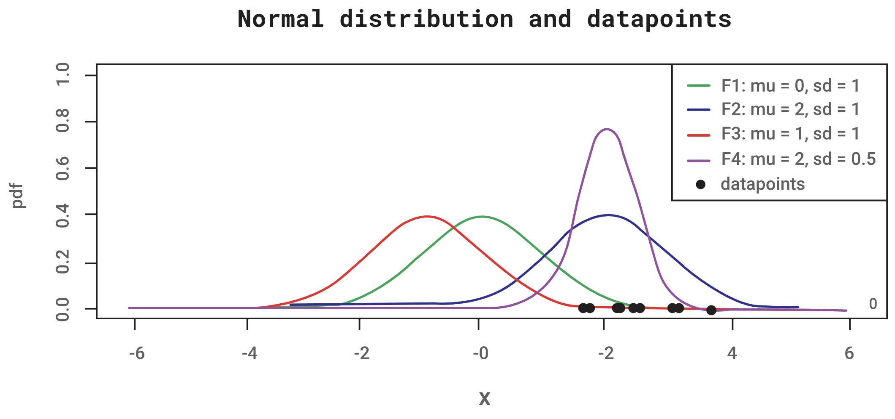

**Maximum likelihood estimation** is a method that determines values for the parameters of a model. The principle of maximum likelihood states that the best fitting model to the data observed is the model that assigns the maximum probability to that data. The parameter values are found to maximise the likelihood that the process described by the model produced the observed data.

Maximum likelihood finds the distribution that assigns the maximum probability to our observed data by searching over all the possible values of θ and finding the one that maximises the likelihood function. Let $𝑋1,...,𝑋𝑛$ be a random sample from a distribution $𝐹_θ$  that is specified up to a vector of unknown parameters θ. The maximum likelihood method can then be used to estimate these unknown parameters. The estimates obtained are called **point estimates** because they specify a single quantity as an estimate of θ.

Any statistic used to estimate the value of an unknown parameter θ is called an **estimator of θ**. The **observed value of the estimator is called the estimate**. For instance, as we shall see, the usual estimator of the mean of a normal population, based on a sample $𝑋1,...,𝑋𝑛$ from that population, is the sample mean $𝑋=∑𝑖(𝑋𝑖/𝑛)$. If a sample of size 3 yields the data $𝑋_1=2, 𝑋_2=3, 𝑋_3=4$, then the estimate of the population mean, resulting from the estimator 𝑋 is the value 3.

## Example
Suppose we have drawn a sample with 10 data points from some process. We need to determine from which process or model these data points came. The following figure illustrates the sample data.

It is known that the data points were observed from the Gaussian distribution. But we do not know the model exactly. Recall that the Gaussian distribution has two parameters. The mean, μ, and the standard deviation, σ. Different values of these parameters result in different curves. We want to know which curve is most likely responsible for creating the data points we observed. Can you take a guess?

Maximum likelihood estimation is a method that will find the values of μ and σ that result in the curve that best fits the data. Because the data points above were created hypothetically, it can be stated that the true distribution from which the data were generated was $𝐹2 𝑁(2,1)$, which is the blue curve in the figure above.