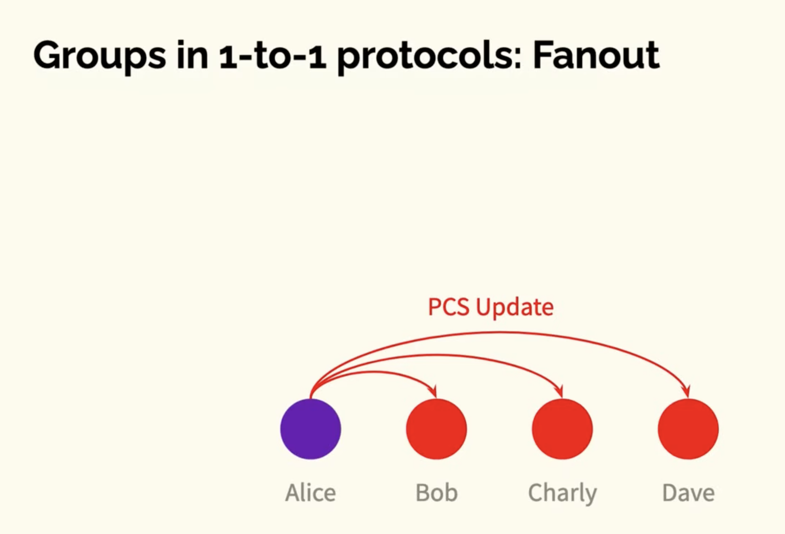
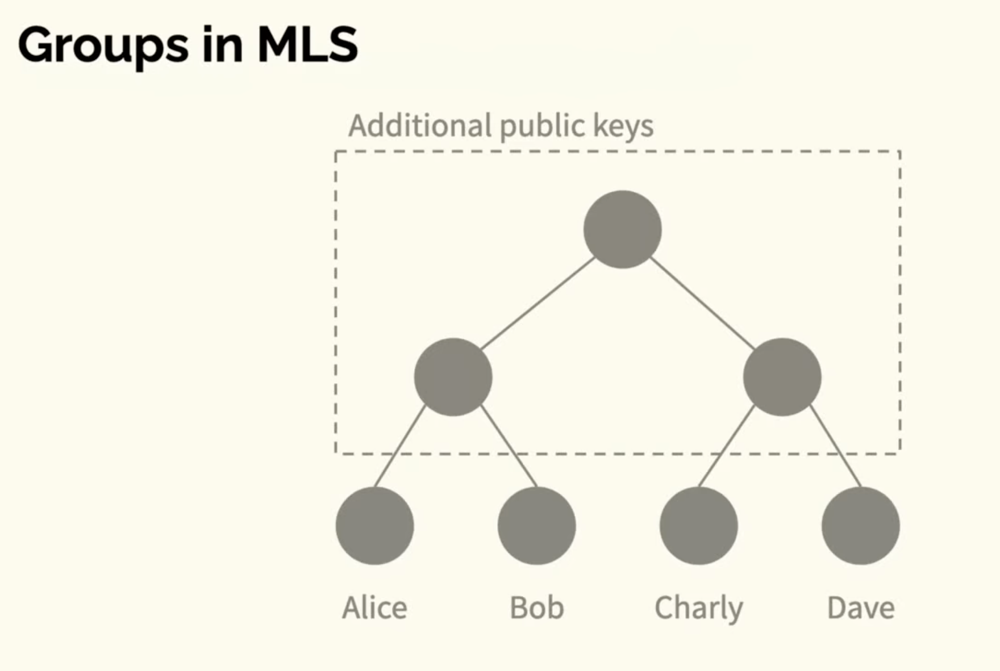
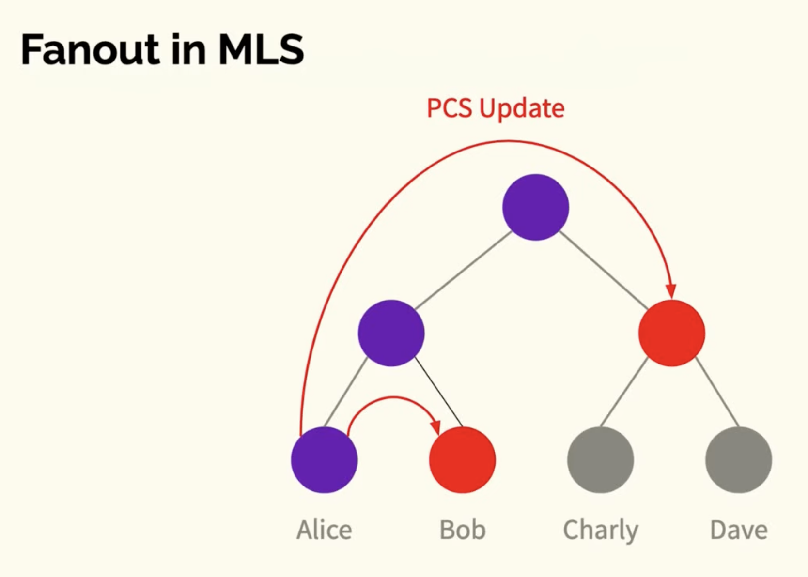
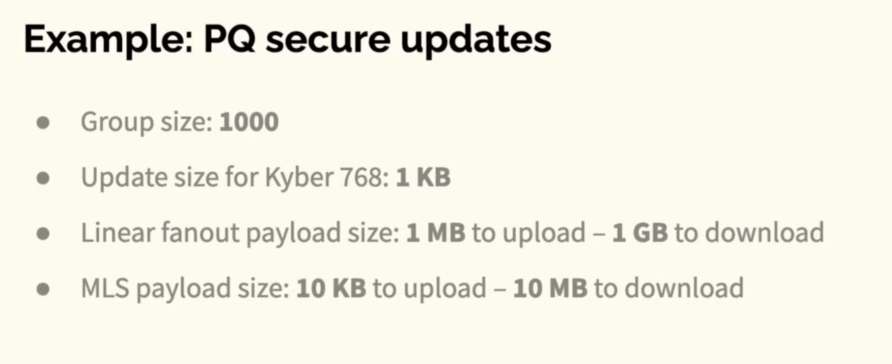

Comes after [[Signal protocol]] introducing cryptographic guarantees on a few new properties:
- agreement on group state
- informal: [[Transcript consistency]][^1]
Other properties:
- extensibility
As well as what are now standard expectations:
- confidentiality
- authenticity
- [[Forward secrecy]]
- [[Post-compromise security]][^1]

## How is MLS designed?
- Initial idea: Asynchronous Ratcheting Trees
- Designed with IETF
- Similar process to TLS 1.3, involving academia

### Architecture
Besides the client, MLS requires two additional services:
- authentication service - for credentials
- delivery service - for message ordering
These are 'abstract' services; 'parts of the service could be run on the client'. Message ordering could be a distributed algorithm (like [[Conflict-Free Replicated Data Types]]?)

Each participant at the leaf nodes has shared keys with all nodes in the path up to the root

Quantum example of benefits of log updates

Operations:
- add
- remove
- update
- send application messages

Application messages are encrypted using the key at the root

**[[Continuous Group Key Agreement]]**
Papers:
[[Continuous Group Key Agreement with Active Security]]
[[A More Complete Analysis of the Signal Double Ratchet Algorithm]]
[[How to Hide MetaData in MLS-Like Secure Group Messaging - Simple, Modular, and Post-Quantum]]
[[On the Insider Security of MLS]]
[[DeCAF - Decentralizable CGKA with Fast Healing]]
[[Key Agreement for Decentralized Secure Group Messaging with Strong Security Guarantees]]
[[A Concrete Treatment of Efficient Continuous Group Key Agreement via Multi-Recipient PKEs]]
[[Server-Aided Continuous Group Key Agreement]]

[^1]: https://www.youtube.com/watch?v=FTPRjVLi8k4
