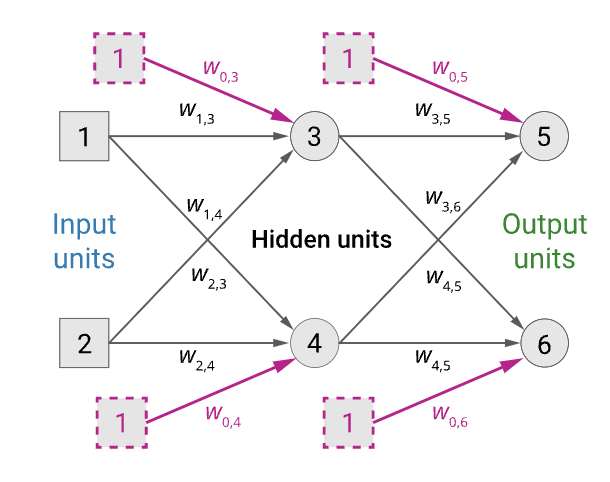
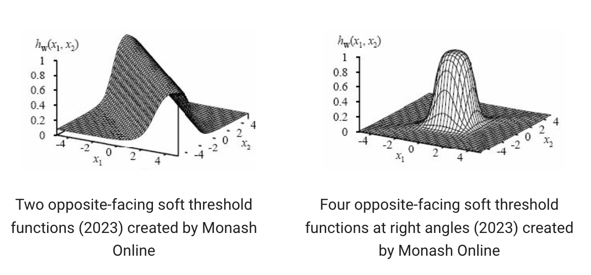

A network with one or more hidden layers of neurons ([[Perceptron|perceptrons]]).
Each hidden layer accepts inputs only from the layer immediately preceding it and passes outputs only to the layer immediately succeeding it. 

We don't use the step function in Multilayer FFNNs, and instead use a differentiable function with a smooth output like the sigmoid for the activation function. 

The output units are a function of the hidden units which in turn are a function of the input units:

- Given an input vector $\mathbf{x} = (x_1, x_2)$
- The activations of the input units are set to $(a_1, a_2) = (x_1, x_2)$
- The output of unit 5 is $a_5 = g(w_{0,5} + w_{3, 5}a_3 + w_{4,5}a_4)$
- Where $a_3 = g(w_{0,3} + w_{1, 3}a_1 + w_{2,3}a_2)$
- and $a_4 = g(w_{0,4} + w_{1, 4}a_1 + w_{2,4}a_2)$

## Expressiveness of Multilayer FFNNs

Using sigmoid instead of step means Multilayer FFNNs can be used to create arbitrarily complex functions.

## Loss function
The loss function for our networks is the square of the difference between the predicted value at each of the output nodes and the true value expected at the node.

We want to minimise the loss function so our learning task is to find the set of weights for which the loss is minimised. We use the [[gradient descent]] algorithm to find those weights. The gradient of the loss function concerning a specific weight within the network tells us the direction we should update that weight.

$$\frac{\delta}{\delta \mathbf{w}}Loss(\mathbf{w}) = \frac{\delta}{\delta \mathbf{w}}\sum_{k=1}^m(y_k -a_k)^2 = \sum_{k=1}^m\frac{\delta}{\delta \mathbf{w}}(y_k -a_k)^2 $$

*if y is the expected output, a is the predicted output - so the [[Derivatives and Differentiation|derivative]] of the square of that difference is the gradient (rate of change) of the weights vector for that perceptron. The derivative of the sum is equal to the sum of derivatives - see the [[Rules of Differentiation|Sum Rule]]*

To actually compute the gradient we use [[backpropagation]]