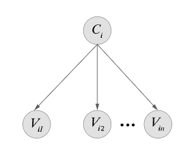

The Naïve Bayes classifier is based on the [[Bayes Theorem]] rule. You’ll likely recognise the following diagram as a simple Bayesian network where 𝐶 is a common cause of each $𝑣_𝑗$. 𝐶 represents the class label we are trying to learn to predict, and each $𝑣_{𝑖𝑗}$ represents attribute values for an item 𝑖.

We can use Bayes rule to calculate the probability of a class given an assignment of each attribute.

$$Pr(C_i = c|v_{i1}, ... v_{in}) = \frac{Pr(v_{i1}, ... v_{in}|C_i = c)}{Pr(v_{i1}, ... v_{in})}$$

The key assumption in Naive Bayes is that each attribute is conditionally independent for each class.

$$Pr(C_i = c|v_{i1}, ... v_{in}) = \alpha \prod_{k=1}^n Pr(v_{ik}|C_i=c)Pr(C_i=c)$$

$\alpha$ denotes $\frac{1}{Pr(v_{i1},...,v_{in})}$ which is the same for each possible class 𝑐

#### The parameters

The parameters that need to be learned for a Naïve Bayes model are the probability of each class: 𝑃𝑟(𝐶𝑖) and the probability of each attribute value given a class label: 𝑃𝑟(𝑉𝑖|𝐶𝑖). 

So how do we **learn the parameters**, and once we know the parameters, how can we use them to **predict the class** of new data?

#### Predicting the class

Given a new vector of values for each attribute 𝑥𝑖, predicting the class requires that we compute the probability of each class given the attributes have the values in $𝑥_𝑖$. The class label that is outputted is the one with the highest probability.

- The predicted class for a new $x_i = (v_{i1}, ..., v_{in})$ is
$$c^* = \arg \max_c Pr(c|v_{i1},...,v_{in})$$
$$= \arg \max_c \prod_{k=1}^n Pr(v_{ik}|c)Pr(c)$$

#### Learning the parameters

To learn the parameters and estimate the CPTs 𝑃𝑟(𝑐) and 𝑃𝑟(𝑣|𝑐), we could use **elicitation** and ask a domain expert who may have sophisticated ways of eliciting probabilities.

We’re interested in machine learning, however, so we will empirically use training data to estimate the probability of each class 𝑐 and the probability of each attribute value $𝑣_𝑖$ from all instances in a class.

### Maximum Likelihood Estimator (MLE)

#### Estimating parameters empirically

We can use the Maximum Likelihood Estimator (MLE) to learn parameters from data. Given a set of samples, the maximum likelihood estimator for a distribution can be calculated by finding the count of a variable assignment and dividing it by the number of samples.

$$Pr_{MLE}(var = w_a) = \frac{count(var = w_a)}{\text{\# of samples}}$$
$$= \frac{|var = w_a|}{\sum_{i=1}^m|var = w|}$$

##### Example

We have four samples from a joint distribution of two random variables, one which is either H or T and the other which is either green, yellow or red.

We have one occurrence out of 4 for H, so the MLE for H is ¼.

$$Pr_{MLE}(H) = \frac14, Pr_{MLE}(T) = \frac34$$

For Pr(Green|T), however, there are a total of 3 samples that are T and 2 of which are green, given an MLE of ⅔

$$Pr_{MLE}(green|T) = \frac23, Pr_{MLE}(yellow|T) = \frac13, Pr_{MLE}(red|T) = 0$$

#### Example

Here is a familiar data set where we predict whether we should play ball, given certain weather conditions.

|Day|Outlook|Temperature|Humidity|Wind|Play ball|
|---|---|---|---|---|---|
|D1|Sunny|Hot|High|Weak|No|
|D2|Sunny|Hot|High|Strong|No|
|D3|Overcast|Hot|High|Weak|Yes|
|D4|Rain|Mild|High|Weak|Yes|
|D5|Rain|Cool|Normal|Weak|Yes|
|D6|Rain|Cool|Normal|Strong|No|
|D7|Overcast|Cool|Normal|Strong|Yes|
|D8|Sunny|Mild|High|Weak|No|
|D9|Sunny|Cool|Normal|Weak|Yes|
|D10|Rain|Mild|Normal|Weak|Yes|
|D11|Sunny|Mild|Normal|Strong|Yes|
|D12|Overcast|Mild|High|Strong|Yes|
|D13|Overcast|Hot|Normal|Weak|Yes|
|D14|Rain|Mild|High|Strong|No|

Play-ball data (2023) courtesy of Ethan Wills

We apply the formula for computing the probability of 'Yes' given the conditions of; sunny, hot, high humidity and weak wind.

$$Pr(Yes|\text{sunny}, \text{hot}, \text{high humidity}, \text{weak wind})$$
We arrive at the given result using the MLE to find each parameter and multiply them together per the classification rule. 

Probability of 'Yes':

$$Pr(C=Yes|v_1 = \text{sunny}, v_2 = \text{hot}, v_3 = \text{high humidity}, v_4 = \text{weak wind})$$
$$= \alpha \times Pr(v_1 = \text{sunny}|C = Yes) \times Pr(v_2 = \text{hot}|C = Yes) \times Pr(v_3 = \text{high humidity}|C = Yes) \times Pr(v_4 = \text{weak wind}|C = Yes)$$
$$= \alpha \times \frac{2}{9} \times \frac{2}{9} \times \frac{3}{9} \times \frac{6}{9} \times \frac{9}{14} = \alpha \times 0.007$$

Probability of 'No':

$$Pr(C=No|v_1 = \text{sunny}, v_2 = \text{hot}, v_3 = \text{high humidity}, v_4 = \text{weak wind})$$$$= \alpha \times \frac{3}{5} \times \frac{2}{5} \times \frac{4}{5} \times \frac{2}{5} \times \frac{5}{14} = \alpha \times 0.027$$

We can see the probability of 'No' is higher, so we assign that as the prediction. 

**Note that the constant 𝛼 here denotes that we need to divide by the constant for the probability of a day being sunny, hot, with high humidity and weak wind to** get an actual probability distribution. However, this value is not important to our classification and is assigned to a constant.

### Expected Likelihood Estimation (ELE)

#### The Sparse Data Problem – Smoothing

Sometimes a particular value of an attribute does not appear for a certain class, which leads to an MLE of 0, or even does not appear in the data set at all, which makes the MLE undefined.

$$Pr_{MLE}(red | T) = 0$$
Not all instances are found in the data set or in a particular class

- If $𝑣_𝑎$ is not found in class 𝑐,|𝑣𝑎|=0,Pr𝑀𝐿𝐸(𝑣𝑎|𝑐)=0
- If $𝑣_𝑎$ is in the training set, $Pr_{𝑀𝐿𝐸}(𝑣_𝑎)$ is undefined (denominator=zero)

A solution is to use the **Expected Likelihood Estimator (ELE)**. The ELE estimator adds a small constant epsilon to the count of each $𝑣_𝑖$  and can be used to compute the naive Bayes parameters. If a variable is not found in the dataset, ELE is 1/m

$$Pr_{ELE}(var = v_a) \cong \frac{|v_a|+ \epsilon}{\sum_{i=1}^m(|v_i| + \epsilon)} = \frac{|v_a|+ \epsilon}{(\sum_{i=1}^m|v_i|) + \epsilon}$$

We use smoothing when estimating parameters Pr⁡(𝐶𝑖) and Pr(𝑣𝑖|𝐶𝑖)

#### Example

Let’s see how the ELE computation compares to the MLE computation for the example from earlier when we use epsilon equals 1.

Compare the MLE computation...

$$Pr_{MLE}(c=H) \cong \frac{|H|}{\sum_2^2|C_i|} = \frac{1}{1+3} = \frac{1}{4}$$
$$Pr_{MLE}(C) = \left < H = \frac14, T = \frac34 \right >$$

... with the ELE computation:

$$Pr_{ELE}(c = H) \cong \frac{|H| + \epsilon}{\sum_1^2(|C_i| + \epsilon)} = \frac{|H| + \epsilon}{\sum_1^2|C_i| + 2\epsilon}$$
$$= \frac{1 + \epsilon}{(1 + 3) + 2\epsilon} = \frac{1 + \epsilon}{4 + 2 \epsilon}$$
$$Pr_{ELE} (C) = \left < H = \frac13, T = \frac23 \right >, \text{if } \epsilon = 1$$

We can see where epsilon is added to the numerator and the denominator in the ELE. Epsilon will be added once to the numerator but added to the denominator once for every value the variable can take. In this case, twice, once for H and once for T.

#### Enhancements to Naïve Bayes

The Naïve Bayes classifier we’ve seen so far can be enhanced to handle **continuous-valued attributes**. It can also be enhanced to handle **missing values**.

For **missing Categorical attributes**, and missing values, we could: 

- ignore the missing values altogether 
- add a new value (?) for missing values
- use the most common value, the mode
- randomly selected according to the distribution.

To handle **missing Continuous values,** use the mean of the attribute.