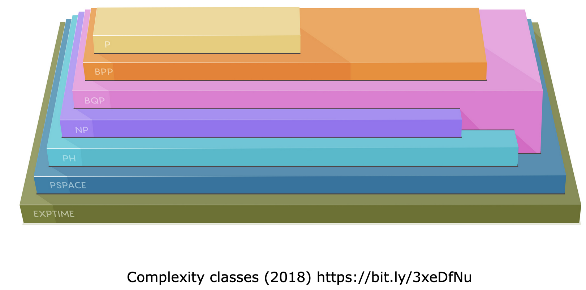

When working with computer systems, different problems take different amounts of resources in order to be resolved. Depending on the resources required, problems are often categorised into various complexity classes. The two most common metrics for evaluating computational complexity are time and memory. While the distinction among the complexity classes is hard to ascertain, scientists generally agree on the degree of complexity associated with each class.

In this lesson, we will briefly outline some of the complexity classes and the impact of the problems within that classification. In later lessons within this module, we will explore some of the underlying hard problems that have been used to develop various cryptographic algorithms that we use today.

# Complexity classes

The study of complexity classes is an open problem in theoretical computer science. For most of the known complexity classes, lower order classes share a subset of relationships with higher order classes. However, this is not known for all classes as some are still considered as open problems in computer science. The following are some of the most common complexity classes:

- **Polynomial Time (P):** Algorithms designed to solve problems in P must generally provide the correct answer in at most n^c time, where n defines the input length and c is some constant. Some common problems include determining if a number is prime or not, determining the shortest distance between two points, etc. An ongoing challenge for researchers is to ascertain if P = NP.
    

- **Non-Deterministic Polynomial Time (NP):** Problems classified as NP tend to have a 'short witness', which allows for the solution provided for the problem to be verifiable in P time. An example of an NP problem is the travelling salesman problem. Similar to the previous class, ascertaining if P = NP is an ongoing challenge.
    

- **Polynomial Hierarchy (PH):** Problems classified as PH are extensions of NP problems. These problems generally ask almost similar questions, however, they add a few additional layers of complexity. An example of this is the clique problem, wherein a clique on a social network is when two or more people are friends with each of the other people. A PH problem could aim to address if a clique of 20 exists but not 30. Due to the nature of NP problems, researchers have not been able to prove that P = PH either.
    

- **Polynomial Space (PSPACE):** This complexity class focuses on the amount of memory required to solve a problem rather than the amount of time. It has been proved that all problems that are P, NP, and PH belong to PSPACE. But is PSPACE diferent from P?
    

- **Bounded-Error Quantum Polynomial Time (BQP):** This complexity class includes all problems that can be solved in P by a quantum computer. An example of this type of problem is identifying the prime factors of an integer. BQP encompasses PSPACE and P but not NP. Researchers believe that NP and BQP are not necessarily comparable.
    

- **Exponential Time (EXP):** This complexity class contains all the previous classes—P, NP, PH, PSPACE, and BQP. However, there are other problems that need exponential time for a classic computer to resolve that are not included in P. A common example of this type of problem is the playing of a game like chess by a computer. Irrespective of the size of the board, the time allocated to this activity would be EXP. Scientists aim to prove that not all EXP problems are in PSPACE.
    

- **Bounded-Error Probabilistic Polynomial Time (BPP):** Algorithms that are classified as BPP are required to provide a correct answer where the probability of the correctness of the answer is as close to 1, when making randomised decisions. An example of this type of problem is the polynomial identity problem. Researchers aim to determine if BPP = P.
    

Having an understanding of these complexity classes is an important concept in computer science, specifically in cryptography.