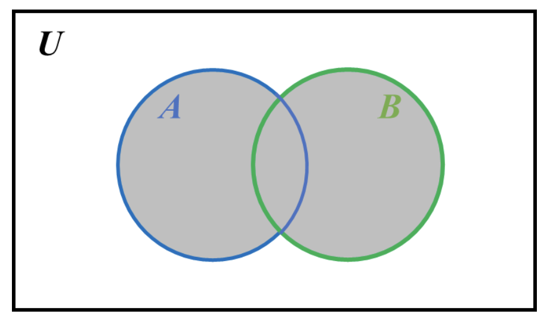
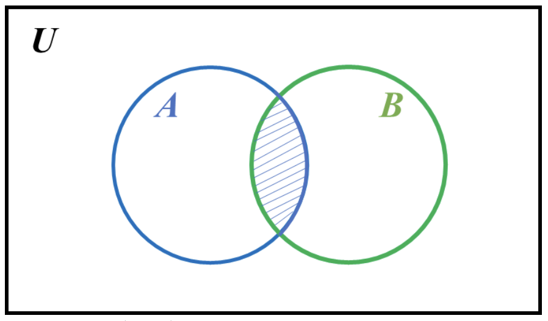
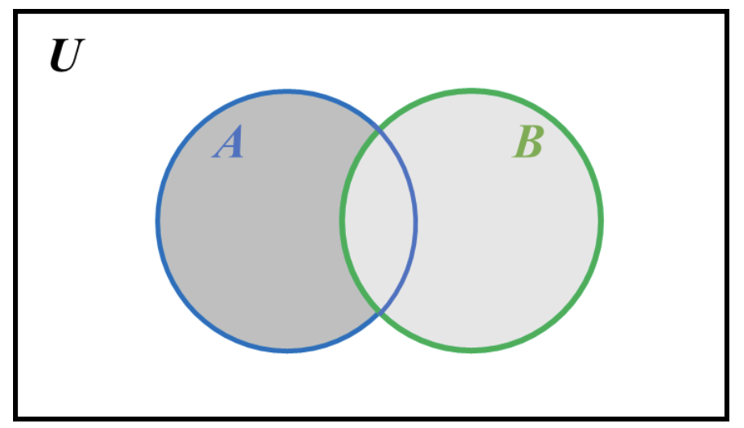
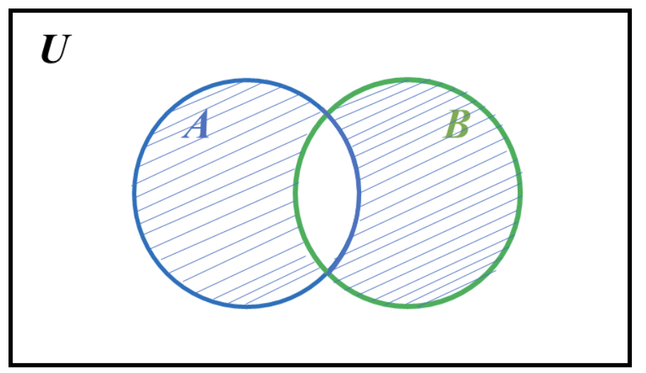
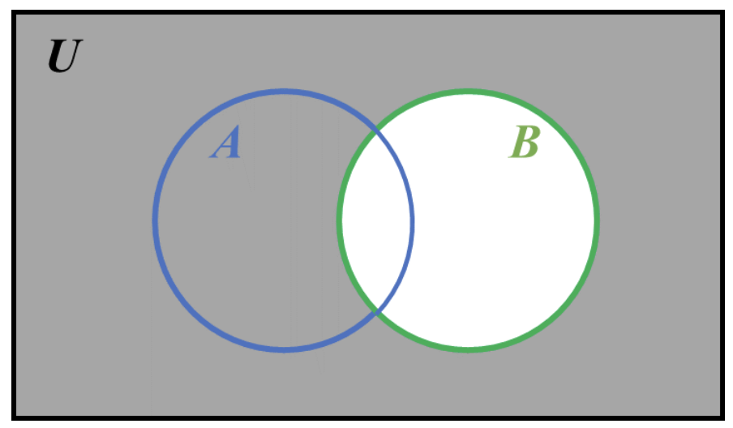

#### 2.1. Operations on sets, properties of set operations

There are five operations on sets:

1. Union of sets (∪).
2. Intersection of sets (∩).
3. Difference of sets ( – ).
4. Symmetric difference (∆).
5. Complement of sets ( c ).

---

#### Union of sets **(∪)**

**Union of sets (∪):** the set that contains all the elements present in either of the sets

E.g. If set 𝐴={𝑎,𝑏,𝑐,𝑑}𝐴={𝑎,𝑏,𝑐,𝑑} and 𝐵={𝑒,𝑓,𝑔}𝐵={𝑒,𝑓,𝑔}, then Union of sets, 𝐴∪𝐵={𝑎,𝑏,𝑐,𝑑,𝑒,𝑓,𝑔}𝐴∪𝐵={𝑎,𝑏,𝑐,𝑑,𝑒,𝑓,𝑔}

Mathematically, this could be expressed as 𝐴∪𝐵={𝑥:𝑥∈𝐴 OR 𝑥∈𝐵}𝐴∪𝐵={𝑥:𝑥∈𝐴 OR 𝑥∈𝐵}, where 𝑥𝑥 denotes the elements present in both sets.

---

#### Intersection of sets **(∩)**

**Intersection of sets (∩):** the set that contains all the elements commonly present in both sets

E.g. If set 𝐴={𝑎,𝑏,𝑐,𝑑}𝐴={𝑎,𝑏,𝑐,𝑑} and 𝐵={𝑐,𝑑,𝑒}𝐵={𝑐,𝑑,𝑒}, then the Intersection of sets, 𝐴∩𝐵={𝑐,𝑑}𝐴∩𝐵={𝑐,𝑑}

Mathematically, this could be expressed as 𝐴∩𝐵={𝑥:𝑥∈𝐴 AND 𝑥∈𝐵}𝐴∩𝐵={𝑥:𝑥∈𝐴 AND 𝑥∈𝐵}, where 𝑥𝑥 denotes the elements present in both sets.

Suppose that:

𝑛(𝐴)=cardinal number of set A𝑛(𝐴)=cardinal number of set A  
𝑛(𝐵)=cardinal number of set B𝑛(𝐵)=cardinal number of set B, and  
𝑛(𝐴∪𝐵)=cardinal number of union of set A and B𝑛(𝐴∪𝐵)=cardinal number of union of set A and B.

Then, 𝑛(𝐴∪𝐵)=𝑛(𝐴)+𝑛(𝐵)−𝑛(𝐴∩𝐵)𝑛(𝐴∪𝐵)=𝑛(𝐴)+𝑛(𝐵)−𝑛(𝐴∩𝐵)

Similarly, 𝑛(𝐴∩𝐵)=𝑛(𝐴)+𝑛(𝐵)−𝑛(𝐴∪𝐵)𝑛(𝐴∩𝐵)=𝑛(𝐴)+𝑛(𝐵)−𝑛(𝐴∪𝐵)

---

#### Difference of sets **( – )**

**Difference of sets ( – ):** The difference 𝐴−𝐵𝐴−𝐵 of two sets 𝐴𝐴 and 𝐵𝐵 consists of the elements in 𝐴𝐴 and not in 𝐵𝐵.

e.g. If set 𝐴={𝑎,𝑏,𝑐,𝑑}𝐴={𝑎,𝑏,𝑐,𝑑} and 𝐵={𝑐,𝑑,𝑒}𝐵={𝑐,𝑑,𝑒}, then the difference, 𝐴−𝐵={𝑎,𝑏}𝐴−𝐵={𝑎,𝑏}

---

#### Symmetric difference of sets **(∆)**

**Symmetric difference (∆):** The union of the difference between 2 sets interchangeable, i.e. union of (𝐴−𝐵)(𝐴−𝐵) and (𝐵−𝐴)(𝐵−𝐴). It contains all elements that belong to either of 𝐴𝐴 or 𝐵𝐵, but not both.

According to the following figure, notice that 𝐴∆𝐵=(𝐴∪𝐵)−(𝐴∩𝐵)𝐴∆𝐵=(𝐴∪𝐵)−(𝐴∩𝐵)

e.g. If set 𝐴={𝑎,𝑏,𝑐,𝑑}𝐴={𝑎,𝑏,𝑐,𝑑} and 𝐵={𝑐,𝑑,𝑒}𝐵={𝑐,𝑑,𝑒}, then the symmetric difference, 𝐴∆𝐵={𝑎,𝑏,𝑒}𝐴∆𝐵={𝑎,𝑏,𝑒}.

---

#### Compliment of sets **( c )**

**Complement of sets ( c ):** everything not in the set concerned.

The following figure shows the complement of B, i.e. B c

e.g. If set 𝐴={𝑎,𝑏,𝑐,𝑑}𝐴={𝑎,𝑏,𝑐,𝑑} and 𝐵={𝑐,𝑑,𝑒}𝐵={𝑐,𝑑,𝑒}, then the complement of 𝐵𝐵 is everything other than 𝐵={𝑐,𝑑,𝑒}𝐵={𝑐,𝑑,𝑒}.

---

#### Cartesian product of sets

If 𝐴𝐴 and 𝐵𝐵 are any two sets, the cartesian product or the cross product of 𝐴𝐴 and 𝐵𝐵 is the set that contains all the ordered pairs of the elements in 𝐴𝐴 and 𝐵𝐵.

In mathematical notation, it is described as: 𝐴×𝐵={(𝑥,𝑦):∀𝑥∈𝐴,𝑦∈𝐵}𝐴×𝐵={(𝑥,𝑦):∀𝑥∈𝐴,𝑦∈𝐵}

e.g. If 𝐴={1,2,3}𝐴={1,2,3} and 𝐵={3,4,5}𝐵={3,4,5} then,  
𝐴×𝐵={(1,3),(1,4),(1,5),(2,3),(2,4),(2,5),(3,3),(3,4),(3,5)}𝐴×𝐵={(1,3),(1,4),(1,5),(2,3),(2,4),(2,5),(3,3),(3,4),(3,5)}  
Here, 𝑛(𝐴)=3𝑛(𝐴)=3, 𝑛(𝐵)=3𝑛(𝐵)=3 and 𝑛(𝐴×𝐵)=3×3=9𝑛(𝐴×𝐵)=3×3=9.