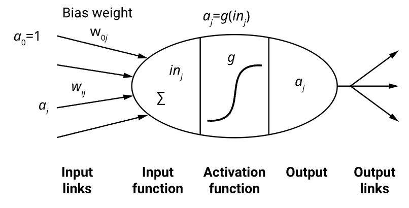
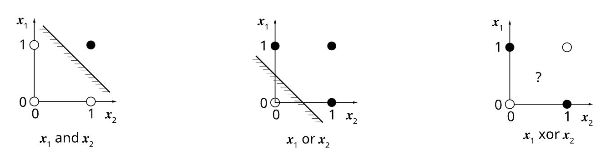
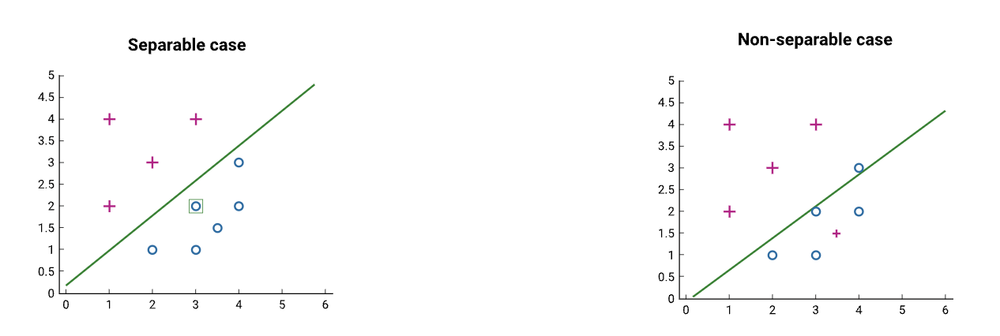
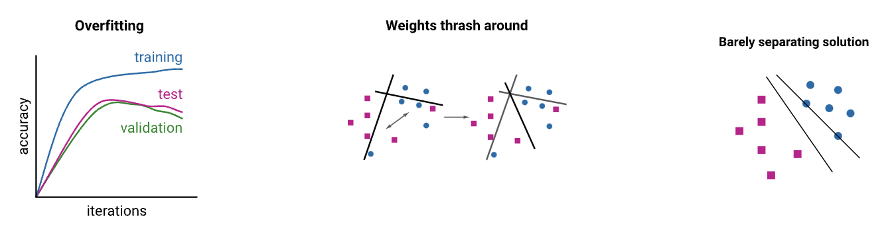

---
aliases:
  - Perceptrons
  - perceptrons
  - perceptron
---
See also [Wikipedia](https://en.wikipedia.org/wiki/Perceptron)

Biological neurons take signals from other neurons and activate or 'fire' when they exceed a certain threshold. Perceptrons model this in a very simple way. 

==A perceptron's output is a **weighted sum of inputs and a bias**, passed to an **[[activation function]]**.== 

The activation function determines if it should 'fire', similar to a biological neuron. This makes more sense when the activation is the 'step function', outputting either 1 or 0. Perceptrons can output any real number.

==I prefer to just think of $x_0$ as always 1 because that's what makes the first weight the **bias**

Vector $\mathbf{a}$ represents the inputs to the neuron, the vector 𝐰 represents the weights applied to each input **and the bias**, and 𝑔 represents the activation function. $j$ is the number of the perceptron. I am just naming the output here $p$. 
$$ p = g(\mathbf{w}_j \cdot \mathbf{a}) = g\left(\sum_{i=0}^n w_{i, j} a_i\right) $$

Perceptrons are the simplest form of [[Feed-forward Neural Network]].

See also [[Multiclass Perceptron]]

[[Training Perceptrons]]

## Expressiveness of Perceptrons

Perceptrons can only learn linearly separable functions. They cannot learn more complicated nonlinear functions like XOR

In all cases the data is separable or non separable
If the data is separable the learning process is guaranteed to converge, if it is non separable it will never converge.

## Problems with perceptrons

- It is susceptible to overfitting like many other machine learning algorithms.
- If it is being trained on non-separable data, the weights may thrash wildly during training.
- The solution found by the perceptron may only barely separate the data and not generalise well.

[[Worked example on perceptrons]]

