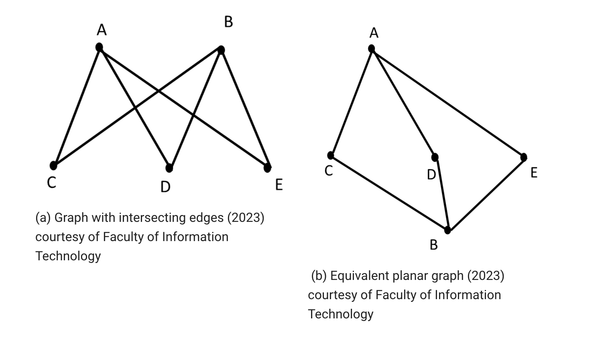
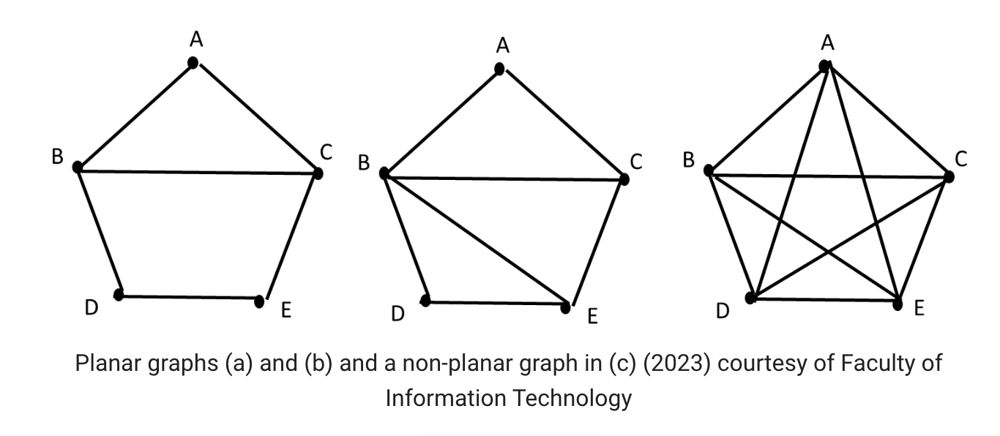

### Planar graphs, Euler graphs, Hamiltonian graphs, and topological sort

#### 3.1. Planar graphs

A planar graph is a connected graph that can be embedded in the plane, i.e. it can be drawn on the plane in such a way that its edges do not cross and they intersect only at their endpoints. When a planar graph is drawn in this way, it divides the plane into regions called faces.

The following graph (a) is a planar graph since we can redraw it as in (b) such that the edges do not intersect.
  

These two graphs are the same, except graph (a) is not of a **planar representation** of the graph. In the following figure, graphs (a) and (b) are planar, however, (c) is not.

