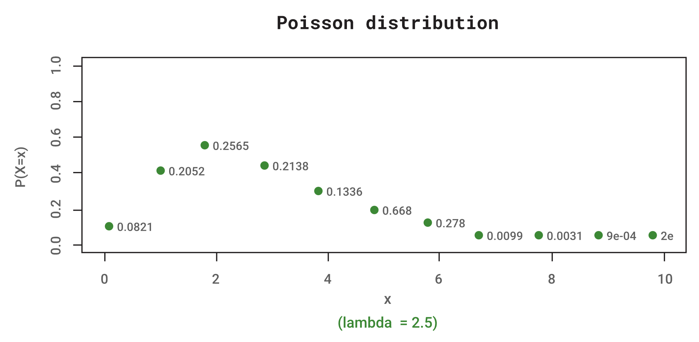

#### Poisson distribution

The probability distribution function (pdf) of the Poisson distribution can be derived by taking the limit of the binomial pdf as $𝑛→∞$,$𝑃→0$, and $𝑛𝑃=μ$ remains constant. The Poisson pdf is given by:

$$𝑓(𝑥)=\frac{𝑒^{−𝜇}𝜇^𝑥}{𝑥!};𝑥=0,1,2,… $$    (Eq 3.4)

Here, 𝑓(𝑥) is the probability of 𝑥 occurrences of an event that occurs on the average μ times per unit of space or time. The mean and the variance of a random variable 𝑋 having a Poisson distribution are μ. The Poisson pdf can approximate probabilities obtained from the binomial pdf given earlier when 𝑛 is large and 𝑝 is small. Generally, good approximations will result when 𝑛 exceeds 10 and 𝑃 is less than 0.05. The approximation will generally be excellent when 𝑛 exceeds 100 and 𝑛𝑃 is less than 10.

If λ is the failure rate (per unit of time) of each component of a system, then λ𝑡 is the average number of failures for a given unit of time. The probability of 𝑥 failures in the specified unit of time is obtained by substituting $μ=λ𝑡$  in Equation 3.4 to obtain:

$$𝑓(𝑥)=\frac{𝑒^{−𝜆𝑡}(𝜆𝑡)^𝑥}{𝑥!};𝑥=0,1,2,…$$

For example, in a certain country, the average number of aeroplane crashes per year is 2.5. What is the probability of 4 or more crashes during the next year? Substituting $λ=2.5$ and $𝑡=1$ in Equation 3.4 yields:

$$𝑓(𝑥)=\frac{𝑒^{−2.5}(2.5)^𝑥}{𝑥!};𝑥=0,1,2,…$$

As the pdf of 𝑋, the number of aeroplane crashes in 1 year. The probability of 4 or more aeroplane crashes next year is then:

$$𝑃(𝑋≥4)=1−∑𝑥$$$$=03𝑒−2.5(2.5)𝑥𝑥!$$$$=1−(0.0821+0.205+0.257+0.214)$$$$=1−0.76=0.24$$

The figure below shows the Poisson distribution when the rate is 2.5. The probability values computed for each 𝑥 value are shown in the plot. Observe that the values in the plot and the example above are the same.

