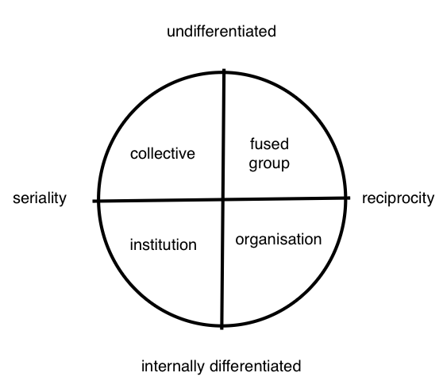

[[Jasper Bernes]]
[[Endnotes]] 5

Sartre:

Why do people revolt? What kind of agencies about revolts can be described?

>"Why do people revolt? Let me tell you, say the pastors and the pedagogues. We just don’t know, say the fatalists" (194)

Two major streams of thought:
1. Voluntarism
2. Fatalism

Within voluntarism there are **pastoralist**, and **pedagogical** approaches.

**Motives** vs **interests**

You can't change people's motives

Interests are more related to people's beliefs

Fatalism is weird twin of voluntarism when it says people *should not* try to intervene as if the people might be led astray - suggesting that they can? Or is this just anarchism?

"As the pure distillates of the fatalist position, [[Monsieur Dupont]], the uniplural authors of [[Nihilist Communism]], recognise this problem and attempt to find something for the fatalist pro-revolutionary minority to do when it goes down. ==The answer: disable the voluntarists. In revolutionary conditions, the fatalist minority will be called upon to “actually go against most of the ‘revolutionary’ communist and anarchist milieu”.== 10 There is certainly some truth here, in that the attempt by some fraction of the revolution to seize power and begin to lead the revolution will need to be contested vigorously by a revolution within the revolution. But fatalists such as Monsieur Dupont are, in a sense, the ==weird twins of the voluntarists==, relying on a view of the masses of ordinary proletarians as fragile, easily manipulated, diverted, or betrayed, even if capable of spontaneous revolt." (200)

**Vanguardism vs adventurism:**

"One can distinguish, ultimately, between two types of intervention: vanguardist and adventurist. The vanguardist seeks to control, lead, and shape proletarian action through pastoral and pedagogical intervention and, as such, sets in motion counter-revolution. The adventurist, however, engages in self-directed action that seeks to facilitate the conditions under which the vast majority of people will decide that going in the direction of the revolution, of communism, means satisfying their materialist motivations. This may mean expropriating capitals and turning them over to people so that they can meet their needs, engaging in defence of the revolution from capitalist counter-attack, or subverting the attempt by revolutionary factions to establish leadership, or any number of other “communist measures”." (200)

**The Materialist Conception of History**

Marx and Engels were responding to the 'idealist' conception of history and in particular 'utopian socialism' where people were convinced that ideas could 

“Communism is for us not a state of affairs which is to be established, an ideal to which reality will have to adjust itself. We call communism the real movement which abolishes the present state of things” (Marx and Engels cited in 203)

"Grounded in a theory of interest-based action, the “materialist conception of history” of Marx and Engels shows little need for pedagogical or pastoral supplement. This is not to say that there is no place for organisation or the elaboration of ideas; rather, these are treated as expressions of class struggle." (205) [[Is all knowledge functional?]] [[Conflict theories are affective reactions to and expressions of embodied social stratification]]

**Critique of [[Unionism|unionism]]**
"Offe and Wiesenthal draw rather gloomy conclusions from these second-order effects, showing how proletarian organisations are forced into contradictory behaviour as a result of the structures in which they find themselves: on the one hand, they must demonstrate their potential to harm the class of capitalists through the use of the strike weapon, which requires a highly active membership; on the other hand, in order to wrest concessions from the capitalist class they must use the strike weapon sparingly, and this requires a disciplined membership, one willing to fall in line with leadership. But such discipline will ultimately produce disaffected and passive unionists, unable to mobilise for strike when necessary." (211-212)

"In many conditions, people are attacked as a group rather than as individuals. If an employer threatens uniform reduction in wages, workers will find it advantageous to resist together, since they are strongest that way. In this case, interests converge because of the defensive nature of the struggle and the collectivising character of the attack." (215-216) cf. [[body without organs]]

>"The main thrust of this argument is to show that workers will never choose to move in the direction of total expropriation and seizure of the whole sum of the social product, because any steps in that direction will produce capital flight that will immediately lower workers’ future consumption. As a critique of socialisms that imagine a gradual process of socialisation mediated by trade unions and workers’ parties, this scenario is absolutely correct," (218) 
	*I need to reflect on this re cooperative movement* #Cooperatives [[Housing Cooperatives]] [[Worker Cooperatives]] [[A radical cooperative movement]]

>"Nonetheless, we can summarise the value of the approach of Bowles and others: its emphasis on equilibrium state as destination rather than origin and its willingness to think through the problems of path-dependency; its elaboration of the criteria of robustness, stability, and initial viability; its reminder that egoism and altruism are, to some degree, the results of social structure rather than expressions of human essence and, in any case, only in opposition within certain constraints; and finally, its reminder that group size matters, especially for producing conditions of reciprocity." (224-225)

> there are situations, revolutionary situations in particular, in which “social” rather “selfish” preferences, can flourish, but there are also situations which crush them [[3quc46lq2i_file.pdf#page=17&annotation=936R]]

> But altruism isn’t the domain of the activist minority exclusively. As noted earlier, there is extensive evidence that altruist motives are, although fairly weak, present among all but a small minority of the population. Mass action can emerge not only as the result of self- defence or a collective struggle for material betterment but as collective outrage at injustice experienced only indirectly. (236)[[3quc46lq2i_file.pdf#page=23&annotation=1077R]] 

> Nevertheless, the fact that material interests supervene over altruism and spite explains not only the dwindling of the riot, but the inability of insurrection to convert into social revolution. (237)[[3quc46lq2i_file.pdf#page=23&annotation=1088R]]

> the theological whims and niceties of [[private property]] evaporate: the things of this world no longer appear as possessions of this or that owner, but as unmarked social possibility. Participants take what they need and give what they can. (237)[[3quc46lq2i_file.pdf#page=23&annotation=1094R]]

